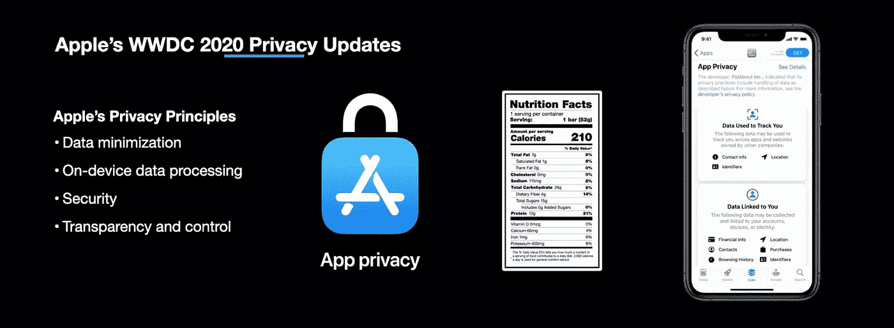
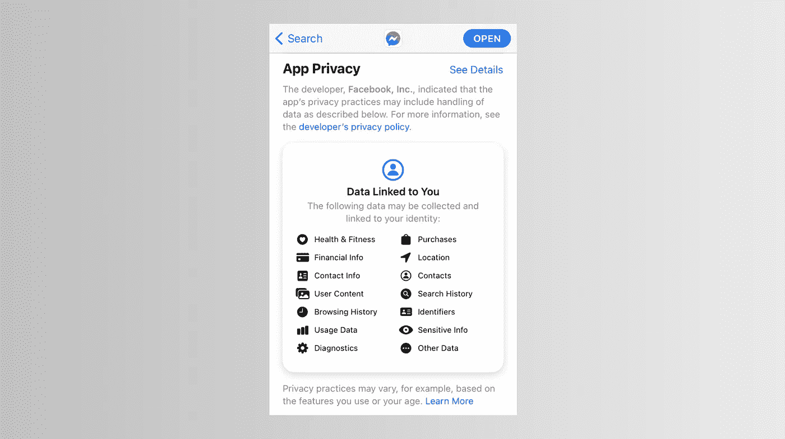
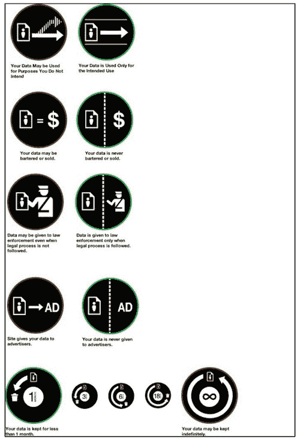
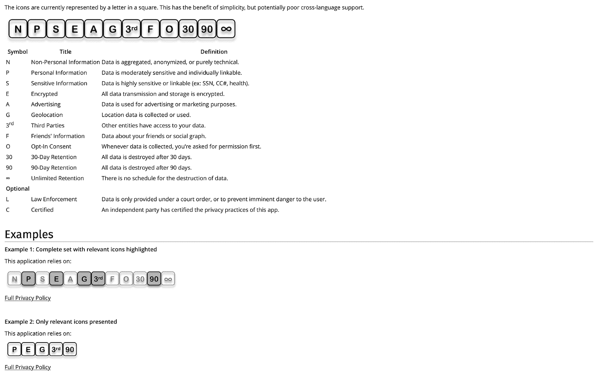
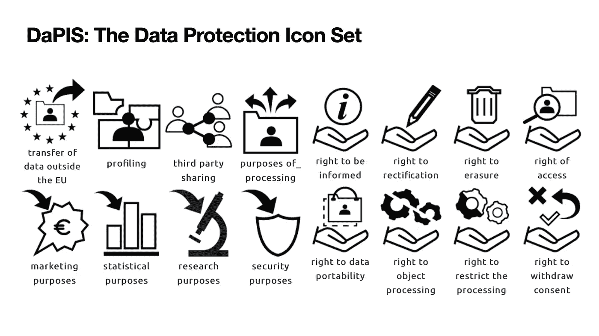
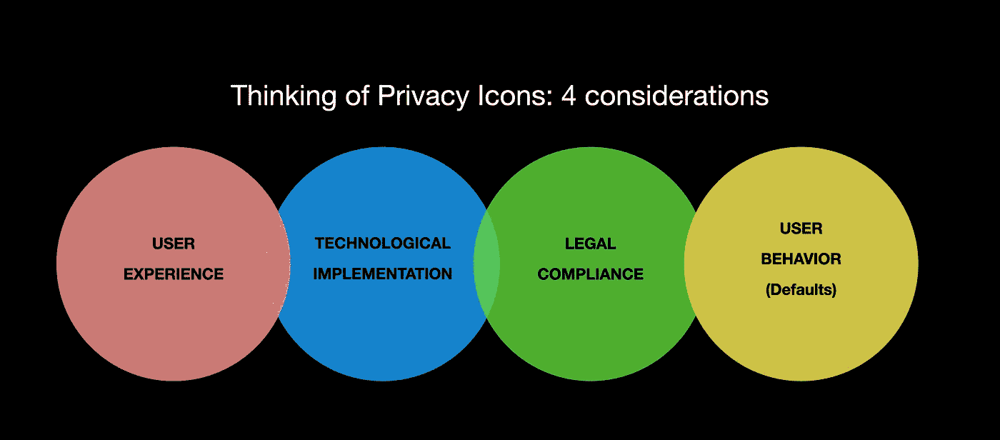

# 隐私图标和法律设计

> 原文：<https://towardsdatascience.com/privacy-icons-4ca999a6f2db?source=collection_archive---------41----------------------->

## 数据生态系统正迅速向以用户为中心的模式转变。哪些因素会影响人们对个人数据价值的认知？

在 2020 年全球开发者大会期间，苹果花时间讨论了当今最热门的话题之一——隐私。在过去的几年里，苹果一直在推出各种公共活动，旨在将自己定位为一家尊重客户隐私的公司。今年的 WWDC 在苹果产品的隐私相关功能方面有一些引人注目的问题。

> “苹果公司成立时，主张是，‘这是个人电脑。这是你自己的数据。…随着世界的发展，[我们]一直认为…您创建的数据，您用计算机做的事情，都是您的，应该在您的控制之下。您应该知道您的数据发生了什么。”—苹果公司的克雷格·费德里吉

首先，苹果重申了其立场，即隐私是一项基本人权，并从一开始就试图将用户隐私考虑纳入产品设计过程。此外，苹果公司的隐私有以下四个要素:

*   **数据最小化**:苹果旨在确保苹果和其他任何人(即 app 开发者)能够接触到个人的最小量的个人数据；
*   **On-device intelligence:** 苹果旨在通过在用户设备上处理尽可能多的信息(而不是将其发送到中央服务器)来避免用户数据收集；
*   **安全性**:苹果正在确保个人所做的一切都是安全的；
*   透明和控制:苹果旨在帮助其用户更好地了解正在收集的数据，以便用户可以就如何使用这些数据做出自己的选择。

保利乌斯·尤尔西斯

除此之外，苹果还宣布了一些新的隐私功能，这些功能与未来几个月将推出的应用程序密切相关。

1.  **追踪。苹果让第三方应用更难追踪其用户。在其下一个移动操作系统 iOS 14(将于 2020 年秋季推出)中，苹果将要求所谓的第三方应用程序在开始跟踪之前要求获得用户许可。与 Safari 浏览器类似，应用程序用户将能够选择是否要分享他们的精确或大致位置。**
2.  **隐私自报。**苹果将开始要求应用程序开发者自我报告这些应用程序访问和利用应用程序用户个人数据的方式。例如，应用程序开发者必须向苹果披露他们是否只收集了“一点点”用户数据，以及这些数据是与谁共享的。
3.  **隐私图标。**苹果旨在简化用户体验，帮助用户更容易、更快速地识别他们决定从 App Store 下载的每个应用的隐私设置。为了实现这一目标，该应用将在应用商店的应用描述中使用隐私图标。目前，在 App store 上发布的应用程序需要有自己的隐私政策。然而，众所周知，没有人会在下载之前或之后去阅读那些隐私政策。
4.  **透明和控制。**为了便于更好地了解应用程序如何使用用户数据，隐私图标将显示在应用程序描述页面上。这些隐私图标将显示该应用程序能够访问哪些个人数据，以及它是否会跟踪你。大概是这样的:

截至 2021 年 9 月的 Facebook Messenger 应用隐私图标。

这种隐私相关的更新对苹果设备的用户来说绝对是有价值的改进。苹果团队努力让个人对自己的数据拥有更多控制权，这值得称赞。不言而喻，这将有助于更好的数据素养和更深入地了解第三方是如何使用个人数据的。与此同时，苹果公司的这一声明应该放在一个更广泛的背景下看待，即直接与客户在线互动的公司受到越来越严格的数据隐私法规的压力(GDPR 和 CCPA)。

# 隐私图标:回到未来

苹果建议使用图标来告知隐私问题，这既不是创新也不是新鲜事。Mozilla 率先向个人披露了互联网隐私设置。2011 年，Mozilla [提出了](https://wiki.mozilla.org/Privacy_Icons)图标的“测试”版本，可以告知个人在线服务提供商如何使用他们的数据。

Mozilla 隐私图标的测试版解决了数据隐私的四个主要方面:

*   **保留期**:公司将个人数据保留多长时间？
*   **第三方使用**:个人数据仅用于预期目的，还是也用于其他目的(例如，数据是否与第三方共享，以及用于何种目的)？
*   **广告网络**:个人数据是否与营销或广告公司共享。
*   **执法**:公司是否向执法机构披露数据(有无搜查令)。

Mozilla wiki 。

## Mozilla 隐私图标的第二次迭代

Mozilla 隐私图标的第二次迭代也是在 2011 年发布的。第二个版本是为了简化隐私政策与各种应用程序用户的沟通而准备的。图标的第二次迭代有点像门捷列夫的周期表，因为它们主要包含字母:

[Mozilla 维基百科](https://wiki.mozilla.org/Privacy_Icons_v0.2)。

仔细观察 Mozilla 隐私图标的这个替代版本，可以发现一些事情。首先，关于个人数据的使用，可能会显示更多类别的信息。例如，第二次迭代区分个人和非个人信息以及更多的使用目的(例如，用于广告、地理定位、与第三方共享以及数据保留期限)。其次，该选项选择使用字母和符号来传达隐私政策。

这两种方法都为隐私图标的讨论奠定了基础。快进十年。虽然已经取得了一些进展，但是在如何向个人消费者传达隐私政策方面还没有达成共识。

《加州消费者隐私法》和《GDPR》对公司如何与消费者沟通提出了许多要求。他们要求每次公司的数据收集和处理实践发生变化时都必须发送通知。这些隐私相关的通知和获得消费者同意的要求导致点击疲劳，并导致用户完全忽略通知和警告。

另一个更近的尝试是:

[达比斯](http://gdprbydesign.cirsfid.unibo.it/dapis-2/)。

# 有哪些食品标签可以教会我们隐私图标？

从历史上看，隐私图标的概念可以追溯到几十年前，当时各国政府开始要求食品制造商向消费者披露他们购买的食品中的成分。在 WWDC 的演示中，苹果首席软件专家 Craig Federighi 将食品标签和隐私图标的使用进行了对比，以解释应用程序将使用哪些用户数据。

食品标签的效率和有效性在社会科学学者中引起了广泛的讨论:消费者是否从这种标签中受益？食品标签证明了它们的成本吗？食品标签中提供的信息真的能影响消费者的行为吗？

在下面的段落中，让我们试着比较一下食品标签和隐私图标，看看它们之间有什么相似之处。

## (a)隐私图标作为自下而上的解决方案

首先，食品标签和隐私图标之间最显著的区别与它们的起源有关。食品标签通常是由政府强加的，政府试图缓解信息不对称，帮助个人对他们消费的食品做出更好的选择。然而，负责创建标签的政府官员面临许多问题。也就是说，预测人们对食品标签的反应可能极其困难。此外，即使可以确定对人类行为的影响，也可能很难显示要求使用食品标签的法规的实际利益(以货币计算)。

这个问题在隐私图标领域似乎并不存在，因为，至少到目前为止，还没有使用“隐私标签”的明确监管义务。相反，我们可以看到这种创建隐私图标的举措是“自下而上的”:为客户提供服务的公司(如苹果公司)正在率先推出隐私图标，旨在帮助个人消费者更好地了解他们的个人数据。

市场参与者正在开发隐私图标，这一事实相当引人注目。

## (b)隐私图标具有明显的经济价值

其次，引入新的监管要求，至少在美国，必须有经济上的合理性。在实践中，这意味着制定法律的政府机构必须表明，新措施创造的社会效益将大于实施该措施的成本。

就私隐权图标而言，政府无需进行任何经济影响评估研究；这是那些押注于隐私图标的公司所为。就苹果而言，推出隐私图标这一事实表明，苹果认为向用户提供个人数据透明度是有价值的。

## (c)人们获取信息的四种可能方式

假设人们愿意接受信息，并且信息会给消费者带来好处，这是非常自然的。然而，最近在食品标签领域的学术研究表明，人们对提供给他们的信息有四种可能的反应方式:

*   有大量的信息是人们不愿意接收的(因此，看不出有什么价值)；
*   有大量的信息是人们希望*而不是*接收的(因此视其为负值)；
*   在某些情况下，人们不想知道；
*   在其他情况下，人们希望*而不是*知道。

这种“信息回避”的现象提出了一个问题:设置隐私图标到底有没有意义。

## (d)决策效用与经验效用

此外，众所周知，消费者不仅受到信息匮乏的困扰，还受到各种行为偏见的困扰。例如，消费者可能会遭受当前偏见(即，人们倾向于高估眼前的回报，而不重视长期后果)或可能不切实际地乐观(即，认为个人自己不太可能经历负面事件)。

当我们看隐私图标时，还有两个行为偏差可能会变得很明显:(a)人们即将同意某个隐私相关选择时的效用(所谓的“决策效用”)和(b)实际体验的效用(所谓的“体验效用”)之间存在明显的差距。隐私图标的问题是，它可能不总是能够在未来提供具体和清晰的体验感。

# 隐私图标和走向以用户为中心的数据生态系统

快速发展的新技术，如机器学习、边缘计算和差分隐私，以及新的数据隐私法规(主要是 GDPR 和 CCPA)，正在为以用户为中心的数据生态系统铺平道路。

以用户为中心的数据生态系统的构建前提是，个人能够集中来自各种不同来源的个人数据，并将这些数据保存在他们的个人数据云中。这些数据云完全由用户控制，用户可以根据什么条件访问这些数据。

隐私图标将在以用户为中心的数据环境中扮演越来越重要的角色。然而，这不是一家公司可以完成的任务。虽然苹果可以被视为趋势的引领者，但提高来自不同文化和不同大陆的人们的数据素养是一项可以由多个利益相关者共同行动来完成的任务。

保利乌斯·尤尔西斯

在创建用户友好的数据隐私图标和通知时，有四个主要考虑因素起着同等重要的作用:

*   用户体验必须使个人用户能够快速浏览他们正在使用的应用程序和技术的主要功能，并能够了解哪些个人数据处于危险之中，以及这些数据是如何使用的；
*   用户体验与软件工具密切相关。这两者必须平衡，并且需要 UX/UI 设计师和软件工程师之间的密切合作；
*   隐私图标和通知等数据扫盲增强工具也应符合法律要求(例如，获得合法有效的同意)；和
*   创建隐私图标和其他数据素养增强解决方案时，应牢记行为和决策模式(例如，考虑选择加入和选择退出默认设置的影响)。

在 [Prifina](http://www.prifina.com) ，我们看到利用图标等工具来简化界面，通过它我们变得精通数据并理解我们的选择。我们相信这可以让消费者变得更有能力，我们可以和开发者一起构建应用和体验，用他们的数据提升个人。

此外，数据隐私图标可能会成为一个强大的工具，特别是如果 UX/UI 设计师、软件工程师、律师和消费者权益倡导者共同努力简化用户体验和用户界面的话。

## 如果你有一个想和我们社区一起开发的图标的想法，请联系我们。如果你有兴趣自己开发，你可以注册我们的开发者账户，然后开始。

# 与我们保持联系

*Prifina 帮助个人从他们的个人数据中获得定制价值，并为开发者提供工具，在用户持有的数据基础上构建应用程序。*

你可以在 [Twitter](https://twitter.com/MyPrifina?source=post_page---------------------------) 、 [LinkedIn](https://www.linkedin.com/company/prifina/?source=post_page---------------------------) 、[脸书](https://www.facebook.com/myprifina/?source=post_page---------------------------)关注[普里菲娜](http://prifina.com/?source=post_page---------------------------)，加入我们的 Slack:[Liberty。平等。数据。](https://join.slack.com/t/libertyequalitydata/shared_invite/zt-ddr4t974-MCzsch4FSeux8DrFQ2atbQ)