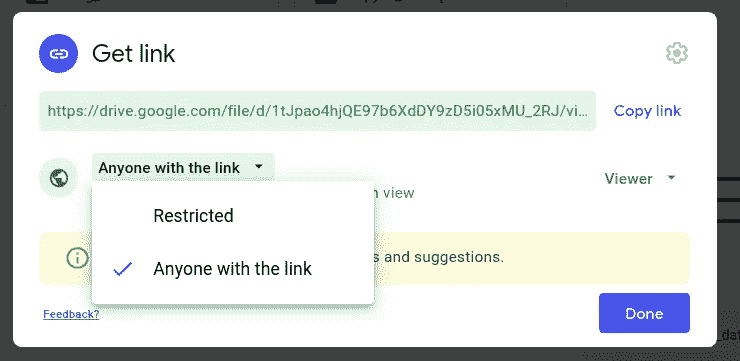

# 在 Colab 环境中下载自定义数据集的提示

> 原文：<https://towardsdatascience.com/pro-tip-for-downloading-custom-datasets-in-colab-environment-5413896d14ec?source=collection_archive---------39----------------------->

萨姆·丹·张在 [Unsplash](https://unsplash.com?utm_source=medium&utm_medium=referral) 上的照片

通常，当数据科学家需要使用他们的自定义数据集进行深度学习或任何推理时，他们需要将数据下载到他们的环境中。这对任何使用 [Colab](https://research.google.com/colaboratory/faq.html#:~:text=Colaboratory%2C%20or%20%E2%80%9CColab%E2%80%9D%20for,learning%2C%20data%20analysis%20and%20education.) 的人来说都特别有用。我基本上使用 Colab 来完成我的深度学习任务，因为我没有硬件来支持我的计算。

我想快速分享我是如何在 google Colab 环境中为我们工作和使用数据集的。事实上，这个过程应该是非常简单的，但是有时候，我们很难做到。实际上我花了一段时间才弄明白。因此，我写这篇文章的原因是。

实际上有几个选项可供选择。

1.  把你的数据推送到 Github，克隆到 google。我个人不喜欢这样。此外，你仍然需要做一些调整，尤其是如果你有一个非常大的数据集，因为 GitHub 不会直接支持你推这些数据集(图像)
2.  另一种选择是手动上传到 Colab。这本来很好，但上传时间太长。因此，如果你需要节省时间，我既不使用它也不建议它。
3.  将您的数据上传到 google drive，并将文件夹安装到您的环境中。这也是一个很好的选择，除了第三方不能使用您的笔记本电脑，因为在安装过程中需要驱动器认证。
4.  第四种选择是上传压缩版本的数据，不管有多少。在这种情况下，数据也可以是预训练的模型或任何其他形式的数据集(通常是图像)。在接下来的文章中，我会专注于此

# 怎么会？

Colab 以不同的方式处理大数据集和小数据集。在这种情况下，大型数据集通常是 100mb 以上的任何数据，小型数据集通常是 100mb 以下的数据。

基本步骤是:

1.  在本地计算机上压缩文件，然后上传到 google drive
2.  右键单击 zip 文件或文件夹(如果没有压缩),然后选择获取可共享链接
3.  通过将链接的权限更改为**任何人来公开:**如果不公开，文件将不会被下载到 Colab。我在第一次尝试中错过了这一步。

4.您现在可以复制链接并提取 **d 和视图**之间的字母数字。这只是您需要的文件 ID。

比如这个链接:[https://drive . Google . com/file/d/1 tjpao 4 hjqe 97 b 6 xddy 9 ZD 5 i5 xmu _ 2RJ/view？usp =共享](https://drive.google.com/file/d/1tJpao4hjQE97b6XdDY9zD5i05xMU_2RJ/view?usp=sharing)，

[**1tjpao 4 hjqe 97 b 6 xddy 9 z D5 I 05 xmu _ 2RJ**](https://drive.google.com/file/d/1tJpao4hjQE97b6XdDY9zD5i05xMU_2RJ/view?usp=sharing)**是文件 id**

**5.对于小型数据集，复制下面的命令并粘贴到您的 Colab 笔记本中。导入 Ipython display clear output 方法来清除下载的输出。显示的输出有时会很大，这会占用不必要的屏幕空间。**

# **下载文件**

**下载小文件**

**对于大文件，请复制下面的命令。注意，有两个位置会替换文件 ID**

**下载大文件**

# ****提取文件****

**如果下载的文件是压缩的，您需要执行以下步骤。检查您合适的文件类型(zip、7z、tar)并复制合适的代码或命令来提取它们以供使用。对于 zip 文件，您只需将 zipfile 作为一个类导入并完成工作。对于其他文件类型，需要安装一个 [p7zip](http://p7zip.sourceforge.net/)**

**一旦你完成了这些，你就可以开始你的机器学习任务了。获取数据是第一步，也是最基本的一步。**

**使用上面的过程，你可以在 Colab 中使用你的文件。唯一的缺点是，每次重启运行时，你都需要下载。**

**希望这能帮助到某个人。干杯。**