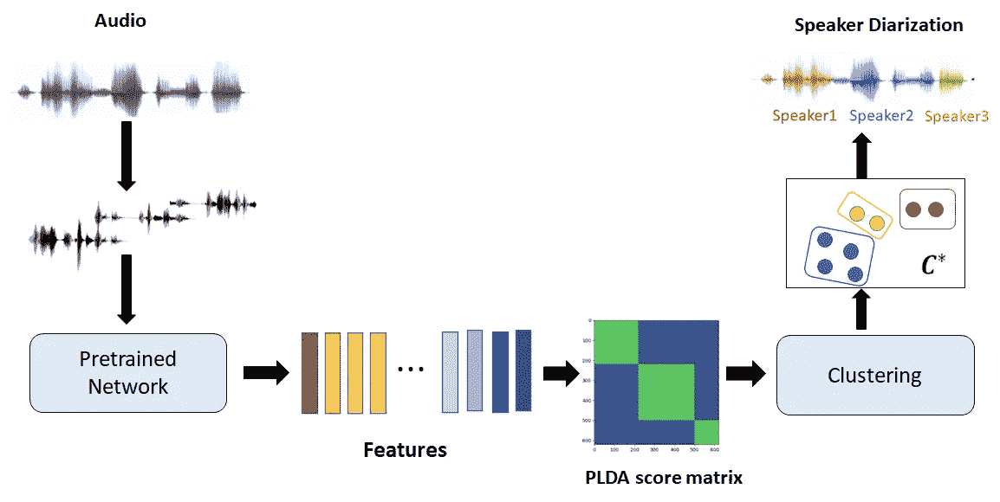

# 概率线性判别分析(PLDA)解释

> 原文：<https://towardsdatascience.com/probabilistic-linear-discriminant-analysis-plda-explained-253b5effb96?source=collection_archive---------6----------------------->

## [入门](https://towardsdatascience.com/tagged/getting-started)

来源:图片由作者提供。具有不同平均值(中心)的高斯分布(椭圆)的等高线用不同的颜色表示。每个轮廓对应于不同类别。

**以**简化**的方式讲解**概率线性判别分析(PLDA)** 的**概念和应用。

# 介绍

顾名思义，**概率线性判别分析**是**线性判别分析**的**概率**版本，能够处理更复杂的数据。尽管 PLDA 在包括计算机视觉、语音处理、自然语言处理(NLP)在内的许多研究领域有着广泛的应用，但它仍然没有以一种能够达到广泛受众的方式进行解释。PLDA 已被用于识别、验证、生成用于聚类的相似性分数、特定于类别的特征提取。

> 我这里的**目的**是**讨论**介绍和应用了 PLDA** 的研究论文**。我将使用等式、图表和易于实现的代码来解释这些概念，以便所有数据科学领域的人都可以理解。
> 
> 这里介绍的推导需要有**基本概率**和**线性代数**的先验知识。可以参考参考文献中提到的来源。

为什么是 PLDA？

在我继续之前，我想给出使用 PLDA 而不是 LDA 的动机。

**LDA** 是一种监督降维技术。LDA 将数据投影到较低维度的子空间，使得在投影的子空间中，与每个类内的分布(最小化**类内协方差 Sw** )相比，属于不同类的点更加分散(最大化**类间协方差 Sb** )。下图展示了这一点。

来源:毕晓普著*[*模式识别与机器学习*](https://cds.cern.ch/record/998831) *。每种颜色代表一个阶层。m1 和 m2 分别是类别 1 和类别 2 平均值。左图显示了 m1 和 m2 连线上的数据投影。两个类别的样本有很多重叠。右图显示了使用 LDA 的数据投影，从而最大限度地减少了两个类别之间的重叠**

*当我们有来自所见类的数据时，这对于分类很有用。但是，当观察到的数据来自看不见的类时，我们如何执行类似的任务呢？例如，考虑人脸识别的任务，我们使用不同的人脸图像训练模型，使得每个唯一的人脸代表一个类别。*

*现在给定两个图像，我们想要找出它们是否属于同一个人，即使模型以前没有见过那个人的任何图像。常见的方法是将两幅图像投影到低维空间，并找出它们之间的距离。如果距离很小，这意味着他们来自同一个班级。LDA 会将图像投影到从训练数据获得的子空间中，因此不是最佳的。因此，我们需要一个更灵活的模型来寻找投影的最佳方向。解决这个问题的一种方法是使用概率方法，而不像 LDA 是确定性的。它被称为概率 LDA。*

***PLDA 的优势***

*   *我们可以使用连续的非线性函数来生成类中心，即使是从看不见的类的单个例子中。*
*   *在假设检验中，我们可以比较以前从未见过的类中的两个例子，以确定它们是否属于同一类。*
*   *对来自未知类别的样本执行聚类*

# ***什么是概率 LDA？***

*设 *x={x₁,x₂,…,xₙ}* 为 *D* 维观测值或数据样本。**概率 LDA 或 PLDA** 是一个**生成模型**，它假设给定的数据样本是从分布中生成的。我们需要找到最能描述训练数据的模型参数。假设产生数据的分布的选择基于两个因素:(1)它应该代表不同类型的数据(2)参数的计算简单而快速。满足这些条件的最流行的分布是高斯分布。下图显示了高斯分布的概率分布函数(pdf)、等高线以及从中生成的样本。*

**

*来源:作者的情节*

*`[**show code**](https://gist.github.com/prachiisc/a5f193212f90c8f82e84b5fe9dcf85d4)`*

*为了将数据聚类成类，我们需要用单独的高斯分布来表示每个类，因此我们可以使用高斯混合模型(GMM)。GMM 是高斯的加权混合，每个高斯具有不同的均值和协方差，其中每个混合可以代表每个类别。*

*GMM 的概率分布函数(pdf)为:*

**

*来源:作者的情节。具有 **πₖ、μₖ、**φ**ₖ的 GMM 的 pdf 为** k- **次高斯**的权重、均值和协方差*

*`[**show code**](https://gist.github.com/prachiisc/4668febcef55f6d857863ca9ffd920bd)`*

*设 ***y*** 为潜在(隐藏)**类变量**代表 GMM 某类/混合的**意思。现在给定这个**类变量*y*，产生数据样本**x的概率为:*******

**

*其中φw 表示给定类的类内协方差。这表明，一旦我们知道了高斯的类参数，我们就可以生成这个类的样本。这里**类变量*y*本身假设是从单独分布中产生的。从假定的分布中产生代表一个类别的特定实例 ***y*** 的概率被称为先验概率。***

*LDA 也被建模为 GMM，其中每个混合的高斯均值是属于各自类别的训练数据的样本均值，并且 ***y*** 的先验概率是离散的，其中 y 只能取离散值，给出如下*

**

*这将产生上面讨论的 GMM。最大化该模型关于参数的可能性{ **πₖ，μₖ，**φw }恢复标准 LDA 投影。但是，为了处理在训练期间没有看到的类，我们需要修改 prior 并使其连续，其中 y 可以取从给定的分布中生成的任何实数值*

**

*这表明，每个类别的潜在变量 y 可以使用高斯分布生成，具有**均值*m*和**类别间协方差**φ**b .**，因此它被称为**概率 LDA。**使用下图可以更好地解释这一点:***

**

*来源:图片由作者提供。小椭圆代表每个类别的高斯分布等值线，平均值位于中心。数据点由十字标记表示。灰色椭圆根据高斯分布生成每一类的平均值。*

**

*来源:人物图片来自 [LFW 数据集](http://vis-www.cs.umass.edu/lfw/)，由作者代表。情节是为了说明。*

*样本 ***y*** 1 和 ***y*** 2 由高斯分布 eq (2)生成，代表人物身份。我们对每个类(人)的示例 ***x*** 1 和 ***x*** 2 进行采样，用等式(1)以 ***y*** 1 和 ***y*** 2 为均值来表示人的不同取向。*

# ***潜在空间***

***PLDA**的目标是**将数据样本**投影到**潜在空间**中，使得来自同一类的样本使用相同的分布建模。这些预测用**潜在变量**表示，这将在本节中讨论。*

*如前所述，isφb**是类间协方差半正定矩阵**而φw 是**类内协方差正定矩阵**。我们得到一个**变换矩阵** V，它将φw 和φb 同时转换成对角矩阵，给出如下:*

**

*其中 I 是**单位矩阵，**ψ**是**对角矩阵**。因此，我们对数据样本的每个维度去相关。现在 PLDA 模型的参数是{ **m** ，A，ψ}。***

*你可以参考下面的推导来得到上面的方程。它需要了解**线性代数**概念，如矩阵的 [**特征值和特征向量**](https://www.google.com/url?sa=t&rct=j&q=&esrc=s&source=web&cd=&cad=rja&uact=8&ved=2ahUKEwifwMC9w8frAhWdzDgGHQwcAqMQmhMwMHoECAoQAg&url=https%3A%2F%2Fen.wikipedia.org%2Fwiki%2FEigenvalues_and_eigenvectors&usg=AOvVaw2--h2kiFfYCXwfK-l_u6Eo)**[**特征值分解**](https://en.wikipedia.org/wiki/Eigendecomposition_of_a_matrix) 。***

***`[**show derivation**](http://leap.ee.iisc.ac.in/prachi/medium/Eigen_value_derivation.pdf)`***

***设 ***u，v*** 是潜在空间中的高斯随机变量定义为，***

******

***我们可以发现**数据样本** ***x*** ，**类变量** ***y*** 与这些潜在变量之间的关系如下:***

******

***因此 ***u*** 表示**类**的实例，而 ***v*** 表示**类变量**在**投影空间**中。等式(5)和等式(6)中的关系以流程图的形式表示，如下所示:***

******

***来源:图片由作者提供。PLDA 在变量独立的潜在空间中对分类中心 v 和示例 u1、u2 进行建模。原始特征空间中的示例 x1、x2 通过可逆变换 A 与其潜在表示 u 相关联***

***有兴趣的可以参考下面的推导:***

******

# ***应用程序***

***PLDA 允许对训练中没有出现的课程进行推断。一个例子是说话人识别。模型参数从训练数据中学习，但是模型应该处理来自训练期间不在场的说话者的例子。这里讨论了可以使用 PLDA 的一些任务。***

## *****分类:*****

***我们有一组**示例 x**g**∈(***x****₁****，x****₂****，…，x*** *M* 每个 **M 类**一个。现在给出一个探针例子 ***x*** p，任务是找到它属于哪个类。这是通过最大化可能性来确定的。首先，使用等式(6)将示例投影到潜在空间中*****

**********

*****当 u 的协方差为 I 时，对数据进行去相关。**P(*u****P***│*u****g***)**给出来自与已知集合中的样本相同类别的探针样本的概率。*****

*****因此，分配给探针示例的 C 类为*****

**********

*****`[**Computation of P(up|ug)**](http://leap.ee.iisc.ac.in/prachi/medium/computation_of_p.pdf)`*****

## *******类推断:*******

*****PLDA 的一个优点是，我们可以从类的单个例子中找到类变量 ***y*** 。对于示例 x，我们计算给定 x 的 y 的后验概率，表示为 p(***y***|***x***)，这将再次是高斯分布。y 的估计是通过将 p(***y***|***x***)相对于 ***y*** 最大化得到的。无非是高斯 p 的均值(***y***|***x***)。可以这样写:*****

**********

## *******假设检验:*******

*****给定两个来自未知类的例子( ***u*** 1， ***u*** 2)，如果我们需要判断它们是否属于同一类，那么我们基于两个假设计算 ***似然比 R*** 。*****

**********

## *******聚类:*******

*****PLDA 也用于将示例分组。基于 ***对数似然比 R*** *或* ***PLDA 分数*** ，我们将每个例子与所有其他例子进行比较。这将创建一个 *PLDA 得分矩阵*，类似于一个相似性得分矩阵，可用于使用 k-means、凝聚聚类等可用算法执行聚类。*****

# *******例子*******

*******说话者二分化:**基于说话者源将输入音频流分割成片段的任务。*****

*****该过程如下*****

1.  *****将音频分成小段，每个小段只包含一个扬声器。*****
2.  *****提取每个线段的特征*****
3.  *****使用预先训练的 PLDA 计算 PLDA 分数矩阵*****
4.  *****使用分数矩阵执行聚类*****

**********

*****来源:图片由作者提供。扬声器双音化管道。*****

*****我使用[语音识别工具包 Kaldi](https://kaldi-asr.org/models/m6) 完成第 1 步和第 2 步，并训练 PLDA 如下。*****

*****以下代码涉及:读取特征->应用主成分分析-> PLDA 潜在空间项目->计算 PLDA 得分矩阵。带有特性和预训练模型的完整代码可以在 [**GitHub**](https://github.com/prachiisc/PLDA_scoring) **中找到。*******

*****`[**show code**](https://gist.github.com/prachiisc/81f1d845b02ae1a7103580c74f260a4b)`*****

## *****分析*****

1.  *******PLDA 潜在表象(u):** 下图显示了将数据投射到 PLDA 潜在空间的效果。我们可以看到，当我们将数据投影到 PLDA 潜像中时，它就变成了可分离的扬声器，即使 PLDA 模型从未见过来自这些扬声器的音频。*****

**********

*****128 维特征的 2d 投影。左侧图是 PCA 转化的嵌入。左侧情节是 PLDA 潜在的表述。每种颜色代表一个扬声器。由作者策划。*****

*****`[**show code**](https://gist.github.com/prachiisc/5ec4c485c62a1b07eee65745b9d4621f)`*****

*******2。对数似然比或 PLDA 得分矩阵:**我们可以通过找到从音频中提取的所有 I 和 j 片段的 ***x*** *ᵢ* 和 ***x*** *ⱼ* 之间的相似性得分 S(i，j)来计算相似性得分矩阵 s。下图显示了标准化余弦得分矩阵和 PLDA 得分矩阵，通过除以矩阵中的最高得分进行标准化。它描绘了在 PLDA 分数中的较高对比，显示了在对相同和不同说话者做出决定时的较高信心。浅色(黄色阴影)表示高分，而深色(蓝色阴影)表示低分。我们可以看到光块和色块，这有助于轻松识别同一扬声器和不同的扬声器区域。*****

**********

*****余弦亲和度矩阵和 PLDA 亲和度矩阵的比较。由作者策划。*****

*****`[**show code**](https://gist.github.com/prachiisc/3519554beccf61275495940890c674b5)`*****

*******3。直方图:**下图显示了 PLDA 分数的分布。更高的计数出现在极端情况下，这有助于更好的聚类。*****

**********

*****x 轴:标准化的 PLDA 分数，y 轴:计数。由作者策划。*****

*****`[**show code**](https://gist.github.com/prachiisc/0c0875217f50781735b0c734d4e72824)`*****

# *******总结*******

1.  *****PLDA 是一个生成模型，其中我们假设一个类的数据样本 **X** 是从高斯分布生成的。高斯平均值代表类别变量 **y** 是从另一个被称为先验的高斯分布生成的。*****
2.  *****对于识别的任务，我们可以通过比较来自相同类别的样本的可能性与来自不同类别的样本的可能性，使用 PLDA 分数来比较两个未知类别的样本。*****
3.  *****我们可以使用整组样本中所有样本对之间的 PLDA 分数将样本聚类成类。*****

# *****参考*****

1.  *****约夫，谢尔盖。"概率线性判别分析."在*欧洲计算机视觉会议* ，第 531–542 页。施普林格，柏林，海德堡，2006。*****
2.  *****普林斯、西蒙·杰狄和詹姆斯·埃尔德。"[概率线性鉴别分析对身份的推断](https://ieeexplore.ieee.org/abstract/document/4409052/?casa_token=LYpmpjhmz08AAAAA:4v5BMfUpqTi-elPqe4RxIwYV-t6q9qxCHLsK2TbG2CIw6n_Kh3dWb8oPSPUUYuOIR2W_6K0fmlDz)"2007 年 IEEE 第 11 届计算机视觉国际会议，第 1–8 页。IEEE，2007 年。*****
3.  *****毕晓普，克里斯托弗 M. [*模式识别与机器学习*](https://cds.cern.ch/record/998831) *。斯普林格，2006 年。******
4.  *****杜达，杰瑞克。"高斯自动编码器。" *arXiv 预印本 arXiv:1811.04751* ，2018*****
5.  *****斯特朗吉尔伯特。*线性代数入门*。第五版。[韦尔斯利-剑桥出版社](http://www.wellesleycambridge.com/)，2016 年。国际标准书号:9780980232776*****