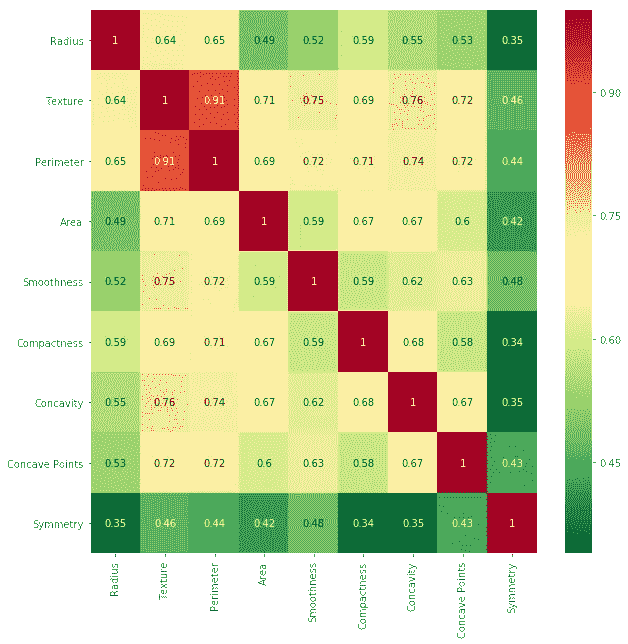
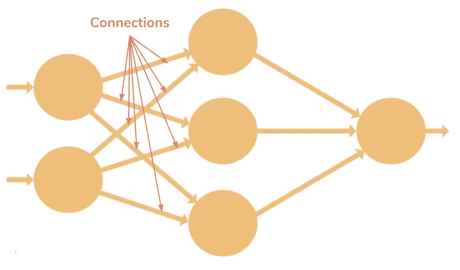
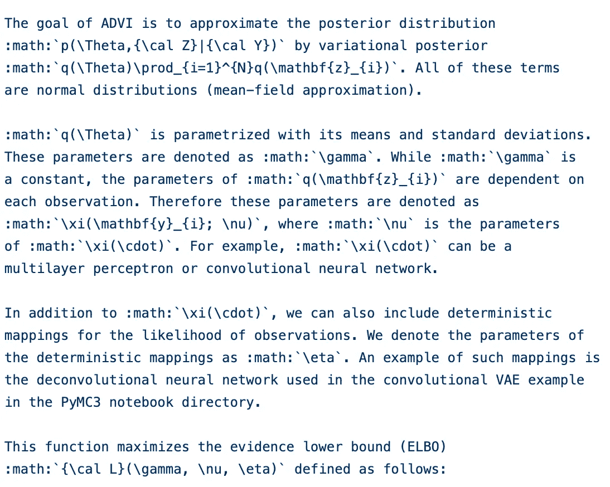
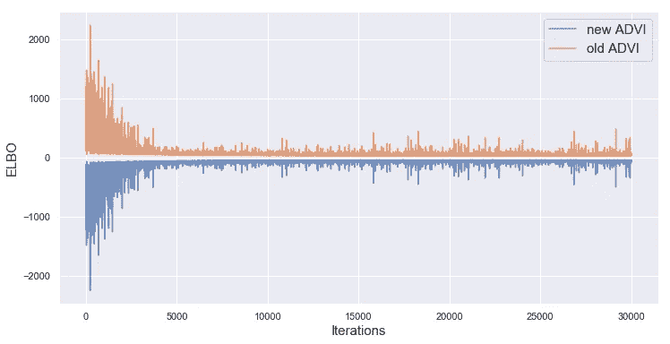
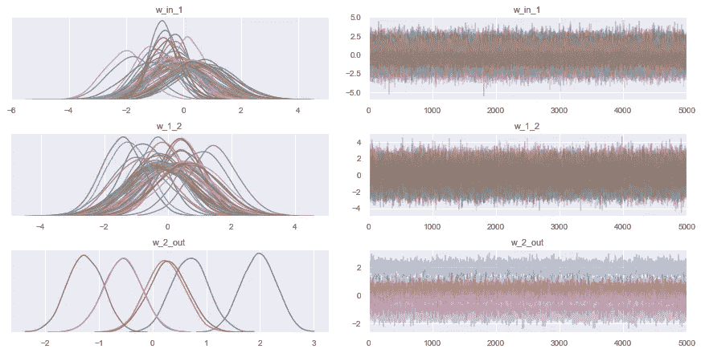
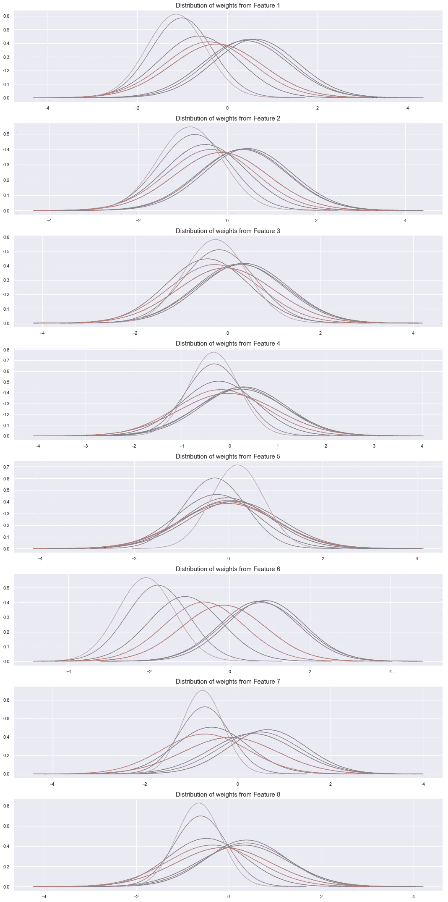
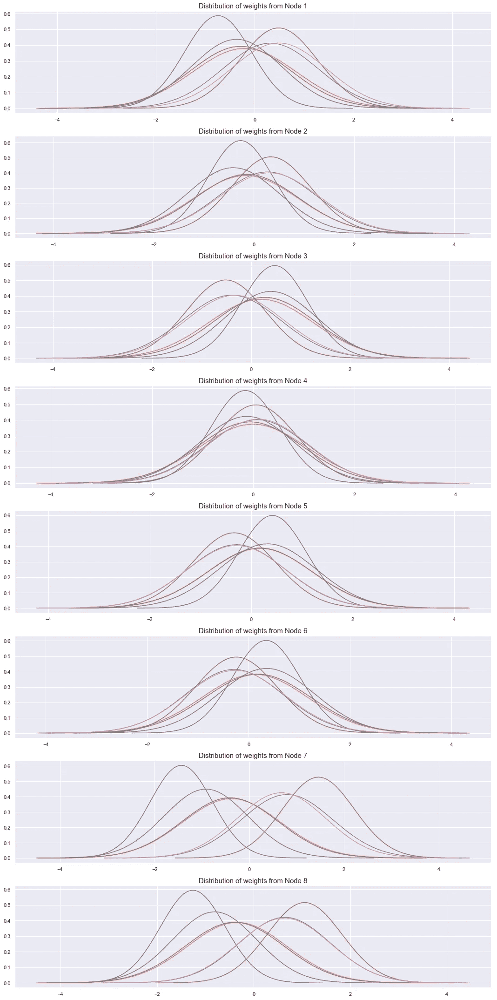

# 用于乳腺癌检测的概率深度学习

> 原文：<https://towardsdatascience.com/probabilistic-neural-networks-for-breast-cancer-detection-2f1a6951e459?source=collection_archive---------27----------------------->


来源: [Unsplash](https://unsplash.com/photos/XrLSV-CKmuQ)

在本文中，我将演示使用变分推理来量化深度神经网络权重的不确定性，并为乳腺癌分类数据集做出更明智的预测。

我将在 PyMC3 中构建一个概率神经网络，它使用 ADVI 来优化我们模型的参数。我们将更多地考虑神经网络权重的后验分布，以及我们可以从中获得的见解。

# 目标

这里的目标是建立一种算法，可以分析关于乳腺癌细胞的信息和指标，以预测细胞中的癌症是“良性”还是“恶性”

乳腺癌的分类是一个二元分类问题，其中我们将细胞分类为良性或恶性。良性肿瘤是一种不会扩散到身体其他部位的非侵袭性肿瘤。恶性肿瘤是一种侵袭性和癌性肿瘤，可以通过血液扩散到身体的其他部位。如果被确定为“恶性”，乳腺癌需要更有效的治疗。

# 犯假阴性的代价

在这个分类问题中，有两种错误——假阴性和假阳性。假阳性(良性癌症被归类为恶性癌症)将导致我们最终给患者服用更强的药物。虽然这会带来额外的成本和风险，但不会危及生命。**任何假阴性(恶性癌症被错误地归类为良性)都可能是致命的，我们应该不惜一切代价避免它。**

我们来量化一下这个损失。假阴性会危及生命。因此，假阴性的代价等于一个人生命的价值。虽然对生命的代价存在重大争议，但人类生命的代价大约是 1000 万美元。(注:我不完全同意给生命贴上价格标签，但你应该读一下[的这篇文章。)](https://www.wsj.com/articles/why-the-government-puts-a-dollar-value-on-life-1458911310)与此同时，导致更多医疗费用的假阳性的成本约为 8 万美元。这两个错误的比例是 125。因此，提交一个假阴性与提交 125 个假阳性是一样的。

使用整体准确性作为衡量标准来微调算法是没有意义的，因为它掩盖了假阴性和假阳性的分布。因此，我们需要一种算法来将假阴性的数量减少到绝对最小值。因此，我们希望根据假阴性的数量来优化我们的模型。

在这个算法中有很多地方，我们可以改变参数来影响结果。在这种情况下，我们将微调算法中的一切，以减少假阴性的数量。

# 数据

我从加州大学欧文分校的机器学习库中获得了这些数据。在数据集中，科学家将肿瘤细胞的图像转换成九个基本指标:

1.  半径，
2.  纹理(灰度值的标准偏差)，
3.  周界，
4.  面积，
5.  平滑度，
6.  紧凑性，
7.  凹度，
8.  凹点
9.  对称。

因此，图像被简化以供我们使用。因此，我们需要更少的预处理来使我们的数据为分析做好准备。

# 数据清理

原始数据文件是未经处理的字符串数据，其中每个值都必须进行分离和处理。一些列有空值。我们清理数据，并在 NumPy 数组中将它转换成可供分析的格式。(注意:大多数 ML/AI 算法接受 NumPy 数组作为输入，因为 NumPy 数组作为矩阵工作。因此，对数据执行线性代数(如点积/投影/乘法)变得容易多了。)

下面是获取原始数据的代码。数据文件并将其合并到干净的 NumPy 数组中。请注意，我故意编写了比平时更长的代码，因为我想演示实际的处理和转换。通过 pandas/NumPy 内置函数，同样的过程更加简单，尽管它们可能不会更快。

```
*""" This section extracts and cleans all the data in the .data file  """***def** extraction(pathname):
    initial = open(pathname)
    image_data = []**for** line **in** initial:
        image_data.append(line.strip()) 
     *#Extracting data line by line*

    final_data = []
    target = []

*# Each line is a record that contains the attributes, delimited by a comma*

    **for** string **in** image_data: 
        string2 = list(string)
        bad_data = **False**
        indexes = [-1]
        **for** (index,element) **in** enumerate(string2):
            **if** element == ',':
                indexes.append(index)*# Finding the indexes where the string needs to be be cut*

        indexes.append(len(string))
        data = [] 

        **for** i **in** range(1,len(indexes)):
            *# For each split by a comma, we extract the element*
            element = string[indexes[i-1]+1:indexes[i]]

            **try**:
            *# If the data is float, we extract it*
                element = float(element)
                data.append(element)

            **except**:
            *# Otherwise it's bad data.*
            *# This includes inputs like missing data, 'NA' or 'nan'*
                bad_data = **True**

        **if** **not** bad_data:
            final_data.append(data[1:len(data)-1])
            target.append(data[-1])*# Appending the data and the class to the data list and target list*
    **return** np.array(final_data), np.array(target).reshape(len(target))
```

我们将继续把这段代码放在一个 [Python 类中。](https://docs.python.org/3/tutorial/classes.html)python 类帮助我们将所有相关的函数和数据保存在一个对象中。

这里的输出是两个 NumPy 数组。一个是维数(或形状)为(683，9)的特征数组。因此，它有 683 条记录，每行有九个属性或维度。第二个是 shape (683，1)数组，这是我们的目标。在目标类别中，1 表示恶性，0 表示良性癌症。让我们来处理我们的实际数据:

# 特征工程和数据整合

在这一点上，有人可能认为我们应该投入到模型中，并尝试对其进行调整。但是这种方法的问题很简单:

> 输出结果中的偏差是数据和算法的函数。如果数据的结构、规模和清理不当，算法只能起到减少偏差的作用，但无法弥补数据缺乏一致性的问题。

所以让我们开始吧。首先，我们检查要素之间的多重共线性。我们将使用关联热图来检查:



使用上述代码生成的关联热图。来源:自己的作品。

在此热图中，重点关注任意两个变量之间过度相关的非对角线元素。我把极端相关度定义为 80%，但也要看问题的语境。在这里，纹理和参数似乎是极其相关的(91%)。但是我不会移除这个变量，因为这两个变量实际上都很重要。这两个参数在肿瘤细胞的生物学中是必不可少的，因此即使我们没有看到非常统计上的好处，因为 90%的变异是相同的，另外 10%可能有一种模式，这将提高我们算法的能力。

值得在没有任何参数的情况下重复分析(就像 A/B 测试实验一样)，但是移除变量需要理论证明。我删除了凹度，因为它提高了我的模型的性能。

下一步是正常化。数据的比例不正确，一些参数的比例与其他参数的比例不同，这可能会使算法偏向一个要素。因此，我们使用标准缩放器来重新缩放所有特征，这将所有特征转换为均值为 0、标准差为 1 的新分布。

**注:**欢迎大家进一步进行数据整理和理解。这里没有限制！我还测试了一个 [PCA](/a-one-stop-shop-for-principal-component-analysis-5582fb7e0a9c) 和一个 [LDA](/linear-discriminant-analysis-in-python-76b8b17817c2) ，试图减少我的数据集中的维数。有趣的是，它没有影响维度，这证明了一个事实，即每个特征都有其变化，不能组合成另一个。主成分分析确实重新排列了维度，这使我们在准确性和假阴性数量方面有了微小的提高。我们将在最后考虑这个问题，但是欢迎您在这里执行自己的 A/B 测试。你也可以在这里下载处理后的数据[。](https://docs.google.com/spreadsheets/d/15uN0eEARf9vP087teWtDueEiD3C9tUWgodVm6dLSfno/edit?usp=sharing)

# 神经网络

如果你不知道什么是神经网络，你可以在这里了解更多。我们试图在多个层中构建“决策节点”,接受数据并进行转换。这些转换有助于对数据做出决策。多个层次做出越来越多的决定，共同导致最终的答案。这就像建立一个规则图，让算法用给定数据后有意义的法律来填补空白。每个节点都有一个激活函数，它采用输入的加权和并提供一个输出，该输出成为神经网络下一层的输入。本文的重点是构建网络并使用它来获得结果的过程。你可以在这里了解更多关于建立神经网络的想法[。](/step-by-step-guide-to-building-your-own-neural-network-from-scratch-df64b1c5ab6e)

# 概率神经网络

在上面链接的文章中， [Marco Peixeiro](https://towardsdatascience.com/@marcopeixeiro?source=post_page-----df64b1c5ab6e----------------------) 谈到了位于神经网络每一层的节点所使用的函数形式。这些“激活函数”在技术上是固定的，并且每个节点的输入权重在网络中被优化。但是简单的神经网络是确定性算法。它给了我们一个重量的估计，你可以用它来做预测。但是没有关于这些估计的不确定性或最终预测的不确定性的信息。这些估计以预测概率或我们估计的置信区间的形式出现。因此，探索贝叶斯推理和神经网络的结合来帮助我们识别这些算法中的不确定性是有价值的。

具体来说，我们希望提取以下信息:

1.  **我们预测的不确定性:**这是以“恶性”对“良性”的概率的形式出现的，而不仅仅是二分法。
2.  **权重中的不确定性:**对于神经网络的每一层，我们希望了解这些权重中的不确定性，并使用它来评估我们的神经网络的质量。
3.  **赋予权重先验的能力:**还记得贝叶斯推理吗？我们将初始化参数的先验，并获得基于先验和给定先验的数据的似然性的后验样本/估计。这些估计将为我们提供不确定性估计。**因此，将 a 置于神经网络中节点权重之前的能力将增加我们分析的价值。**
4.  **分层建模:**神经网络的一个重要方面是理解和汇集基于子群的参数的能力。例如，我们可以估计癌症样本的种族的不同权重(这可能非常重要，因为已经有大量研究证明[种族影响乳腺癌](https://www.cdc.gov/cancer/dcpc/research/articles/breast_cancer_rates_women.htm)的死亡率)。
5.  **建模的灵活性**:贝叶斯推理带来了建模的灵活性和主观性。虽然这种灵活性可能会威胁到模型的可靠性，但如果您是专家，并且了解我们数据的不同输入之间的交互的本质细节，这将是有益的。

# 自动微分变分推理

如果你对 MCMC 或者变分推理(VI)不太了解，你应该看看[这篇文章。](/bayesian-inference-problem-mcmc-and-variational-inference-25a8aa9bce29)总而言之，VI 对给定的参数进行分布，然后优化这些分布。例如，网络某一层的权重具有正态分布的先验，我们使用 VI 来找到该分布的最佳平均值和标准偏差。

VI 使用 KL-Divergence，这是一个成本函数，帮助我们了解我们的目标概率分布和当前分布之间的距离。但是 VI 不是全自动的，需要微调。因此，我们将使用一个称为自动微分变分推理(ADVI)的 VI 版本，它优化了一个不同的参数(类似于 KL-Divergence，但更容易优化)。该算法使用各种库来区分 ELBO(我们这里的度量)并找到最大值来更新参数。它使用坐标下降(沿坐标轴优化)来实现参数更新方程。我知道这是很多信息，但是我推荐你阅读[这篇文章](https://luiarthur.github.io/statorial/varinf/introvi/)来熟悉它。

# 用 PyMC3 中的 ADVI 构建神经网络

对于这个实现，我们不会从头开始构建 ADVI 算法。相反，我们将使用 PyMC3 的内置特性来开发我们的模型，并指定我们想要实现的参数、先验和网络层。

对于这个特定的实现，我将构建一个具有三层的神经网络。最后一层是感知器，也是最后的决策层。我将为它使用一个 sigmoid 函数，这样它就像一个逻辑回归。内部的两个隐藏层将使用“双曲正切”函数。您可以在这里使用 PyMC3 文档中您喜欢的任何函数。我用‘tanh’是因为它的灵活性。在 3.14 弧度的旋转中，Tanh '可以从-无穷大到+无穷大，因此，它可以很容易地模拟不同种类的渐变。

对于每一层，我们必须对每个网络的权重进行先验分布。这些权重处理输入并帮助函数做出决策。我使用标准正态分布(均值为 0，标准差为 1)来构建权重矩阵。请注意，这是一个不知情的先验。如果您有相关的知识来支持您的选择，您可以使用不同的发行版。

**对于我的网络架构:**每一层接受输入并产生输出。输出的维度比前一个维度少一个。因此，层 1 与 9 维的整个数据集一致，并产生 8 维的隐藏和处理输出，该输出被馈送到第二层。第二层输出七个维度，然后由感知器(基础层)作为逻辑回归进行处理。使用伯努利可能性将最终输出建模为二进制结果。看看下面的代码，跟着注释走:(注意，这个实现的基本结构是受托马斯·威茨基的帖子[这里](https://docs.pymc.io/notebooks/bayesian_neural_network_advi.html)的启发。我已经采取了骨架结构，并实现了一个新的，有组织的和知情的神经网络)

```
import numpy as np
floatX = theano.config.floatX
import pymc3 as pm
import theano.tensor as Tdef build_network(X_train, Y_train):

    **# We're initialising the weights here 
      (the parameters we need to optimise)****# Note that the shape of the distribution 
      should match the dimension of the layer.
    # So, first distribution should go from X.shape[1] = 9 to 8**initial_weights_1 = np.random.randn(X.shape[1],8).astype(floatX)
    initial_weights_2 = np.random.randn(8, 7).astype(floatX)
    initial_weights_p = np.random.randn(7).astype(floatX)**# Initialising a model**
    with pm.Model() as neural_network:**# Denoting input data** features = pm.Data('ann_input', X_train) 
        output = pm.Data('ann_output', Y_train) **# Denoting targets**

       ** # We're now taking the set of parameters and 
          assigning a prior distribution to them.
        # The pm.Normal assigns a Normal distribution 
           with mean 0 and standard deviation 1**

        prior_1 = pm.Normal('w_in_1', 0 ,  **#mean**
                  sigma=1, **# standard deviation**
                  shape=(X.shape[1], 8), **#shape of set of parameters**
                  testval=initial_weights_1) **#initialised parameters**

        prior_2 = pm.Normal('w_1_2', 0, sigma=1, shape=(8, 7),
                            testval=initial_weights_2)prior_perceptron = pm.Normal('w_3_out', 0, sigma=1, 
                            shape=(7,), testval=initial_weights_p)

        **# Now, we'll assign the functional form of each layer
        # tanh for the first three and sigmoid for the perceptron**layer_1 = pm.math.tanh(pm.math.dot(features, prior_1))
        layer_2 = pm.math.tanh(pm.math.dot(layer_1, prior_2))
        perceptron = pm.math.sigmoid( pm.math.dot(layer_2, 
                                      prior_perceptron))

        **# A bernoulli distribution as the likelihood 
          helps model the 0,1 target data as pass/fails**likelihood = pm.Bernoulli('out', output, observed=output,
                                  total_size=Y_train.shape[0])return neural_network
```

让我们现在构建网络，并在其上放置一个随机种子，以消除任何起始偏差。

```
**from** sklearn.model_selection **import** train_test_split
X_train, X_test, Y_train, Y_test = train_test_split(X, Y, test_size=        .5)neural_network = build_network(X_train, Y_train)from pymc3.theanof import set_tt_rng, MRG_RandomStreams
set_tt_rng(MRG_RandomStreams(101))
```

# 网络权重的含义



神经网络中每个连接的权重示例。**来源** : [黑客月](https://hackernoon.com/everything-you-need-to-know-about-neural-networks-8988c3ee4491)

简单地说，每个节点都有一个处理数据的激活函数(就像我们使用的 tanh 函数一样)。该数据然后被加权，然后提交给下一层中的每个节点。这些权重决定了一个节点对下一层中每个节点的影响。通过提取每个权重的不确定性，我们可以了解总体预测不确定性的根源，并将其追溯到数据特征。因此，这些不确定性在用户和神经网络之间提供了急需的透明度，神经网络的隐藏层(节点前后的垂直堆叠变换)更难解释。

# 优化时间！

我们将使用内置的 ADVI 算法来优化神经网络的权重分布。PyMC3 使它的实现变得非常简单:

```
with neural_network:inference_method = pm.ADVI()
    approx = pm.fit(n=30000, method= inference_method)**# n is the number of iterations for ADVI**
**# method is where we denote the ADVI() from PyMC3**plt.figure(figsize=(12,6))
plt.plot(-inference.hist, label='new ADVI', alpha=.3)
plt.plot(approx.hist, label='old ADVI', alpha=.3)
plt.legend()
plt.ylabel('ELBO')
plt.xlabel('iteration');
```

尽管 PyMC3 屏蔽了 ADVI 代码，但还是有必要查看一下后端代码来理解这个过程。您将在 PyMC3 Github 存储库的这个 python 文件中找到 ADVI 代码。复习第 323 行的 ADVI 类。ADVI 职能部门的以下文件至关重要:



ADVI 代码进一步依赖于从[推理. py](https://github.com/pymc-devs/pymc3/blob/master/pymc3/variational/approximations.py) 文件导入的平均场推理函数。它执行简单的平均场推断。同时，它分析输入参数并相应地采取行动。在这种情况下，MeanField()的* *参数还包括一个 ELBO 自动优化的注释。默认为 KL-Divergence。



ELBO 随迭代次数的变化。**来源:**自己的作品

ELBO 的优化在 19 秒内完成。但是关于这个模型有一些事情会导致 ELBO 收敛的问题，包括我们在 500 次迭代后观察到的收敛中的噪声。首先，它是一种神经网络，不总是能很好地处理小数据集。训练数据集只有大约 342 个数据点。因此，网络发现在只有 342 个数据点的情况下训练自己并解释所有的复杂性是一项挑战。因此，ELBO 的优化并不简单。

其次，神经网络很难建立。要知道创建正确网络所需的隐藏层数并不容易。因此，模型规范中也存在不确定性。让我们试着解决这些问题:

# 微调 ELBO 的优化

有多种方法可以确保模型的 ELBO 优化不会发散。这些指标定义了每个神经元处理的不确定性和方差的数量。值得注意的是，模型的收敛取决于数据变化的精确建模。很有可能，您对神经网络的第一次尝试将导致对数据变化的过度建模或建模不足。网络的结构及其参数必须相应地调整。我们可以对该模型的两个主要特性进行微调，以获得更好的结果:

## 微调神经网络

我们可以控制两个主要指标:隐藏层的数量和每个网络中神经元(节点)的数量。

1.  *隐藏层数*:在较小的数据集(比如我的)中，较高的层数会导致数据中方差的损失，从而影响模型的准确性。在我的实验中，我发现两个隐藏层最适合这个数据集。该指标随着数据集的大小和结构而变化。
2.  *神经元数量:*每个隐藏层有几个在初始权值部分指定的神经元。您可以选择这些数字来减少、增加或保持层的数量不变。目标是以尽可能好的方式解包数据。因此，这一步取决于每个特征所代表的数据的变化。对于我的数据集，不同特征之间存在高度相关性，每层神经元数量的减少会导致整体准确性的增加。

## 使用微型批次进行可扩展优化

为了使推断更快，我们将在 PyMC3 中使用迷你批处理。迷你批次减少了训练数据集的大小。在初始设置中，参数更新将要求参数查看整个训练数据集。他们创建一个小批量的训练数据集(大小为“b”)，每次更新的训练都在小批量上进行。每次迭代后，批次都会更新。

经过大量的迭代，微型批次在优化 ELBO 方面变得非常高效，因为更新方程可以查看几乎每一个数据点，但不是同时查看所有数据点，这使得该过程更具可扩展性。

```
X_new = pm.MiniBatch(X_train, b=50)
Y_new = pm.MiniBatch(Y_train, b=50)neural_network = build_network(X_train, Y_train)with neural_network:
    inference = pm.ADVI()
    approx = pm.fit(n=30000, method=inference, callbacks=
                                [CheckParametersConvergence()])
```

要使用迷你批次检查结果的收敛性，我们使用相同的绘图算法:


使用小批量优化的 ELBO 变量。来源:自己的工作

使用迷你批处理，我们在 12 秒内达到收敛，但优化似乎不太顺利(初始收敛后发散更多)。我使用了来自大小为 340 的训练数据集的批量大小 50。因此，大小是一个限制，训练批次的减少导致了权重收敛的不稳定性。在结果部分，我们将比较假阴性的实际数量，以确定这种方法在乳腺癌检测中的有效性。

# 结果的概率

为了预测结果，我们首先生成后验样本，这些样本可用于构建预测测试结果的函数。注意，给定模型权重的估计，这些样本对应于结果的后验概率。这些样本不是参数的后验样本，因为我们没有进行 MCMC 采样。

PyMC3 没有给我们提供预测类。对于每一行，它为我们提供了结果为“1”的概率。我们必须定义一个决策边界。完成这项任务的代码如下:(这段代码的灵感来自 Thomas Wiecki 的博客，虽然我已经简化了代码，减少了一些技术术语)。

对于计算优化，我不会使用内置的 sample_posterior_predictive 函数，因为它很慢，并且不允许我们初始化预测的先验，这是我们可以手动完成的事情，以实现测试预测的加速。

```
**# Setting initial values**x = T.matrix('X') **# create symbolic input**
n = T.iscalar('n') **# number of samples**
x.tag.test_value = np.empty_like(X_train[:10]) 
n.tag.test_value = 100 **#initialising test values****# We now have to generate samples from our nodes 
# that'll help us make the test predictions**_sample_proba =approx.sample_node(neural_network.out.distribution.p,
                                   size=n,
                                   more_replacements=         
                                   {neural_network['ann_input']: x})**# Converting the samples into a workable function**
sample_proba = theano.function([x, n], _sample_proba)**# The function for prediction of posterior probabilities:****# Predicts the outcomes (True/False) given a decision boundary**
def predict(decision_boundary):
    pred = sample_proba(X_test, 500).mean(0) > decision_boundary
    return pred**# Compares the outcome to the Y_test values and checks for false-negatives/ false-positives**def false_results(pred):
    false_neg = 0
    false_pos = 0

    for i in range(len(pred)):
        if pred[i] == 0 and list(Y_test)[i] == 1:
            false_neg+=1
        elif pred[i] == 1 and list(Y_test)[i] == 0:
            false_pos+=1return false_neg, false_pos
```

在收集了测试预测之后，我们处理它们以收集总错误数、总假阴性和总假阳性。

```
boundaries = np.linspace(0,1,101)
false_negative_num = []
false_positive_num = []
total_errors = []for i in boundaries:
    pred = predict(i)
    n, p = false_negatives(pred)
    false_negative_num.append(n*100/len(pred))
    total_errors.append((n+p)*100/len(pred))
    false_positive_num.append(p*100/len(pred))plt.figure(figsize=(20,10))
plt.plot(boundaries, false_negative_num, label='False Negative Rate(%)', color='red')
plt.plot(boundaries, false_positive_num, label='False Positive Rate(%)')
plt.plot(boundaries, total_errors, label='Total Error Rate(%)', color='orange')
plt.xlabel('Decision Boundary', fontsize=20)
plt.ylabel('Percentage Cases', fontsize=20)
plt.legend(fontsize=20)
plt.show()
```

# 优化决策边界


误差百分比随决策边界的变化。**来源:**自己的作品

这里的决策边界是结果被分类为恶性和非良性的结果的概率。

对于非常低的决策边界，假阳性的数量非常高(这很直观，因为我们将一切都归类为恶性)。随着决策边界的上升，我们在 0.3 的决策边界处看到最初的几个假阴性。随着我们进一步深入，上升是缓慢的，直到 0.6 的决策边界，在那里我们看到大约 2%的假阴性率，在那之后急剧上升(如预期的)。因此，理想的决策边界位于 0.3 和 0.6 之间，尽管它可能因训练数据集的不同片段而改变。从这个网络中，对于 0.4 的判定边界，我们实现了大约 97.3%的准确度。

如果我们只考虑假阴性的数量，很容易说我们应该将决策边界设为 0，但这将不再有用，因此我们将告诉每个人他们患有恶性癌症，这将使算法无用。因此，我们需要小心我们整体预测的质量以及关注的指标。

# 解释模型的权重

生成重量分布图的一种简单方法是构建参数的轨迹图。

```
trace = approx.sample(draws=5000)
pm.traceplot(trace)
```



参数样本的轨迹图。来源:自己的工作

请注意，这不是一个非常清晰的可视化，但是我们可以从中获得一些见解:(在下一节中，我们将更深入地研究权重，并通过每个节点对它们进行剖析)

**大多数权重被建模为高斯分布，这与我们之前的假设和初始分布非常吻合。**

最后一组权重(w_2_out)是一组较小的分布，因为这是映射到感知器节点(做出最终决策的 sigmoid 曲线)的七个权重(来自最终层的七个神经元)。权重有一个平衡分布，这意味着对最终概率有正面和负面影响的分量数量相等。这些是经过两个隐藏层后的转换组件，所以很难谈论它们的“实际”意义，但可以认为它们是一个中间结果。

这些分布中的大多数在 w_2_out 中似乎与 0 有统计上的显著差异，除了在中间的几个。这意味着有一些特定组件的变换在统计上没有显著的权重，因此，它们对我们最终结果的影响并不显著。(作为一项带回家的任务，读者应尽量减少最后一层的神经元数量，以观察变化。)

**w _ 1 _ 2 分析:**这些权重代表了从第一层到第二层的成果映射。第一层有八个神经元，第二层有七个神经元。因此，这里的神经元总数是 8*7 = 56。(权重聚类的原因)。这些权重中的大部分似乎在**统计上不显著**(基于分布与 0 的重叠)，这表明第二层对于模型来说不像我们想象的那样信息丰富。

另一个重要的注意事项是，这里的权重分布更广。这意味着这些权重存在很大的不确定性。(这是在确定性神经网络中永远无法分辨的事情)

**w _ in _ 1 分析:**这些权重表示数据到第一层八个节点上的映射。数据中有九个维度，第一层有八个神经元。因此，这里的神经元总数是 9*8 = 72。(权重聚类的原因)。在这种情况下，还存在权重统计不显著的问题。

但是这个分析需要更多的深度。让我们按每个节点分解权重并绘制它们。我们将使用以下代码获得每个重量的平均值和标准偏差:

```
means = approx.bij.rmap(approx.mean.eval())
sds = approx.bij.rmap(approx.std.eval())
```

# 解释每个节点的权重

对于第一个映射(w_in_1):



从数据到第一层映射的模型权重的分割分布。**来源:**自己的作品

我们可以从上图中获得以下见解:

1.  特征 2、3、4 和 5 具有大量统计上不显著的权重(平均值接近于 0)，因此，它们不会持续地影响模型中的方差。(这意味着它们的影响在某些情况下是积极的，在其他情况下是消极的)
2.  特征 1、6、7 和 8 的权重具有更大的可变性和更小的不重要权重。因此，它们以更大的一致性(更可能停留在正面或负面)对模型的方差做出贡献。
3.  虽然大多数分布都一样宽(平均标准偏差为 1)，但特征 6 和 7 的分布似乎更宽。相反，特征 4 和 5 具有最平坦的曲线，具有较小的标准偏差。

对于第二个映射(w_1_2):



从第一层到第二层映射的模型权重的分割分布。**来源:**自己的作品

我们可以从上图中获得以下见解:

1.  节点 2-6 具有大量统计上不显著的权重(平均值接近于 0)，因此，它们不会持续地影响模型中的方差。
2.  其余节点的权重具有更大的可变性和更小的无关紧要的权重。因此，它们以更大的一致性(更可能停留在正面或负面)对模型的方差做出贡献。
3.  特征 7 和 8 似乎是变化的最佳贡献者，而节点 4 似乎是最不相关的贡献者，大多数平均权重为 0。

# 根据此信息采取行动:

通过理解第一层对数据建模的影响较小，而第二层的影响较大，我们可以得出两个结果:

1.  减少一层网络以观察对权重一致性的影响是值得的。这可能有助于将差异合并到较少数量的更重要的节点中。
2.  减少节点的数量也是值得的，看看它是否有助于将差异合并到更少的节点中。

# 最终要点:

1.  使用该模型，我们能够在测试数据集上实现大约 97%的准确率。我们还能够了解这种准确性随不同决策边界的变化，并确定最适合我们目标的决策边界范围。
2.  我们能够仔细检查神经网络中的每一个权重，以及每个节点权重的不确定性。这些信息有助于优化网络并增加模型的可靠性。

# 未来的改进:

1.  值得收集更大的数据集来提高我们模型的质量。如果首先没有足够的数据来分析，神经网络只能增加这么多的价值。
2.  我们可以用多种激活函数和大小来增强神经网络，作为 A/B 测试，以找到最佳匹配。

如果你想探索这个模型，我已经在这里的笔记本[中将整个工作流程构建成一个易于使用的 Python 类。](https://github.com/sohitmiglani/MCMC-and-Variational-Inference/blob/master/Bayesian%20Deep%20Learning.ipynb)

如果您有任何问题或想要联系，我的 LinkedIn 个人资料是[这里。](https://www.linkedin.com/in/sohitmiglani/)在推特上联系我[这里。](https://twitter.com/sohitmiglani)