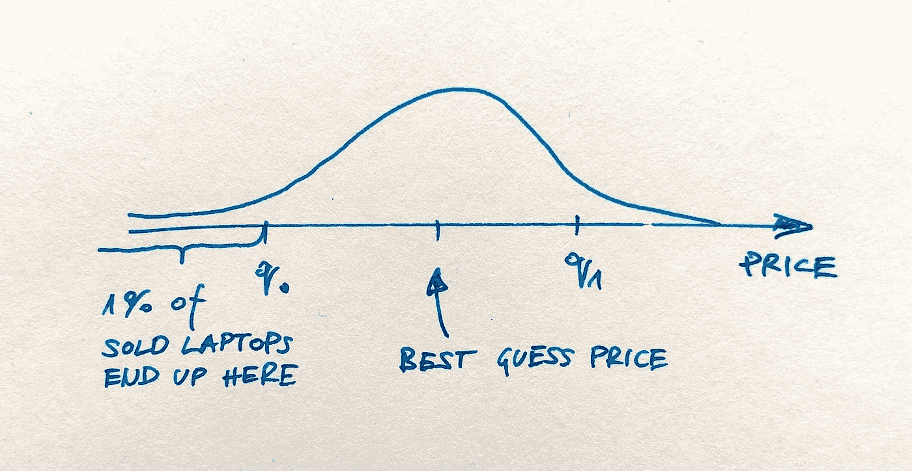

# 概率预测

> 原文：<https://towardsdatascience.com/probabilistic-predictions-fe04214bde48?source=collection_archive---------29----------------------->

## 拥抱不确定性，做出更好的决策

安妮·斯普拉特在 [Unsplash](https://unsplash.com?utm_source=medium&utm_medium=referral) 上的照片

在数据科学中，处理预测错误的传统方法让我想起了冰山的比喻。我们的模型不能完美地预测未来，所以我们优化它们，尽可能地降低预测误差。更好的模型有望导致更小的误差。但是有一个下限是任何模型都无法超越的:贝叶斯误差。贝叶斯误差是潜在问题固有的随机性的表现，这种随机性通常是相当大的。

一旦我们接近了这种贝叶斯表现，我们就很想宣布胜利并结束我们的工作。通过这样做，我们处理了冰山的可见部分。但是，我们可以做得更好，通过深入研究并建立一个模型来解决问题的不确定部分，即我们看不到的冰山区域。量化不确定性将允许我们用偏差估计修正点预测(=最佳猜测)，并最终导致我们可以信赖的更好、更稳健的模型。

在本文中，我将讨论概率预测，它将点预测和不确定性建模统一在一个一致的框架中。使用概率预测模型，我们可以计算最佳猜测预测，并推导出“安全缓冲区”，共同形成明智的决策和我们的想法。让我们开始吧！

# 俄罗斯轮盘赌和概率论

这可能是一个有点极端的机会游戏的例子，但它是解释我将在本文中使用的概率论的一些基本概念的理想场所。如果你不熟悉这个“游戏”，我建议你参考下面的维基百科[文章](https://en.wikipedia.org/wiki/Russian_roulette)。

给枪装上一发子弹，旋转圆筒，扣动扳机的动作就是*随机实验*的一个例子。随机实验的定义属性是这样一个事实，即这种实验的每次重复可能会导致不同的结果，但结果集是预先知道的。

在俄罗斯轮盘赌中，实验有两种可能的结果:枪是否开火。将一个数学对象 Y 分配给一个随机实验的结果是很方便的。y 称为结果集的一个*随机元素*。(有时人们称 Y 为随机变量。)这意味着 Y =‘枪发射了’，如果那是我们扣动扳机后观察到的事件，否则，Y 的值就是‘枪没有发射’。如果你是一个程序员，你可能会认为 Y 是一个没有参数的函数，如果对它求值，它会返回实验的结果。

如果我们给枪装上一发子弹，旋转枪管，试着射击，它*可能*不会开火。更准确地说，枪开火的概率是⅙.让我们庆祝这个罕见的时刻:我们的直觉与事物的数学定义完全吻合。事件的*概率*是一个介于 0 和 1 之间的数字。零表示“不会发生”。我们给一个确定的事件分配一个。严格介于 0 和 1 之间的数字表示不同程度的“可能性”。

一个*概率分布*，通常用 F 表示，编码了随机实验结果的概率，或者，等价地，一个随机元素 Y 的可能值的概率。所以你可能会问 F，Y =“枪开火”的概率是多少。而 f 会给你答案:F(Y =“枪火”)= ⅙.因为 F 回答这些问题太靠谱了，所以人们有时会把 F 叫做 y 的*定律*。

数学的任务是归纳思想并将结果应用于新问题。它通常是这样工作的:现在我们几乎知道了关于经典和古老的俄罗斯轮盘赌的一切，让我们更进一步，定义一下*广义俄罗斯轮盘赌*的游戏。

> 不如这样，我们可以用 n 发子弹，而不是只用一发子弹，然后把这 n 发子弹放进一把有 m 膛的枪里。显然，我们必须要求 n 在 0 和 m 之间，m 是正整数。(通常 m=6)。
> 
> 给定一把 m=6 的枪，Y 的概率分布由我们放入枪中的子弹数 X 决定。如果 X=2(我们用两轮)呢？什么是 F(Y = "炮火")？
> 
> 如果 X=2(我们用两发子弹)，那么 F(Y =“枪响”)= ⅓.
> 
> 换句话说，不同的 X 值产生不同的 y 定律。

广义俄罗斯轮盘赌游戏是*概率分类问题*的一个例子。对于输入参数 X 的不同值，我们询问结果 Y 作为 X 的函数的概率分布。结果集是固定的，对于所有 X 值都是相同的，只是这些结果的概率不同。

通常，在一个概率分类问题中，Y 的概率分布是不给出的，我们被要求以某种方式猜测或估计它。例如，给定某人签名的照片(X)，我们被要求估计该签名是真实的(Y=“真实签名”)或伪造的(Y=“伪造签名”)的概率。

对于刚刚描述的两个分类问题，产生不同结果的概率比简单地给出一个最可能的结果作为答案要有用得多，典型的分类算法就是这样做的。设想一个为检查签名而建立的业务流程。初始处理步骤可能涉及概率分类算法。如果算法几乎确定签名 X 不是伪造的，即 F(Y=“真实签名”)> 0.95，我们可以将其标记为真实的。对于任何低于 0.95 的值，我们采用进一步的、更昂贵的检查来调查签名的有效性。

俄罗斯轮盘赌的例子更加清楚地阐明了这一点。任何一个“枪会开火”/“枪不会开火”的答案都不能说明问题。我们真正想知道的是那些结果概率。

# 战略投标

几年前，我在易贝购买了目前的笔记本电脑。这是一台二手的联想 Thinkpad，我支付的价格远远低于同类新机型的价格。二手商用笔记本电脑的市场很大，因为许多公司定期购买新硬件并淘汰旧机器。这个市场提出了一个有趣的问题。假设我们想买一台硬件参数在一定范围内的笔记本电脑。拍卖投标的最佳策略是什么，它会导致较低的购买价格？

我们可以把这种情况描述为一个回归问题。给定一台笔记本电脑的硬件参数 X(可能结合了关于笔记本电脑状态的数据和卖家的信誉评分)，我们可以说这台机器的价格 Y 是多少？y 是一个随机量:它不仅由特征值 X 驱动，还由随机和不可预测的因素驱动，如用户对特定拍卖的兴趣、可能的其他正在进行的类似模型的拍卖、机器的感知价值、拍卖结束的时间等。

要想出一个最佳的投标策略，我们需要具体说明我们购买一台笔记本电脑的迫切程度。如果我们急需一台新机器，那么我们应该愿意出高价，因此出价高于 EY 的最佳猜测价格。另一方面，如果我们可以坐在那里观察市场几个星期，等待一个“异常”价格，我们应该出价大大低于点预测价格 EY。

但出价明显低于 EY 的价格意味着什么呢？要回答这个问题，我们需要了解 Y 的预测分布*和*，并根据特定价格范围的概率重新表述我们的问题。例如，异常价格可能是以 1%的概率低于价格 q0 的价格。阈值价格 q0 是 Y 分布的*分位数*，也就是说，对于给定的概率 p0=0.01，我们预计平均只有 1/100 售出的笔记本电脑的价格低于 q。这个陈述相当于公式 F(Y < q0) = 0.01，其中 F 是 Y 的法则。按照同样的思路，我们可以以价格 q1 投标，这样，以概率 0.9，购买价格低于 q1。这种方法会很快导致问题的解决。

让我们强调，分位数 q0 和 q1 取决于 Y 的分布 F(其取决于特征向量 X)，以及置信概率水平 p0 = 0.01 和 p1= 0.9。同样，我们可以把计算分位数 q0 和 q1 的问题看作是估计单侧*预测区间* (-∞，q0】和(-∞，q1)的问题。

一旦我们有了对分布 f 的估计，这就很容易了。

许多批发市场使用拍卖作为价格发现机制，因此上述讨论也适用于许多公司。例如，在德国电力批发市场，买方和卖方都参与拍卖，拍卖的结果是前一天的价格计算。电力生产商指定价量对(p，v ),并通过这样做，设置他们愿意以不低于 p 的价格出售的电量 v(MW)。类似地，电力消费者指定价量对(p，v ),指示他们愿意以不高于 p 的价格购买的电量 v。使用拍卖机制找到一个用于所有结算交易的价格，可确保交易尽可能多的电量。符合该价格的所有订单(p，v)都被结算，其余订单被丢弃。

# “M5 预测—不确定性”竞赛

Makridakis 竞赛是由预测研究人员 Spyros Makridakis 组织的一系列竞赛，旨在评估和推动适用于现实世界问题的预测方法的研究。最近，比赛的第五部分[正在 Kaggle 平台上进行，ka ggle 平台在数据科学研究人员和爱好者中都很有名。](https://www.kaggle.com/c/m5-forecasting-uncertainty)

其中提出的问题是预测未来连续 28 天在 10 个选定的沃尔玛商店中三个产品类别(食品、家庭和爱好)的各种产品的销售数量。训练数据由几年来所有产品和商店组合的历史销售数字的时间序列组成。

今年比赛的一个有趣的方面是它有两种变体:预测预期的销售数量(M5 预测-准确性)和估计销售数量 50%，67%，95%和 99%的预测区间(M5 预测-不确定性)。

今年的问题似乎非常困难，不仅因为涉及的时间序列数量巨大(约 30，000)，还因为提供的训练数据非常“嘈杂”。让我们来看看训练数据集中的一个时间序列示例:

商店层面的购买行为似乎非常不稳定，难以预测。很有可能是一些季节性因素(每周、每年、节假日)推动了销售数字的强度。在大多数情况下，销售数字的峰值无法用所提供的数据来解释。这是有道理的:我们的生活充满了我们不公开分享的细节。比方说，我们和我们所在地区的大约 20 个人最近看了一个烹饪节目，决定尝试烤香橼馅饼。一家出售制作这种馅饼所需原料的零售商对我们的计划一无所知，也没有任何有用的数据来解释柠檬需求的突然飙升。

从零售商的角度来看，更有用的是尽可能精确地知道未来销售数字的分布，而不是试图计算点预测。上面的例子说明了预期的销售数量对于处理不可预测的需求高峰毫无帮助。

作为零售商，我们希望我们的货架上有足够的商品来应对这些意想不到的需求高峰，并防止客户不得不在其他地方寻找他们需要的产品。另一方面，每家店的展示空间都是有限的，有些产品容易腐烂，不可能无限期保存。此外，储存易腐产品的成本通常不可忽略——想想超市里的巨型冰箱。

因此，最终，最大化客户满意度(和我们的收入)的问题是对我们提供的每种产品的需求的概率回归问题。我们可以为不同的需求场景分配概率(例如柠檬的需求高峰)，并将这些场景与结果的成本影响联系起来。成本的例子包括:由于对产品的需求得不到满足而导致的收入减少，或者失去一个客户的成本。

这是一个典型的不确定情况下的决策问题。我们关注不同的有利或不利事件，将收入或成本因素与它们相关联，并优化反映业务成果的指标。

# 结论

在本文中，我们讨论了通过概率预测获得对数据科学问题更全面的理解。我们已经表明，许多现实世界问题的潜在部分，即不确定性，与可见的贝叶斯性能元素一样重要。揭示这种不确定性可以带来更稳健、更可信的模型，并为开发能够应对各种未来情景的战略决策系统开辟了一条至关重要的道路。

非常感谢 Sarah Khatry 阅读了这篇博文的草稿，并提供了无数的改进意见和更正。