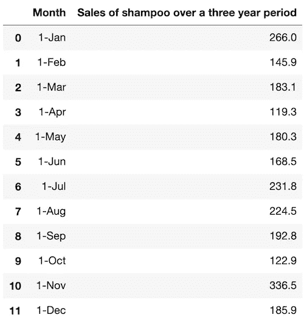
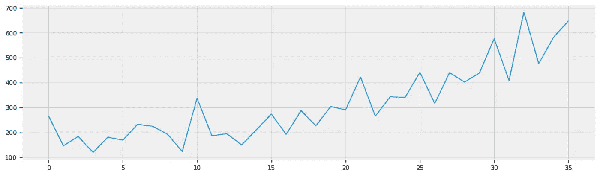
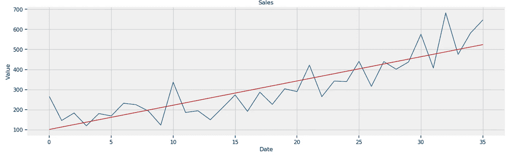
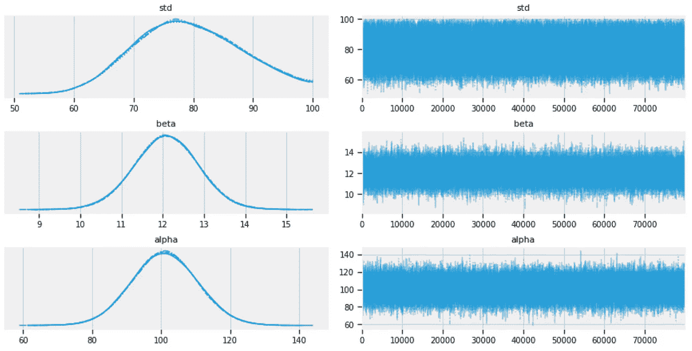
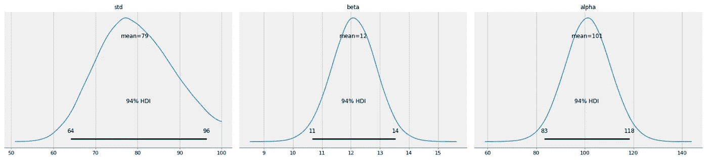
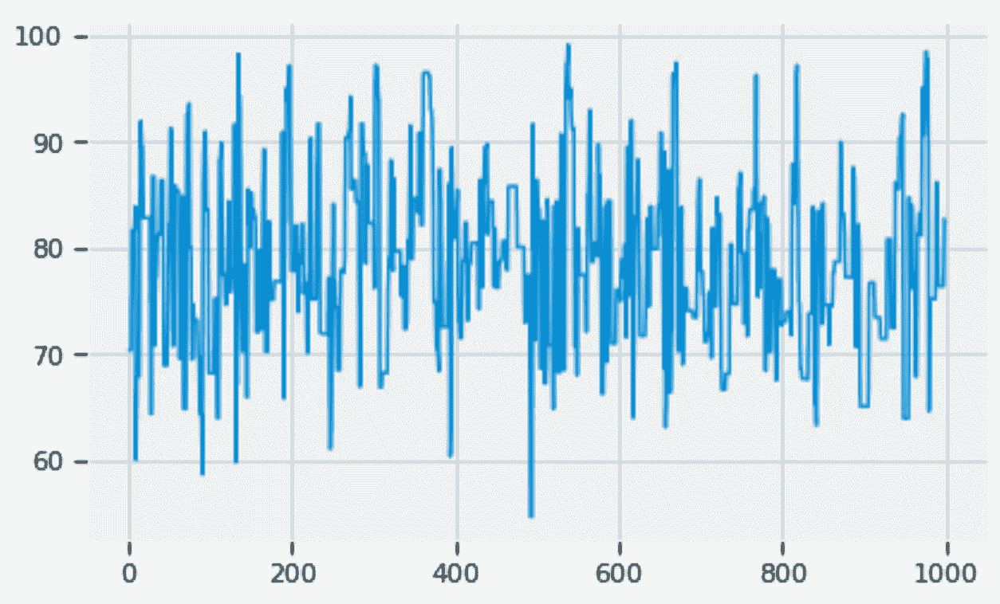
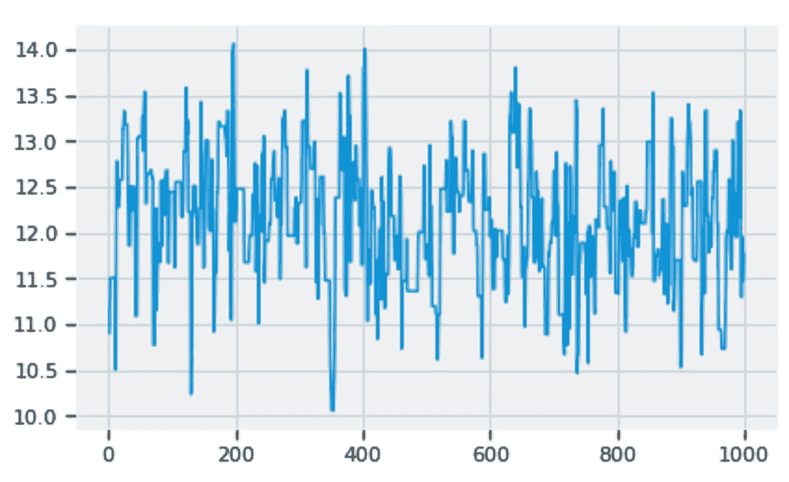
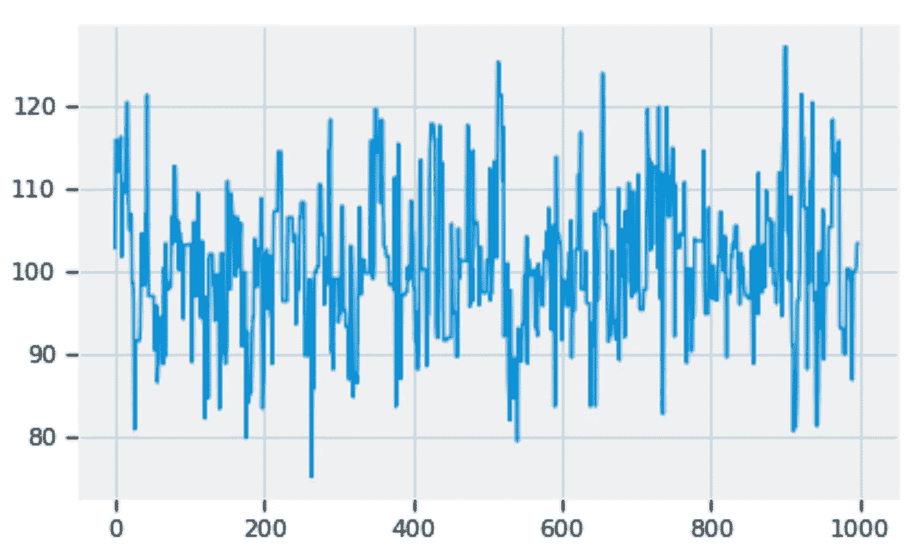
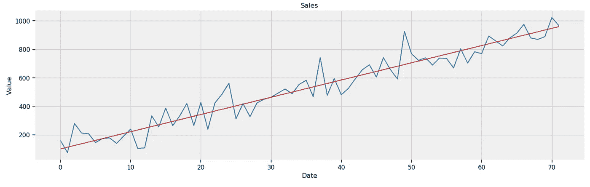

# Python 中时间序列分析和预测的概率规划和贝叶斯推理

> 原文：<https://towardsdatascience.com/probabilistic-programming-and-bayesian-inference-for-time-series-analysis-and-forecasting-b5eb22114275?source=collection_archive---------7----------------------->

## Python 中时间序列数据分析和预测的贝叶斯方法


作者照片

如[1][2]所述，[时间序列](https://en.wikipedia.org/wiki/Time_series)数据包括来自金融、医学、科学研究(如全球变暖、语音分析、地震)等不同领域的多种真实实验数据。时间序列预测在各个领域都有很多实际应用，例如商业预测(如销售、股票)、天气、死亡等[2]。统计建模和推理(如 ARIMA 模型)[1][2]是时间序列分析和预测的流行方法之一。

有两种统计推断方法:

*   [贝叶斯推断](https://en.wikipedia.org/wiki/Bayesian_inference)
*   [频率主义者的推论](https://en.wikipedia.org/wiki/Frequentist_inference)

贝叶斯推理的哲学是将概率视为事件可信度的度量[3][4][5]，并使用[贝叶斯定理](https://en.wikipedia.org/wiki/Bayes%27_theorem)随着更多[证据](https://en.wikipedia.org/wiki/Evidence)或[信息](https://en.wikipedia.org/wiki/Information)变得可用来更新概率，而频率主义推理的哲学将概率视为事件的长期频率[3]。

一般来说，只有在大量数据样本可用的情况下，我们才能使用 Frequentist 推断。相比之下，贝叶斯推理可以应用于大数据集和小数据集。

在本文中，我使用 Kaggle [6]的一个小的(只有 36 个数据样本)[洗发水销售](https://www.kaggle.com/djokester/sales-of-shampoo-over-a-three-year-period)时间序列数据集来演示如何使用概率编程来实现贝叶斯分析和推理，用于时间序列分析和预测。

文章的其余部分安排如下:

*   贝叶斯定理
*   [MCMC](https://en.wikipedia.org/wiki/Markov_chain_Monte_Carlo) 基础知识(马尔可夫链蒙特卡罗)
*   概率规划
*   时间序列模型和预测[3]
*   摘要

# 1.贝叶斯定理

设 ***H*** 为事件将发生的假设， ***D*** 为新观察到的数据(即证据)，而 ***p*** 为概率，贝叶斯定理可描述如下[5]:

p(H | D) = p(H) x p(D | H) / p(D)

*   p(H):在我们看到任何数据之前，假设的先验概率
*   p(H | D):我们观察新数据后假设的后验概率
*   p(D | H):似然，假设下数据的概率
*   p(D):任何假设下数据的概率

# 2.MCMC 基础

[MCMC](https://en.wikipedia.org/wiki/Markov_chain_Monte_Carlo) 由一类[算法](https://en.wikipedia.org/wiki/Algorithm)组成，用于从[概率分布](https://en.wikipedia.org/wiki/Probability_distribution)中取样。广泛使用的算法之一是[Metropolis–Hastings 算法](https://en.wikipedia.org/wiki/Metropolis%E2%80%93Hastings_algorithm)。基本思想是随机生成大量代表性样本，以逼近多维连续参数空间上的连续分布[4]。

Metropolis 算法的高级描述可以表示如下[3]:

*   步骤 1:从 n 参数空间中的当前位置(即，n 参数值的向量)开始
*   步骤 2:建议移动到新位置(n 参数值的新向量)
*   步骤 3:基于先前位置的先验概率、数据以及根据贝叶斯定理[3]从数据及其先验分布计算的后验概率，接受或拒绝提议的移动。
*   第四步:如果提议被接受，那就去新的职位。否则，不要动。
*   步骤 5:如果尚未达到预先指定的步骤数，请返回步骤 1 重复该过程。否则，返回所有接受的位置。

MCMC 的基础是贝叶斯定理。从假设和数据的给定先验分布开始，上述 Metropolis 过程的每次迭代都会积累新数据，并使用它来更新假设，以随机行走的方式选择下一步[4]。接受的步骤是假设的后验分布的样本。

# 3.概率规划

有多个 Python 库可用于编程贝叶斯分析和推理[3][5][7][8]。这种类型的编程称为概率编程[3][8]，相应的库称为概率编程语言。PyMC [3][7]和张量流概率[8]就是两个例子。

在这篇文章中，我使用 PyMC [3][7]作为概率编程语言来分析和预测洗发水的销售[6]作为演示目的。

# 4.时间序列模型与预测

本节描述了如何使用 PyMC [7]对时间序列预测的贝叶斯分析和推理进行编程。

## 4.1 数据加载

一旦 Kaggle [6]三年洗发水销售的数据集下载到本地机器上，数据集 csv 文件就可以加载到 Pandas 数据帧中，如下所示:

```
df = pd.read_csv('./data/sales-of-shampoo-over-a-three-ye.csv')
df.head(12)
```



数据框架中的销售列可以提取为时间序列数据集:

```
sales = df['Sales of shampoo over a three year period']
sales.plot(figsize=(16,5))
```

下面这个图是三年(36 个月)洗发水的销量:



**图 1:** 三年(36 个月)洗发水销量。

## 4.2 建模

贝叶斯建模的良好开端[3]是考虑一个给定的数据集可能是如何生成的。以图 1 中洗发水时间序列数据的销售为例，我们可以从思考开始:

*   由于数据集从左下角到右上角大致形成一条直线，因此数据集可能是由销售中带有随机误差的时间线性函数生成的。
*   随机误差可能遵循均值为零且标准偏差未知的正态分布 *std* 。

我们知道一个线性函数由两个参数决定:[斜率](https://en.wikipedia.org/wiki/Slope)β和[截距](http://www.columbia.edu/itc/sipa/math/intercepts.html)α:

*销售* = *贝塔* x *t* + *阿尔法* + *误差*

为了估计时间的线性函数可能是什么，我们可以将[线性回归](https://en.wikipedia.org/wiki/Linear_regression)机器学习模型拟合到给定的数据集中，以找到斜率和截距:

```
import numpy as np
from sklearn.linear_model import LinearRegressionX1 = sales.index.values
Y1 = sales.values
X = X1.reshape(-1, 1)
Y = Y1.reshape(-1, 1)
reg = LinearRegression().fit(X, Y)reg.coef_, reg.intercept_
```

其中 *reg.coef_* = 12.08 为斜率， *reg.intercept_* = 101.22 为截距。

```
Y_reg = 12.08 * X1 + 101.22def plot_df(x, y, y_reg, title="", xlabel='Date', ylabel='Value', dpi=100):
    plt.figure(figsize=(16,5), dpi=dpi)
    plt.plot(x, y, color='tab:blue')
    plt.plot(x, y_reg, color='tab:red')
    plt.gca().set(title=title, xlabel=xlabel, ylabel=ylabel)
    plt.show()plot_df(x=X1, y=Y1, y_reg=Y_reg, title='Sales')
```

上面的代码在蓝色销售曲线上绘制了红色回归线:



**图 2:** 三年(36 个月)洗发水销量，回归线为红色。

回归线的斜率和截距只是基于有限数据的估计。考虑到不确定性，我们可以将它们表示为正态随机变量，将确定的斜率和截距表示为平均值。这在 PyMC [7]中实现如下:

```
beta = pm.Normal("beta", mu=12, sd=10)
alpha = pm.Normal("alpha", mu=101, sd=10)
```

同样，为了处理不确定性，我们可以使用 PyMC 将误差的标准偏差表示为在[0，100]范围内的均匀随机变量:

```
std = pm.Uniform("std", 0, 100)
```

有了随机变量 *std* 、 *beta* 、 *alpha* ，具有不确定性的回归线可以用 PyMC [7]表示:

```
mean = pm.Deterministic("mean", alpha + beta * X)
```

利用具有不确定性的回归线，洗发水销售时间序列数据的先验分布可以在 PyMC 中编程:

```
obs = pm.Normal("obs", mu=mean, sd=std, observed=Y)
```

使用上述先验分布作为参数(即*α*、*β*、 *std* )空间中的起始位置，我们可以使用 PyMC 中的[Metropolis–Hastings 算法](https://en.wikipedia.org/wiki/Metropolis%E2%80%93Hastings_algorithm)执行 MCMC:

```
import pymc3 as pmwith pm.Model() as model:
    std = pm.Uniform("std", 0, 100)

    beta = pm.Normal("beta", mu=12, sd=10)
    alpha = pm.Normal("alpha", mu=101, sd=10)

    mean = pm.Deterministic("mean", alpha + beta * X)

    obs = pm.Normal("obs", mu=mean, sd=std, observed=Y)

    trace = pm.sample(100000, step=pm.Metropolis())
    burned_trace = trace[20000:]
```

总共有 100，000 个被接受的步骤，称为*跟踪*。我们忽略前 20，000 个可接受的步骤，以避免收敛前的磨合阶段[3][4]。换句话说，我们只使用磨合期后的公认步骤进行贝叶斯推断。

## 4.3 后验分析

以下代码描绘了老化期后 *std* 、 *alpha* 和 *beta* 的轨迹:

```
pm.plots.traceplot(burned_trace, varnames=["std", "beta", "alpha"])
```



**图 3:**STD、alpha、beta 的痕迹。

*std* 、 *alpha* 和 *beta* 的后验分布可以绘制如下:

```
pm.plot_posterior(burned_trace, varnames=["std", "beta", "alpha"])
```



**图 4:**STD、alpha、beta 的后验分布。

*std* 、 *alpha* 和 *beta* 的个别痕迹可以提取进行分析:

```
std_trace = burned_trace['std']
beta_trace = burned_trace['beta']
alpha_trace = burned_trace['alpha']
```

我们可以用任何指定的步数(如 1000)放大 *std* 的轨迹细节:

```
pd.Series(std_trace[:1000]).plot()
```



**图 5:** 放大 std 的痕迹。

同样，我们可以分别放大 *alpha* 和 *beta* 的轨迹细节:

```
pd.Series(beta_trace[:1000]).plot()
```



**图 6:** 放大贝塔的踪迹。

```
pd.Series(alpha_trace[:1000]).plot()
```



**图 7:** 放大 alpha 的痕迹。

图 5、6 和 7 显示 *std* 、 *alpha* 和 *beta* 的后验分布具有良好的混合频率，因此自相关性较低，这表明 MCMC 收敛【3】。

## 4.4 预测

可以计算出 *std* 、 *alpha* 和 *beta* 的后验分布的平均值:

```
std_mean = std_trace.mean()
beta_mean = beta_trace.mean()
alpha_mean = alpha_trace.mean()
```

*   *标准平均值* = 79.41
*   *beta_mean* = 12.09
*   *alpha_mean* = 101.03

洗发水销售的预测可以建模如下:

*Sale(t)*=*beta _ mean*x*t*+*alpha _ mean*+*误差*

其中*误差*服从正态分布，均值为 0，标准差为 *std_mean* 。

使用上面的模型，给定任意数量的时间步长(例如 72)，我们可以生成销售的时间序列:

```
length = 72
x1 = np.arange(length)
mean_trace = alpha_mean + beta_mean * x1
normal_dist = pm.Normal.dist(0, sd=std_mean)
errors = normal_dist.random(size=length)
Y_gen = mean_trace + errors
Y_reg1 = mean_trace
```

给定 36 个月的数据，下面的代码绘制了未来 36 个月(从第 37 个月到第 72 个月)的销售预测。

```
plot_df(x=x1, y=Y_gen, y_reg=Y_reg1, title='Sales')
```



**图 8:** 预测未来 36 个月(从第 37 个月到第 72 个月)的销售额。

# 5.摘要

在本文中，我使用来自 Kaggle [6]的小型[洗发水](https://www.kaggle.com/djokester/sales-of-shampoo-over-a-three-year-period)【6】时间序列数据集来展示如何使用 PyMC [3][7]作为 Python 概率编程语言来实现时间序列预测的贝叶斯分析和推理。

概率编程语言的另一种选择是[张量流概率](https://github.com/tensorflow/probability)【8】。我在本文中选择 PyMC 有两个原因。一个是 PyMC 比张量流概率更容易理解。另一个原因是 Tensorflow probability 正在从 Tensorflow 1.x 迁移到 Tensorflow 2.x 的过程中，缺少 Tensorflow 2.x 的 Tensorflow probability 文档。

# 参考

1.  [Python 中常用的时间序列数据分析方法和预测模型](https://medium.com/p/common-time-series-data-analysis-methods-and-forecasting-models-in-python-f0565b68a3d8?source=email-80e8f2faf4bc--writer.postDistributed&sk=24961c5af213777f4e8dcdd00b290004)
2.  R.H. Shumway 和 D.S. Stoffer，时间序列分析及其应用，第 4 版，施普林格，2017 年
3.  C.戴维森-皮隆，《黑客的贝叶斯方法，概率编程和贝叶斯推理》，艾迪森-韦斯利，2016 年
4.  J.K. Kruschke,《做贝叶斯数据分析》,与 R、JAGS 和斯坦合著，学术出版社，2015 年
5.  A.B .唐尼，思考贝氏，奥赖利，2013
6.  [三年内洗发水的销售额](https://www.kaggle.com/djokester/sales-of-shampoo-over-a-three-year-period)
7.  [PyMC3](https://docs.pymc.io/)
8.  [张量流概率](https://github.com/tensorflow/probability)
9.  Github[中的 Jupyter 笔记本](https://github.com/yzzhang/machine-learning/tree/master/probabilistic_programming)