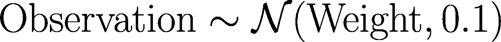
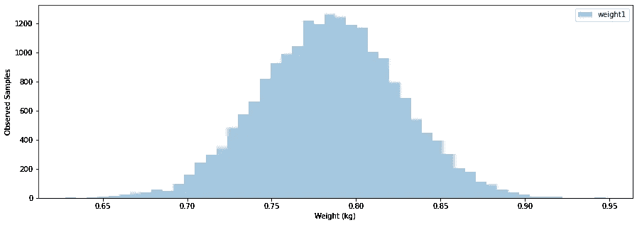
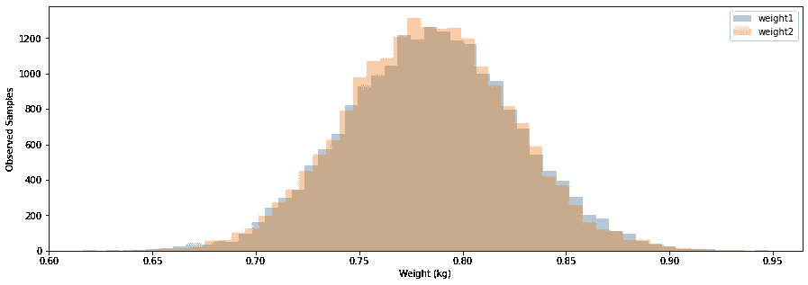
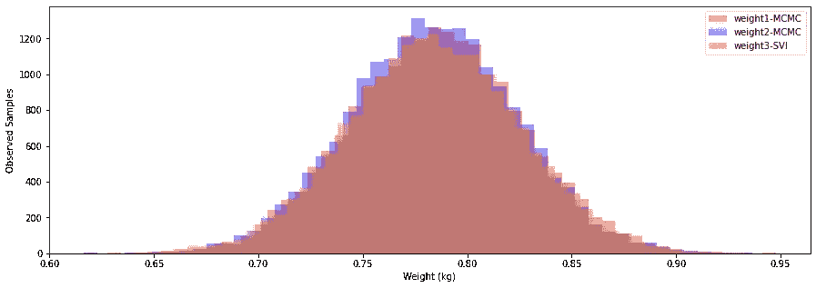
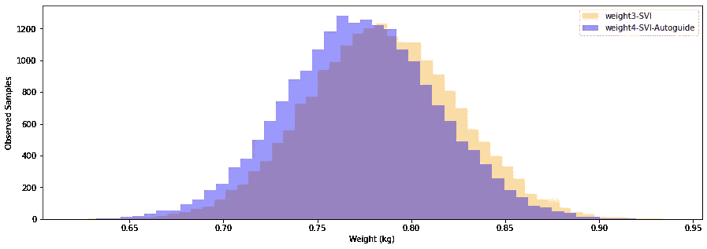

# 用 Pyro 和厨房秤进行概率编程

> 原文：<https://towardsdatascience.com/probabilistic-programming-with-pyro-and-kitchen-scale-f8d6a5d9ae0f?source=collection_archive---------21----------------------->


照片由来自 [Pexels](https://www.pexels.com/photo/black-click-pen-on-white-paper-167682/?utm_content=attributionCopyText&utm_medium=referral&utm_source=pexels) 的 [Lum3n](https://www.pexels.com/@lum3n-44775?utm_content=attributionCopyText&utm_medium=referral&utm_source=pexels) 拍摄

最近感兴趣的技术之一是概率规划的使用。如果你以前从未听说过概率编程，你可能会认为它只是用概率编程。这是正确的，但只是故事的一部分。

在其核心，概率规划是关于寻找潜在的分布，影响感兴趣的过程。你定义一个过程和它是如何工作的，然后让你选择的概率编程语言(PPL)来推断影响你的过程的因素的可能值，以及它们的可能性有多大。

最好用一个例子来解释这一点，对于这个例子，我将使用 Pyro 作为 PPL 的选择，以及一个简单的案例研究，主要灵感来自官方的 Pyro 示例[。](http://pyro.ai/examples/intro_part_ii.html)

# 构建我们的过程——神奇的厨房秤

想象你有一个厨房秤，你把一个物体放在上面，秤告诉你它的重量。但是想象的尺度相当古老，而且不是很准确。每次你把同样的物体放在上面，它会给你一个稍微不同的测量值。然而，您观察到，这种秤以某种神奇的方式产生误差，在物品的真实重量周围形成正态分布，标准偏差为 0.1 千克



让我们来描述这个过程(我们将使用 PyTorch，Pyro 使用它作为底层张量计算引擎)。

首先，我们将导入我们需要的库

让我们来定义我们的厨房秤，或者更具体地说，它用来给我们观察的过程

现在让我们问自己一个简单的问题；

> *“如果我们将一件 0.5 千克的物品放在秤上，我们会得到哪些可能的值？”*

```
tensor(0.6541)
tensor(0.4707)
tensor(0.2821)
```

我们得到了 3 个值的集合。每次我们要求我们的秤给出答案，我们都会得到一个稍微不同的值。有时值会非常接近 0.5(大多数情况下会出现这种情况)，有时会非常远。虽然这很容易实现，但就编程而言并不新鲜。

我们来试试稍微难一点的问题；

> *“如果我将一件重 0.5 千克的物品放在磅秤上，观察到高于 0.63 千克的值的概率是多少？”*

我们也可以通过编程来回答这个问题。我们将只生成许多值，统计我们生成的所有值，统计所有大于 0.63 的值，并找出它们的比率:

```
rough estimate: 0.097
reasonable estimate: 0.101
good estimate: 0.09691
true estimate: 0.0968004845856103
```

如果我们运行这个过程足够多次，我们将得到一个对所有意图和目的都好的估计。这需要更多的工作和时间，但是总的来说这个工作流程也不是太难。

让我们试试一个更难的问题:

> *“我观察到一个 0.63 千克的值，该物品最可能的真实重量是多少？”*

这可能会让你大吃一惊，但稍加思考后，你可能会想起你神奇的不准确但性能良好的秤报告了该物品真实重量的正态分布，因此在没有进一步信息的情况下，最有可能的重量实际上是 0.63 千克

然而，这在很大程度上是容易的，因为**我们知道**围绕秤的真实重量的分布是正态的。如果不正常呢？如果它甚至不是预先内置到 Python 中的东西呢？

现在让我们尝试一个难题，它将激励我们使用概率规划:

> *“让我们想象一下，从我们的秤中得到以下一组观察值:0.74 千克、0.98 千克、0.66 千克、0.75 千克、0.84 千克和 0.74 千克，物体最可能的真实重量是多少？”*

**我用来生成这些值的真实重量是 0.8 千克，但是让我们看看如何才能发现它**

# 在 Pyro 中构建我们的流程

上一节中的问题正是概率规划要回答的问题。一般的形式是“给定一些观察，以及对过程的良好理解，我能推断出一些关于我的过程中隐藏的值或初始条件吗？”

现在我们想知道，我们的产品最可能的重量是多少。我们现在将使用 Pyro 来回答这个问题。

```
The mean of the observations is: 0.7850000262260437.
```

首先，让我们再次定义我们的过程，但是有一些变化。我们还会将函数从`process`重命名为`model`，因为这通常是 Pyro 代码的编写方式:

这可能看起来很多，所以让我们解开这个函数是如何工作的。

给定我们的观察值，我们试图找到一个可能的权重值的分布。

*   我们首先定义这些值的先验分布，这是我们对概率分布的最佳猜测，在(1)。
*   然后，我们从(2)的分布中取样。然而，现在这是一个命名的发行版(我们将其命名为`"weight1"`)。这是我们告诉 Pyro 优化权重来源分布的方式。在幕后，Pyro 将修改这个分布，使之更符合我们的观察。
*   在(3)中，我们定义了秤的工作方式。回想一下，为了进行测量，秤返回以重量为中心的正态分布值，标准偏差为 0.1。
*   最后，在(4)中，我们从我们在(3)中定义的分布中取样。请注意，这些也是命名样本，但它们取决于观察结果。这就是我们告诉 Pyro 我们的`"weight1"`值与观察值的关系。

# 使用抽样技术估算我们的体重

现在，我们将使用我们的模型来找到一个合适的估计重量的项目，给我们的测量。我们将使用一个称为马尔可夫链蒙特卡罗(MCMC)的算法家族，以及一个称为哈密顿蒙特卡罗(HMC)的特定实例。关于 MCMC 和原始 Metropolis 采样算法的深入解释(HMC 就是建立在这个基础上的)，我鼓励你去看看扎克·安临来的演讲

本质上，该算法将基于我们定义的分布影响的观察值(我们命名为`"obs_{i}"`的变量)，构建我们命名的分布`“weight1”`的概率分布。

```
Sample: 100%|██████████| 20100/20100 [02:03, 163.05it/s, step size=1.55e+00, acc. prob=0.902]
```

让我们看看这里发生了什么:

*   在(1)处，我们从我们的 Pyro 存储器中清除所有命名的样本。Pyro 使用一个特殊的、内置的、类似字典的对象来跟踪我们请求的项目的估计值。清楚这一点很重要，这样如果我们多次运行这段代码，前面的运行就不会扭曲我们的结果。
*   在(2)和(3)中，我们定义了一种 MCMC 算法，该算法使用 HMC 实现来估计命名变量`"weight1"`的分布。MCMC 算法运行一定次数的迭代，在本例中为 20，100 次迭代。然而，它得出的前几个估计值对初始随机条件非常敏感，所以我们倾向于丢弃这些估计值(我们将丢弃前 100 个)。所有剩余的 20，000 个样本将用于构建我们对`"weight1"`的后验估计
*   最后在(4)中，我们运行我们的 MCMC 算法。注意，我们必须将我们的观察结果发送到`model`函数中(因为我们之前定义它接受一系列观察结果)。这是我们将所有变量发送给`model`函数的地方。

现在，让我们画出估算`"weight1"`时得到的所有样本，将这些样本转换成一个 NumPy 数组(它们作为 PyTorch 张量返回)，并绘制成直方图。

```
array([0.8106951 , 0.77260906, 0.79576313, ..., 0.86141765, 0.7857265 , 0.7469458 ], dtype=float32)
```



具有正态先验的 HMC 算法生成的权重值的样本分布

我们还可以绘制摘要，并查看该分布的平均值，以找到最可能的值以及 90%的可信区间。

```
 mean  std   median  5.0%    95.0%     n_eff     r_hat
weight1  0.78  0.04  0.79    0.72    0.85   29855.87     1.00Number of divergences: 0
```

因此，我们看到平均值约为 0.78 千克，我们 90%确信该物品的重量值在 0.72 千克到 0.85 千克之间(这也是我们判断是否对这 90%范围满意的空间)。

你现在可能会说 ***“嗯，你有一个很好的先验，你的平均值非常接近 0.8 公斤的真实值。如果你使用一个信息量较少的先验呢？”***

让我们也来探索一下这个场景。这一次我们将使用 0.0(重量不能为负)和 2kg(看起来是一个很好的上限)之间的均匀分布。

```
Sample: 100%|██████████| 20100/20100 [03:20, 100.21it/s, step size=8.57e-01, acc. prob=0.978]
```

```
 mean   std   median      5.0%     95.0%     n_eff     r_hat
weight2  0.78  0.04     0.78      0.72      0.85   1059.35      1.00

Number of divergences: 0
```

有这样一个信息不丰富的先验并没有造成多大的不同。该算法 90%确信体重在 0.72 千克和 0.85 千克之间，并且这些值的平均值仍然集中在 0.78 千克(非常接近使用的 0.8 千克)。

我们可以再次获取这个新近似值的样本，再次将它们转换为 NumPy 数组，并将结果绘制成分布图。你会看到分布重叠得非常厉害，即使使用了两个非常不同的先验。



由具有正态先验的 HMC 算法以及具有均匀先验的 HMC 算法生成的权重值的样本分布

# 使用随机变分推断来近似我们的重量

如果您运行上面的代码，您会注意到使用 MCMC 方法绘制所有的样本需要相当多的时间。Pyro 提供了一种评估隐藏参数的替代方法，这种方法更快，并且可以为一些问题提供同样好的结果:随机变分推断(SVI)。

SVI 方法把这个推理问题当作一个最优化问题。在 SVI 方法中，我们选择由一些参数定义的另一种分布(例如，正态分布由其均值和标准差定义)，并优化这些参数，直到我们选择的分布提供“足够接近”我们观察结果的结果。

这种评估后验概率的替代方法需要一个额外的函数，它被称为引导函数。这个函数定义了我们的参数，以及我们建议的与观察值相匹配的分布。

让我们再次定义我们的模型:

现在，让我们定义我们的向导函数:

*   首先，向导和模型函数必须接受相同的输入，即使向导根本不使用它们中的任何一个。
*   在(2)和(3)中，我们说取一个正态分布，并调整它的参数(平均值和标准偏差),以便它更有可能产生观察到的观察值。在(2)中，我们必须提供这些参数的初始猜测(注意`pyro.param`语句，它与`pyro.sample`不同，因为它注册的是参数，而不是分布)。
*   在(4)中，我们从(3)中定义的分布中提取一个权重。我们实际上不需要将该值存储到 python 变量中，我们只需要与模型函数中的名称完全相同的`pyro.sample`语句。这只适用于未观察到的样本(没有`obs=`附加参数的样本)

现在这变成了一个优化问题，我们只需要优化`"mu"`和`"sigma"`，使它们定义的正态分布更接近我们观察到的值。

```
iter: 9900, loss: -2.031
```

在执行优化之后，我们可以向 Pyro 请求找到的`"mu"`和`"sigma"`的值

```
"mu" is 0.7845805883407593
"sigma" is 0.040342673659324646
```

我们还可以要求与之前相同的关于`“weight3”`的统计数据，例如 90%的可信区间，但是我们必须为此做更多的工作。

我们需要使用我们发现的值来生成新的样本(MCMC 通过生成样本来工作，因此在算法运行之后我们不需要额外的步骤):

```
 weight_mean  weight_5%  weight_95%
0     0.784121   0.717712    0.850685
Run time for SVI algorithm and result extraction: 19.51 seconds
```

我们可以看到，我们得到的结果与使用 MCMC 模型时观察到的结果非常相似，但只是运行时间的一小部分。

SVI 方法旨在提高执行速度。但是，由于它们需要预定义的配送作为指导，因此对于某些配送(例如多式联运)来说，可能很难选择这些配送。对于可以由预定义分布近似的分布，它们是理想的，因为它们提供了实质性的性能提升。

我们还可以将通过 SVI 算法采样获得的结果分布与之前的样本进行比较:



由两种 HMC 算法生成的权重值的样本分布，以及由 SVI 算法生成的样本分布，

# 使用自动导向装置

我想在这里介绍的最后一个功能是在 Pyro 中使用自动引导。当构建你自己的指南是一项费力的任务时，Pyro 提供了使用预建自动指南功能的能力。

```
Optimizing...
iter: 9900, loss: -1.88
Parameters:
"mu" is [0.77290195]
"sigma" is [0.04055462]
Predicting...
   weight_mean  weight_5%  weight_95%
0     0.773199   0.706324      0.8403
Run time for SVI algorithm and result extraction: 23.17 seconds
```

我们还可以绘制这些结果，并比较两种 SVI 方法的分布:



具有自定义向导和自动分类的 SVI 算法生成的权重值的样本分布

这篇文章展示了 Pyro 在推断模型中隐藏的参数值时提供的基本功能。

我鼓励大家探讨扎克·安临来 的 [**演讲，讨论概率编程应用(示例使用 PyMC3 进行探讨，但现在应该更容易翻译成 Pyro)，以及 Chi Nhan Nguyen**](https://www.youtube.com/watch?v=5f-9xCuyZh4) 的[演讲，展示如何使用 Pyro 为过度自信的神经网络引入不确定性(演讲使用 Pyro 的旧版本)。](https://www.youtube.com/watch?v=mtFBfOmdFQk)

在以后的文章中，我将探索如何将 Pyro 用于更真实的应用程序，但是当开始使用任何新的库时，一个容易理解的简单示例对于解释库的工作方式非常有用。

这篇文章的笔记本版本，请访问 [**这里**](https://github.com/bshabashFD/Project-Chronos/blob/master/Pyro%20Tutorial/Basic%20Probabilistic%20Programming%20with%20Pyro.ipynb)