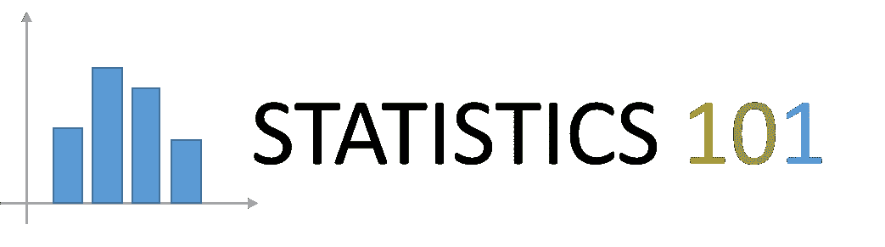

# 概率导论

> 原文：<https://towardsdatascience.com/probability-79b00c69a0e6?source=collection_archive---------45----------------------->



## 统计 101

## 通过圆周率实验定义


照片由 D [伊兰·诺尔特](https://unsplash.com/@dylan_nolte?utm_source=unsplash&utm_medium=referral&utm_content=creditCopyText)在 [Unsplash](/s/photos/numbers?utm_source=unsplash&utm_medium=referral&utm_content=creditCopyText) 上拍摄

概率是一个多方面的概念；在一个小实验的帮助下，我们将尝试对他的方面给出一个完整的解释。

# 实验

想象一个 1x1 的盒子，里面有四分之一的圆(图 1)。半径是 1，所以面积当然是π/4。我们将尝试通过概率的不同定义来估计这一领域，提供概念的可视化和理论结论的经验证据。


图 1 —实验(作者)

# 经典解释

概率的一个定义，被称为经典，是从概率游戏(即轮盘赌、掷骰子、掷硬币等)的理论发展而来的。).该理论指出，在没有任何随机事件信息的情况下，或者当我们知道所有机会都是均等分布的(就像我们掷骰子一样)时，将所有事件简化为所有可能积极结果的基数是正确的，概率是比率:


一个典型的例子:我们掷一个公平的骰子，我们想知道这个数字是质数的可能性。我们知道 2、3、5 是质数，所以我们总共有 6 次机会中有 3 次“赢”(有利事件发生)。所以:


在实验中，我们建立了一个点的网格，在 0 和 1 之间均匀分布在 *x* 和 *y* 中。这样，我们可以模拟任何事件的等效发生。什么时候一个事件是有利的？我们要估计曲线下的面积，所以任何对 *E* 中的 *(x，y)* ，这样:


是有利的事件。这个想法就是简单地计算点在 *E* 和点在ω。它们的比率是概率(根据定义)和曲线下面积的估计值。

在 Python 中，我们可以定义一个简单的函数:

```
def classic_ex(n):
    xl = []
    yl = []
    color = []
    e = 0
    for i in range(n+1):
        for j in range(n+1):
            x = 1/n * i;
            y = 1/n * j;
            if ((x**2 + y**2) <= 1):
                e = e + 1;
                color.append('blue')
            else:
                color.append('lightgray')
            xl.append(x)
            yl.append(y)

    return e/(n**2), xl, yl, color;
```

用 matplotlib plt 函数*散点*调用函数 end graph it:

```
e1, x1, y1, c1 = classic_ex(n);
plt.scatter(x1,y1,color=c1)
plt.set_title('p=' + str(e1))
```

通过用 n = (10，33，100，333)重复这个过程，我们得到了下图中的结果(图 2):


图 2-该区域的经典概率估计(作者)

可以看到，当 *n* 越来越大时，E(曲线下面积)的概率越来越接近 pi/4 的预期结果，这就导致了*冯米塞斯*的假设:


如果我们尝试的次数足够多，实验比会收敛到概率。

概率的经典定义在以下条件下成立:

1.  这些事件是互斥的
2.  事件的并集是可能事件ω的总和
3.  每一个结果(事件)都被认为是同样可能的

条件 3 在某种程度上是“循环的”，因为可能性既是一种假设，也是概率度量的对象。在我们的实验中，我们强迫事件平均分布(均匀分布)；在没有任何其他数据信息的情况下，在实际情况下，这并不总是一个有效的假设；我们需要概率的另一个定义。

# 频繁主义

在频率主义下，我们对事件的等可能性没有任何假设。相反，我们认为概率是一个随机事件的*总体趋势*，它会发生很多次。我们测量有利事件(计数发生)的*频率*，没有任何概率分布的假设。

在实验中，我们假设点是均匀分布的，但不是事件的均匀分布。这是因为我们想要模拟随机选择点的情况，这些点有助于概率的估计(曲线下的面积)。随着 *N* 变大，我们陷入了冯·米塞斯的假设:


在 Python 中:

```
def freq_ex(n):
    xl = []
    yl = []
    color = []
    e = 0
    for i in range(n):
            x = np.random.uniform(0,1)
            y = np.random.uniform(0,1)
            if ((x**2 + y**2) <= 1):
                e = e + 1;
                color.append('blue')
            else:
                color.append('lightgray')
            xl.append(x)
            yl.append(y)

    return e/n, xl, yl, color;
```

再次为了形象化:

```
e1, x1, y1, c1 = classic_ex(n);
plt.scatter(x1,y1,color=c1)
plt.set_title('p=' + str(e1))
```

运行 n = (100，1000，10000，100000)的实验，最后可视化我们得到的结果(图 3):


图 3——该地区的常客概率估计(按作者)

同样，估计的概率趋向于π/4 的预期结果。

为了实证检验这种集中趋势，让我们尝试另一个实验:重复频率测试 a 1000 次，并查看估计区域的分布。

在 Python 中:

```
ex = []
for i in range(1000):
    e1, x1, y1, c1 = freq_ex(1000);
    ex.append(e1)fig = plt.figure(figsize=(15,15))
plt.hist(ex, bins=20)
plt.vlines(np.pi/4,0,150)
```

我们得到(图 4):


图 4——区域估计的主要趋势(按作者)

我们看到这个奇怪的钟形曲线，它定义了概率的预期估计的分布。这条曲线决定了一个*高斯*或*正态*分布，但这也是后话。现在，我们看到我们概率的中心趋势对应于π/4 曲线下的期望面积。

# Kolmogorov 和公理化定义

俄罗斯数学家安德烈·尼古拉耶维奇·科尔莫戈罗夫(Andrej Nikolaevič Kolmogorov)定义了现在所谓的概率公理化解释的基础。

(来自[维基百科](https://en.wikipedia.org/wiki/Probability_axioms)):

> 设(ω， *F* ， *P* )为测度空间，其中 *P* 为某事件 *E* 的概率，记为 *P(E)* ，*P(ω)= 1*。那么(ω， *F* ， *P* )就是一个概率空间，样本空间*ω*，事件空间 *F，*和概率测度 *P.*

Kolmogorov 理论基于三个公理。让我们在实验中使用它们。

## 第一公理


这个公理说明事件 E 的概率总是一个正实数。

## 第二公理


整个样本空间的概率等于 1(这意味着至少有一个基本事件肯定发生)。

## 第三公理


当我们有可计数数量的互斥事件 *E1* ， *E2* ，…那么事件联合的概率等于每个事件的概率之和。这个性质被称为*σ-additivity，*，对于有限数量的事件，他的解释很简单。对于无限多的事件来说并不相同，但这超出了本文的范围。

回到我们的实验，我们有:


E1 和 E2 是互斥的，E1 和 E2 的和等于整个ω。从 Kolmogorov 公理出发，利用集合代数，在下一篇文章中，我们将定义概率的一些基本性质。

我希望你喜欢这篇文章，并随时留下评论，关注我未来在 Medium 上的帖子。感谢大家，很快再见。