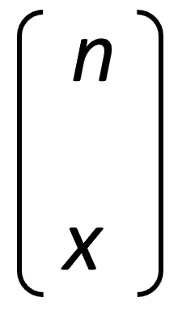

# 数据科学家必须知道概率分布

> 原文：<https://towardsdatascience.com/probability-distribution-19a51fe188ab?source=collection_archive---------33----------------------->

## 常见的概率分布:二项式分布和正态(高斯)分布。

照片由[威廉·胡克](https://unsplash.com/@williamtm?utm_source=medium&utm_medium=referral)在 [Unsplash](https://unsplash.com?utm_source=medium&utm_medium=referral) 拍摄

我是一名移动应用程序的数据科学家。作为一名数据科学家，您经常会从总体中随机抽取一个样本来进行实验或分析。有了随机样本，你就可以对更大的群体进行统计推断。

*例如，作为一名移动应用程序数据科学家，在一次 AB 测试中，我将随机抽取所有安装了该移动应用程序的用户，并量化用户在安装该应用程序一周后回来的概率。*

我用的这个概率很可能是一个期望值，也就是一个随机变量的平均值。理解这个叫做**随机变量**的术语很重要。简单地说，随机变量意味着量化随机过程的结果。那么这和一篇关于概率分布的文章有什么关系呢？

> 一个随机变量的所有可能值的列表，以及它们的概率，称为概率分布。——假人统计要点

概率分布会因分布类型的不同而不同。我不会涵盖所有类型的发行版，但我会涵盖我认为最常见的**发行版。有两种主要类型，称为离散型和连续型。我将介绍属于每种类型的概率分布。**

*   **离散->-**二项分布
*   **连续** - >正态分布

# **二项式分布**

让我们首先从二项分布开始。**要知道一个分布是否是二项式的，你需要确保它满足以下条件。**

*   固定数量的试验/事件—固定(n)
*   每个试验/事件有两种可能的结果——0(失败)或 1(成功)
*   概率 *P(假)/P(真)*对于每次试验都是相同的
*   每个试验/事件都是相互独立的

注:事件和审判这两个术语可以互换。

对于二项式分布，有一个公式可以用来预测随机变量的概率，通常用变量 *X.* 表示

公式是:

由 Kenny Kim 在 PowerPoint 中创建的图像

回到上面陈述的条件，这里是公式的分解。

*   ***n* =固定数量的试验/事件**
*   ***×成功次数=* 。因此， *n -x* 为失败次数**
*   ***p =* 成功的概率。因此，1- *p =* 故障概率**

另一个可能令人困惑的关键部分是公式的左边部分。

由 Kenny Kim 在 PowerPoint 中创建的图像

这意味着在 *n* 次试验中安排 *x* 次成功的方法的数量。F

让我们通过一个例子来说明这一点。

## **问题:**

四个用户安装一个应用程序并在一周后回来的概率分布会是什么样的？

*注意:我们假设每个用户一周后回来的概率是相同的。不现实。*

*   *p =* 0.40
*   4

## **回答:**

为了找到概率分布，你要使用公式计算所有可能的 ***x (0，1，2，3，4)。***

由 Kenny Kim 在 PowerPoint 中创建的图像

例子的概率分布。由 Kenny Kim 在 PowerPoint 中创建的图像

通常情况下，你永远都不需要手动计算这些，所有的工具都可以帮助你。然而，对于一名优秀的数据科学家来说，掌握您正在使用的工具的基础知识并了解其背后发生的事情是很好的。

# 正态分布**又名高斯分布**

正态分布可能是你会看到的最常见的分布之一。它有你所说的钟形分布，如下所示。实际的分布可能看起来不完全相同，但您会看到分布有一个主峰，两边是圆滑的曲线。

标记为重复使用，图片由 Kenny Kim 在 PowerPoint 中修改

它是最重要的分布之一，因为许多真实世界的实验都使用正态分布，无论是企业中的 AB 测试还是研究机构中的实验。这很大程度上是由于 [***中心极限定理***](https://www.khanacademy.org/math/ap-statistics/sampling-distribution-ap/sampling-distribution-mean/v/central-limit-theorem)*所假设的随着样本量变得越来越大，分布将呈现正态分布。*

*现在让我们通过一个例子来更好地理解这种分布。我相信分布是非常简单的。*

*下面是正态分布的一些重要特征*

*   *平均值将代表曲线的中间(峰值)*
*   *这种分布通常用标准差来表示*
*   *分布是对称的*

*注意:如果您不理解上面的一些概念，我建议您查看我的另一篇文章，它涵盖了基本的统计概念:*

*   *[数据科学家必须了解统计学](/data-scientists-must-know-statistics-5716cdece25)*

*下图对理解正态分布的工作原理非常有帮助。*

**

*标记为可从维基共享资源中重复使用*

*就像二项式分布一样，正态分布也有一个公式来计算 x 的概率，但我不确定这在现实世界中有多大帮助…如果你真的想看，就去看这个视频，但我真的相信所有读者需要知道的是，在正态分布中:*

*   *68.3%的数值在 1 个标准偏差内*
*   *所有值的 95.4%在 2 个标准偏差内*
*   *所有值的 99.7%在 3 个标准偏差内*

*许多公司利用两个标准差来表示一个值在统计上是显著的。我将在下一篇文章中介绍一个使用标准化正态分布公式的 z 检验或 t 检验的例子。*

# *资源*

*   *[可汗学院的随机变量](https://www.khanacademy.org/math/statistics-probability/random-variables-stats-library/random-variables-discrete/v/random-variables)*
*   *[通过机器学习掌握概率分布](https://machinelearningmastery.com/what-are-probability-distributions/)*

# *如果您有任何问题或反馈，请随时在下面留下您的问题或反馈，或者在 LinkedIn 上联系我。*

*中:[https://medium.com/@](https://medium.com/@kennykim.90)测试操作学习*

*领英:[https://www.linkedin.com/in/kennyk1m/](https://www.linkedin.com/in/kennyk1m/)*