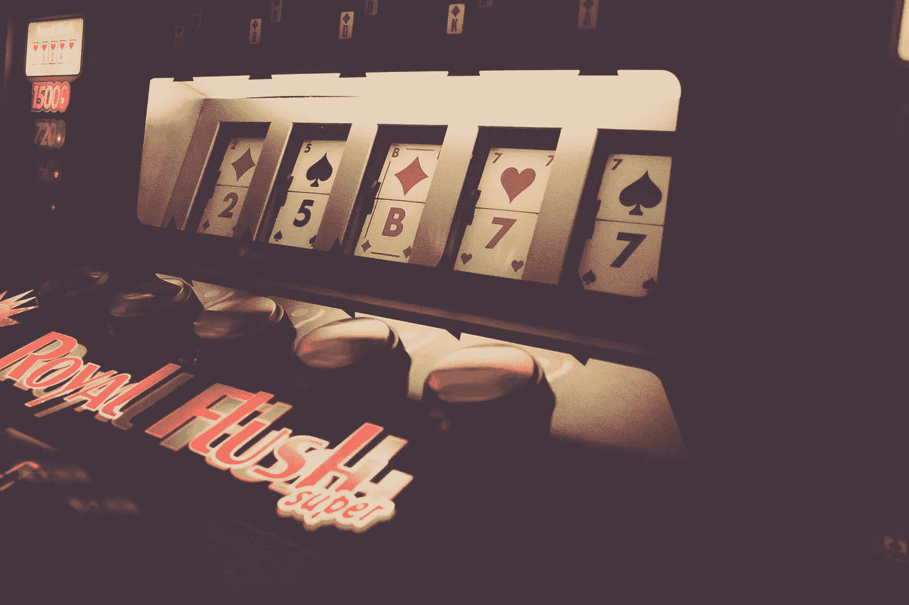
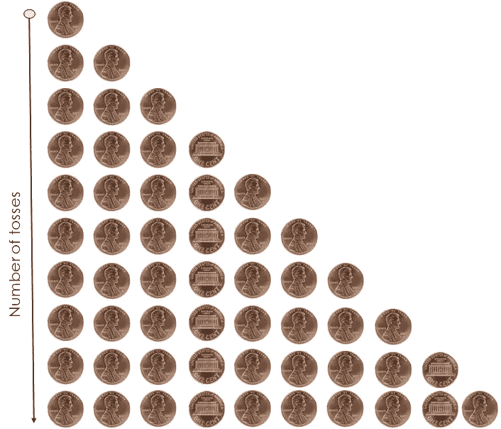
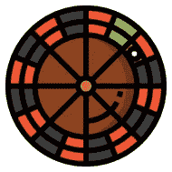
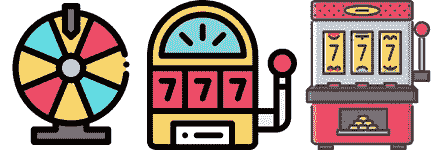
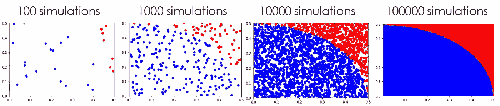

# 概率学习:蒙特卡罗方法

> 原文：<https://towardsdatascience.com/probability-learning-monte-carlo-methods-6ea4f35c49c6?source=collection_archive---------24----------------------->

## 用三个简单的例子学习蒙特卡罗方法



图片来自 [Unsplash](https://unsplash.com/photos/gvGlAAIvIBg)

***朋友们你们好！*** ***欢迎来到概率学习！*** *在本帖中我们将看到什么是蒙特卡罗方法，它们不同的用例，以及它们在现实世界中是如何应用的。我们开始吧！*

```
*Awesome Machine Learning Resources:**- For* ***learning resources*** *go to* [***How to Learn Machine Learning***](https://howtolearnmachinelearning.com/books/machine-learning-books/)*!* *- For* ***professional******resources*** *(jobs, events, skill tests) go to* [***AIgents.co — A career community for Data Scientists & Machine Learning Engineers***](https://aigents.co/)***.***
```

# 蒙特卡洛不是一个城镇吗？这是怎么回事？


来自 [Unsplash](https://unsplash.com/photos/aNOkFgAUQAE) 的蒙特卡洛图像

你问这个问题是对的。蒙特卡洛是摩纳哥的一部分，以其令人惊叹的世界级豪华赌场而闻名。如果你在这个地方走一走，你会看到数以千计的船只和令人惊叹的汽车，还有一些漂亮的酒店和顶级餐厅。

然而，这不是我们今天在这里的原因。 ***蒙特卡洛方法或蒙特卡洛实验*** 是计量经济学、机器学习和统计学中使用的工具，目的是为了获得某些问题的数值结果。为此，蒙特卡罗方法使用了我们世界的一个关键特征:R **和记忆。**

啊？你这话是什么意思？我们一会儿就会看到它，但在本文的其余部分请记住这一点:

> ***蒙特卡罗方法利用随机性获得特定问题的数值解*** *。*

很棒吧？让我们看看他们是如何做到这一点的。

# 什么是蒙特卡罗方法？

这是一种使用推理统计来估计未知量的值的方法。蒙特卡洛的主要元素包括:

*   总体:所有的选择或可能性。
*   **样本:**该人群的子集。

蒙特卡罗背后的主要思想是，如果我们随机选择一个样本，它将表现出与从中抽取样本的总体相同的特性。如前所述，这里的关键是随机性。如果我们不采取随机抽样，就没有理由假设这个小的子集将具有与初始群体相同的性质。

此外，为了表示初始群体的属性，样本需要足够大。让我们用一个**简单的例子来看看我的意思。**

## 抛硬币模拟


来自[平面图标](https://www.flaticon.com/free-icon/coin-toss_2471534?term=coin%20toss&page=1&position=4)的图标。

想象一下，我们正在向一个从未见过硬币的人解释正面和反面的游戏。游戏的目标是预测硬币落地时是正面还是反面。然而，这个游戏有一个快速捕捉:我们永远不会在硬币落地前给他们看，只会在它落地后才给他们看。

他挑尾巴，我们挑头。

我们抛一次硬币，它正面朝上。我们再扔一次，这次也是正面。我们扔第三次，它又露出了头。现在，我们这位不寻常的朋友可能认为硬币只有一个头。我们不断重复这个过程，到第 10 次翻转时，我们得到了 8 个正面和 2 个反面，如下图所示。



10 次投掷后正面和反面数量的演变。来自 [Shutterstock](https://www.shutterstock.com/es/search/coin+heads+or+tails?image_type=photo) 的硬币。

我们的朋友已经看到了尾巴也能出现，但是他相当厌烦，因为他认为硬币落在头上的机会比落在尾巴上的机会大。他不想继续玩了。我们告诉他，这只是一个运气的例子，这一切都是随机的，但他走开了，留下我们一个人。如果他能多扔几次，比如说 990 次，那么正面和反面的数量就会持平，让他对比赛更加满意…

为了说服他回来，我们编写了一个抛硬币的模拟器，向他展示正面和反面的概率完全相同，他只是运气不好。

我们准备代码，并对 2、5、10、20、50、100、500、1000、10000、100000 和 1000000 次投掷进行仿真。

结果如下面的代码片段所示:

硬币仿真笔记本

在我们 10 次投掷的模拟中，我们得到了与现实生活中我们的朋友完全相反的结果:2 个正面和 8 个反面。我们 80%的投掷都显示了同样的结果。这是否意味着如果我们投掷 10 次，有 80%的概率是正面或反面？当然不是！

正如我之前所说的，我们模拟一个事件的次数(或者人口样本的大小)必须足够大，才能真实地反映现实。在前面的片段中，我们可以看到，随着模拟次数的增加，实验结果越来越接近我们所知道的结果:50%的时间是正面，50%的时间是反面。

我们带着这个代码去找我们的朋友，给他看结果，他同意再玩一次。**被蒙特卡洛救了！**

前面的例子强调了蒙特卡罗是怎么一回事:对某一特定情况进行大量模拟，以便能够预测其最可能的结果。因为我们的朋友从来没有玩过正面或反面，也没有见过硬币，他可能不知道 1/2 和 1/2 的真实概率，但是，通过详尽地模拟正面和反面，我们向他证明了这一点！

让我们看看另一个例子:著名的轮盘赌。

## 轮盘赌游戏



来自 [Flaticon 的图标。](https://www.flaticon.com/free-icon/roulette_1907785?term=roulette&page=1&position=62)

你听过典型的短语 ***【赌场常胜】*** ？在这个例子中，我们将使用蒙特卡罗方法解释为什么这是真的。

我们的轮盘赌游戏将按以下方式进行:我们将从 1 到 36 中选择一个数字(在我们的例子中是 7)，并模拟 3 种不同的场景，在特定的旋转次数下，每次旋转持续下注 1 美元。我们将针对 2、5、10、20、100、10000 和 1000000 次旋转进行此操作。我们的轮盘没有 0 口袋，我们从不玩黑或白，只玩 7 号。

**注:** *如果我们也随机生成我们下注的号码，结果将是相同的，但为了简单起见，我们选择始终下注相同的号码*。

再一次，我们使用蒙特卡罗的优势进行解释:随机模拟游戏的结果特定次数，以了解其性质。让我们看看下面的代码片段会发生什么！

轮盘模拟

这段代码实现了我们上面描述的内容。它模拟了我们在不同的场景下对 7 号下注 1 美元。我们从 2 次旋转开始，然后到 5 次旋转，然后到 10 次，以此类推…每次模拟我们做 3 次。

正如我们所见，**对于低次数的旋转**，我们几乎总是输掉所有的钱。然而，在 10 次旋转中，我们幸运地获得了 260%的回报。这表明，对于少量的旋转，结果是相当不稳定的:我们可以失去一切或赢得很多。**结果变化很大。**

这是赌一晚上的乐趣之一，结果完全出乎意料，你可能会输(这很可能会发生)，但你也可能会赢！

然而，需要观察的重要事情是**随着我们旋转次数的增加，预期收益开始收敛到 0** 。如果我们仔细观察，我们会发现现在结果几乎没有变化。**结果不仅更接近 0，而且更接近在一起。**

这才是赌场在乎的。他们不关心 20 次、50 次甚至 100 次旋转会发生什么。他们关心一百万次旋转会发生什么。他们关心每天晚上什么时候有很多人去玩和下注。



赌场总是赢。来自[平板图标](https://www.flaticon.com/free-icon/roulette_419465?term=Casino&page=1&position=55)的图标

这里重要的一点是，对于单个玩家来说，投掷的次数很少，结果是高度可变的:他的回报率可以从-100%到非常高的数字，如 260%甚至更高。然而，随着许多玩家聚在一起玩游戏，在几天、几周、几个月的时间里，上亿次的投入，所有玩家的预期回报将是高度可预测的，并且非常非常接近于零:**赌场确切地知道长期会发生什么。**

所以即使一个玩家赢了，也是可以的。他们知道所有玩家的复合平均回报非常接近于零:他们不会损失任何钱，而你可能要支付门票、饮料、演出的费用，并在其他游戏上输掉你的钱。

让我们看最后一个**最后一个例子**如何使用蒙特卡罗来估算某个平面形状的面积。

## 周长的面积:

我们要用蒙特卡罗方法的最后一件事，是估计某个形状内部的面积，在我们的例子中是一个圆周。


来自[平板图标](https://www.flaticon.com/free-icon/circle_594580?term=Circumference&page=1&position=9)的图标。

具体来说，我们要用它来计算一个正方形和一个圆形的面积之间的关系。我们得到了下图:


我们有一个边长为 L 的正方形，周长为 L/2

我们知道正方形的面积是 L 乘以 L，但是，我们完全不知道圆的面积。然而，我们听说过蒙特卡罗方法，并设计了一个程序来使用这个统计工具计算它！

我们要做的是在正方形内随机生成点，在模拟结束时，计算我们在圆内得到的点的总数，以及生成的点的总数，并用它来计算圆内的面积。为了简单起见，我们将使用一个大小为 L = 1 的正方形。

以下代码显示了为发现圆的面积而实现的蒙特卡罗模拟:我们随机生成形状右上象限的点，并使用已知的正方形面积、落入圆内的点数以及生成的总点数，精确计算圆的面积。

模拟计算圆的面积

在下图中，您可以看到一个接一个生成的图像。它展示了蒙特卡洛的魔力。使用随机生成的点，我们画一个圆，随着我们运行更多的模拟，我们变得越来越精确。我们生成的随机点越多，我们的模拟就越好。我们可以在前面的代码中看到，随着模拟次数的增加，圆的估计面积变得越来越接近真实面积。



随着我们进行越来越多的模拟，圆的形状也在演变。

**酷吧？**蒙特卡罗可用于获得令人惊叹的数值结果的另一种情况。这也可以用来计算我们想要的任何奇怪形状的面积。

# 结论

*通过三个非常简单的例子，我们对蒙特卡洛方法或蒙特卡洛实验有了一种直觉。这些方法的关键要素，被一遍又一遍地重复:随机抽样。这篇文章中展示的例子是这些统计方法的非常简单的应用，然而它们可以用于许多其他领域，如物理学、人工智能或市场营销。*

点击这里查看我的其他概率学习帖子:

*   [概率学习:**贝叶斯定理**](/probability-learning-i-bayes-theorem-708a4c02909a)
*   [概率学习:**贝叶斯定理如何应用于机器学习**](/probability-learning-ii-how-bayes-theorem-is-applied-in-machine-learning-bd747a960962)
*   [概率学习:**最大似然**](/probability-learning-iii-maximum-likelihood-e78d5ebea80c)
*   [概率学习:**贝叶斯**背后的数学](/probability-learning-iv-the-math-behind-bayes-bfb94ea03dd8)
*   [概率学习:**朴素贝叶斯**](/probability-learning-v-naive-bayes-7f1d0466f5f1)
*   [概率学习:**隐马尔可夫模型**](/probability-learning-vi-hidden-markov-models-fab5c1f0a31d)

我强烈建议你阅读它们，因为它们很有趣，充满了关于概率机器学习的有用信息。

就这些，我希望你喜欢这个帖子。请随时在 Twitter 上关注我，地址: **@jaimezorno** 。还有，你可以在这里 看看我在数据科学、统计学、机器学习[**的帖子。好好读！**](https://medium.com/@jaimezornoza)