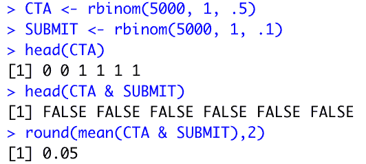
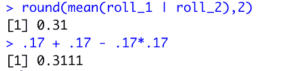
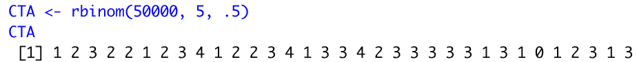
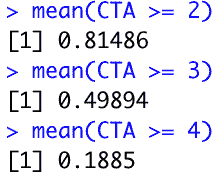

# 概率必备

> 原文：<https://towardsdatascience.com/probability-must-haves-f5e44e2bf88d?source=collection_archive---------93----------------------->


由安卡在 pixabay.com

# 理解随机事件

# 客户和您的应用

假设你有一个用户点击行动号召的随机可能性(从现在开始我称之为 CTA，但这是你邀请读者购买、购物、发送电子邮件等的任何时候。)在您的应用程序中。一旦他们点击了行动号召，随后他们可能会点击提交按钮发送他们的电子邮件信息(在这种情况下)。

现在让我们分配一些概率…点击 CTA: 50%的可能性和提交按钮:10%的可能性。

现在我们的问题是，在这些事件发生之前，两个 T2 事件发生的可能性有多大？

# 重温经典的概率例子:骰子

现在你可能已经看过了，所以至少这是一个很好的复习。

首先，让我们回答以下问题:掷出两个连续的 6 的概率是多少。

对于你的第一次掷骰子，你可以用以下方式掷骰子:1–2–3–4–5–6。总的来说，你有六个选择。

明显？是的，是的，但是现在我们在这一点上思考得更为关键。如果你掷 1，你的下一个选择是什么？嗯，它是下列任何一个数字:1–2–3–4–5–6。如果你掷了一个 2，你在第二次掷骰子时会有同样的 6 个选项。在这种情况下，你的第二次投掷有 6 个选项。总之，这给了我们 36 (6*6)种不同的结果。

那么回到问题…你连续掷出两个 6 的可能性有多大？

如果我们掷骰子，第一次落在 6 点的可能性是 1/6。一旦发生这种情况，我们又有 1/6 的可能性。在所有 36 种不同的两次掷骰子的组合中，只有一种是连续掷出两次 6。这个问题的数学方法是简单地将两个概率相乘，给你 1/36 的可能性，你会连续掷出两个 6。

# 回到应用程序示例

让我们将刚刚学到的知识应用到我们最初的例子中。如果用户有 1/2 的机会点击 CTA，并且有 1/10 的机会点击提交按钮；然后我们可以把我们的概率相乘，说有 1/20 或 5%的几率他们会同时按下两个按钮。

# 抛开理论，让我们写一些代码

在此作序；如果你没有看过我关于统计推断的中型帖子，我详细介绍了`rbinom`函数:[https://towardsdatascience . com/an-introduction-to-binomials-inference-56394956 E1 a4](/an-introduction-to-binomials-inference-56394956e1a4)。为了让您快速了解这一点的重要性，您可以使用这个函数来模拟随机发生的二项式事件。

# 让我们要求两者都使用…和

我们有 5000 张该事件的抽签图，以及相应的概率。我们将看到 5000 个 1 或 0 的平局。当我们指定`&`时，我们实际上是在说两者都必须为真。当我们对这两种情况的发生率取平均值时，就给出了这两种情况都发生的概率。

```
CTA <- rbinom(5000, 1, .5) 
SUBMIT <- rbinom(5000, 1, .1) 
mean(CTA & SUBMIT)
```



我们可以重复这个过程，无论需要多少步骤。从上面我们可以看到，有 5%的时间两种行为同时发生。

# 从和到或

让我们回到骰子的例子。假设不是两次都是 6 的可能性，而是我们想要计算两次掷骰中任何一次都是 6 的概率。

# 概念方法

思考这个问题的方法是从它们的独立可能性开始。任何一个都有 1/6 的几率被碾压。我们把这两个 1/6 的可能性加起来。差不多了…但是有一个问题…1/6+1/6 也隐含着一组事件，其中**和**都会发生- **和**都是这里的关键词。那些事件必须被揭露出来！

这就是我们迄今为止所学知识的汇集之处。

我们将把概率加在一起，然后我们将减去两者的概率。也就是 1/6*1/6。

# 数学方法

这给了我们一个公式 1/6+1/6–1/6 * 1/6

# 纲领性方法

让我们像之前一样复制这个。

```
roll_1 <- rbinom(5000, 1, .17) 
roll_2 <- rbinom(5000, 1, .17)round(mean(roll_1 | roll_2),2) .17 + .17 - .17*.17
```



上面你会看到一些和我们第一次看到的非常相似的东西——唯一的区别是`OR`或者`|`操作符。我们可以看到，当我们生成许多随机事件时，我们在随机生成的数据集中有 31%的发生率。我们能够通过执行我们刚刚得出的简单等式来复制这个数字，验证这两种方法是一致的。

# 从条件句到条件句

假设你要模拟五个人来到你的网站，点击或者不点击 CTA，两种结果都有 50%的可能性。与我们之前所做的类似，我们将模拟 5 人组整整 50，000 次。

```
CTA <- rbinom(50000, 5, .5) 
mean(CTA)
```



您可以看到每次试验或模拟中点击 CTA 的次数。当我们取 CTA 的平均值时，我们看到每个试验的平均值为 2.5，这代表了每个试验中 5 的 50%。

既然我们已经走到这一步，假设您想了解 5 个用户中至少有 2 个会点击 CTA 的概率，那么让我们对 5 个中的 3 个，然后 5 个中的 4 个做同样的事情。

```
mean(CTA >= 2) 
mean(CTA >= 3) 
mean(CTA >= 4)
```



当你插入这个值为真或假的条件语句时。我们的 mean 函数将 TRUE 视为 1，将 FALSE 视为 0，这样我们就可以获取语句为真时的平均出现次数。

我们现在可以用 OR 和 and 来利用这个想法。

# 结论

我们在很短的时间内访问了许多想法，我希望这个概率基础的分解是有帮助的！请务必查看我在 datasciencelessons.com 的博客，了解更多信息！

一如既往，祝数据科学快乐！