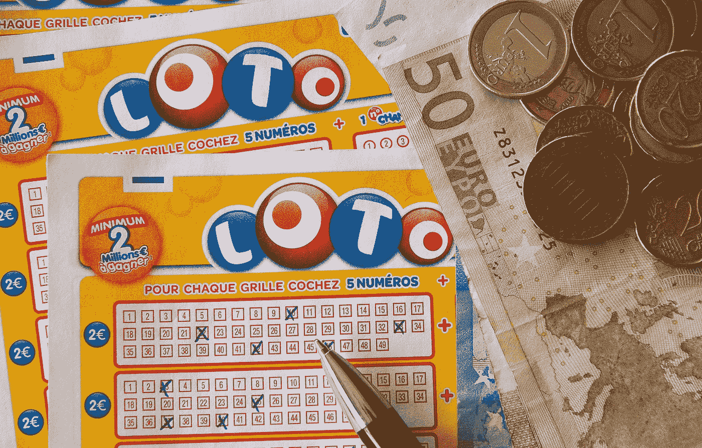
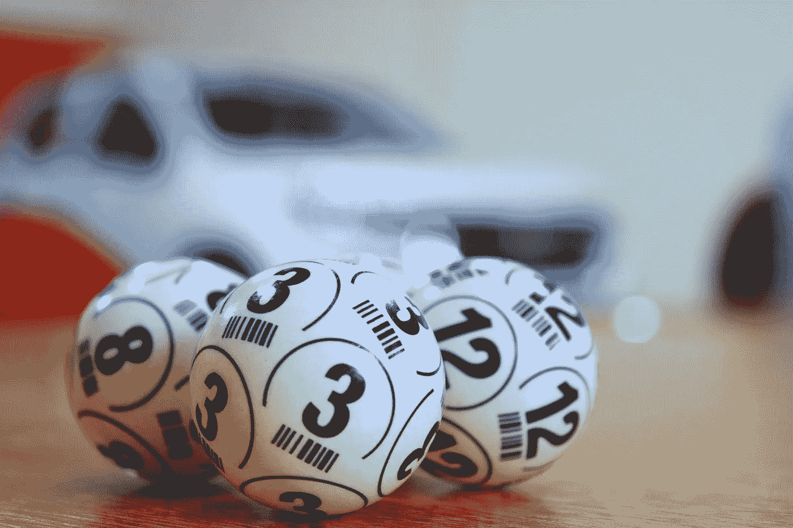

# 彩票中奖概率

> 原文：<https://towardsdatascience.com/probability-of-winning-the-lottery-9331080952c4?source=collection_archive---------4----------------------->

## 使用 Python 来确定你的成功几率



图片由来自[皮克斯拜](https://pixabay.com/?utm_source=link-attribution&utm_medium=referral&utm_campaign=image&utm_content=1363219)的[杰奎琳·马库](https://pixabay.com/users/jackmac34-483877/?utm_source=link-attribution&utm_medium=referral&utm_campaign=image&utm_content=1363219)拍摄

你有没有想过如果你中了彩票，你的生活会有多大的不同？彩票似乎是许多人梦寐以求的快速致富计划。据 ABC 新闻报道，强力球在 2016 年达到了惊人的[**【15.86 亿美元(强力球)**](https://abc7news.com/society/10-largest-lottery-jackpots-in-history/2317638/)…

显然，要赢得最终的百万或十亿美元的头奖，你必须挑战巨大的赔率。据[评论期刊](https://www.reviewjournal.com/business/20-things-more-likely-to-happen-to-you-than-winning-the-lottery/)报道，以下事件发生的几率比你中彩票的几率高。

*   **被陨石压碎**
*   **成为下一个沃伦·巴菲特**
*   **热自来水致死**
*   成为美国总统


在 [Unsplash](https://unsplash.com?utm_source=medium&utm_medium=referral) 上由 [Srikanta H. U](https://unsplash.com/@srikanta?utm_source=medium&utm_medium=referral) 拍摄的照片

假设我们的彩票结构是每次从 1-49 的数字池中抽取 6 个数字。如果你不熟悉彩票的工作原理，选择六个号码的顾客必须得到与中奖号码完全相同的号码。如果有一个数字不同，他们就不会赢得大奖。

首先，我们需要创建一些函数。

# 阶乘函数:

[正整数 n 的阶乘](https://en.wikipedia.org/wiki/Factorial)，用 n 表示！，是所有小于等于 n 的正整数的乘积:比如 0 的值！是 1，按照惯例为空产品。

```
def **factorial**(n):
    final_product = 1
    for i in range(n, 0, -1):
        final_product *= i
    return final_product
```

# 组合功能:

[**组合**](https://en.wikipedia.org/wiki/Combination) 区域从集合中选择项目，这样选择的顺序就无关紧要了。如果你想了解更多，这里的是一本好书。

```
def **combinations**(n,k):
    numerator = factorial(n)
    denominator = factorial(k) * factorial(n-k)
    return numerator / denominator
```

# 单张彩票功能:

现在我们来计算一下购买的单张票的中奖概率。

```
def **one_ticket_probability**(numbers):
    total_outcomes = combinations(49, 6) 
    successful_outcome = 1 / total_outcomes 
    probability_winning = (successful_outcome / total_outcomes) *100
    print(f"You're chances of winning are {probability_winning}%!")
```

需要注意一些重要的事情，

1.  total_outcomes —使用我们之前制作的组合公式，传入可能的数字总数 **49** 和选项数量 **6** 。
2.  successful_outcomes —正如前面提到的，只有一个赢家，所以只有一张票赢。

正好有 **13，983，816** 个赢的机会(total_outcomes)，

如果我们在为一张票选择的 6 个数字样本上运行这个函数，我们将得到以下结果。

```
test_ticket = [1,4,32,38,5,18] #random numbers
**one_ticket_probability**(test_ticket)
```

输出:

"你赢的几率是 0.00000000005113857220%！"

> “选择乐观，感觉更好。”
> 
> 达赖喇嘛

买多张票会怎么样？如果你批量购票，你的胜算会大多少？



来自 [Pixabay](https://pixabay.com/?utm_source=link-attribution&utm_medium=referral&utm_campaign=image&utm_content=3846567) 的 [Alejandro Garay](https://pixabay.com/users/ChiniGaray-10612456/?utm_source=link-attribution&utm_medium=referral&utm_campaign=image&utm_content=3846567) 的图片

# 多张彩票功能:

```
def **multi_ticket_probability**(n_tickets_played):
    total_outcomes = combinations(49, 6)
    successful_outcome = n_tickets_played / total_outcomes
    probability_n_tickets = (successful_outcome / total_outcomes) *100
    **combinations_simplified = round(total_outcomes / n_tickets_played)   
    print('''*Your chances to win the big prize with {:,} different tickets are 1 in {:,} chances to win.*'''.format(n_tickets_played,combinations_simplified))**
```

如您所见，我保留了与 single_ticket 函数相同的主要代码块，但是现在我添加了代码来简化组合。我还在末尾添加了[字符串格式](https://www.learnpython.org/en/String_Formatting)，以帮助生成更具可读性的输出。

让我们使用各种票金额和一个 for 循环来测试代码。

```
ticket_quantity = [1, 10, 100, 10000, 1000000, 6991908, 13983816]for tickets in ticket_quantity:
    multi_ticket_probability(tickets)
    print("""
    ----------------------
    """)
```

输出如下所示。

```
Your chances to win the big prize with **1** different tickets are **1 in 13,983,816** chances to win. ----------------------

Your chances to win the big prize with **10** different tickets are **1 in 1,398,382** chances to win. ----------------------

Your chances to win the big prize with **100** different tickets are **1 in 139,838** chances to win. ----------------------

Your chances to win the big prize with **10,000** different tickets are **1 in 1,398** chances to win. ----------------------

Your chances to win the big prize with **1,000,000** different tickets are **1 in 14** chances to win. ----------------------

Your chances to win the big prize with **6,991,908** different tickets are **1 in 2** chances to win. ----------------------

Your chances to win the big prize with **13,983,816** different tickets are **1 in 1** chances to win.
```

不出所料，我们可以看到随着购票数量的增加，中奖几率也在增加。最后一行显示，如果我们购买 **13，983，816** 的股票，我们有 100%的机会获胜，因为我们之前计算过，可能的结果总数是 **13，983，816**

理解计算彩票概率的过程和代码结构是深入数据科学世界获得无限可能性的垫脚石。

使用概率的其他令人兴奋的方法是什么？

> "一个行为的后果影响着它再次发生的可能性."
> 
> - B. F .斯金纳