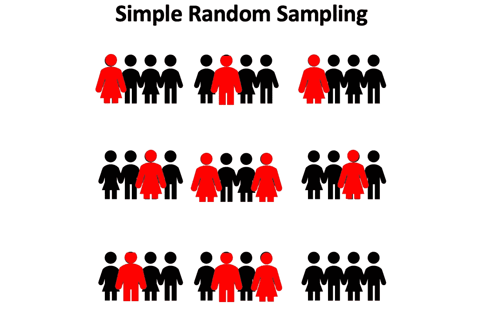
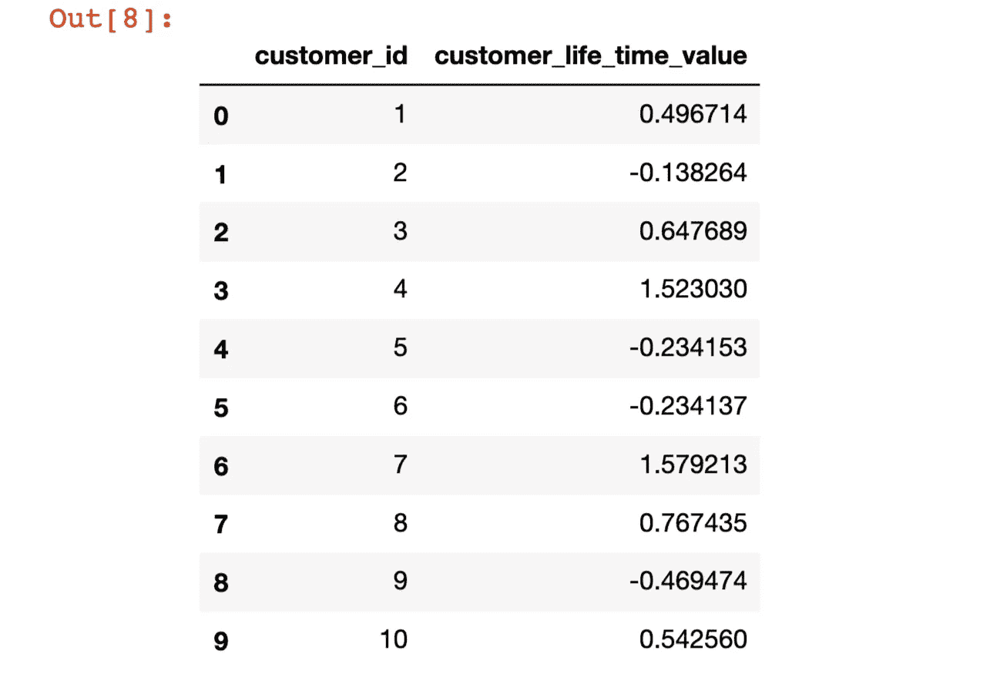
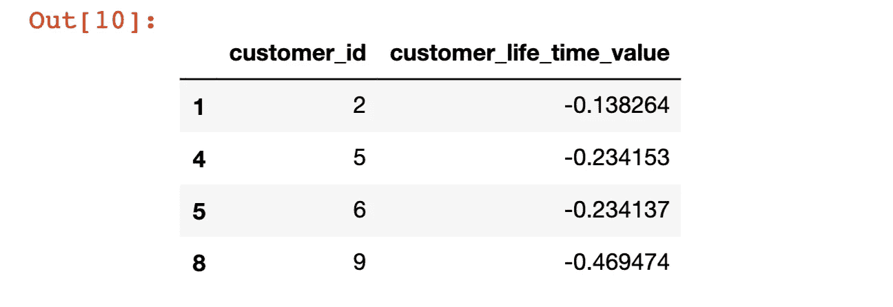
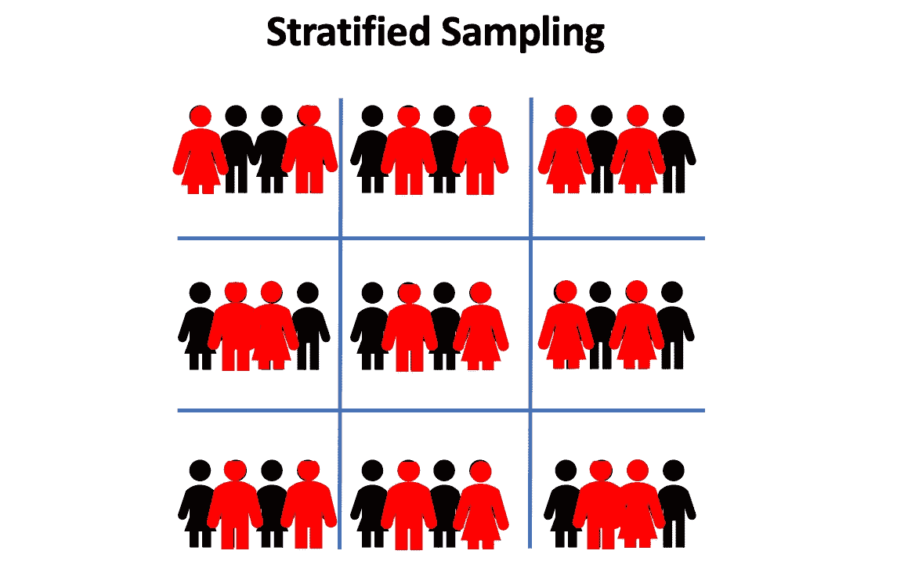
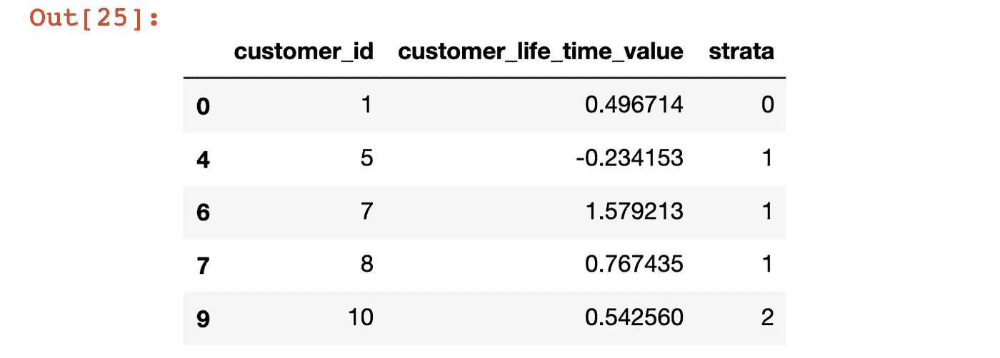
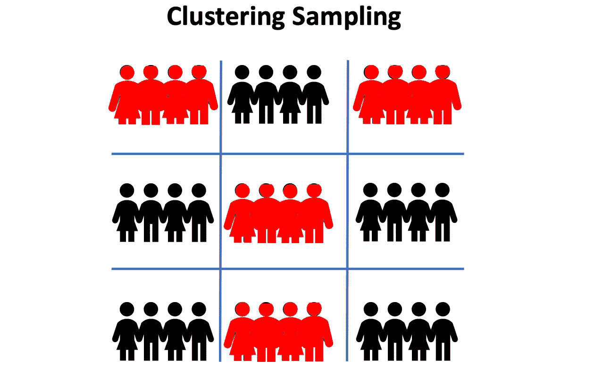
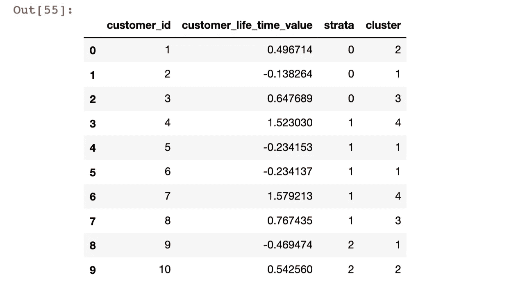
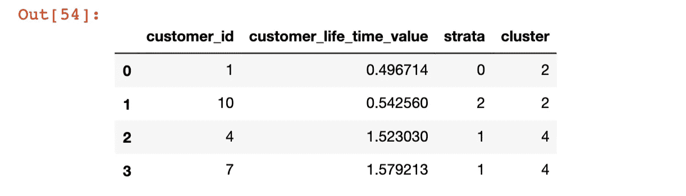
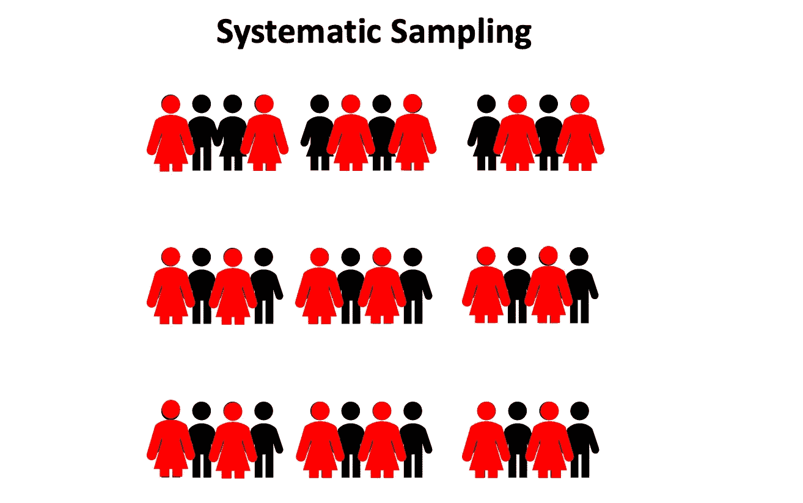
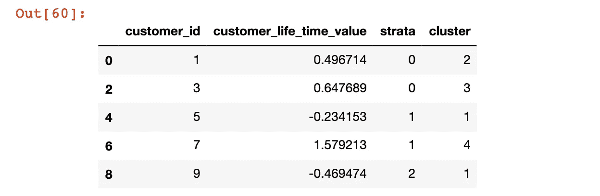

# 用 Python 解释概率抽样方法

> 原文：<https://towardsdatascience.com/probability-sampling-methods-explained-with-python-4c0a19a59456?source=collection_archive---------18----------------------->

## 概率和统计用 PYTHON

## 所有数据科学家都必须知道的四种采样方法


丘拉斯奎拉·马丁斯在[拍摄的照片](https://www.kindpng.com/imgv/ThxTxoh_population-and-sample-clipart-hd-png-download/)

# 为什么我们需要取样？

当我们试图在不知道总体的情况下得出结论时，就会用到抽样。**总体**指我们想要研究的观测值的完整集合，而**样本**是目标总体的子集。这里有一个例子。去年 7 月 15 日至 31 日进行的盖洛普民意调查发现，42%的美国人认可唐纳德·特朗普作为总统处理工作的方式。结果是基于对大约 4500 个电话的随机抽样的电话采访(假设每个电话有一个成年人)。约 4500 名成年人)，年龄在 18 岁及以上，居住在美国。该民意调查是在特朗普的社交媒体评论引发争议期间进行的。对于这项调查，人口是所有 18 岁以上的美国公民，样本是 4500 名成年人。

如果取样不当，将会导致偏差，影响您的研究/调查结果的准确性。为了避免选择偏差，我们必须仔细选择一个能够代表整个群体的子集。

# 概率抽样的类型

## 简单随机抽样



作者使用 Powerpoint 制作的图片

简单随机抽样是指我们从总体中随机选择样本，其中每个单元被选中的概率相同。

**优点:**在随机选择群体成员之前，没有必要将群体分成子群体或采取任何其他额外的步骤。

**缺点:**样本可能不具有代表性，对于大量人群来说，这可能很耗时。

**用例:**在我们不太了解人群的情况下使用。

```
#let's create a dataframe first!
import numpy as np
import pandas as pd
from numpy.random import randn
# Define total number of customers
number_of_customers = 10
# Create data dictionary
data = {'customer_id':np.arange(1, number_of_customers+1).tolist(),
       'customer_life_time_value':randn(10)}
# Transform dictionary into a data frame
df = pd.DataFrame(data)
# View data frame
df
```



创建了数据框(图片由作者提供)

```
#only using random(), we can generate 4 samples from this dataset
# Obtain simple random samplesimple_random_sample = df.sample(n=4).sort_values(by='customer_id')
simple_random_sample
```



随机选择的客户(图片由作者提供)

## 分层抽样



作者使用 Powerpoint 制作的图片

对于分层抽样，人口被分成若干小组(称为阶层)，然后从每个阶层中随机选择样本。

**优点:**它捕捉了关键的人口特征，因此样本更能代表人口。

**缺点:**如果不能形成子群，就无效。

**用例:**它通常用于地理采样，其中层可以是州、国家或生态区域。

```
#Let's add subgroup labels to the datasetdf['strata']=[0, 0, 0, 1, 1, 1, 1, 1, 2, 2]sss = StratifiedShuffleSplit(n_splits=5, test_size=0.5, random_state=0)for x, y in sss.split(df, df['strata']):
    stratified_random_sample = df.iloc[y].sort_values(by='customer_id')
stratified_random_sample
```



从每个阶层中随机选择的客户(图片由作者提供)

## 巢式抽样法



作者使用 Powerpoint 制作的图片

对于整群抽样，总体被分成不同的群。然后随机采样固定数量的群，并且每个所选群内的所有单元都包括在样本中。

优点:它减少了可变性，并且易于实施。

**缺点:**采样时有可能引入偏差。

**用例:**当每个聚类中的所有个体都可以代表总体时使用。

```
#create 4 different clusters based on customers' lift time valuesdf['cluster'] = pd.cut(df['customer_life_time_value'], bins=4, labels=False) +1
```



增加了“集群”栏(图片由作者提供)

```
# predefine which clusters/groups we want to select samples fromn=[2,4]def clustering_sampling(df,n):
    df_list=[]
    for i in range(len(n)):
        df1=df[df['cluster']==n[i]]
        df_list.append(df1)
    final_df=pd.concat(df_list, ignore_index=True)

    return final_dfclustering_sampling(df,n)
```



从样本中的聚类 2 和聚类 4 中选择所有客户(图片由作者提供)

## 系统抽样



从人群中选择每一个人(图片由作者使用 Powerpoint 制作)

通过从样本框架中系统地选择单元来抽取系统样本。(即每隔一个单位包括在样本中)

**优点:**可以消除聚类选择，执行起来很简单。

缺点:我们需要预先确定估计的人口数量。如果人口有一种标准化的模式，那就不好用了。

**用例:**当相关数据不呈现模式时使用。

```
def systematic_sampling(df, step):

    indexes = np.arange(0,len(df),step=step)
    systematic_sample = df.iloc[indexes]
    return systematic_sample

systematic_sampling(df, 1)
```



示例中包含所有其他 customer_id(图片由作者提供)

# 参考

1.  [https://news . Gallup . com/poll/262694/latest-trump-job-approval-rating . aspx](https://news.gallup.com/poll/262694/latest-trump-job-approval-rating.aspx)
2.  [https://www.investopedia.com/](https://www.investopedia.com/)