# 用 Python 进行概率采样

> 原文：<https://towardsdatascience.com/probability-sampling-with-python-8c977ad78664?source=collection_archive---------7----------------------->

## 概率和统计用 Python

## 了解取样方法

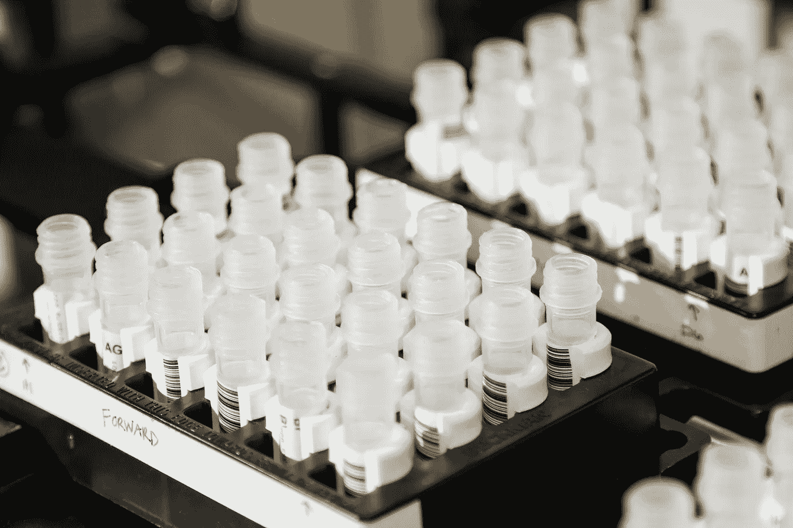

图片由国家癌症研究所提供，可在 Unsplash 获取

# 介绍

## 什么是抽样？

抽样是从已知总体中选择随机数量单位的过程。它允许基于这些单位(即样本)的统计数据获得关于群体的信息并得出结论，而不需要研究整个群体。

## 为什么要用抽样？

执行采样有多种原因，包括:

*   由于人口规模而无法研究全部人口的情况
*   取样过程涉及样品破坏性试验的情况
*   有时间和成本限制的情况

## 取样技术

有两种类型的采样技术:

*   **概率抽样**:给定人群中的每个单位被选中的概率相同的情况。这种技术包括简单随机抽样、系统抽样、整群抽样和分层随机抽样。
*   **非概率抽样**:来自给定群体的单位不具有相同的被选中概率的情况。该技术包括方便抽样、定额抽样、判断抽样和滚雪球抽样。与概率抽样相比，这种技术更倾向于以不具有代表性的样本组结束，从而导致关于总体的错误结论。

对于以下示例，让我们使用概率抽样从一组 10 个产品中获取样本，以确定感兴趣的特定度量的总体均值。让我们来看看 Python 代码:

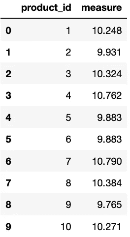

产品数据框架

## 简单随机抽样

顾名思义，简单随机抽样方法从过程或总体中选择随机样本，其中每个单元被选中的概率相同。这是最直接的概率抽样方法。

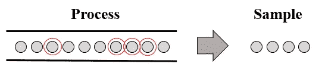

简单随机抽样

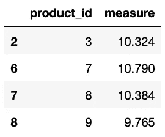

简单随机样本

## **系统采样**

系统采样方法根据固定的采样间隔选择单元(即每第 *n* 个单元从给定的过程或总体中选择)。这种抽样方法往往比简单的随机抽样方法更有效。

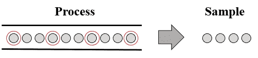

系统抽样

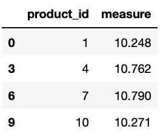

系统抽样

## **整群抽样**

整群抽样方法将人口分成大小相等的群 *n* 并每 *T* 次选择一个群。

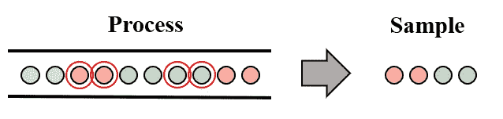

巢式抽样法

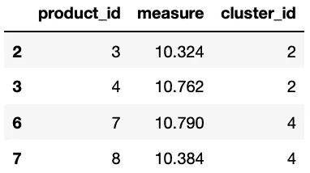

聚类样本

## 分层随机抽样

分层随机抽样方法将人口划分为子群(即阶层),并选择随机样本，其中每个单元被选中的概率相同。

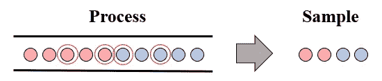

分层随机抽样

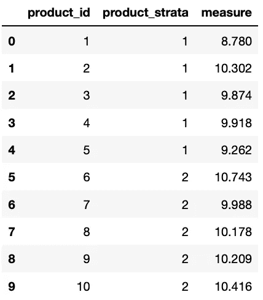

产品数据框架

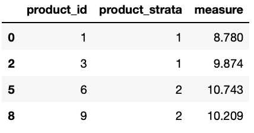

分层随机样本

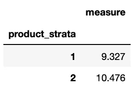

衡量每个产品组的平均值

## 每种取样方法的测量平均值比较

使用每种抽样技术获得样本后，让我们将样本平均值与总体平均值(通常是未知的，但在本例中并非如此)进行比较，以确定能够获得总体测量平均值最佳近似值的抽样技术。

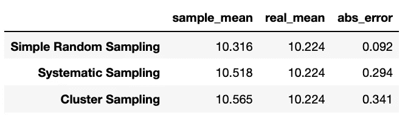

每个取样方法表的测量平均值比较

根据每个抽样方法表的测量平均值比较，通过简单随机抽样技术获得的样本的测量平均值最接近真实平均值，绝对误差为 0.092 个单位。

# 总结想法

抽样是从样本中得出总体结论的一种有用而有效的方法。然而，分析师和工程师必须定义具有足够样本量的采样技术，能够减少采样偏差(例如，方便采样选择偏差、系统采样选择偏差、环境偏差、无响应偏差)，以获得给定人群的代表性样本。

*—*

*如果你觉得这篇文章有用，欢迎在* [*GitHub*](https://github.com/rsalaza4/Python-for-Industrial-Engineering/tree/master/Six%20Sigma/Probability%20Sampling) *上下载我的个人代码。也可以直接发邮件到*[*rsalaza4@binghamton.edu*](mailto:rsalaza4@binghamton.edu)*找我，在*[*LinkedIn*](https://www.linkedin.com/in/roberto-salazar-reyna/)*找我。有兴趣了解工程领域的数据分析、数据科学和机器学习应用的更多信息吗？通过访问我的媒体* [*简介*](https://robertosalazarr.medium.com/) *来探索我以前的文章。感谢阅读。*

*——罗伯特*