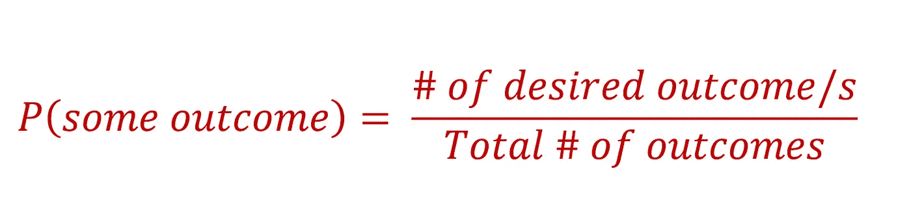
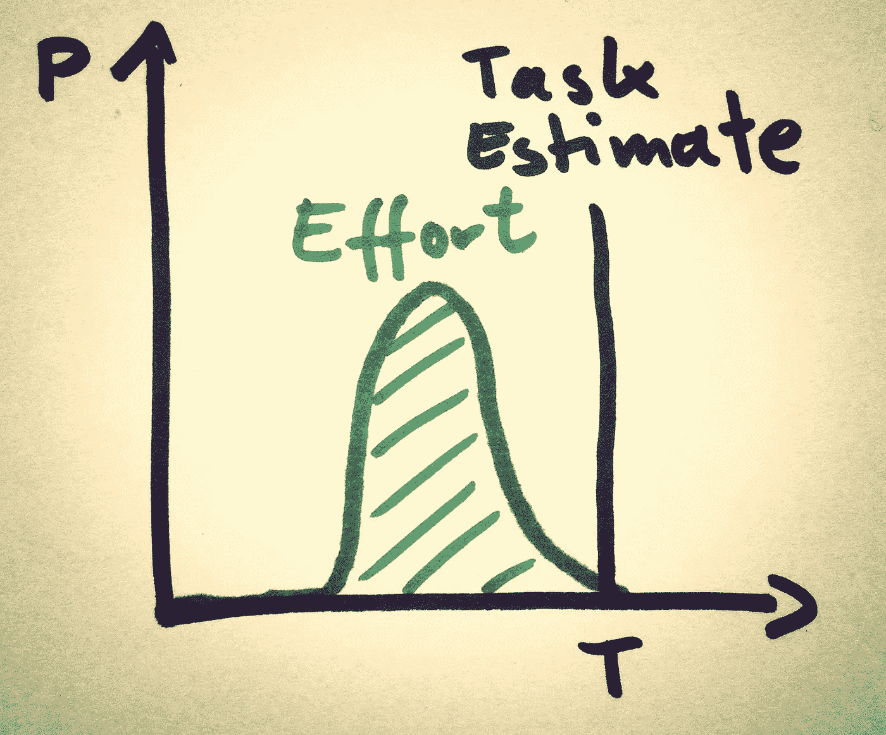
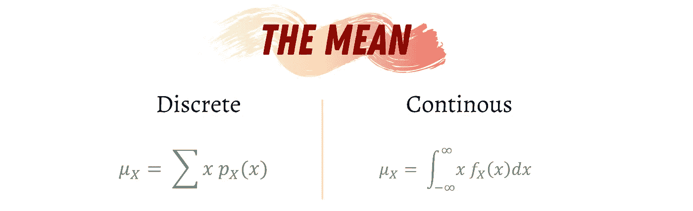
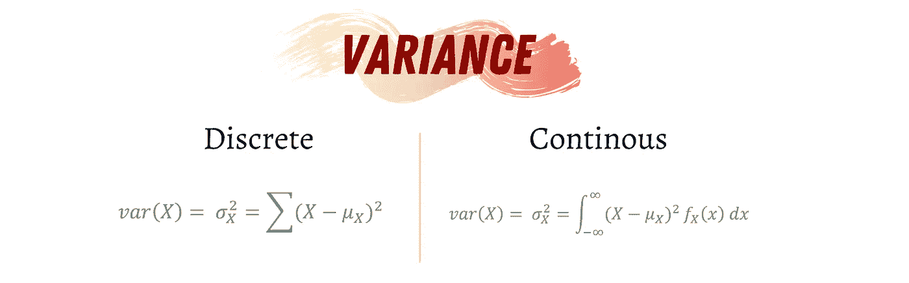
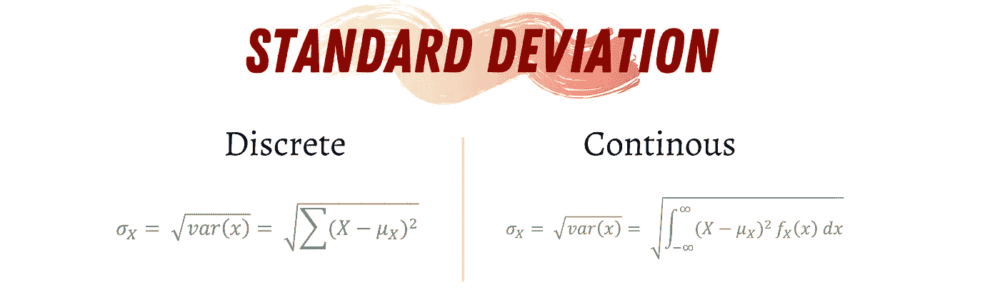
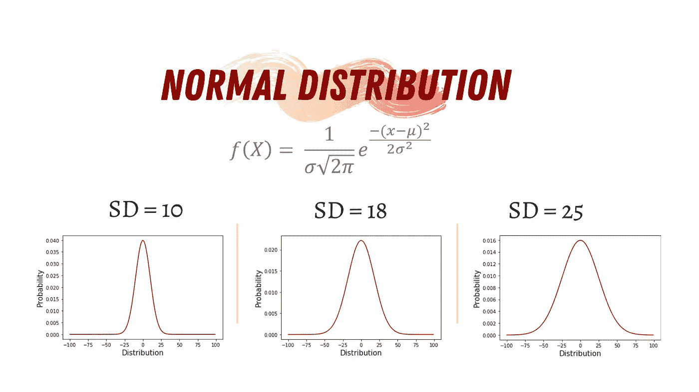
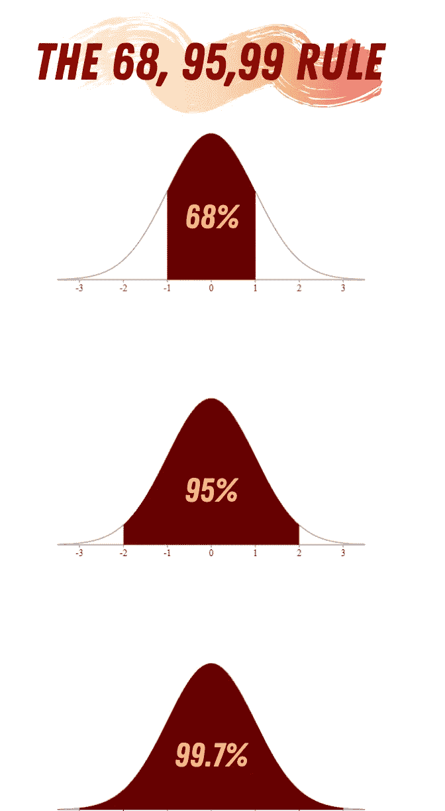
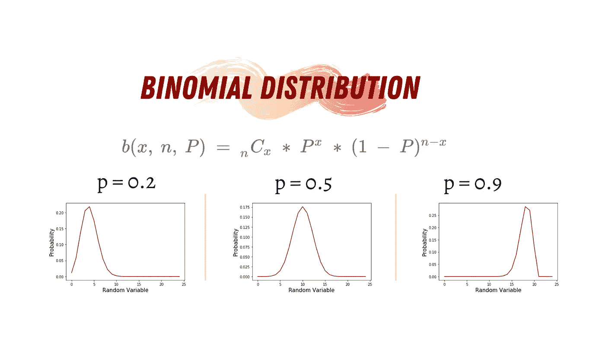
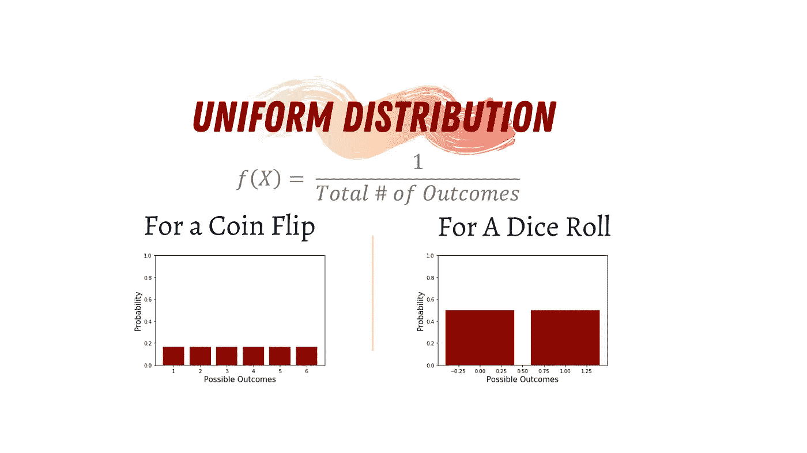
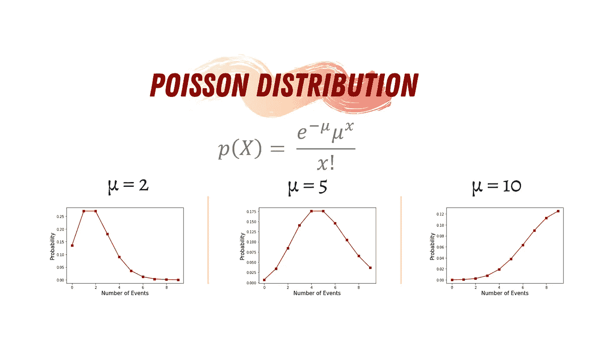

# 数据科学是关于概率的

> 原文：<https://towardsdatascience.com/probability-theory-in-data-science-bacb073edf1f?source=collection_archive---------11----------------------->

## 与数据科学数学混淆？这里是一个开始的好地方

## 数据科学中最常用的 4 种概率分布


卢克·切瑟在 [Unsplash](https://unsplash.com?utm_source=medium&utm_medium=referral) 上的照片

P 概率分布是各种现实生活应用中最常用的数学概念之一。从天气预测到股票市场，再到机器学习应用，不同的概率分布是所有这些应用以及更多应用的基本组成部分。如果你想进入数据科学的神奇世界，或者你已经在这个领域，了解概率论的基本知识和最常见的概率分布是必备的知识。

> 从统计学上来说，我们中的任何一个人出现在这里的概率是如此之小，以至于你会认为仅仅存在的事实就能让我们所有人都沉浸在惊喜的喜悦中——刘易斯·托马斯

# 概率论基础

概率论是一门成熟的数学分支，研究我们生活中的不确定性。在 PT 中，一个 ***实验*** 是任何可以通过实验重复的过程，并且有一组众所周知的不同结果。一个例子是掷骰子；我们可以重复这个实验，骰子可以落在六个不变的面上。每个实验都有一个 ***样本空间*** 代表该实验所有可能的结果。在掷骰子的情况下，我们的样本空间将是{1，2，3，4，5，6}。最后，实验的每一次尝试都被称为一个 ***事件*** 。

## 理论概率与实验概率

理论上，我们可以使用以下公式计算每种结果的概率:



如果我们考虑掷骰子的例子，骰子落在六个面中任何一面的概率是 0.166。如果我想知道骰子落在偶数上的概率，那么它将是 0.5，因为在这种情况下，期望的结果是{2，4，6}在整个样本空间{1，2，3，4，5，6}之外。

所有可能结果的概率总和应该总是等于 1。

从外部来看，任何结果的概率都可能与理论上的略有不同；然而，如果我们将实验重复足够的次数，那么实验概率将接近理论概率。

我们可以编写简单的 Python 代码来证明理论概率和实验概率之间的差异。

运行这段代码的结果将接近:

```
probability of 1 is 0.16
probability of 2 is 0.15
probability of 3 is 0.18
probability of 4 is 0.12
probability of 5 is 0.18
probability of 6 is 0.21
 — — — — — — — — — — — — — — — 
probability of 1 is 0.16
probability of 2 is 0.179
probability of 3 is 0.168
probability of 4 is 0.162
probability of 5 is 0.154
probability of 6 is 0.177
```

如你所见，我们的试验越多，我们就越接近理论概率值。

## 随机变量

随机变量(RV)的值由随机实验的结果决定。回到我们掷骰子的例子，如果我们定义一个随机变量 X 为任何结果的概率，那么 P(X=5) = 0.166。

随机变量有两种类型:

*   离散随机变量:可以取可数个不同值的随机变量，如可能的结果或掷骰子。
*   连续随机变量:在一个区间内可以取无穷多个值的随机变量，如东京八月任何一天的温度。

# 概率分布



[迈克尔·迈耶](https://www.flickr.com/photos/michael_mayer/)在 [Flickr](https://www.flickr.com/) 上的任务估计/概率分布

概率分布只是特定随机变量的数据或分数的集合。通常，这些数据集合是按照一定的顺序排列的，并且可以用图形显示。每当我们开始一个新的 DS 项目时，我们通常会获得一个数据集；该数据集代表来自更大数据集*人群*的*样本*。使用这个样本，我们可以尝试在数据中找到独特的模式，这些模式可以帮助我们对主要的查询主题做出预测。例如，如果我们想从股票市场购买一些股票，我们可以从特定公司的最近 5~10 年中获取一个样本数据集，分析该样本并预测股票的未来价格。

**分布特征**

数据分布有不同的形状；这些形状是根据用于绘制分布的数据集定义的。每个分布都可以用三个特征来描述:均值、方差和标准差。这些特征可以告诉我们关于分布的形状和行为的不同事情。

*   **的意思是:**



作者使用 [Canva](https://www.canva.com/)

平均值(μ)就是一组数据的平均值。例如，如果我们有一组离散数据{4，7，6，3，1}，则平均值为 4.2。

*   **差异**



作者使用 [Canva](https://www.canva.com/)

方差(var(X))是平均值的平方差的平均值。例如，如果我们有来自{4，7，6，3，1}之前的相同数据集，那么方差将是 5.7。

*   **标准偏差**



作者使用 [Canva](https://www.canva.com/)

标准差(σ)是对数据集数量分布程度的一种度量。因此，较小的标准偏差表示值彼此更接近，而较大的标准偏差表示数据集值分散。

## 均值、方差和标准差的属性

1.  如果数据集中的所有*值都相同*，则**标准差**将**等于 0** 。
2.  如果*数据集的值已经移位*(从所有值中增加或减去一个常数)，则**均值**将**增加或减少**移位量，而方差将**保持不变**。例如，如果我们将数据集移动 3，那么平均值将增加 3。
3.  如果*数据集的值已经被缩放*(乘以一个常数)，则**均值**将被**缩放相同的因子**，而方差将被**缩放因子**的绝对值。例如，如果我们将数据集缩放 3 倍，那么平均值也将缩放 3 倍。然而，如果我们将它缩放-3，则在两种情况下，平均值将缩放-3，而方差将缩放 3。

# 4 种最常见的分布

有许多不同的概率分布。其中一些比另一些更常见。在本文中，我们将讨论数据科学中最常用的五种。

## 正态分布



作者使用 [Canva](https://www.canva.com/)

高斯分布(正态分布)以其钟形而闻名，是数据科学中使用最多的分布之一。此外，许多现实生活中的现象遵循正态分布，如人的身高、机器生产的东西的大小、测量误差、血压和考试分数。

***正态分布特征***



作者使用 [Canva](https://www.canva.com/)

正态分布的主要特征是:

*   该曲线在中心对称，这意味着它可以围绕平均值分成两个对称部分。
*   因为正态分布是一种概率分布，所以分布曲线下的面积等于 1。

当处理正态分布时，有一个重要的规则。这叫做**68，95，99 法则。**该规则规定，正态分布中 68%的数据在-σ和σ之间，95%的数据在-2σ和 2σ之间，99.7%的数据在-3σ和 3σ之间。

各种机器学习模型被设计成在遵循正态分布的数据集上工作，例如高斯朴素贝叶斯分类器、线性和二次判别分析以及基于最小二乘的回归。此外，我们可以将非正态分布的数据集转换为正态分布的数据集，使用一些数学转换算法，如对原始数据求平方根、求逆或自然对数。

使用 Python 生成正态分布。

**指数分布**

指数分布是正态分布的推广。因此，它也被称为广义正态分布。然而，指数分布还有两个因子λ，它代表正的比例参数(挤压或拉伸分布)和κ，它代表正的形状参数(改变分布的形状)。此外，指数分布不考虑不对称数据，因此，它更像是一种偏斜的正态分布。

## 二项分布



作者使用 [Canva](https://www.canva.com/)

二项式实验是一种统计实验，其中二项式随机变量是二项式实验的 n 次重复试验的成功次数 x。二项随机变量的概率分布称为二项分布。

***二项分布的条件***

1.  它是由独立试验组成的。
2.  每次试验可以分为成功或失败，其中成功的*概率是 p* ，而失败的*概率是 1-p* 。
3.  它有固定的试验次数(n)。
4.  每次试验成功的概率是不变的。

现实生活中二项分布的例子是:如果一种全新的药物或疫苗被引入来治愈一种疾病，它要么治愈该疾病(成功)，要么不治愈(失败)。再比如:买彩票，要么中奖，要么不中奖。基本上，任何你能想到的有两种可能结果的事情都可以用二项分布来表示。

考虑二项分布的一种方式是，它们是有限正态分布的离散版本。正态分布是二项分布的多次连续试验的结果。

使用 Python 生成二项分布。

***伯努利分布***

伯努利分布是二项式分布的一个特例。这是一个只有一次试验的二项分布。

## 均匀分布



作者使用 [Canva](https://www.canva.com/)

均匀分布，也称为矩形分布，是具有恒定概率的概率分布，例如掷硬币或掷骰子。这种分布有两种类型。基本统计中最常见的类型是连续均匀分布(形成矩形)。第二类是离散均匀分布。

用 Python 生成均匀分布。

## 泊松分布



作者使用 [Canva](https://www.canva.com/)

泊松随机变量满足以下条件:

1.  两个不相交时间间隔内的成功次数是独立的，成功次数的平均值是μ。
2.  在小时间间隔内成功的概率与时间间隔的整个长度成比例。

泊松分布存在于许多现象中，如先天性残疾和基因突变、车祸、交通流量以及页面上的打字错误数量等。此外，泊松分布被商人用来预测一年中某一天或某一季节的购物者人数或销售额。在商业中，如果产品没有售出，库存过多有时会意味着损失。同样，库存不足也会导致商业机会的损失，因为您无法最大限度地提高销售额。通过使用这种分布，商界人士可以预测需求何时会很高，这样他们就可以购买更多的股票。

使用 Python 生成泊松分布。

还有更多的发行版；然而，了解这四个发行版会让你更顺利、更舒服地进入数据科学。