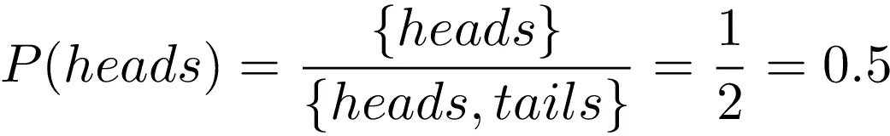

# 概率与赔率

> 原文：<https://towardsdatascience.com/probability-vs-odds-f47fbc6789f4?source=collection_archive---------3----------------------->

## 有什么区别？用一个简单的例子来学习它，永远不要忘记它！

图片来自 [Unsplash](https://unsplash.com/photos/jf_YIwWKg8Q)

许多人认为他们知道什么是概率，也认为他们对什么是赔率有完美的理解:他们一直被用于赌博。

**但他们真的这样吗？这两个术语很容易混淆。**

在这篇文章中，我们将很快阐明它们是什么，它们的区别，以及它们之间的关系。

**我们走吧！**

# 什么是概率？

在我们的日常语言中，当我们说“我不这么认为”或“这不太可能”时，我们总是会用到概率。**概率**，在一个不严谨的描述中，**可以定义为我们对世界事物的相信程度的度量**。

我们可以通过计算事件的结果来计算概率。例如，如果我们考虑一个掷硬币游戏，其中我们选择正面，因此想要计算有利结果的概率，即预期结果可能出现的次数除以可能结果的总数。

对于我们的例子，这可以用下面的术语来描述。

获得正面的概率。图片作者。

在某些情况下，统计事件的结果既有用又简单，就像前面的例子一样。然而，很容易看出，当有许多多重组合和可能的结果时，**这种技术变得不可行，因为它不适用于大范围的现实生活问题**。

例如，你能用前面的方法来回答下面的问题吗？

*   明天下雨的可能性有多大？
*   你认为皇家马德里赢得冠军联赛的机会有多大？
*   你认为我们会有时间停下来买个冰淇淋吗？

正如你所看到的，如果跳过二元选项(是或否，或 0 和 1)，并试图在两者之间选择一些东西(一种可能性)，准确回答这些问题就不那么容易了。然而，我们可以通过使用赔率并将概率表示为信念的比率来做到这一点。

让我们看看如何！

# 使用赔率来计算概率

正如我们刚刚看到的，**我们需要一种有效的方法来计算更一般情况下的概率**。为了展示我们如何利用 odds 做到这一点，考虑下面的例子:

想象一下，你和一个朋友正在讨论谁是更好的跑步者。你最近训练很多，过去你总是击败他，老实说，自从他开始频繁外出后，他的状态不是很好。

你如何量化你在比赛中一定会赢他的信念？很多时候，我们通过打赌来做到这一点:我跟你赌 5 美元，我会在一周内的比赛中打败你。如果你赢了，我给你 10 英镑。你说。

**从概率上讲，这意味着什么？**由于这是一场只有两种可能结果的比赛，你要么赢，要么输，赢和输的概率总和必须始终为 1，如下图所示:

所有概率的总和必须始终为 1。图片作者。

此外，你的声明说，如果你赢了，你会得到 5 美元，如果你输了，给 10 美元，表达了打赌的赔率。

**赔率是一种表达对一个事件的信念的方式，它是一个比率**，即如果你是错的，你愿意付出多少，如果你是对的，你会得到多少。它们可以用以下方式量化:

赌注的赔率。

现在，我们如何将它转化为概率呢？容易。由于所有概率的总和必须为 1，我们使用上图中的等式，得到:

最后，如果我们代入我们得到的概率:

计算我们认为我们赢的概率是多少。

正如我们所看到的，我们认为我们会赢的概率是 0.66%或 66%。当我们决定赌两倍我们会得到的权利时，似乎更多？

**根据赔率计算概率的过程可以用下面的等式**来概括，其中 H 是某个假设，O(H)是支持该假设的赔率(赌赢与赌输的比率):

概率和赔率之间的一般关系。

# 结论和更多资源

就是这样！概率是牛逼的。一如既往，我希望你喜欢这篇文章，并且通过这个简单的日常例子，你已经了解了概率和赔率之间的区别。

*如果有，那就看看我其他关于概率、数据科学和机器学习的帖子* [*这里*](https://medium.com/@jaimezornoza?source=post_page---------------------------) *。好好读！*

如果你想深入了解这个话题，可以看看 StatQuest 的视频:

此外，你可以在这里查看我的其他概率学习文章:

*   [概率学习:**贝叶斯定理**](/probability-learning-i-bayes-theorem-708a4c02909a)
*   [概率学习:**贝叶斯定理如何应用于机器学习**](/probability-learning-ii-how-bayes-theorem-is-applied-in-machine-learning-bd747a960962)
*   [概率学习:**最大似然**](/probability-learning-iii-maximum-likelihood-e78d5ebea80c)
*   [概率学习:**贝叶斯背后的数学**](/probability-learning-iv-the-math-behind-bayes-bfb94ea03dd8)
*   [概率学习:**朴素贝叶斯**](/probability-learning-v-naive-bayes-7f1d0466f5f1)
*   [概率学习:**隐马尔可夫模型**](/probability-learning-vi-hidden-markov-models-fab5c1f0a31d)
*   [概率学习:**蒙特卡罗方法**](/probability-learning-monte-carlo-methods-6ea4f35c49c6)

我强烈建议你去读读，因为它们很有趣，充满了关于概率机器学习的有用信息。

*如果你想了解更多关于机器学习和人工智能的知识* [***关注我上媒***](https://medium.com/@jaimezornoza) *，敬请关注我的下期帖子！还有，你可以查看* [***这个资源库***](https://howtolearnmachinelearning.com/) *获取更多关于机器学习和 AI 的资源！*