# 可能是关于 SQL Server 中的连接、交叉应用、联合、交叉连接等的最佳介绍

> 原文：<https://towardsdatascience.com/probably-the-best-introduction-about-join-cross-apply-union-cross-joins-and-more-in-sql-server-f2ee8f8af957?source=collection_archive---------16----------------------->

在这个故事中，我们将从零开始理解在 SQL Server 中组合两个或多个表的大部分方法。我们将使用 SQL Server 2019，但几乎下面描述的每个查询都可以在旧版本的 SQL Server 上执行，甚至可以在 Oracle 或 MySQL 等其他 SQL 数据库上执行，只需做很小的调整。

**在开始之前，一定要知道本文中的结构、数据和所有查询都可以在这个页面上找到**[**<>**](https://dbfiddle.uk/?rdbms=sqlserver_2019&fiddle=bb54aaea7e0a2527a7e5b14b6dc922e6)**。你会发现它非常有用，因为它们都是可编辑和可执行的，所以你可以随意尝试你想到的任何东西。**

# 设置环境

我们将在所有查询中使用下面的表格和示例数据。想象一下，你正在查看像 Bird、Lime、Dott 这样的电动滑板车租赁服务的数据仓库(一个非常非常简化的版本)。

我们有以下表格:

*   **表【dbo】。【Trip】**:包含所有行程的事务表。它在每次旅行中都有一行，换句话说，每次用户解锁踏板车、使用它通勤并再次锁定它时都会生成一行。

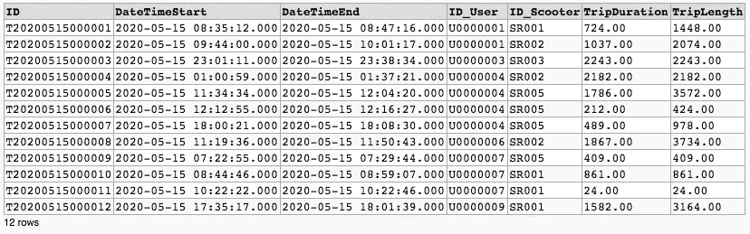

*   **表【dbo】。【用户】**:用户的维度表。

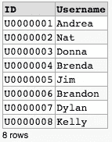

*   **表【dbo】。【踏板车】**:踏板车尺寸表。

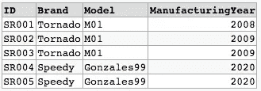

*   **表【dbo】。[RepairedScooter]** :这是一个表格，包含至少一次通过维修区的滑板车列表。

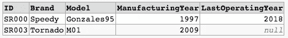

您可以查看从 db <> fiddle 创建和填充数据的代码，但也可以查看预览。

# 查找不同列的组合

我们可以在不同的情况下使用交叉连接(或笛卡尔连接),但是，它最常用的范围可能是当您想要从一个或多个表中选择两个或多个字段的所有组合时。

在下面的示例中，您可以使用交叉连接对指示器和用户的每种组合进行选择。例如，如果您希望制作第一个表来分析用户是否不止一次租用同一辆小型摩托车，这可能会很有用。

> **—查询 A001**
> 从【用户】A、【代步车】B
> 中选择 DISTINCT A【ID】、A【用户名】、B【ID】、B【品牌】、B【型号】
> 排序按 A【ID】、B【ID】

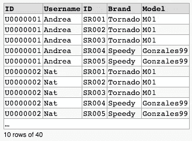

# 使用不同表的列

当您想要将另一个表(表 B)中的一列或多列添加到表(表 A)中时，可以使用联接。如果您想使用基于 SQL 的数据库，这可能是需要掌握的最重要的构造。

## 语法介绍

在理解不同类型的连接之前，让我们快速浏览一下在表之间进行连接时使用的语法。

以下查询是表[Trip](别名为“A”)和表[Scooter](别名为“B”)的基本连接。连接的类型是内部连接，我们将在文章的这一部分的后面理解它的含义。ON 子句后列出了连接条件。这里，列之间有一个简单的等式，但它们可以不止一个(在这种情况下，您应该使用 AND、OR，而不是运算符),或者可以是更复杂的等式，如 between 或 like。在连接条件中，您还可以找到应用于列的函数(例如 LEFT ),但这是一个介绍，因此我们不会找到这些情况。

> **—查询 B001**
> 选择 A.[ID]，A.[DateTimeStart]，A.[TripDuration]，B.[Brand]，B.[Model]
> 从[Trip] A
> 内联[Scooter] B
> 上 A.[ID_Scooter]=B.[ID]

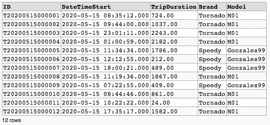

我们在查询中使用了一些别名，但是，我们也可以重复表的完整名称，得到相同的结果。

> **—查询 B003**
> 选择【行程】。[ID]，[Trip]。[日期时间开始]，[行程]。[旅行持续时间]，[踏板车]。[品牌]，[滑板车]。【车型】
> 从【行程】
> 内加入【踏板车】
> 上【行程】。[ID_Scooter]=[Scooter]。[ID]

如果列名只存在于其中一个表中，则指定表名或别名不是强制性的(但建议这样做)。此外，这个查询给出的结果与其他两个相同。

> **—查询 B002**
> 选择 A.[ID]，[DateTimeStart]，[TripDuration]，[Brand]，[Model]
> 从[Trip] A
> 内联接[Scooter] B
> 上[ID_Scooter]=B.[ID]

当然，您可以通过连接三个或更多的表来扩展所有这些规则，这方面没有限制。

> **—查询 B004**
> 选择 A.[ID]，A.[DateTimeStart]，A.[TripDuration]，B.[Brand]，B.[Model]，C.*
> 从[Trip] A
> 内联接[Scooter]B
> ON A .[ID _ Scooter]= B .[ID]
> 内联接[User]C
> ON A .[ID _ User]= C .[ID]

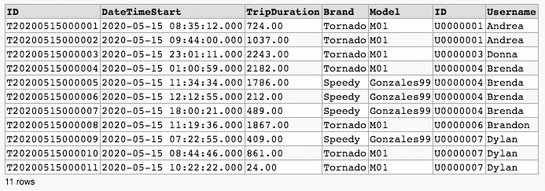

*最后，您可能会发现一些具有不同语法的连接子句(例如，如果您正在使用 SAP Business Objects suite)，类似于交叉连接。这也是一种有效的语法，称为 ANSI-92，但在本文中，我们不使用它，所以可以在互联网上找到许多关于它的文章。*

## 完全外部连接

完全外部连接的结果将包括表 A 中的至少一行和表 B 中的至少一行，即使不满足连接条件，在这种情况下，一行空值将来自不匹配的行。

参见下面的例子来阐明这个概念。

> **—查询 C001**
> SELECT *
> FROM[Trip]A
> FULL OUTER JOIN[User]B【T33]ON A .[ID _ User]= B .[ID]

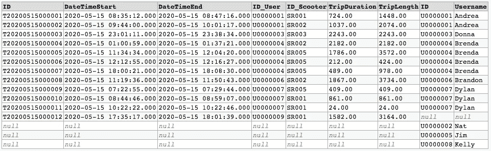

## 左外部连接

左外部联接类似于完全外部联接，但不对称。这意味着结果中至少有一行来自左边的表(下例中的表 A)，但是右边的表(下例中的表 B)中不满足连接规则的行不会显示出来。

> **—查询 D001**
> SELECT *
> 从【行程】A
> 左加入【用户】B
> ON A.[ID_User]=B.[ID]

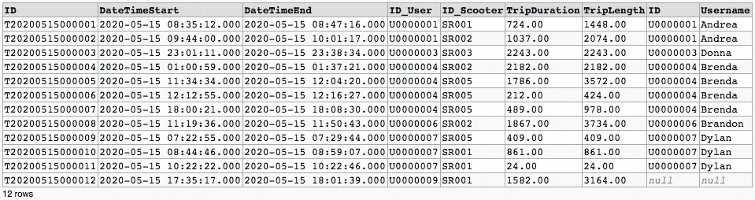

请注意，我们可以使用 LEFT OUTER JOIN 构造来查找左边表(表 A)中根据连接规则在右边表(表 B)中没有对应行的行。这是一个非常有用的应用程序，您只需在查询下添加一个 WHERE 子句，如下例所示。

> **—查询 D002**
> SELECT A . *
> FROM[Trip]A
> LEFT JOIN[User]B
> ON A .[ID _ User]= B.[ID]
> 其中 B .[ID]为空

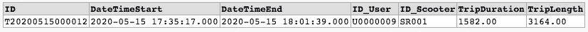

## 右外部联接

正如您可能期望的那样，我们对左外连接的所有考虑可以对称地用于右外连接。

在理解了上一节中的左外连接之后，可以随意看一下下面的两个例子来确认或否定您对右外连接的期望。

> **—查询 E001**
> SELECT *
> FROM[Trip]A
> RIGHT JOIN[User]B
> ON A .[ID _ User]= B .[ID]

> **—查询 E002**
> SELECT B . *
> FROM[Trip]A
> RIGHT JOIN[User]B
> ON A .[ID _ User]= B .[ID]
> 其中 A.[ID]为空

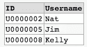

## 内部连接

从概念上讲，内部连接是左外部连接和右外部连接的组合，因此该连接的结果将只包含符合连接规则的行。

**—查询 F001**
SELECT *
FROM[Trip]A
INNER JOIN[User]B
ON A .[ID _ User]= B .[ID]

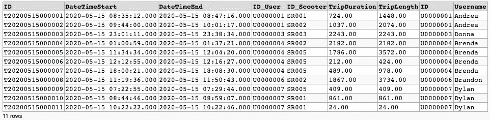

## 反连接

相反，反连接将只显示左侧的表行(表 A)和右侧的表行(表 B ),它们不符合连接规则。

**—查询 G001**
SELECT *
FROM[Trip]A
FULL OUTER JOIN[User]B
ON A .[ID _ User]= B.[ID]
其中 A.[ID]为空或 B .[ID]为空

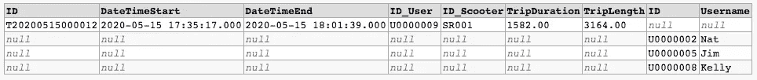

## 交叉应用

交叉应用类似于内部连接，但是当您想要指定一些关于连接中的数量或顺序的更复杂的规则时，可以使用它。交叉应用最常见的实际应用可能是当您希望在两个(或更多)表之间建立连接，但您希望表 A 的每一行都是 math，并且只有表 B 的一行是 math。在下面的示例中，更详细地说，每个用户(表 A)将与其最长的行程(表 B)匹配。请注意，没有进行任何旅行的用户不会包括在结果中，因为我们已经说过交叉应用在某种程度上类似于内部连接。

**—查询 H001**
SELECT A.*，B.[TripDuration]，B .[ID]
FROM[User]A
CROSS APPLY(
SELECT TOP 1 *
FROM[Trip]C
其中 C .[ID _ User]= A .[ID]
ORDER BY C .[Trip duration]desc
)B

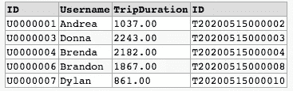

## 外部应用

外部应用与我们刚刚讨论的交叉应用非常接近。主要区别在于，外部 APPLY 还会在结果中包括表 A 中不符合 WHERE 子句中定义的匹配规则的行。

下面的例子类似于我们在交叉应用部分中的例子，但是，正如您可以很容易地看到的，没有任何旅行的用户也包括在结果中。

**—查询 I001**
SELECT A.*，B.[TripDuration]，B .[ID]
FROM[User]A
OUTER APPLY(
SELECT TOP 1 *
FROM[Trip]C
其中 C .[ID _ User]= A .[ID]
ORDER BY C .[Trip duration]desc
)B

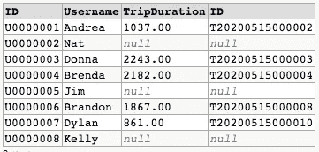

## 在连接中使用 WHERE 条件

在继续之前，理解使用连接时 WHERE 子句的用法是很重要的。

我们将考虑四个例子，有四个完全不同的结果，我希望这些例子有助于理解如何正确地编写连接和 WHERE 规则。

在查询 L001 中，您可以看到一个关于连接的重要事实，因为数据库将首先根据连接规则在表之间建立连接，然后才使用 WHERE 子句进行过滤。因此结果将只包括 b .[用户名]='Brenda '的行。

> **—查询 L001**
> SELECT *
> FROM[Trip]A
> LEFT JOIN[User]B
> ON A .[ID _ User]= B .[ID]
> 其中 B.[Username]='Brenda '

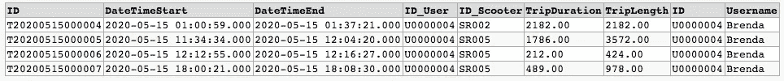

关于连接的另一个重要事实是，您可以在连接规则中指定一些过滤规则。如果考虑在 WHERE 子句之前应用连接规则，那么这是一个好主意，这样可以限制数据库在筛选之前必须提取的行数。

硬币的另一面是，您必须知道并始终注意，在左出连接中，只有应用于右表(表 B)的过滤规则才会被考虑。

> **—查询 L002**
> SELECT *
> FROM[Trip]A
> LEFT JOIN[User]B
> ON A .[ID _ User]= B .[ID]AND B .[Username]= ' Brenda '

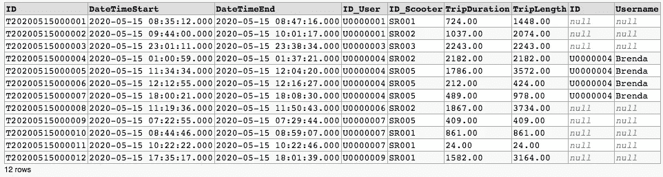

> **—查询 L003**
> SELECT *
> FROM[Trip]A
> LEFT JOIN[User]B
> ON A .[ID _ User]= B .[ID]
> 其中 A.[ID_Scooter]='SR001 '

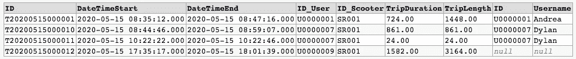

正如我们在查询 L002 的示例中已经说过的，在左出连接中，只考虑应用于右表(表 B)的过滤规则。在本例中，您可以看到过滤规则 A.[ID_Scooter]='SR001 '被忽略，所有指示器都被提取到结果中。请花一些时间来理解查询 L003 和 L004 的结果之间的差异。

> **—查询 L004**
> SELECT *
> FROM[Trip]A
> LEFT JOIN[User]B
> ON A .[ID _ User]= B .[ID]AND A .[ID _ Scooter]= ' Sr 001 '

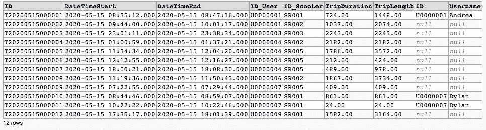

# 使用不同表格的行

在组合了不同表中的列之后，您可能会问是否有可能组合不同表中的行。答案是肯定的，但是你必须掌握不同的结构。

## 联合和联合所有

关于组合不同表中的行的第一个重要假设是列名和类型必须相同。例如，如果您尝试将表 Scooter 和 RepairedScooter 与 UNION ALL 组合在一起，您将会得到一个错误，因为它们有不同的列。

**—查询 M001**
从【代步车】
中选择*
从【维修代步车】中选择*

Msg 205 Level 16 State 1 Line 2 所有使用 UNION、INTERSECT 或 EXCEPT 运算符组合的查询在其目标列表中必须有相同数量的表达式。

无需修改表的结构，只需选择两个表中都存在的列，就可以轻松地合并这两个表。

**—查询 M002**
从【代步车】
中选择【ID】、【品牌】、【型号】、【制造年份】
从【维修代步车】中选择【ID】、【品牌】、【型号】、【制造年份】

UNION 和 UNION ALL 的区别在于，前者只在结果中包含不同的值，因此，它比后者稍慢。

**—查询 M003**
从【代步车】
中选择【ID】、【品牌】、【型号】、【制造年份】
从【维修代步车】中选择【ID】、【品牌】、【型号】、【制造年份】

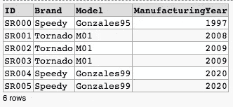

## 除...之外

如果我们希望提取第一个表中的行而不是第二个表中的行，我们可以使用 EXCEPT。

**—查询 N001**
从【代步车】
中选择【ID】、【品牌】、【型号】、【制造年份】
除了
从【维修代步车】中选择【ID】、【品牌】、【型号】、【制造年份】

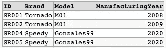

## 横断

如果我们想提取第一个表和第二个表中的行，我们可以使用 INTERSECT。

**—查询 O001**
从【代步车】
中选择【ID】、【品牌】、【型号】、【制造年份】
从【维修代步车】中选择【ID】、【品牌】、【型号】、【制造年份】

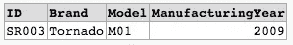

# 使用流程图进行简单回顾

我们看到了很多构造，我希望这个故事能帮助你更好地理解它们之间的区别。在下图中，您可以找到一个流程图，您可能会发现在 SQL Server 中组合不同来源的数据的第一步很有帮助。

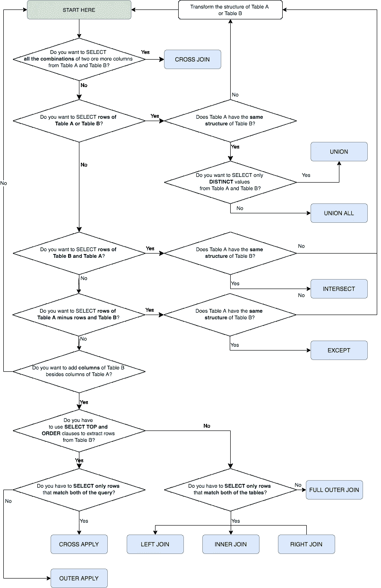 [## SQL Server 2019 |数据库小提琴

### 免费的在线 SQL 环境用于实验和分享。

dbfiddle.uk](https://dbfiddle.uk/?rdbms=sqlserver_2019&fiddle=bb54aaea7e0a2527a7e5b14b6dc922e6)