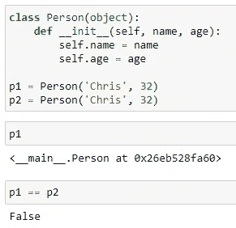
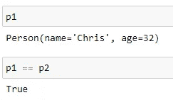
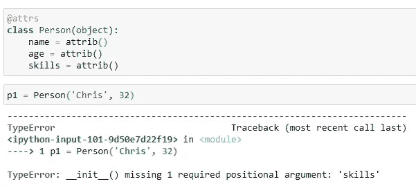
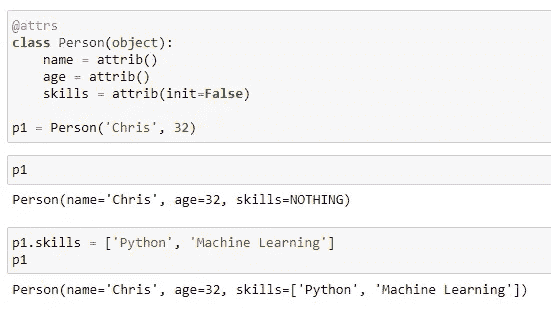
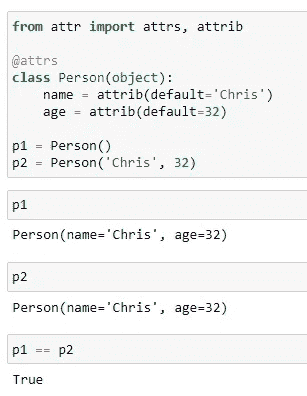
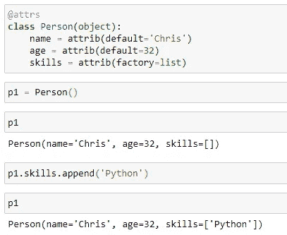
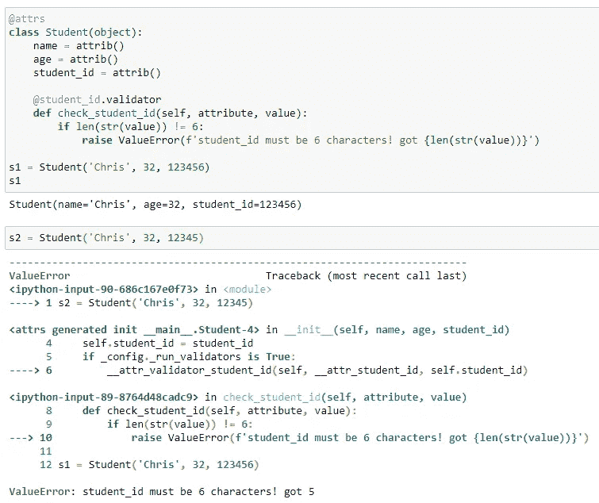
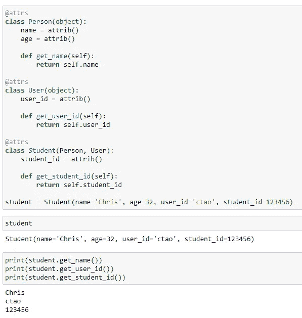
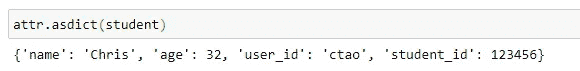

# 可能是面向对象 Python 的最佳实践— Attr

> 原文：<https://towardsdatascience.com/probably-the-best-practice-of-object-oriented-python-attr-d8c26c0e8a4?source=collection_archive---------6----------------------->


由 [davisco](https://unsplash.com/@codytdavis?utm_source=medium&utm_medium=referral) 在 [Unsplash](https://unsplash.com?utm_source=medium&utm_medium=referral) 上拍摄的照片

## 让 Python 面向对象编程变得更加容易

众所周知，Python 非常灵活，可以用函数式、过程式和面向对象的方式编写。老实说，除非万不得已，我很少用 Python 写类，只是因为大多数时候我不想过度设计问题。例如，当我们使用 Python 执行一些特定的数据分析时，使用面向对象编程可能没有太大意义。

然而，当我知道这个名为“Attrs”的图书馆时，事情发生了变化。它让 Python 用面向对象模式编程变得更加容易(我觉得 Python 的面向对象编程已经非常简洁和容易了)。在本文中，我将介绍这个库如何促进 Pythonic 面向对象编程。

 [## 属性

### 版本 19.3.0()。是 Python 包，它将把您从……

www.attrs.org](https://www.attrs.org/) 

# 简单的开始


照片由[丹妮尔·麦金尼斯](https://unsplash.com/@dsmacinnes?utm_source=medium&utm_medium=referral)在 [Unsplash](https://unsplash.com?utm_source=medium&utm_medium=referral) 上拍摄

像大多数 Python 库一样，我们可以使用`pip`简单地安装`attrs`。

```
pip install attrs
```

现在，让我们用 Python 编写一个没有任何库的类。

```
class Person(object):
    def __init__(self, name, age):
        self.name = name
        self.age = age

p1 = Person('Chris', 32)
p2 = Person('Chris', 32)
```

请注意，我还用相同的属性值实例化了两个实例。



当我们输出实例时，我们只能得到类名。此外，属性值相同的两个实例不会被视为相等，因为它们没有指向相同的内存地址。

那么，`attrs`能为我们做些什么呢？让我们在这里做同样的事情。

```
from attr import attrs, attrib[@attrs](http://twitter.com/attrs)
class Person(object):
    name = attrib()
    age = attrib()

p1 = Person('Chris', 32)
p2 = Person('Chris', 32)
```

我想有些事情需要一个简单的解释。首先，`@attrs`是一个注释，它告诉我们这个类将要用`attrs`库来声明。然后，对于每个属性，我们只需要将它们定义为`attrib()`，而不需要有一个`__init__()`方法。之后，我们可以简单地实例化这个类，就像有一个`__init__`方法一样。

我们也来试试输出和相等测试。



显然，我们有一个非常有意义的对象输出，以及我们可以测试对象之间的相等性。

# 非初始化属性


照片由[诺德伍德主题](https://unsplash.com/@nordwood?utm_source=medium&utm_medium=referral)在 [Unsplash](https://unsplash.com?utm_source=medium&utm_medium=referral) 上拍摄

你现在可能有一个问题。如果有这样一个属性，我们不想在实例化过程中初始化它，但可能在以后给它赋值，那该怎么办？当然，如果你还是用下面的`attrib()`就不行了。



使用`attrs`，您可以通过用`False`传递`init`参数来实现这一点。

```
[@attrs](http://twitter.com/attrs)
class Person(object):
    name = attrib()
    age = attrib()
    skills = attrib(init=False)

p1 = Person('Chris', 32)
```



如图所示，我们不必一开始就给出`skills`的值，但是我们可以在以后赋值。

# 默认值


由 [Kelly Sikkema](https://unsplash.com/@kellysikkema?utm_source=medium&utm_medium=referral) 在 [Unsplash](https://unsplash.com?utm_source=medium&utm_medium=referral) 上拍摄的照片

你可能还会问，我想给属性赋予默认值怎么样？是的，有了`attrs`，你可以轻松做到。

```
[@attrs](http://twitter.com/attrs)
class Person(object):
    name = attrib(default='Chris')
    age = attrib(default=32)

p1 = Person()
p2 = Person('Chris', 32)
```



如图所示，我们为这两个属性都提供了默认值。然后，没有传入任何参数的实例与另一个用参数显式初始化的实例完全相同。

如果我们希望将一个空集合的属性作为默认值，该怎么办？通常，我们不想传入一个`[]`作为参数，这是 Python 著名的陷阱之一，可能会导致许多意想不到的问题。别担心，`attrs`为我们提供了一个“工厂”。

```
[@attrs](http://twitter.com/attrs)
class Person(object):
    name = attrib(default='Chris')
    age = attrib(default=32)
    skills = attrib(factory=list)
```



如图所示，属性`skills`最初是空的，但是后来，我们可以向它追加值。

# 验证属性


马库斯·温克勒在 [Unsplash](https://unsplash.com?utm_source=medium&utm_medium=referral) 拍摄的照片

现在，我们想给属性添加一些验证，以确保我们传入的值是有效的。使用`attrs`也很容易实现。

```
[@attrs](http://twitter.com/attrs)
class Student(object):
    name = attrib()
    age = attrib()
    student_id = attrib()

    [@student_id](http://twitter.com/student_id).validator
    def check_student_id(self, attribute, value):
        if len(str(value)) != 6:
            raise ValueError(f'student_id must be 6 characters! got {len(str(value))}')
```

在上面的例子中，我们用属性“student_id”声明了一个“Student”类。假设我们要验证学生 id，它的长度必须是 6 个字符。

注意，我们需要定义一个函数来完成这项工作。该函数需要注释为`@<attribute_name>.validator`。所以，在我们这里，这个应该是`@student_id.validator`。然后，我们可以在这个验证函数中引发一个异常，如上所示。

让我们做一个简单的测试。



第一个实例`s1`没有任何问题，因为它的`student_id`长度为 6，但是第二个实例`s2`不会通过，因为长度为 5，并且正确显示了带有预定义错误消息的异常。

# 子类


照片由[Clker-Free-Vector-Images](https://pixabay.com/users/Clker-Free-Vector-Images-3736/)在 [Pixabay](https://pixabay.com/vectors/diagram-schematic-hierarchy-chart-23676/#) 上拍摄

在普通 Python 中，我们必须使用`__init__()`函数中的`super()`函数来实现继承。当我们需要多重继承时，这将会非常复杂。使它变得极其容易。

```
[@attrs](http://twitter.com/attrs)
class Person(object):
    name = attrib()
    age = attrib()

    def get_name(self):
        return self.name

[@attrs](http://twitter.com/attrs)
class User(object):
    user_id = attrib()

    def get_user_id(self):
        return self.user_id

[@attrs](http://twitter.com/attrs)
class Student(Person, User):
    student_id = attrib()

    def get_student_id(self):
        return self.student_idstudent = Student(name='Chris', age=32, user_id='ctao', student_id=123456)
```

在上面的例子中，`Student`继承了`Person`和`User`。在`Student`类中，我们只需要定义它的特定属性`student_id`，来自`Person`和`User`的其他属性将直接自动继承，无需任何详细定义。



如上所示，函数被继承也没有问题。

# 连续编入词典


[Pixabay](https://pixabay.com/photos/girl-english-dictionary-study-2771936/) 上 [libellule789](https://pixabay.com/users/libellule789-5876729/) 的照片

`attrs`库还可以帮助我们轻松地将实例序列化到字典中。之后，你可以在 JSON 中使用它，做任何你想做的事情。

```
attr.asdict(student)
```



# 摘要


乔安娜·科辛斯卡在 [Unsplash](https://unsplash.com?utm_source=medium&utm_medium=referral) 上拍摄的照片

在这篇文章中，我已经介绍了库`attrs`和一些基本用法。我喜欢这个库，因为它使 Python 更加简单和简洁。如果你以前没有用过，强烈建议你试用一下。希望你也会喜欢。

[](https://medium.com/@qiuyujx/membership) [## 通过我的推荐链接加入 Medium 克里斯托弗·陶

### 作为一个媒体会员，你的会员费的一部分会给你阅读的作家，你可以完全接触到每一个故事…

medium.com](https://medium.com/@qiuyujx/membership) 

如果你觉得我的文章有帮助，请考虑加入 Medium 会员来支持我和其他成千上万的作者！(点击上面的链接)