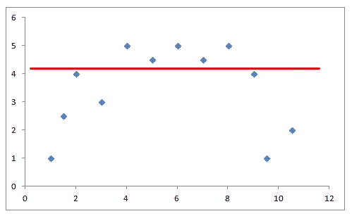
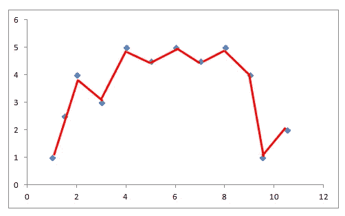
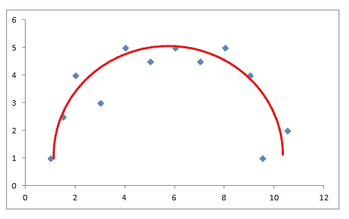
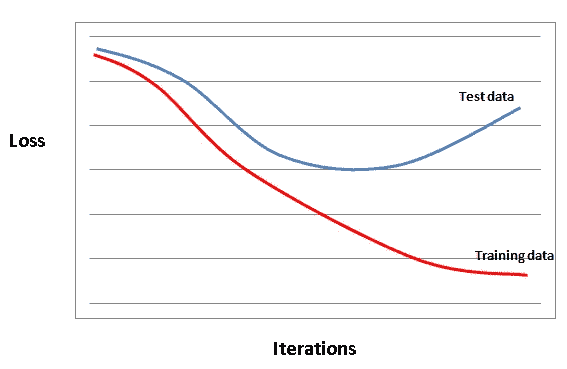
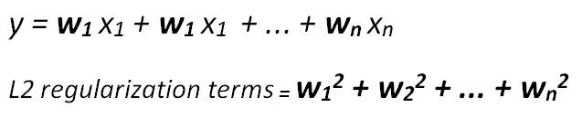
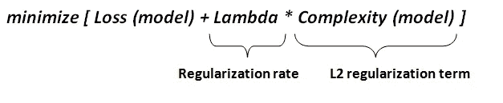
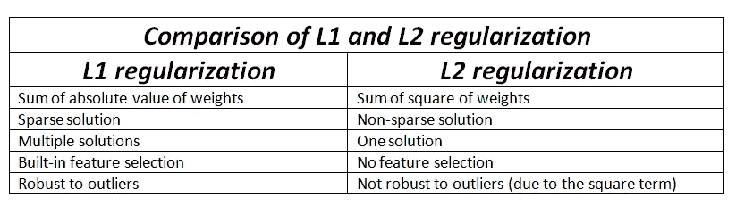

# 问题:过度拟合，解决方案:正则化

> 原文：<https://towardsdatascience.com/problem-overfitting-solution-regularization-b466d3d1f4da?source=collection_archive---------21----------------------->

什么使模型过度拟合，我们如何解决这个问题

我们都有这样的朋友，他们讲述的故事极其详细。当你问他们最近看的一部电影时，你可能不仅会知道这部电影，还会知道电影院卖爆米花的那个人的手表。另一方面，我们有沉默寡言的朋友，他们只会告诉你这部电影是“好”还是“坏”。

就细节的数量而言，过度适应和欠适应与那些不同类型的朋友相似。过度拟合的机器学习模型试图提取训练数据的细节，而欠拟合的模型过于笼统，往往会错过训练数据中的重要趋势。

一个更像机器学习的例子是预测图像中的对象。假设我们正在尝试构建一个模型来预测图像中的西红柿:

照片由 [Soya Soong](https://unsplash.com/@sooong?utm_source=unsplash&utm_medium=referral&utm_content=creditCopyText) 在 [Unsplash](https://unsplash.com/s/photos/tomato?utm_source=unsplash&utm_medium=referral&utm_content=creditCopyText)

*   模型 A:红色，圆形，顶部是绿色的星形，有一些水滴
*   B 型:红色，圆形

A 型的问题是，并不是所有的番茄上都有水滴。这个模型太具体了，很可能会挑湿番茄。它不能很好地推广到所有的番茄。它会寻找水滴，所以无法预测图像中的干番茄。是**过拟合**。

另一方面，B 型认为所有红色圆形的东西都是番茄，这是不正确的。该模型过于一般化，不能检测番茄的关键特征。是**欠配合**。

这些例子并不完全是机器学习模型如何学习和预测的，而是给出了过度拟合和欠拟合的概述。在这篇文章中，我将详细介绍以下概念:

*   偏差和方差
*   过度拟合和欠拟合
*   正规化

# **偏差和方差**

偏差和方差对于理解过度拟合和欠拟合是至关重要的。

**偏差**衡量平均预测值与实际值的差距。如果我们试图用一个非常简单的模型来模拟一个复杂的关系，就会产生偏差。高偏差模型的预测非常相似。由于它对数据内的变化不敏感，因此该模型在训练数据和测试数据(以前未见过的数据)上的准确性都很低。

高偏差模型

蓝点是训练集中的观察值，红线是我们的有偏模型，它不关心观察值的两个特征内的波动，并进行相同的预测。

**方差**是偏差的反义词，对数据内的变化敏感。具有高方差的模型对训练数据中甚至很小的变化都非常敏感。它试图捕捉每一个小细节，因此训练数据的微小变化也会改变模型。具有高方差的模型也倾向于捕捉数据中的噪声。异常值将在模型的范围内。

高方差模型

如您所见，该模型试图根据数据中的所有变化进行调整。具有高方差的模型的预测被广泛传播。很明显，该模型在训练集上有很高的准确率。然而，它在新的、以前看不到的观测中表现不佳。

机器学习模型是为以前看不到的观察结果而建立的，因此方差很大的模型是不可接受的。我们也永远不能依赖高偏差的模型。因此，找到偏差和方差之间的界限是至关重要的。偏差和方差之间总是有一个权衡。我们很容易找到一个高偏差低方差或者低偏差高方差的模型。然而，你的模型的成功取决于在偏差和方差之间找到最优的方法。例如，下面的模型似乎很适合。

# **过拟合和欠拟合**

*   具有高偏差的模型往往会欠拟合。
*   方差高的模型往往会过度拟合。

当模型试图很好地拟合训练数据，以至于不能推广到新的观察结果时，就会出现过度拟合。广义模型在新的观察上表现得更好。如果一个模型比需要的更复杂，我们很可能会过度拟合。欠拟合模型不能很好地推广到训练和测试数据集。

在监督学习任务中，我们可以通过比较训练和测试数据集上的模型精度来检测过拟合。如果训练数据集(模型看到的观察值)数据集的精度远远高于测试数据集(看不到的观察值)的精度，则模型过度拟合。

损失表示实际价值和我们的预测之间的差异

损失与实际目标值和预测值之间的差异成比例。监督学习模型执行多次迭代，通过更新特征权重来最小化这种损失。然而，在某个点之后，模型在测试和训练数据上表现不同。损失在训练数据上持续减少，但是在某个点之后在测试数据上开始增加。检测这一点对于创建出色的机器学习模型至关重要。

过度拟合是机器学习模型的一系列问题，但我们如何防止模型过度拟合？答案是正规化。

# **正规化**

过度拟合的主要原因是使模型比必要的更复杂。如果我们找到降低复杂度的方法，那么过拟合问题就解决了。

> 正则化不利于复杂的模型。

正则化增加了对模型中较高项的惩罚，从而控制了模型的复杂性。如果增加一个正则项，该模型试图最小化损失和模型的复杂性。

> 正则化减少了方差，但不会导致偏差显著增加。

两种常见的正则化方法是 L1 正则化和 L2 正则化。模型的复杂性取决于:

*   特征总数(由 L1 正则化处理)，或
*   特征的权重(由 L2 正则化处理)

**L1 正规化**

它也被称为稀疏正则化。顾名思义，它用于处理稀疏向量。如果我们有高维特征向量空间，模型就变得很难处理。

L1 正则化强制无信息特征的权重为零。L1 正则化的作用类似于在每次迭代中从权重中减去少量的力，从而最终使权重为零。

> L1 正则化惩罚|权重|。

**L2 正规化**

为简单起见，它也被称为正则化。如果我们把模型的复杂度作为权重的函数，那么特征的复杂度与它的权重的绝对值成正比。

L2 正则化迫使权重趋向于零，但并不使它们完全为零。L2 正则化就像在每次迭代中去除一小部分权重的力。因此，权重永远不会等于零。

> L2 正则化惩罚(权重)

有一个额外的参数来调整 L2 正则化项，称为**正则化率(λ)。**正则化率是一个标量并乘以 L2 正则化项。

> **注意:**选择λ的最佳值很重要。L2 正则化的目标是简单。然而，如果 lambda 太高，模型就会变得太简单，从而可能会不足。另一方面，如果λ太低，调节的效果变得可以忽略不计，模型可能会过拟合。如果 lambda 设置为零，那么正则化将被完全移除(过度拟合的高风险！).

> **注:** **岭回归**使用 L2 正则化，而**拉索回归**使用 L1 正则化。**弹性网回归**结合了 L1 和 L2 正则化。

# **结论**

过度拟合是机器学习模型的一个关键问题，需要小心处理。我们使用我们已经知道的数据建立机器学习模型，但在新的、以前看不见的数据上尝试或测试它们。我们希望模型了解训练数据中的趋势，但同时不希望模型过于关注训练数据。模型的成功取决于在过度拟合和欠拟合之间找到最佳点。

感谢您的阅读。如果您有任何反馈，请告诉我。