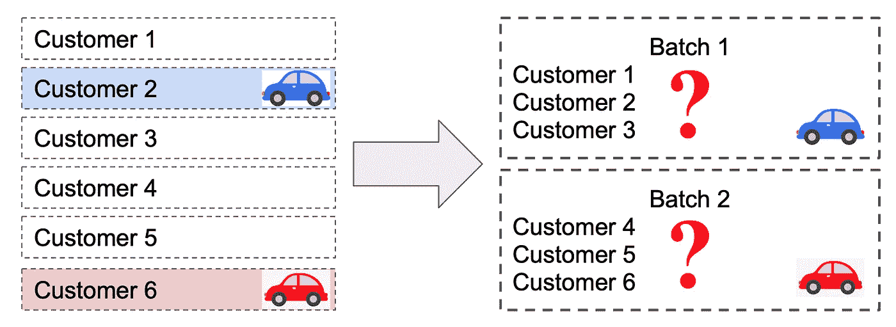
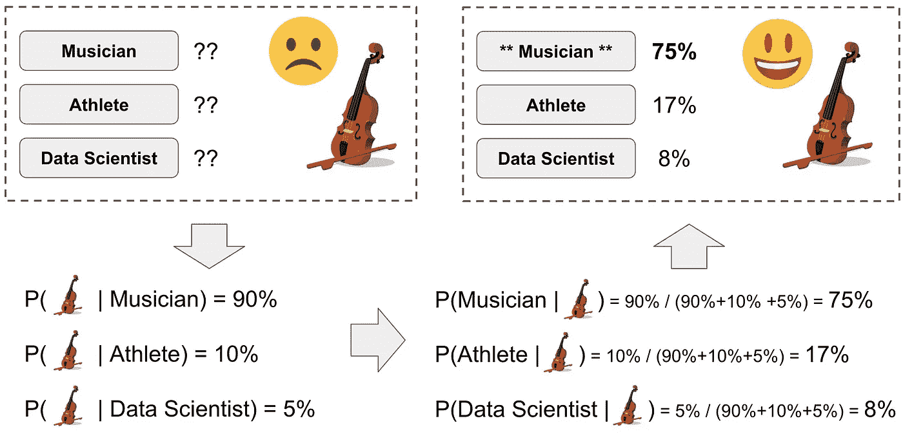
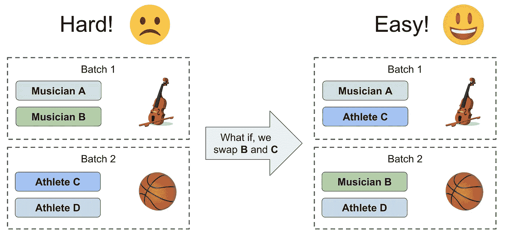
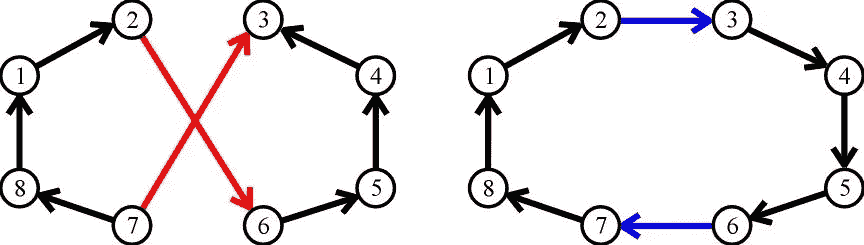
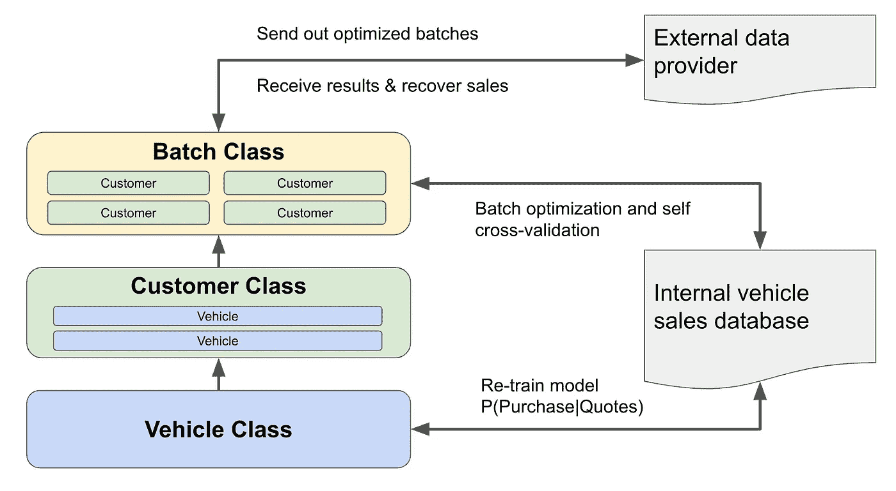

# 作为数据科学家解决问题:案例研究

> 原文：<https://towardsdatascience.com/problem-solving-as-data-scientist-a-case-study-49296d8cd7b7?source=collection_archive---------2----------------------->

## 我对数据科学家如何解决问题的想法，以及分享我在第一份工作中使用一个最喜欢的项目的案例研究

沃洛季米尔·赫里先科在 [Unsplash](https://unsplash.com/s/photos/rubix-cube?utm_source=unsplash&utm_medium=referral&utm_content=creditCopyText) 上的照片

关于数据科学家如何解决问题，有两个神话:一个是问题自然存在，因此数据科学家面临的挑战是使用算法并将其投入生产。另一个神话认为数据科学家总是试图利用最先进的算法，更好的模型等于更好的解决方案。虽然这些并非完全没有根据，但它们代表了对数据科学家工作方式的两种常见误解:一种过于强调“执行”方面，另一种夸大了“算法”部分。

显然，这些神话并不是我们实际解决问题的方式。在我看来，数据科学家解决问题的方式是:

*   更多关于“如何将问题从商业背景中抽象出来”，而不仅仅是“被交给一个具体的任务”
*   更多的是“用算法解决问题”，而不仅仅是“用最好的算法解决问题”
*   更多的是“迭代地交付商业价值”，而不仅仅是“实现代码并收工”。

说到这里，我注意到解决问题的过程通常包括四个阶段，我想分享一下这四个阶段是什么，以及它如何通过案例研究发挥作用，然后我们如何以正确的心态实现这四个阶段。

# 故事开始于，从前…

我的第一份工作是在一家经营汽车定价和信息网站的公司，该公司于 2014 年 5 月进行了首次公开募股(IPO)。这是一次很棒的经历，我清楚地记得那天周围的每个人都在为一家上市公司的诞生欢呼。作为一家上市公司，我们的收入开始受到很多关注，尤其是在 8 月份发布了第一份季度收益报告。7 月初，税收部门的主管来到数据科学家的座位区，看起来他没有好消息要分享。

“我们有麻烦了，销售收入的一个百分比不能适当地记入贷方；我们需要你的帮助。”

这里有一些相关的背景:公司的收入是基于它向汽车经销商介绍更多的销售这一事实而产生的。为了获得应得的佣金，我们需要将车辆的销售与正确的客户相匹配。如果我们的数据提供者可以告诉我们哪个客户买了哪辆车，那么匹配就完成了，不需要额外的努力；然而，问题是一个数据提供商决定不提供一对一的销售记录:它必须批量完成(如下所示的“批量”的可视化)，那么要知道哪个客户买了哪辆车就更加困难和不确定了。

收入团队对这一变化感到惊讶，在花了一个月的时间试图解决该问题后，该数据提供商只有 2%的销售额可以手动恢复。这对第一个盈利电话来说是个坏消息，所以他们开始向数据科学家寻求帮助。这显然是一个急需解决的问题，所以我们马上着手处理。

# 第一阶段。理解问题，然后用数学术语重新定义它

这是数据科学中解决问题的第一阶段。关于“理解问题”部分，一个人需要清楚地识别痛点，这样一旦痛点被解决，问题就应该消失了；关于“重新定义”问题部分，这通常是问题需要数据科学家帮助的原因。

对于我们的收入团队询问的具体问题，问题是:我们不能将每辆售出的车辆分配给一个客户，这样我们就失去了收入。

痛点是:在给定的批次中查找谁购买了车辆是手动的且不准确，考虑到有数千个批次需要匹配销售，这非常耗时且不可持续。

这个“重新定义”的问题用数学术语来说就是:给定一批有客户 C1、C2、..，Cn，以及售出车辆信息，V1，V2，…，Vm，我们需要一个自动化的解决方案来准确识别正确的匹配对(Ci，Vj ),以反映实际的购买活动。

# 第二阶段。分解问题，确定一个逻辑算法解决方案，然后构建出来

对于重新定义的问题，我们可以看到这是一个在约束条件下的“匹配”练习，给定客户和批量车辆。所以我把问题进一步分解成两步:

*   第一步。给定车辆 P(C|V ),计算客户的购买可能性
*   第二步。根据可能性，将汽车归属于该批中最有可能的客户

现在，我们可以进一步确定每个问题的解决方案。

## 第一步。概率计算

为了简单起见，让我们假设在这个批次中有三个客户(c1、c2、c3)，并且提供一个车辆(v1)信息作为销售。

*   P(C=c1)代表 c1 购买任何一辆车的可能性。假设没有关于每个客户的先验知识，他们购买任何汽车的可能性应该是相同的:P(C=c1) = P(C=c2) = P(C=c3)，这等于一个常数(例如，在这种情况下是 1/3)
*   P(V=v1)是 v1 被出售的可能性，假设它显示在该批次中，这应该是 1 (100%被出售的可能性)

由于只有一个顾客进行购买，这种概率可以扩展为:

P(V=v1) = P(C=c1，V=v1) + P(C=c2，V=v1) + P(C=c3，V=v1) = 1.0

对于每一项，给出以下公式

P(C=c1，V = v1)= P(C = C1 | V = v1)* P(V = v1)= P(V = v1 | C = C1)* P(C = C1)

我们可以看到 P(C=c1|V=v1)与 P(V=v1|C=c1)成正比。所以现在，我们可以得到概率计算的公式:

P(C = C1 | V = v1)= P(V = v1 | C = C1)/(P(V = v1 | C = C1)+P(V = v1 | C = C2)+P(V = v1 | C = C3))

关键是得到每个 P(V|C)的概率。这样的公式可以口头解释为:特定客户购买车辆的可能性与该客户购买该特定车辆的可能性成比例。

上面的公式可能看起来太“数学”了，所以让我把它放到一个直观的上下文中:假设三个人在一个房间里，一个是音乐家，一个是运动员，一个是数据科学家。有人告诉你这个房间里有一把属于他们其中一个人的小提琴。现在猜猜，你认为谁是这把小提琴的主人？这很简单，对吧？鉴于音乐家拥有小提琴的可能性很高，而运动员和数据科学家拥有小提琴的可能性较低，小提琴更有可能属于音乐家。“数学”思维过程如下图所示。

现在，让我们把概率放到业务环境中。作为一个在线汽车定价平台，每个客户需要生成至少一个车辆报价，因此，我们假设客户可以合理地表示为他/她报价的车辆。然后，这种 P(V|C)概率可以从公司在历史中已经积累的现有数据中获知，包括谁在何时生成了车辆报价，以及他们最终购买了什么车辆。细节我就不进一步细说了，关键是我们可以学习 P(V|C)，然后计算每一批需要的概率 P(C|V)。

## 第二步。车辆属性

一旦我们获得了每辆车销售给客户的预期概率，第二步就是归属过程。假设该批中只有一辆售出的车辆，这样的过程是琐碎的；但是，如果该批次中有多辆售出的车辆，则以下任一方法都适用:

*   (直接归因)仅使用计算出的概率 P(C|V)，始终将车辆归因于可能性最高的客户。根据这种方法，可以将两辆车归属于同一个客户。
*   (循环法)假设每个客户最多购买一辆车:一旦一辆车被分配给一个客户，在下一轮车辆分配之前，两辆车都被删除。

现在我们已经设计了两步算法来解决关键挑战，是时候测试性能了！给定历史报价和销售数据，直接模拟“创建随机批次”、“将销售附加到批次”的过程，并尝试“从给定的批次信息中恢复销售”。这种模拟提供了一种评估模型性能的方法，我们估计超过 50%的销售额可以以高精度(> 95%)恢复。我们为真实数据集部署了该模型，结果与我们的预期非常匹配。

收入团队对上述解决方案非常满意:与 2%的回收率相比，50%超过了 25 倍！从业务影响的角度来看，这一收入直接增加了我们第一份季度收益报告的底线，数据科学团队贡献的价值是巨大的。

# 第三阶段。深入思考，寻求进一步改进的机会

我们将上述解决方案再运行一个月，看到性能相当稳定，现在是时候考虑下一步了。我们收回了 50%的销售额，但剩下的 50%呢？有没有可能进一步改进算法才能达到？

通常，我们作为数据科学家，有过于关注算法细节的倾向；在这种情况下，围绕如何更好地对 P(V|C)建模进行了一些讨论:我们是否应该使用深度学习模型来使这个概率变得更好，等等。然而，根据我的理解，这些纯粹的算法改进通常只会带来性能的提升，而我们不太可能缩小剩下的 50%的差距。

然后，我开始与收入团队进行更深入的交谈，试图找出我们对问题的理解中缺少的东西，结果是我们可以控制如何将客户分组到一个批次中！虽然有一些限制(例如，客户必须从同一家经销商处生成报价)，但这给了我们进一步优化的自由，我认为这是缩小其余 50%销售差距的方向。

为什么我对这个方向充满信心？想一下这个情况:如果你有 4 个人要分批，每批有 2 个人。最好的批处理策略是将最不同的人放在同一个批处理中，这样一旦返回一个项目，归属将更加准确。下面的可视化展示了这个概念。在左边，如果你把两个音乐家放在同一个批次，两个运动员放在同一个批次，很难知道谁拥有小提琴或篮球。而在右边，如果你有一个音乐家和一个运动员的每一批，它更容易告诉音乐家 A 拥有小提琴，运动员 D 拥有篮球，有很高的信心。

要实现上述概念，需要两个步骤:

*   (相似度定义)如何定义客户对客户的相似度？然后把一批的熵作为优化的目标函数？
*   (批次优化)基于以上相似性，如何设计一个优化策略来达到最优批次？

## **第一步。相似性定义**

在第一阶段解决方案中，我们已经找到了一种计算 **P(V|C)** 的方法，在这里，我将做一个直接的概括:两个客户之间的相似性与双方客户购买对方报价车辆的平均可能性成正比。如果每个客户只对一辆车报价(c1 对 v1 报价，c2 对 v2 报价)，则简化版本如下:

相似度(C1，C2)= 0.5 *(P(V = v1 | C = C2)+P(V = v2 | C = C1))

一旦我们有了两个客户之间的成对相似性，我们就可以将一个批次的熵定义为该批次中客户之间的相互成对相似性的总和。现在，我们有一个优化的目标函数:我们想要最大熵的批次

## 第二步。批量优化

在看了一些类似的研究后，我决定使用 2-opt 算法，这是一种用于解决旅行商问题的简单局部搜索算法。

2-opt 算法的基本概念是:在每一步中，随机选取两条边并尝试“交换”，如果交换后目标函数更好，则执行交换；否则，重新选择两条边。该算法继续进行，直到目标函数收敛或达到最大迭代次数。下图说明了拾取两条边(红色)并将其交换到新边(蓝色)中，从而缩短距离的情况。

为了在我的例子中应用 2-opt 算法，我对旅行推销员问题(TSP)进行了类比:

*   在 TSP 中，随机选择两条边；在我的案例中，随机选择了两批，然后每批随机挑选一名顾客进行交换
*   在 TSP 中，总距离作为目标函数，越短越好；在我这里，所有批次的熵就是目标函数，越高越好。

太好了，我们拥有优化批次的所有要素！在实现算法后，我们进一步对现有数据进行回测，发现:85%以上的销售额可以恢复。在接下来的一个月中，当我们将此应用于真实数据集时，发现恢复率处于类似的水平。这种方法果然有效！

# 第四阶段。设计解决方案，使其具有可扩展性和可维护性

我上面描述的主要是算法设计部分；与此同时，还有工程开发部分，简单地编写代码并期望它具有可扩展性和可维护性并不容易。

在项目发展过程中，我们逐渐注意到在所需的模块之间存在一种依赖模式。车辆由多个特征表示，客户由一组车辆表示，批次由一组客户表示。有了这种高级表示，我们可以将依赖关系构建为 Vehicle -> Customer -> Batch。

与此同时，作为一个数据产品，我们需要确保系统可以不断发展，以更新所需的参数，并始终评估沿途的性能。因此，该架构是按照以下方式设计的

使用这种体系结构，数据科学家需要定期做的事情有:

*   重新训练 P(V|C)模型，以确保它包含最近的客户购买行为
*   对整个过程进行模拟，包括批次优化和销售归属，以确保系统性能高于阈值
*   每月批量优化，为我们的收入团队和销售归属准备数据，以将客户与销售匹配

现在，我们已经构建了一个可维护的可持续数据产品。鉴于数据科学团队建立了良好的声誉，在接下来的一年中，我们大量参与了销售匹配系统的重新设计，这进一步扩大了数据科学在公司的足迹。由于这种架构的卓越运营，我们可以腾出更多资源来应对下一个挑战。

# 用正确的心态解决问题的一般流程

数据科学领域非常广泛，设计算法数据产品只是许多潜在项目的一部分。其他常见的数据科学项目有实验设计、因果推理、推动战略变革的深度分析等。尽管他们可能没有严格遵循或者甚至不需要我上面列出的所有阶段，四阶段流程仍然有助于展示一种思考解决问题的方法:

*   第一阶段(问题识别)是帮助你专注于关键问题，而不是在深入研究数据时迷失方向
*   第二阶段(第一个合理的解决方案)是让你快速取胜，并保持与业务伙伴建立信任的势头
*   第三阶段(迭代改进)是帮助您将解决方案向前推进，并成为该领域的所有者
*   第 4 阶段(卓越运营)是帮助您消除技术债务，将您从日常维护工作中解放出来

四阶段流程不一定是一个应该遵循的严格规则，但如果数据科学家在面对任何即将到来的挑战时拥有正确的心态，它更像是一个自然的结果。在我看来，这些心态是:

*   **业务驱动，而不是算法驱动**。纵观全局，了解数据科学在业务中的位置，理解为什么需要数据科学以及它如何提供价值。不要太执着于任何特定的算法:“如果你只有一把锤子，那么一切看起来都像钉子”。
*   **拥有问题，而不仅仅是接受订单**。成为问题的主人意味着一个人会积极主动地思考如何现在就解决它，更好地解决它，用更少的努力解决它。人们不会停留在一个次优的解决方案，并认为它已经完成。
*   **虚心，永远在学习**。作为一个跨学科的领域，数据科学与统计学、计算机科学、运筹学、心理学、经济学、市场营销、销售等学科重叠！提前了解所有领域几乎是不可能的，所以要虚心学习，一路走来不断学习。总会有比你已经知道的更好的解决方案。

希望以上分享对你有所帮助:快乐解决问题，数据科学之道。

— — — — — — — — — — — — — —

*如果你喜欢这篇文章，通过点赞、分享和评论来帮助传播。潘目前是 LinkedIn 的数据科学经理。可以看以前的帖子，关注他上* [*LinkedIn*](https://www.linkedin.com/in/panwu/) *。*

*之前有两篇分享潘数据科学经验的文章:*

[*我的第一个数据科学项目*](https://www.linkedin.com/pulse/my-first-data-science-project-pan-wu/)

[*数据科学如何创新*](https://www.linkedin.com/pulse/how-innovate-datascience-pan-wu/)