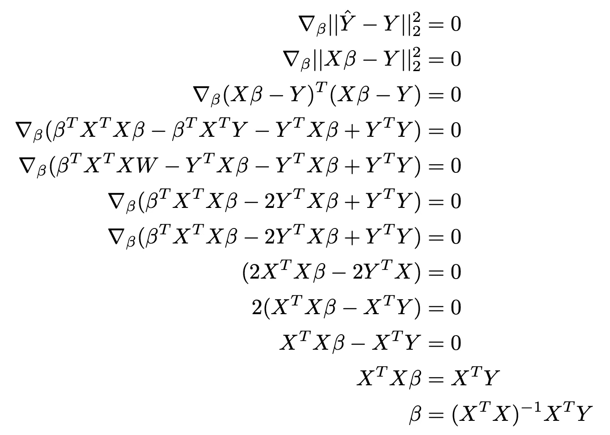
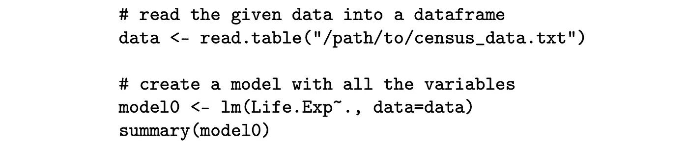
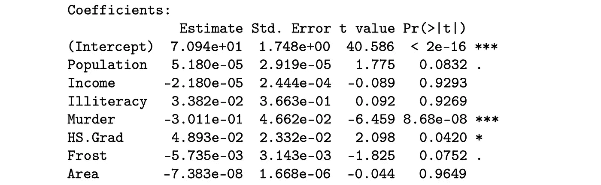
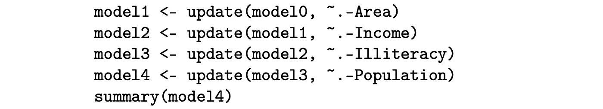
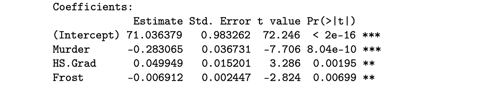
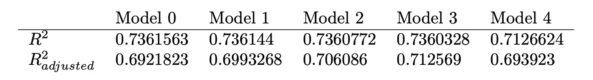
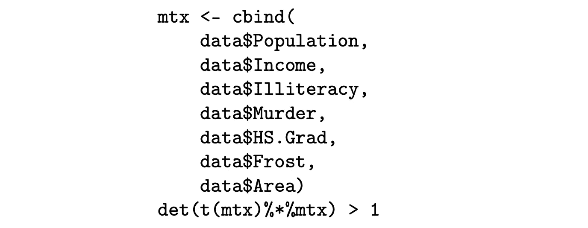

# 多元线性回归的问题，R

> 原文：<https://towardsdatascience.com/problems-with-multiple-linear-regression-in-r-bef5940518b?source=collection_archive---------17----------------------->

## 如果你以任何形式滥用数学，它就不会站在你这边

小心直线…图片由 [Unsplash](https://unsplash.com/photos/tpRGKt2IdHY) 上的[阿塔瓦·图尔西](https://unsplash.com/@atharva_tulsi)拍摄

线性回归是一种流行的、古老的、充分发展的方法，用于估计测量结果和一个或多个解释(独立)变量之间的关系。例如，线性回归可以帮助我们建立一个模型，代表心率(测量结果)、体重(第一个预测因素)和吸烟状况(第二个预测因素)之间的关系。在这篇博客中，我们将了解如何进行参数估计，探索如何使用基于美国人口普查局数据创建的数据集进行多元线性回归，并讨论在我们试图简化模型时，由于删除“坏预测因素”而出现的一些问题。

线性模型的典型表示方式可能是人们所熟悉的:

这里， *y* 表示由斜率为 *m* 且截距为 *b* 的直线估计的测量结果。我们可以重新排列等式，得到:

我们可以进一步改变变量，用贝塔系数来表示:

这是线性回归模型的典型表示方式。注意，我们使用 *y_hat* 来表示估计，而不是观察。我们可以扩展该模型，使其包含多个预测变量:

其中 *x_1，x_2，…，x_p* 为预测值(其中有 *p* )。在这种情况下，可以调用线性代数中的一个概念——线性组合！请注意，β和预测值 *x_i* ( *i* 是预测值的索引)可以表示为单独的向量，为我们提供了模型的一般矩阵形式:

假设我们有`N`个结果，我们想找出结果和单个预测变量之间的关系。除了`N`结果，我们还会有单个预测因子的`N`观察。此外，假设结果和观察结果都存储在矩阵中。由于结果是一个单一的数字，并且有`N`个，我们将有一个`N x 1`矩阵来表示结果— **Y** (在本例中是一个向量)。此外，观察值将存储在一个`N x (p + 1)`矩阵中，其中`p`是预测值的数量(在我们的例子中是一个)。我们将一列 *1s* 添加到观察矩阵中，因为它将帮助我们估计与模型截距相对应的参数——矩阵 **X** 。请注意，我们添加了一个误差项——epsilon，它表示预测值( ***Y_hat*** )和实际观测值( ***Y*** )之间的差异。

术语 **β** 是包含线性模型的参数/系数的`(p + 1) x 1` 向量。附加项 **ε** 是一个表示测量误差的`n x 1` 矢量。

## 假设

与大多数(如果不是全部)统计工具类似，线性回归有几个必须满足的假设，以便使用其原理对问题建模:

1.  线性(duh)——特征和结果之间的关系可以线性建模(如果数据是非线性的，可以进行转换以使其线性，但这不是本文的主题)；
2.  同方差——误差项的方差是常数；
3.  独立性——观察相互独立，即结果 *i* 不会影响结果*I+1*；
4.  正态性——对于 **X** 的任意固定值， **Y** 呈正态分布。

## **如何获得β**

拟合模型时，目标是最小化测量观察值和该观察值的预测值之间的差异。在线性回归中，我们通常会尝试最小化均方误差，即独立观察值与其预测值之间的平方差总和的平均值:

我们可以通过获取关于β(参数)的梯度并将其设置为 0 来最小化 MSE，从而得到β的公式:

了解了β是如何得出的，我们就可以开始练习了。

我们将使用一个由美国人口普查局收集的不同类型指标汇总而成的数据集。我们将尝试基于 7 个预测因素来预测预期寿命——人口估计、文盲率(人口百分比)、每 10 万人口中的谋杀和非过失杀人率、高中毕业生百分比、平均气温为 32 华氏度的天数以及按州分组的土地面积(平方英里)。请注意，该数据集来自 1975 年左右，不代表当前趋势，并且**仅**用于练习如何创建线性模型:

在众多统计工具中，r 是一个很好的工具(Python 也很好)，所以我们将在这里利用它。首先，我们可以创建一个简单的回归模型，并检查每个预测变量的显著性:

语法很有趣，所以让我们来看一下:

1.  `lm` —创建线性模型的命令；
2.  `Life.Exp~.` —我们正在预测的变量`Life.Exp`，由(`~`)所有预测者(`.`)解释；
3.  `data` —我们用来创建模型的数据矩阵。

我们得到以下总结(仅显示系数的显著性):

创建模型时，R 为我们执行显著性检验，并报告与每个预测值的相应检验相关的 p 值。如果我们假设 p 值截止值为 0.01，我们会注意到，考虑到模型中包含的其他预测值，大多数预测值都是无用的。在这种情况下，我们可以通过创建一个仅使用预测器子集的模型来执行类似于手动降维的操作([逐步回归](https://en.wikipedia.org/wiki/Stepwise_regression))。我们可以按 p 值降序丢弃预测值，从最没用到最没用:

我**强烈**建议在每次模型更新后执行一次`summary`调用——在其中一个特征被删除后，再次执行每个系数估计的显著性测试，这会影响最终的 p 值，从而决定我们是否继续删除特征。为了节省空间，我在这里跳过了它。该模型的最终总结为我们提供了:

我们设法将功能的数量减少到只有 3 个！然而，这种方法存在一些问题。

## 意义

与我们在本练习中所做的类似，执行变量的反向消除，只会帮助我们简化模型以实现计算目的，并有可能提高通过残差平方和等指标衡量的性能。从模型中剔除的变量并不意味着该变量在现实生活中不重要。例如，我们剔除了收入，这可能是一个人预期寿命的“重要”因素。这个世界非常复杂，一个简单的模型，比如我们创建的这个，有几个缺点:

1.  由 R 执行的显著性测试本质上是有偏差的，因为它们是基于创建模型所依据的数据。这与测试有关，与 R 本身无关；
2.  有多种指标可以用来衡量一个模型有多“好”。例如，R(决定系数)是一个度量标准，通常用于解释预测变量的变化比例(范围 0 到 1 ),如预测因子所解释的。调整后的 R 值考虑了模型使用的变量数量，因为它表示模型的复杂性。然而，一个模型有可能显示出作为其一部分的变量的高显著性(低 p 值),但是具有表明较低性能的 R 值。根据下表，我们可以认为，我们应该选择第三个模型是“最好的一个”,并接受平衡“无关紧要”的变量和较高的 R 值之间的折衷；

然而，请注意，添加一个无关紧要的变量将*始终*增加 R 值并减少 MSE。尽管不重要，变量的增加仍然可以解释响应变量中的一小部分变化，这导致 R 更高，MSE 更低；

3.正如已经提到的，像这样的模型可能是对现实世界的过度简化。有许多因素可以影响一个人的整体生活，从而影响预期寿命。我们必须留意这些因素，并始终以怀疑的态度解读这些模型。这特别适用于这个模型，因为它试图模拟一个代表人们生计的因素。然而，这可以扩展到我们构建的任何通用模型；无论是模拟气候、制造过程中化学物质的产量等等。此外，怀疑主义原则适用于任何模型架构，而不仅仅是回归。

## 多重共线性

回想一下我们在开始时提到的线性组合，它们在多重共线性中也发挥了作用。当数据集显示[多重共线性](https://en.wikipedia.org/wiki/Multicollinearity)时，一个或多个测量特征可以用同一数据集中的其他特征来表示。这意味着关于特征(列向量)的信息由其他特征编码。从技术上讲，矩阵没有满秩，这意味着并非所有列都是线性独立的。其结果是数值不稳定和潜在的膨胀系数——即β！让我们集中讨论 X 的转置与 X 本身相乘所得到的矩阵的逆矩阵。

求矩阵 `A`的[逆涉及计算矩阵的行列式。然后将行列式的倒数乘以另一项，得到倒数。注意我提到了“行列式的逆”；也就是`1/determinant(A)`。当矩阵不是满秩时，行列式通常是比 1 小得多的值，导致行列式的倒数是一个巨大的值。这是求逆的要素，最终导致系数膨胀！在 R 中，我们可以通过自己写出矩阵乘法来检查行列式是否小于 1。给定我们在练习中使用的数据集，我们可以写出:](https://en.wikipedia.org/wiki/Invertible_matrix)

让我们来分解命令:

1.  `cbind`命令用`data`的指定特征列创建一个矩阵，并将该矩阵存储在`mtx`；
2.  `t(mtx)`取`mtx`的转置；
3.  `%*%`是 r 的矩阵乘法运算符。

事实证明，对于我们在示例中使用的数据集，行列式约为 3e+41，因此我们得到`TRUE`作为输出！在执行多元线性回归时，这是一个需要检查的重要元素，因为它不仅有助于更好地理解数据集，而且还表明应该后退一步，以便:(1)更好地理解数据；(2)潜在地收集更多数据；(3)或者使用主成分分析或岭回归进行维数减少。

线性回归仍然是一种非常流行的建模方法。像任何统计工具一样，应该注意:(1)理解数据，以避免虚假的参数估计；(2)开发如何执行参数估计的意识，以便能够在潜在问题发生之前对其进行诊断；(3)解释为什么一个系数很重要，而另一个可能不重要，以及这如何反映我们试图模拟的世界现象。下面是最终的代码示例: