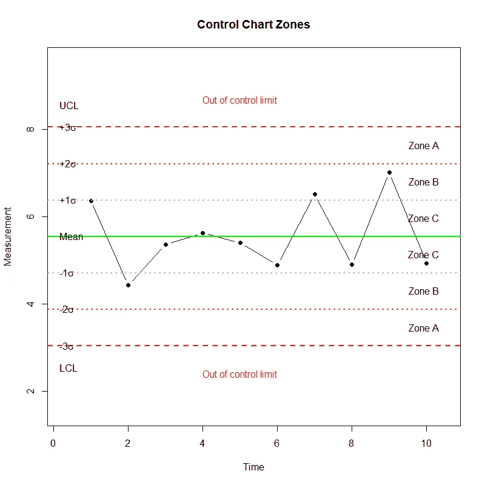
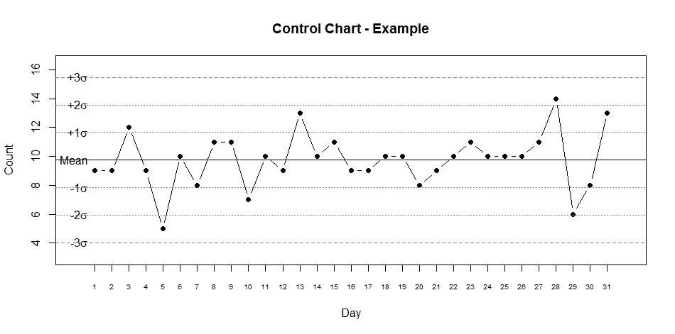

# 带 R 的过程稳定性分析

> 原文：<https://towardsdatascience.com/process-stability-analysis-with-r-9ec41ec5fc0d?source=collection_archive---------22----------------------->

## r 代表工业工程师

## 解释质量控制图

图片由 Lukas 拍摄，可在 [Pexels](https://www.pexels.com/photo/chart-close-up-data-desk-590022/) 获得

# 质量控制图

质量控制图是工程师监控一个过程是否在**统计控制下**的重要工具。它们有助于可视化变化，发现并纠正出现的问题，预测预期的结果范围，并分析特殊或常见原因导致的流程变化模式。

通过注意控制图上出现的某些类型的模式，可以在控制图上发现变化的特殊原因。为了真正抓住控制图的好处，必须认识到这种模式——以及它们在给定过程中所代表的东西——以找到变异的特殊原因背后的原因。为此，评估 8 个控制图规则来分析它们。

# 控制图区域

为了识别给定测量中的变化程度，控制图被分成平均值上下三个相等的区域。

*   **中线**:对应被分析测量的平均值。
*   **A 区**:对应于中心线以上/以下 2 sigma 到 3 sigma 的区域。
*   **B 区**:对应于中心线以上/以下一个西格玛到两个西格玛的区域。
*   **C 区**:对应于从中心线到中心线上下一个西格玛的区域。
*   **UCL(控制上限)**:对应于平均值以上的最大公差。
*   **LCL(控制下限)**:对应于平均值以下的最大公差。

为了在**统计控制**下考虑一个过程，它的大部分点必须在中心线附近，而一些点可以更接近控制极限——全部没有模式——但是没有超出控制极限。

# 控制图规则

以下控制图规则用于识别给定过程中出现变化的特殊原因(即模式):

*   **规则#1 —超出限值**:一个或多个点超出控制限值。
*   **规则# 2——A 区**:A 区或更远的连续 3 分中的 2 分。
*   **规则# 3—B 区**:B 区或 B 区以外的 5 个连续点中的 4 个。
*   **规则# 4—C 区**:平均值一侧的 7 个或更多连续点(在 C 区或 C 区以外)。
*   **规则 5——趋势** : 7 个连续的向上或向下的点。
*   **规则 6 —混合物** : 8 个连续点，c 区没有点。
*   **规则#7 —分层**:c 区 15 个连续点。
*   **规则# 8——超控**:上下交替的 14 个连续点。

# 规则关联模式和可能的原因

*   **规则 1 和规则 2** :偏离平均值很大。 ***可能*** c ***原因*** :执行工作的新操作员；错误的设置；测量误差；跳过了流程步骤；流程步骤未完成；停电；设备故障。
*   **规则#3 和#4** :平均值的小偏移。 ***可能*** c ***原因*** :原材料变更；工作指令的变更；不同的测量设备/校准；不同班次；工人获得了更多的工作经验；维护计划的变更；安装程序的变更。
*   规则五:趋势。 ***可能的*** c ***原因*** :工装磨损；温度影响(例如冷却、加热)。
*   **规则 6** :混合物。 ***可能的*** c ***原因*** :存在多个流程(如班次、机器、原材料)。
*   **规则 7** :分层。 ***可能的*** c ***原因*** :存在多个流程(如班次、机器、原材料)。
*   **规则#8** :过度控制。 ***可能*** c ***原因*** :操作员篡改；交替原材料。

虽然列出每种模式的可能原因很复杂，因为特殊原因高度依赖于过程的类型，但是上面列出的原因可以作为质量保证工程师进行头脑风暴会议的参考，以找出变化的特殊原因背后的原因。

对于下面的例子，让我们使用 R 软件分析 31 个随机点的过程稳定性控制。将对 8 条控制图规则中的每一条进行评估，以确定是否存在可归因于特殊原因引起的变化的趋势。我们来看看 R 代码！

首先，让我们从构建包含所有必要信息的数据框开始:

数据框如下所示:

接下来，让我们建立相应点的控制图:

作为第一印象，这个过程似乎在统计控制之下；所有点都位于控制上限和下限内。但是，有必要评估控制图规则，以确定数据中是否有任何趋势。

在接下来的步骤中，让我们将每个控制图规则的布尔值初始化为 true。 ***注意*** :规则#1 到#5 被分成“上”和“下”规则，这取决于被分析的图表的哪一侧。

现在让我们构建每个控制图规则逻辑背后的代码。每个数据点的每个规则评估结果(即*真*或*假*)将存储在一个新列中。

*   规则一:

*   规则二:

*   规则三:

*   规则四:

*   规则五:

*   规则六:

*   规则 7:

*   规则八:

最后一步，让我们创建控制图摘要数据框架，从最近日期开始按降序排列规则评估:

最终结果如下所示:

正如最初建议的那样，可以说这个过程是在统计控制之下的；所有数据点都位于控制范围内，并且不存在由于特殊原因导致的变化趋势。

# 总结想法

不受监控的流程无法改进。能够解释和理解质量控制图提供的信息是质量和工业工程师的一项重要任务，以识别由特殊原因产生的变化趋势。只有在它们被确定之后，过程改进的想法和项目才能在头脑风暴会议和质量圈里被计划，并最终被执行。

基于控制图规则评估数据点可能是检测过程中变化的最佳策略之一。然而，即使控制图规则在不同行业和统计学家之间可能略有不同，但它们几乎是相同的。质量和工业工程师必须精通阅读和解释质量控制图，以确保向客户交付符合其要求和规格的高质量产品。

*— —*

*如果你觉得这篇文章有用，欢迎在*[*GitHub*](https://github.com/rsalaza4/R-for-Industrial-Engineering/blob/master/Quality%20Control%20Charts/Process%20Stability%20Control.R)*上下载我的个人代码。你也可以直接在 rsalaza4@binghamton.edu 给我发邮件，在*[*LinkedIn*](https://www.linkedin.com/in/roberto-salazar-reyna/)*上找到我。有兴趣了解工程领域的数据分析、数据科学和机器学习应用的更多信息吗？通过访问我的介质* [*简介*](https://robertosalazarr.medium.com/) *来探索我以前的文章。感谢阅读。*

*-罗伯特*