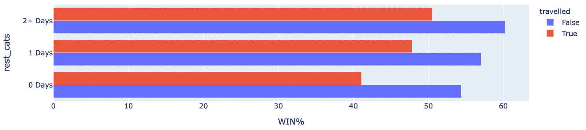

# 用 Python 处理和可视化多个分类变量——NBA 的赛程挑战

> 原文：<https://towardsdatascience.com/processing-and-visualizing-multiple-categorical-variables-with-python-nbas-schedule-challenges-b48453bff813?source=collection_archive---------6----------------------->

## 使用平行分类图和树形图来可视化、识别和比较数据中多个输入变量的影响:NBA 中的休息、旅行和主场。


可视化多个分类变量

今天，我想讨论处理、可视化和回顾分类变量的各种方法。当有多个分类变量时，处理和可视化数据可能会很棘手。

你可能见过有多种颜色和标记形状的交叉线条图，或者可能是支线剧情的网格。这些解决方案可以工作(并且工作得很好)，但是它们远不是这个特定任务的唯一可用的绘图类型，今天我们将探索一些其他的方法。

至于数据，我们将使用篮球(NBA)输赢数据。更具体地说，我们将着眼于三个据说影响篮球比赛结果的关键外部因素；主场优势，旅行，休息日。

一如既往，虽然这篇文章利用了篮球数据，但它首先是一篇数据分析和可视化的文章。因此，专门针对篮球的讨论保持在相对最小的范围内，之前的篮球/NBA 知识是不必要的(尽管*欣赏*和*鼓励*😉).

# 在开始之前

## 数据

我将代码和数据包含在我的 [GitLab repo here](https://gitlab.com/jphwang/online_articles) (在 **nba_travel_impact** 目录中)中，如果您愿意，您应该能够通过下载/克隆 repo 来轻松跟进。

## 包装

我假设您熟悉 python。即使你相对来说是新手，这个教程也不应该太难。(请在 [twitter](https://twitter.com/_jphwang) 上找到我，并告诉我您是否想要更多指导。)

你需要`pandas`和`plotly`。用一个简单的`pip install [PACKAGE_NAME]`安装每一个(在你的虚拟环境中)。

显然，你可以使用任何图形包，但我个人更喜欢你用 [Plotly](https://plot.ly/) 得到的简单和强大。

# NBA 赛程—影响

每个 NBA 常规赛在十月和四月之间进行。(例如，2019-20 赛季将在 10 月 22 日至 4 月 15 日之间举行。)在这段时间里，每支球队打 82 场比赛，平均每场比赛只有 2.15 天。比赛之间勉强算一天休息。

不仅如此，NBA 球场遍布美国和多伦多。为了平衡赛程，他们有一半的比赛要在客场进行，球队必须像乘地铁一样往返于两地之间。


所有 29 个 NBA 球场都在一张地图上

事实上，NBA 球队每年的行程大约在 60，000 到 85，000 公里(37，000-53，000 英里/年)之间，他们的飞行总的来说是这样的:


所有 30 支 NBA 球队的旅行日程-可视化

> ([我关于可视化旅行数据的文章](https://medium.com/swlh/interactive-animated-travel-data-visualizations-mapping-nba-travel-a154a2e7c18d)，以及一个[交互式的 html 版本的地图](https://demo.hindsights.io/202002_nba_travel/nba_travel_map.html))

所有这一切的结果是，旅行，比赛和休息的场地是 NBA 日程的重要组成部分。

82 场比赛中，每支球队有一半在主场进行，另一半在客场进行。甚至许多主场比赛也不总是需要休息——可能需要旅行一夜才能回来，他们甚至可能为了下一场比赛而马上离开。

对于我们这些不得不乘坐商业航班的凡人来说，这将是一场噩梦。然而，现代 NBA 球员乘坐私人团队飞机，他们的健康和福祉管理得如此之好，以至于旅行不会对他们产生重大影响。让我们找出答案。

## 加载/获取数据

在我们分析休息、比赛和主场优势的影响之前，我们需要收集或加载我们的数据。为了方便起见，我用上一季的，但是(你也可以用这一季的，或者几季的。

虽然您可以简单地加载我已经预处理过的数据(如果您愿意，可以跳到我加载`box_df`的地方)，但是如果您感兴趣的话——我是这样编译数据的:

我从[basketball-reference.com](https://www.basketball-reference.com)获得了时间表数据，你可以简单地从我的回购中加载如下数据:

```
schedule_df = pd.read_csv('srcdata/2019_nba_schedule.csv', index_col=0)
```

该数据包括 EST ( `est_time`)中的游戏提示时间，因此我创建了一个 date 列。

```
schedule_df = schedule_df.assign(game_date=schedule_df.est_time.dt.date)
```

然后，`game_dates = schedule_df.game_date.unique()`获得一个独特的比赛日期列表，之后用`basketball_reference_web_scraper`包下载我们每个日期的数据。如果你想尝试这段代码，你需要用`pip`来安装它。

我在这里做的是下载数据，将每场比赛标记为主场比赛或客场比赛，并保存数据帧。

无论如何，让我们加载一个我之前为保持一致性而准备的文件:

```
box_df = pd.read_csv('srcdata/2019_nba_team_box_scores.csv', index_col=0)
```

看一下`box_df`，你会看到它包含 2460 行，与 30 支球队的 82 场比赛相匹配，因为每一行都显示一支球队的盒子分数。

## 简单的故障

我在这里处理了数据，以包括布尔列，表示球队是否在`home`比赛，他们是否有`travelled`，以及他们是否赢了(`win`)。我还为休息日的数量创建了一个分类变量(`rest_cats`)，任何超过 2 天的都被归在一起，包括开幕日。

对于我们的第一次可视化，让我们看看有多少游戏属于休息日和旅行的每一个类别。我会跳过主客场平分，这是 50:50。

```
import plotly.express as px

# How many games in each category?
temp_grp_df = box_df.groupby('rest_cats').count().reset_index(drop=False)

fig = px.bar(temp_grp_df, y='rest_cats', x='outcome', orientation='h')
fig.show()
```


2018-19 赛季，按休息日

```
# How many games in each category? Rest days & travel.
temp_grp_df = box_df.groupby(['rest_cats', 'travelled']).count().reset_index(drop=False)
temp_grp_df = temp_grp_df.assign(travelled=temp_grp_df.travelled.astype(str))
fig = px.bar(temp_grp_df, y='rest_cats', x='outcome', orientation='h', color='travelled', barmode='group')
fig.show()
```


2018-19 赛季，按休息日&是否涉及旅行

这很简单，分类变量在这里可以简洁地表示为成组的条形。

至于产出，有几个观察要做 NBA 的时间表是这样的，大多数比赛有 1 天的休息，没有多少背靠背(0 天休息)的比赛。

即使有，也似乎主要是主场比赛(因为不涉及旅行)，这对球队来说是好事。

## 对成功百分比的总体影响

现在，让我们来看看休息和旅行对胜利的影响。这样做的代码与前面的基本相同，除了现在为每个组创建一个`WIN%`列，它成为我们的因变量。

```
travel_cats = ['rest_cats', 'travelled']
travel_grp_df = box_df.groupby(travel_cats).sum()
travel_grp_df = travel_grp_df.assign(games=box_df.groupby(travel_cats)['minutes_played'].count())
travel_grp_df['WIN%'] = travel_grp_df.win/travel_grp_df.games * 100
travel_grp_df.reset_index(drop=False, inplace=True)
travel_grp_df = travel_grp_df.assign(travelled=travel_grp_df.travelled.astype(str))fig = px.bar(travel_grp_df, y='rest_cats', x='WIN%', orientation='h', color='travelled', barmode='group')
fig.show()
```



趋势正如所料——旅行不利于获胜，多休息更好。但是，有趣的是——旅行过的队伍(红色)在休息 2 天以上的情况下赢得了几乎一半的比赛！

现在，增加这些图表的复杂性是分析开始变得具有挑战性的地方。

我们有三个分类变量，我们试图分析，我们需要选择如何可视化它们，同时也表明因变量(例如，win %)。对于条形图，一种选择是使用上面提到的支线剧情:

```
travel_cats = ['home', 'rest_cats', 'travelled']
...
fig = px.bar(travel_grp_df, y='rest_cats', x='WIN%', facet_col='home', orientation='h', color='travelled', barmode='group')
```


作为支线剧情

这很好，但是它仍然缺少相当多对我们有用的信息。例如，它没有向我们展示这些分类变量是如何重叠或相互作用的。此外，支线剧情并不容易沿着轴线进行比较。

相反，让我们探索一个平行的类别图表。

# 平行类别图

## 创造

因为它们有些不寻常，所以让我们画一个，然后讨论它们包含的内容。幸运的是，用 Plotly 绘制平行分类图相对容易。事实上，Plotly Express 只是将原始的 box score 数据帧作为参数，并根据我们传递的类别来编译数据。

看看这个简单的例子，用二进制类别表示`home`和`travelled`。

```
# PARALLEL CATEGORIES - THREE CATEGORIES AND WIN %
box_df = box_df.assign(win_num=box_df.win.astype(int))
travel_cats = ['home', 'travelled']
fig = px.parallel_categories(box_df, dimensions=travel_cats, color='win_num')
```


平行类别图—显示“家庭”和“旅行”

你可能以前没有见过很多平行分类图表。它们看起来很复杂，但是一旦你掌握了窍门，它们就非常简单。

每个垂直柱代表一个类别，每个带显示了沿着每个柱的分类变量的排列。上面的图表代表两个分类变量，我也根据结果(赢或输)将它们分开，代表三个变量。


平行类别图—显示“家庭”和“旅行”

在这里，它显示有 329 场比赛(乐队)球队在主场(左栏)，在比赛前旅行(右栏)，并取得胜利(彩色)。

图表的本质是，每增加一个类别都会增加图表的复杂性，潜在地呈指数增长。看看下面的图表，增加了休息日长度的类别。


平行类别图—显示“家”、“旅行”和“休息 _ 猫”变量。

下面的示例显示了两条高亮显示的路径。

最上面的深色路径显示了球队在客场(`home==false`)、前往比赛(`travel==true`)以及休息 2 天或更长时间(`rest_cats == 2+ Days`)的比赛*失败*的次数。

下方的黄色路径显示了相同标准的比赛数量，但是球队赢得了比赛。


平行类别图—显示鼠标悬停弹出窗口

([这里有一个互动版的这个给你试试&玩一玩。](https://demo.hindsights.io/202002_nba_travel_impact/parcat.html))

一旦我们习惯了这种格式，通过平行类别图表探索多维分类关系会令人耳目一新。在这里，每一个竖线显示了总的胜率，简单地跟随粗线揭示了强共现的位置。

举例来说，让我们来看看球队没有休息，并且旅行的比赛。这张截图突出显示了在客场比赛的球队的记录。


团队记录—出门在外，没有休息日

已经很清楚的是，损失远远大于收益。客队在这些比赛中只赢了大约 32%(总共 237 场)。

另一方面，反过来说，一个主场球队在无休日赢得了 83 场比赛中的 69%(我将把它作为一个练习——你自己看看[这里](https://demo.hindsights.io/202002_nba_travel_impact/parcat.html))。

我发现平行分类图非常有用，尤其是对于数据探索。例如，我发现这张图表非常有用，视觉效果也很突出([我为本文](/how-to-visualize-hidden-relationships-in-data-with-python-analysing-nba-assists-e480de59db50)准备了这张图表)。


我早些时候创建的一个——通过区域和助攻显示克莱的投篮(灰色:无帮助)

这张图表显示了克莱·汤普森的所有射门，按照射门位置，以及助攻来自谁。虽然最初看起来很复杂，但看看找出类别的主要组合是多么容易。如图所示，平行分类图可以很容易地发现趋势和共现。

诚然，虽然平行类别图表在某些情况下很有用，但它也有其局限性。根据我的经验，它可能需要读者做一些工作来理解正在发生的事情，并且对许多人来说，它可能是视觉上的对抗和恐吓。

另一个很好的、可能更简单的可视化这类数据的方法是树形图。

**树状图**

树形图是探索分级、分类数据集的一种奇妙方式。看一看这个例子，就知道它有多容易理解了。


一个树形图的例子( [Plotly](https://plot.ly/python/treemaps/) )

尽管树形图通常用于评估分层数据结构的影响，但它也是一个很好的工具，适用于像这样的多变量情况。

我们可以在这里生成树形图，方便地显示每个组的大小，以及随着我们越来越深入地研究每个类别，胜率的变化。

因为树状图需要层次结构，所以我们在这里通过绘制两种不同的树状图来探索:

首先，层级基于*回家/离开*、*旅行/不旅行*和*休息日*。


树状图 1:回家->旅行->休息

在第二种情况下，层级被更改为基于*回家/离开*、*休息日*和*出差/未出差*。


树状图 2:回家->休息->旅行

树形图布局很好地显示了每个子集样本大小的差异，以及颜色百分比的变化。

在这两个图中，很明显，对胜率的更大影响通常来自于休息的时间，以及仅仅是在家还是在外，而不是来自于他们是否旅行。

看看上面的图表，在第二层的方框中(标有“旅行/停留”),是主场比赛。主队在比赛前回家(即旅行)的比赛的总赢/输百分比与他们没有旅行的比赛非常相似。

在第二张图中，所有盒子在休息日的总体胜率有很大不同，例如休息日为 0 的客场比赛是最差的(正如我们前面在平行类别图中看到的)。

让我们再探讨一点，结束今天的分析。到目前为止，我们是从一个球队的角度来看这些数据的(除了主客场数据，这是一个补充)。如果对手的休息数据也是会怎么样？

出于这个原因，我得到了另一个数据集——对手的休息日被添加到`opp_rest_cats`列中。

```
box_df = pd.read_csv('srcdata/2019_nba_team_box_scores_2.csv', index_col=0)travel_cats = ['home', 'rest_cats', 'opp_rest_cats']
travel_grp_df = box_df.groupby(travel_cats).sum()
travel_grp_df = travel_grp_df.assign(games=box_df.groupby(travel_cats)['minutes_played'].count())
travel_grp_df.reset_index(drop=False, inplace=True)

chart_cats = ['home_str', 'rest_cats', 'opp_rest_cats']
home_away = pd.Series(['Home ' * i for i in travel_grp_df.home.values]) + pd.Series(['Away ' * (1-i) for i in travel_grp_df.home.values])
travel_grp_df['home_str'] = home_away
travel_grp_df['rest_cats'] = travel_grp_df['rest_cats'] + "' Rest"
travel_grp_df['opp_rest_cats'] = 'Opponent: <BR>' + travel_grp_df['opp_rest_cats'] + "'<BR>Rest"
travel_grp_df['WIN%'] = travel_grp_df.win/travel_grp_df.games * 100

fig = px.treemap(
    travel_grp_df, path=['home_str', 'rest_cats', 'opp_rest_cats'], values='games', color='WIN%', color_continuous_midpoint=50, color_continuous_scale=px.colors.diverging.Portland
)
fig.show()
```


树状图 3:主场->休息->对手休息

看那个！最佳和最差的赢/输百分比发生在其余差异最大的时候。

看看左边的“客场”统计，我们的球队休息 0 天，对手休息 2 天以上，相反，我们的球队休息 2 天以上，对手休息 0 天。他们代表了极端的对立面。这种模式一直存在，休息的差异是获胜几率的一个重要因素。

即使主队背靠背，他们平均也能击败其他背靠背的球队，显示了家常菜的价值。最中立的安排似乎是让主队背靠背，而客队长时间休息。

那不是很有趣吗！？事实证明，旅行是一个相对较小的因素，赢/输百分比的最大因素是休息差和主场/客场。通过这些树形图很容易发现这一点。

总而言之，我希望以上展示了一些有用的例子和技术，用于钻取包含多个分类变量的数据集。

在我看来，平行分类图和树形图是这样做的有用工具，也是潜在未被充分利用的工具。

当数据被细分时，树形图在可视化数据方面是有效的，在属性的向下钻取和变化方面，而平行类别图在识别数据点的同现和流动方面是极好的。用你自己的数据集来尝试这些，我很乐意听到更多关于它们的信息。

如果你喜欢这个，请说👋/关注 [twitter](https://twitter.com/_jphwang) ，或点击此处获取更新。我还写了这篇关于使用 Plotly 绘制 NBA 旅行数据的文章，如果你以前没有读过的话:

[](https://medium.com/swlh/interactive-animated-travel-data-visualizations-mapping-nba-travel-a154a2e7c18d) [## 交互式和动画旅行数据可视化—绘制 NBA 旅行地图

### 了解如何使用 Python 和 Plotly 创建位置和路径数据的精彩互动和动画可视化。

medium.com](https://medium.com/swlh/interactive-animated-travel-data-visualizations-mapping-nba-travel-a154a2e7c18d) 

还有这篇关于我最喜欢的数据可视化书籍的文章。

[](/create-impactful-data-visualizations-with-these-books-ca9fbfecfde5) [## 用这些书创建有影响力的数据可视化

### 如果没有交流，好的分析没有什么意义。数据可视化会有所帮助。以下是我对…的建议

towardsdatascience.com](/create-impactful-data-visualizations-with-these-books-ca9fbfecfde5) 

谢谢，下次再见！