# 在 Python 中用 Unicode 处理文本

> 原文：<https://towardsdatascience.com/processing-text-with-unicode-in-python-eacc226886cb?source=collection_archive---------22----------------------->

## 数据科学家的最佳实践

照片由 [Kayla Kozlowski](https://unsplash.com/@kaylamkozlowski?utm_source=medium&utm_medium=referral) 在 [Unsplash](https://unsplash.com?utm_source=medium&utm_medium=referral) 上拍摄

我们能够阅读这些文本行，因为我们熟悉英语中使用的 26 个字符的拉丁字母。其他语言有他们自己的字符，他们都需要被编码，这样他们就可以被我们的计算机所代表。几十年来，计算机能够根据 ASCII 码表来表示字符。

## ASCII 表

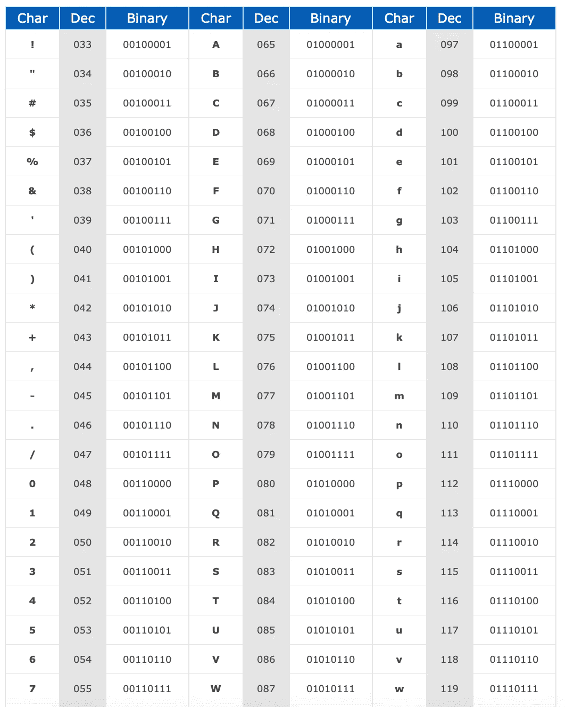

ASCII 是一种在 8 位代码的 256 个可用位中分配字母、数字和其他字符的标准。对于不使用拉丁字母的语言，如汉语、希腊语、日语，ASCII 无法表示这些文本，我们需要一个新的字符集。它们是 Unicode。

## Unicode 表

Python 中的文本可以用 unicode 字符串或字节表示。

## 编码 unicode 字符串

让我们在 Python 中定义一个`string`，看看它的类型。

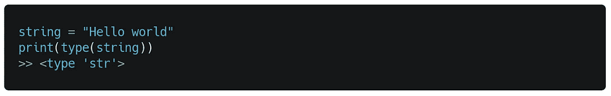

它确实是一个`str`类型的对象或者一个字符串。如果我们定义一个字节。*(我们可以用* `*bytes*` *函数将字符串转换成字节对象)*。

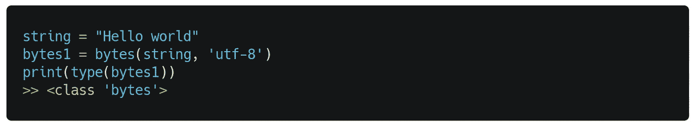

我们尝试定义一个包含非 ASCII 字符的 byte 对象(中文*“Hello，World】*)。

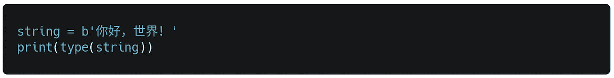

我们可以用前缀 b 定义一个字节

它显示了一个错误，告诉我们需要先将包含非 ASCII 字符的字符串转换成 bytes 对象。

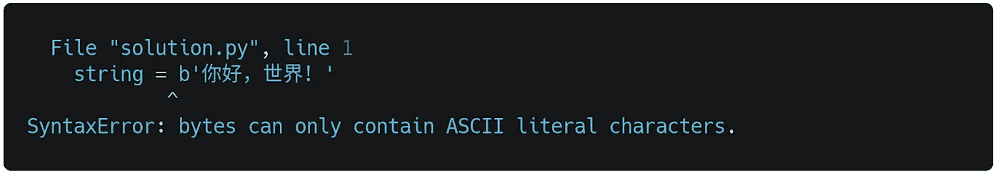

我们将需要提供和编码来做到这一点如下。

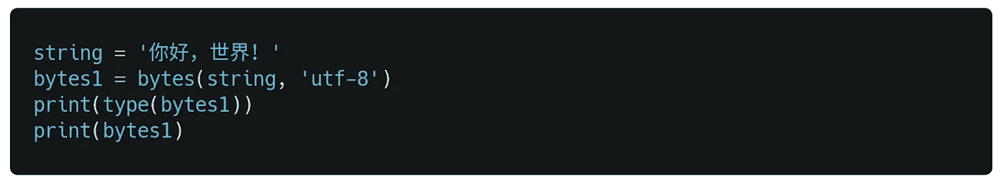

这部分代码的结果如下图所示。

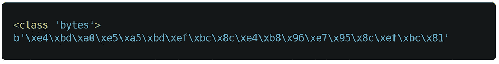

处理编码的一个更好的方法是使用`encode()`函数。

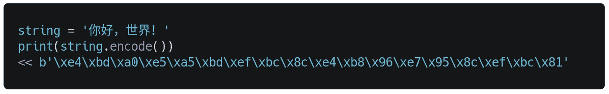

正如你所看到的，我们得到了和以前一样的结果。

> 请记住，默认情况下，Python 3 使用 utf-8 编码。

因为 Python 3 默认使用`utf-8`，所以我们应该如何使用不同的编码，我们简单地把它传递给函数。例如，我们可以如下编码`utf-16`中的`‘hello world’`字符串。

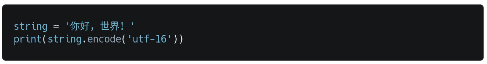

## 解码字节

Unicode 字符串可以用一些预定义的编码方式编码成字节，比如`utf-8`、`utf-16`等。字节可以解码为 unicode 字符串，但这可能会失败，因为在特定的编码中，并非所有的字节序列都是有效的字符串。

> 没有简单的方法来确定在字节串中使用什么类型的编码。

unicode 和字节之间的转换通过`encode()`和`decode()`函数完成。我们尝试做相反的操作，解码字节对象，如下所示。

没有简单的方法来确定在字节串中使用什么类型的编码。

因此，我们需要提供正确的编码(utf-8、utf-16 等。)到解码方法

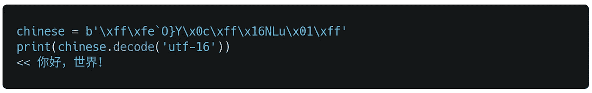

## 正则表达式模式

请记住，正则表达式模式也适用于非拉丁字符。在这里，我们如何删除 US-ASCII 字符范围之外的字符？

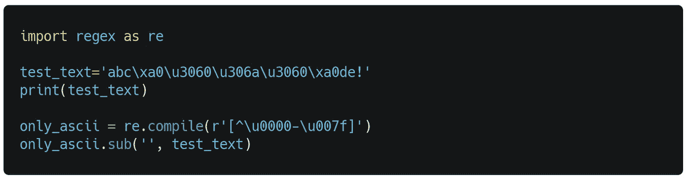

这部分代码的结果如下图所示。

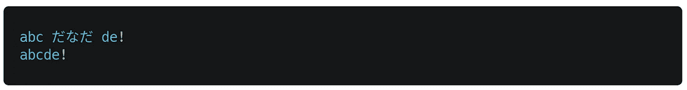

## 从 csv 文件中读取 UTF 8 编码的数据

下面的例子演示了如何用 Python 从 csv 文件中读取`“utf-8”`编码的数据。

很简单，对吧？这完全是关于用 Python 中 Unicode 处理文本。

## 参考

[1][https://www.ascii-code.com](https://www.ascii-code.com)

[2][https://home.unicode.org](https://home.unicode.org)