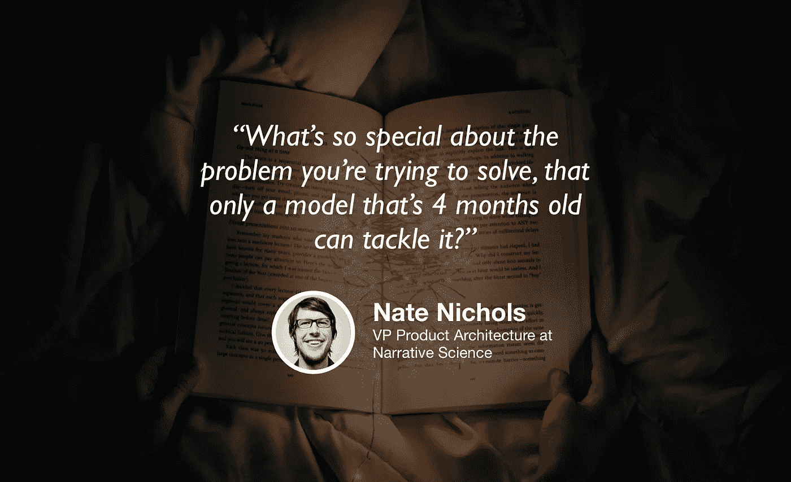

# 产品直觉和数据叙事

> 原文：<https://towardsdatascience.com/product-instinct-and-data-storytelling-ce0a216249e6?source=collection_archive---------28----------------------->

## [苹果](https://podcasts.apple.com/ca/podcast/towards-data-science/id1470952338?mt=2) | [谷歌](https://www.google.com/podcasts?feed=aHR0cHM6Ly9hbmNob3IuZm0vcy8zNmI0ODQ0L3BvZGNhc3QvcnNz) | [SPOTIFY](https://open.spotify.com/show/63diy2DtpHzQfeNVxAPZgU) | [其他](https://anchor.fm/towardsdatascience)

## 内特·尼科尔斯在 [TDS 播客](https://towardsdatascience.com/podcast/home)

*编者按:迈向数据科学播客的“攀登数据科学阶梯”系列由 Jeremie Harris、Edouard Harris 和 Russell Pollari 主持。他们一起经营一家名为*[*sharpes minds*](http://sharpestminds.com)*的数据科学导师创业公司。可以听下面的播客:*

如果说有一个趋势是，在进入 2020 年之前，似乎没有足够多的数据科学家关注，那就是:数据科学家正在成为产品人。

五年前，情况完全不是这样:数据科学和机器学习风靡一时，经理们对花哨的分析和过度设计的预测模型印象深刻。今天，一剂健康的现实已经到来，大多数公司都将数据科学视为达到目的的手段:它是改善真实用户和真实付费客户体验的方式，而不是一种冷静自圆其说的神奇工具。

与此同时，随着越来越多的工具不断让非数据科学家的人构建和使用预测模型变得越来越容易，数据科学家将不得不擅长新事物。这意味着两件事:产品本能和数据故事。

这就是为什么我们想与 Nate Nichols 聊天，他是一名数据科学家，后来成为叙事科学公司(Narrative Science)的产品架构副总裁，该公司致力于简化数据通信。内特也是《让你的人成为人》的合著者，这是一本关于数据故事的(免费)书。他有很多很棒的见解要分享，以下是几个重要的亮点:

*   大学不是学习如何解决产品问题的地方，因为学术研究倾向于强调工具而不是理解用例。你可能从硕士毕业时就有了预测建模的坚实基础，但是根本不知道如何决定你应该首先做什么样的。
*   数据叙事是一项至关重要的技能。你可以对你的数据进行出色的分析，但是如果你不能向你的经理解释你的结果，你就不能为公司增加价值。
*   例如，招聘经理注重讲故事，通常看重你描述自己思维过程的能力，以及用高于之前工作附加值的客观指标的数据进行论证的能力。这很重要。
*   好的讲故事能力不是任何人与生俱来的；这需要练习。写博客，在当地会议上做报告，或者在 youtube 上录制一段讲解视频——然后，寻求反馈。训练和验证不仅仅针对机器学习模型😉
*   你不能把交流和解释分开。如果你发现你很难向其他人解释你的最新项目，注意他们在哪里感到困惑:很有可能，你自己的想法中也有需要填补的漏洞。

你可以在 Twitter [这里](https://twitter.com/ndnichols)关注内特，或者在 LinkedIn [这里](https://www.linkedin.com/in/nate-nichols/)关注他。

## [夹子](https://www.youtube.com/watch?v=qtoBUdVn5D4)

[youtube.com](https://www.youtube.com/watch?v=qtoBUdVn5D4)

我们正在寻找能与我们的观众分享有价值的东西的客人。如果你碰巧知道谁是合适的人选，请在这里告诉我们:[publication@towardsdatascience.com](mailto:publication@towardsdatascience.com)。