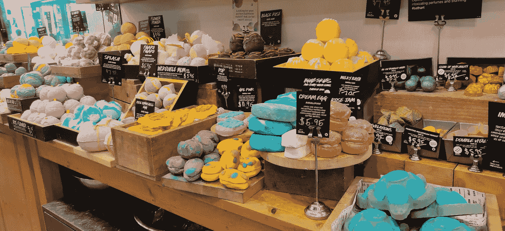
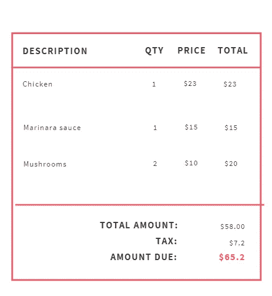
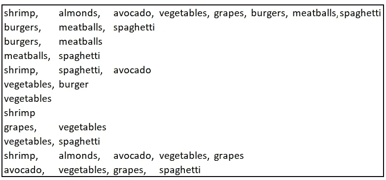

# 基于关联规则学习的产品布局、定价和促销策略

> 原文：<https://towardsdatascience.com/product-placement-pricing-and-promotion-strategies-with-association-rule-learning-d37f2b70d29e?source=collection_archive---------20----------------------->

实体店中的产品植入在购买量中起着重要的作用

## 使用 Apriori 算法提供产品推荐、产品放置、定价和捆绑策略

想象一下，如果我们能够了解客户的下一次购买会是什么！想象一下，如果我们能够发现购买行为的模式，并将其用于我们的优势！未来的钥匙在历史中！

> 市场购物篮分析有助于零售商根据大量交易确定目录中各种产品之间的关联。这些信息可用于推动产品定价、捆绑和投放。

想象一下，你有一家超市，你想增加产品的销量。您希望根据顾客购物车中的商品或他们之前购买的商品，为顾客提供购买商品的建议。你甚至可能想推荐随产品一起购买的最受欢迎的商品。

交易数据可能是洞察的金矿

分析的第一步是收集数据。所以你在你的商店里找出了过去一年的大量交易记录。每笔交易的兴趣点是购买的物品。

有些交易可能非常罕见。例如，有多少人会在一次交易中购买面包和一把剪刀？我敢说没几个人值得麻烦。另一方面，一起购买面包和黄油的交易数量肯定是一个非常大的数字，因为人们很有可能会购买黄油和面包一起吃。因此，我们可以这样把面包和黄油联系起来:

> **如果**一个人买**面包**、**，那么**一个人可能会买**黄油**。

在交易历史中可能会出现许多这样的产品组合。

然而，要使产品之间有很强的关联，这些组合必须经常被购买。为了不在罕见的组合上浪费时间，可以设置截止频率、 ***、f*** 、。算法中不考虑出现次数少于 *f* 的任何项目组合。这个最小频率 *f* 叫做 ***支持*** 。

> 支持=项目组合在所有交易中出现的次数/交易总数

在根据项目组合的频率过滤事务之后，我们剩下的是具有更高频率的事务。在这些交易中，如果你想在两个项目之间建立一个关联规则，比如说面包和黄油*、*，你还想确定在所有面包和黄油的组合中*、*至少出现了一定的次数。这个频率叫做 ***信心*** *。*

> 置信度= i1 和 i2 在所有事务中出现的次数/i1 出现的事务数
> 
> 注意:如果两个项目同时出现的置信度很低，那么任何包含这两个项目的组合的置信度也会很低。

如果面包和剪刀不是很频繁的一起买，那么直觉上剪刀、面包和鞋子也不会买的那么频繁。这是根据子集频率消除许多组合的基础。

现在，您有了一组事务，其中只有那些具有足够大的支持度和置信度的项目组合才会出现。

让我们看看这在实践中是如何工作的。让我们看看下面的 12 笔交易:

交易清单样本

从上面的列表中，我们看到蔬菜和葡萄，以及意大利面和肉丸被频繁购买(分别是 12 次中的 4 次和 12 次中的 3 次)。

让我们通过 Apriori 算法找出这样的产品关联。
首先要设置的是支撑。假设只考虑那些在交易中至少出现 3 次的项目。让我们用 S(item)来表示对一个项目的支持。

S(虾)= 4
S(杏仁)= 2
S(牛油果)= 4
S(蔬菜)= 7
S(葡萄)= 4
S(汉堡)= 4
S(肉丸)= 4
S(意大利面)= 6
这就排除了杏仁，因为杏仁的支持度只有 2。

让我们试着在意大利面和肉丸之间建立一种联系。为此我们需要树立信心。让我们把它设为 0.35。这意味着至少 35%有意大利面的交易必须有肉丸。让我们定义两个项目 C(项目 1，项目 2)的置信度。

我们知道 C(item1，item2) = S(item1，item2)/Support(item1)

C(意大利面、蔬菜)= 3/6 = 0.5
C(意大利面、汉堡)= 2/6 = 0.33
C(意大利面、牛油果)= 3/6 = 0.5
C(意大利面、葡萄)= 2/6 = 0.33
C(意大利面、肉丸)= 3/6 = 0.5
C(意大利面、虾)= 2/6 = 0.33

基于我们选择的信心，意大利面似乎与蔬菜、鳄梨和肉丸有很强的联系。

## 但是我们能说置信度越高，产品之间的关联就越强吗？

置信度可能是一个有偏差的度量，因为它只考虑一个组成项目的支持度。为了解释膨胀的信心，我们使用 Lift。升力是指物品组合的支撑与组合中单个物品支撑的乘积之比。

> 升力=支撑(i1，i2)/((支撑(i1)*支撑(i2))

很自然，项目组合的提升越高，项目之间的关联就越高。

现在让我们重新考虑意大利面与其他项目的关系。让我们将两个项目的提升表示为提升(项目 1、项目 2)。

L(意大利面、蔬菜)= 3/(7*6) = 0.071
L(意大利面、汉堡)= 2/(4*6) = 0.083
L(意大利面、牛油果)= 3/(4*6) = 0.125
L(意大利面、葡萄)= 2/(4*6) = 0.083
L(意大利面、肉丸)= 3/(4*6) = 0.125
L(意大利面、虾)= 2/(4*6)

基于 Lift，我们看到意大利面和蔬菜之间的关系并不像信心所显示的那样紧密。意大利面和鳄梨、意大利面和肉丸之间的联系最为紧密。
类似地，可以在任意数量的项目之间建立关联。

根据我们的计算，我们如何改进我们的营销工作？

1.  **植入式广告:**植入式广告有两种方式。放置相关产品的一种方法是将这些产品放在彼此靠近的位置，这样顾客就不需要看其他地方了。
    如果你想让顾客在拿到想要的商品之前冲动购物，那么就让这两件商品在商店里尽量远离。
    比如*尽量保留意大利面和肉丸*，让顾客穿过所有其他过道从意大利面过道走到肉丸过道。当他们经过不同的通道时，顾客可能想要购买他们以前没有计划购买的物品。
2.  **产品促销和定价:**从上面的练习中，我们发现意大利面与肉丸和鳄梨有着密切的联系。为了推广这种组合，可以提供意大利面和肉丸/意大利面和鳄梨组合的促销优惠。可以对相关联的商品进行捆绑定价，这样客户就会有兴趣购买产品捆绑包，而不是单个商品。

## 摘要

Apriori 算法用于确定在多次交易中购买的商品之间的潜在关系。用于建立项目-项目关联的三个关键指标是:
1 .支撑
2。信心
3。电梯

举例来说，已经使用了 2 项组合，但是如果它们通过了最低支持和置信水平，也可以建立更大的组合(3 项及以上)。

## **参考文献:**

阿格拉瓦尔河和斯里坎特河(1994 年 9 月)。挖掘关联规则的快速算法。在*过程中。第 20 国际。糖膏剂超大型数据库，VLDB* (第 1215 卷，第 487–499 页)。