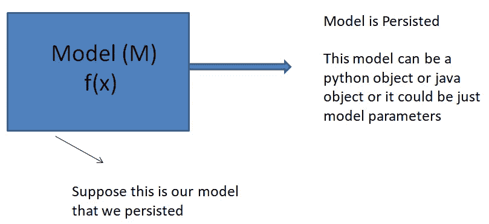
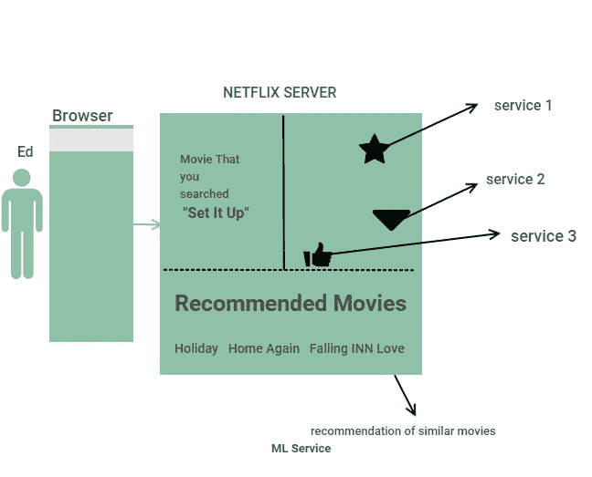
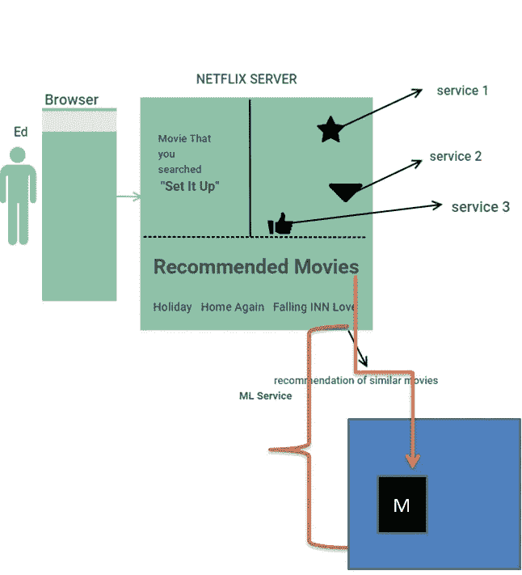

# 机器学习模型的生产和部署——III

> 原文：<https://towardsdatascience.com/production-and-deployment-of-machine-learning-models-iii-66e2bff419bb?source=collection_archive---------34----------------------->

## **为执行端到端预测而实施的架构框架。**

为了建立一个不折不扣的机器学习系统，在这里我们获取数据，训练我们的模型，然后部署模型为客户服务，我们需要一个适当设计的架构。我们应该直接探索一些重要的设计架构。

我们将触及所有的结构，并详细阐述我工作的那个。但首先我想直观地解释一下这个操作。

假设总的来说，人们现在已经对模型构建过程有了一个公平的理解。我假设我们已经训练和测试了我们的模型，结果是模型(M)。这是我们将坚持的模式。

**你说的模型持久性是什么意思？**

模型持久性意味着将模型保存到磁盘上。

简单地说，模型持久化意味着将你的模型保存到磁盘上。

技术定义:模型持久性是保存和加载机器学习模型的能力。希望有一种方法来保持模型以供将来使用，而不必重新训练。

Pickle 和 Joblib 是您在模型持久化过程中经常会听到的术语。

您可以将您的模型称为持久 python 对象。您可以将此文件存储到硬盘或固态驱动器中。

此时，模型保存在磁盘上。下一步是部署模型。

简单来说，部署的意思是您的模型如何与公司或组织架构中的其余系统进行交互，这听起来很模糊！坚持住…

绿色的大圆圈是公司已经实施的系统架构。两个深灰色圆圈代表该架构中的对象。这些对象可以是运行不同服务的单独的盒子，其中一个特定的盒子是存储我们的模型的地方，用红色表示。

没有什么比一个例子更能让人们参与到这个主题中来了。

今天，你厌倦了那些恼人的自助餐厅谈话(他们总是关于谁在做什么，左对右和上帝！人们确实有自己的看法，坦白地说，我对几乎所有事情都不感兴趣。你回到家，坐在床边舒适的椅子上休息，几分钟后，你决定去看电影。你打开浏览器，输入网飞。当它打开你想看的电影时，你会在底部看到 5-6 部类似电影的推荐。页面除了推荐你的电影还有很多东西。

我不能使用实际的网飞页面来举例说明。但我会尽力给你足够的见解，让你开始明白这一切。

你打开浏览器，输入了网飞的地址。当网飞打开你选择的电影时，页面也有其他细节(它有一个加入和订阅，它在侧边栏上有另一个菜单和一些更多的选项。这是当你点击网站时发生的事情，网站连接到它的服务器，服务器上运行着许多服务，这些服务对页面有贡献。服务器将连接到一种服务类型的数据库，加入和订阅将通过不同类型的服务来执行，类似地，您将在底部获得的**类似电影**(作为推荐)将通过连接到**服务器的 **ML 服务盒**来执行。**所有这些服务同时运行，为您提供结果。

在上图中，你可以认为一个星形或三角形是不同的服务，在页面底部也是相似的电影，尽管系统上运行着 **ML 服务**。一个页面有许多部分，对于每个部分，它将调用不同的服务并获取数据。web 服务器将从各种服务中提取数据，并对其进行整理以生成页面。在我们的例子中，将有一个 m1 的这样的服务，它是推荐相似电影的服务(推荐系统)。

这个服务像其他服务一样运行在不同的机器上，它不会在实际的服务器上。它将位于运行模型“M”的系统中。服务器从盒子中调用类似的电影服务。它将向该服务发送一个请求(向它所在的框发送，考虑图中的蓝色框)，该服务将使用类似的电影进行响应，以占据页面上的特定空间。这更像是面向服务的架构。

**设计方法**

这是一种方式，我们部署我们的模型。该模型在一个盒子上运行，我们将带有数据的请求(我们称之为特征化数据的数据，前面讨论过)推送到盒子，它将响应一个结果(可能是类似产品、电影、预测价格等的推荐)。).

对于请求，服务器；发送请求的服务器和给出输出的 ML 服务器就数据的格式达成一致(格式对流程至关重要)。

这就是所发生的事情，目的是给你直觉，我将在后面详述这些部分。

我讨论的方法是一个 Web API 方法。在这种方法中，模型被离线训练和持久化，然后被上传到一个 web 应用程序中，当客户端将关于给定电影的细节发布到 rest API 时，该应用程序可以给出类似电影的实时预测。这是一种类型的架构，它需要更多的细节，但目前重要的是理解这个想法。

一种方法是离线训练你的模型，然后作为一个请求，例如，客户将上传一个包含输入细节的电影 CSV 文件，然后等待一段时间，等待一封电子邮件或一条消息告诉他们检查网站的结果。这个应用程序将使用异步任务队列执行批量预测，这些结果将保存到一个共享数据库中，然后 web 应用程序可以访问该数据库来显示结果。

您也可以创建自己的示例，尝试使用 amazon 页面，该页面有如此多的服务，从订单详细信息按钮到产品详细信息，再到购买此产品的人也购买了这些产品，并尝试围绕它构建部署理念，我相信您能够理解。

请在评论中给出一些有价值的反馈，以便我改进。谢谢你。