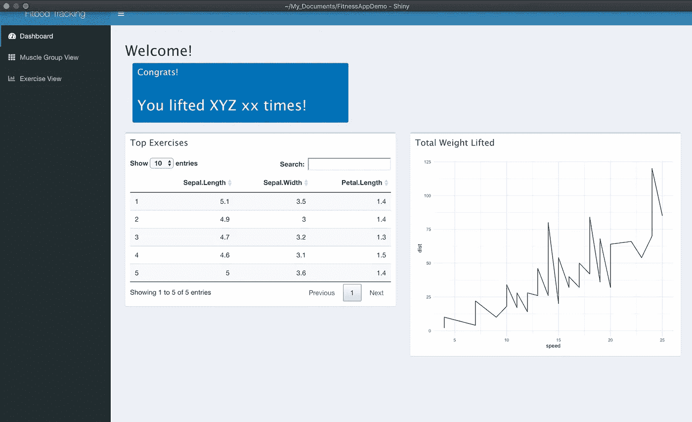

# 生产级 R 闪亮假人:原型制作

> 原文：<https://towardsdatascience.com/production-grade-r-shiny-with-golem-prototyping-51b03f37c2a9?source=collection_archive---------17----------------------->

## 使用假人软件包从头开始制作一个健身应用程序


本教程结束时您的仪表板|作者图片

这是一个激动人心的时代，成为一名开发者——R Shiny 正被越来越多地采用，让数据科学家制作快速、漂亮的 web 应用程序来共享数据，甚至提供面向公众的数据产品和仪表板访问。R Shiny 让非 web 开发人员快速启动并运行应用程序，但也让数据科学家和数据分析师在依赖性管理、可再现性、测试和部署责任方面成为 web 开发人员或软件工程师。随着 R Shiny 在各个领域的采用，一个全新的 *production Shiny* 工具已经开发出来，以帮助应对开发由数据科学家和非 web 开发人员创建和维护的健壮、可持续和可复制的 R Shiny 应用程序的挑战。事实上，我认为即使你不认为你的应用程序是真正的*产品*或*软件*，你也可以从在你的开发工作流程中使用闪亮的产品工具中获益。

在本教程中，我将介绍使用一个名为[假人](https://thinkr-open.github.io/golem/index.html)的新包在开发中启动并运行 R Shiny 应用程序的基础知识，该包是专门为开发生产就绪的 R Shiny 应用程序而设计的自以为是的框架。出于本教程的目的，我们的客户是我，我们将专注于构建一个举重应用程序的原型。

在本教程中，您将学习:

*   用户访谈和原型制作的基本思想
*   基本线框绘图
*   如何使用 [shinipsum](https://github.com/ThinkR-open/shinipsum) 包让 R 中的工作原型充满填充文本和演示图形

# 第 1 部分:需求收集和线框图

## **用户访谈**

您可能想知道为什么这个部分在这里——来吧，看看代码！好吧，在我们开始在 R 中混日子之前，我们可能应该花点时间弄清楚我们要做什么！这可能是所有开发步骤中最被低估的一步:实际定义我们想要构建什么。幸运的是，假设这个应用程序的用户是我(或我们)，这应该是一个非常简单的用户访谈！

*核心功能*

*   从 [Fitbod](https://www.fitbod.me/) 上传更新的导出数据(我在那里生成并跟踪我的锻炼)
*   记录我在一段时间内提升了多少重量，让我有成就感
*   跟踪我在不同锻炼中每次锻炼的总运动量
*   追踪我在不同训练中预计的 1 次重复最大值
*   追踪我每个*肌肉群*举起了多少

## **线框**

在我们开始编码之前的最后一步，我保证。我们将快速(手动)勾画出我们要建造的东西，这样我们就知道我们要做什么了。如果你愿意的话，有很多很酷的交互模型工具，但是我们现在要保持简单，只是把它画出来。我在平板电脑上画出了这个，但是笔和纸也可以。

首先，让我们画出我们想要的主仪表板页面和数据上传的样子:


带有数据上传弹出框以及仪表板页面上的图表和列表的仪表板的绘图。作者照片。

我们还可以绘制另外两个选项卡，以包含在我们的用户访谈中概述的特定运动统计数据和肌肉群统计数据的内容。


(**顶部)**一个选项卡的绘图，允许选择一个练习，最大投影 1 个重复和两个图形。| ( **底部)**允许用图形和表格选择肌肉群的标签的绘图。作者照片。

# 第 2 部分:假人入门

## 创建和设置应用程序

与假人一起启动一个项目看似简单。首先，确保你已经用你的老朋友`install.packages('golem')`安装了它。

安装 golem 后，你应该可以在 RStudio 菜单中进入“文件”->“新目录”->“使用 golem 打包闪亮的应用程序”。

您也可以通过在 RStudio 控制台中键入`golem::create_golem("projectName")`在命令行上创建您的项目。

从这里，假人将打开大量的文件，让你去！让我们从编号为 1.1 的评论处的`dev/01_start.R`开始。继续操作，在`golem::fill_desc()`函数中填写您的姓名、包名等。我更喜欢提前设置我的回购，所以我将在 GitHub 上创建一个空的回购，并在这里输入 URL。

现在让我们打电话给`golem::set_golem_options()`来安排这一切。我们还将保留注释“1.2-设置公共文件”中的所有内容，就像现在一样。

我们现在将运行`golem::use_recommended_tests()`来为单元测试添加一个文件夹，稍后我们可以使用 [*testthat*](https://testthat.r-lib.org/) 来添加。测试允许您自动化您用来确保您的代码正确工作的过程。为什么应该使用单元测试？嗯，这个说的很好:

> 我开始使用自动化测试，因为我发现我花了太多的时间重新修复我以前已经修复过的 bug。在编写代码或修复错误时，我会执行交互式测试以确保代码正常工作。但是我从来没有一个系统可以存储这些测试，这样我就可以在需要的时候重新运行它们。我认为这是 R 程序员的普遍做法。不是你不测试你的代码，而是你不自动化你的测试。
> 
> 由哈德利·韦翰和詹妮弗·布莱恩创作

现在我们运行`golem::use_recommended_deps()`来添加假人推荐的依赖项。这些是您在开发过程中几乎肯定会用到的包。

我还将运行`golem::use_utils_ui()`和`golem::use_utils_server()`，因为我从来不会拒绝一些我以后可能需要的很好的预写函数。这些并不是绝对必要的，但是它们为一些常见的任务增加了一些功能，可能会帮到我们。

这样，我们就可以开始原型制作了！

## 使用 shinipsum 构建 UI 原型

还记得我们想画的画吗？好了，现在是时候看看当我们实际上试图使它闪闪发光时，它是否看起来很好！

原型是一种很好的方式，可以在你完成构建之前检查你的用户需求。当人们可以看到一个应用程序的样子并玩它时，即使它还没有最终的信息，他们也会澄清他们想要什么，因为他们意识到应用程序缺少一些东西，或者他们不喜欢或不想要他们认为必不可少的功能。

我们将尝试傀儡世界的一个有趣的新部分来做我们的原型:`{shinipsum}`

像往常一样，我们将开始安装它:`install.packages('shinipsum')`，我们会让傀儡知道我们将使用它与`usethis::use_package("shinipsum")`。

让我们开始原型制作吧！

如果我们回头看看我们的图表，我们会看到我们实际上有三个选项卡(我没有计算让我们的用户上传数据的初始弹出窗口)。

这意味着有三个模块，每个页面一个，可能是一个好的开始。

让我们使用 golem 创建我们的第一个模块！在您的 R 终端中，您可以使用 golem 的功能直接添加模块基础设施:

`golem::add_module(name = 'Home')`

现在让我们添加其他模块:

`golem::add_module(name = 'Exercises')`

`golem::add_module(name = 'MuscleGroup')`

酷-我们有两个模块！让我们按照新创建的模块中所说的那样做，并在主 UI 和主服务器中添加对这些模块的引用，这样应用程序就知道要调用它们。一旦你将这些块粘贴到了`R/app_ui.R`和`R/app_server.R`文件中的正确位置，就可以随意删除模块文件底部的注释块。

现在让我们回头看看第一页的绘图，开始制作我们的模块。


显示占位符文本、图形和表格的仪表板线框。|作者图片

嘿，导航部分看起来很重要，所以让我们先关注它。我们希望这看起来很漂亮，所以我们要拿出华丽闪亮的 UI 设计的大枪:

```
install.packages("shinydashboard")
install.packages("shinydashboardPlus")
usethis::use_package("shinydashboard")
usethis::use_package("shinydashboardPlus")
```

我们将把侧边栏放在我们的主`R/app_ui.R`文件中，因为我们希望它在我们所有的页面上都可见。现在请听我说，因为这将会是一段疯狂的 UI 代码之旅。

```
app_ui <- function() {
  tagList(
    # Leave this function for adding external resources
    golem_add_external_resources(), # Define this page as a dashboard page to signal we're using the     dashboard page format
    shinydashboardPlus::dashboardPagePlus(

      header = shinydashboardPlus::dashboardHeaderPlus(
        title = "Fitbod Tracking Dashboard",
        enable_rightsidebar = FALSE
      ), # Create our navigation menu that links to each of the tabs we defined
      sidebar = shinydashboard::dashboardSidebar(
        shinydashboard::sidebarMenu(
          # Setting id makes input$tabs give the tabName of currently-selected tab
          id = "tabs",
          shinydashboard::menuItem("Dashboard", tabName = "dashboard", icon = icon("dashboard")),
          shinydashboard::menuItem("Muscle Group View", icon = icon("th"), tabName = "mg"),
          shinydashboard::menuItem("Exercise View", icon = icon("bar-chart-o"), tabName = "ev"
          ))
      ),# Show the appropriate tab's content in the main body of our dashboard when we select it
      body = shinydashboard::dashboardBody(
        shinydashboard::tabItems(
          shinydashboard::tabItem("dashboard", mod_Home_ui("Home_ui_1")),
          shinydashboard::tabItem("mg", mod_MuscleGroup_ui("MuscleGroup_ui_1")),
          shinydashboard::tabItem("ev", mod_Exercises_ui("Exercises_ui_1")
          )
        ) 
      ),
      rightsidebar = NULL,
      title = "FitBod App Monitoring Dashboard"
    )
  )
}
```

只是为了好玩，让我们也添加一些东西到我们的每个模块页面，这样我们就可以知道我们的导航是否正常工作。

在每个`R/mod_TABNAME_ui.R`文件中，添加一条线来表示哪个标签显示在`tagList(`之后

例如:

```
mod_Home_ui <- function(id){
  ns <- NS(id)
  tagList(
  h1("Welcome HOME!")
  )
}
```

现在让我们看看这是否可行！如果你是一个更有经验的 Shiny 开发者，你可能已经注意到我们没有在任何地方采购我们的模块，并且在我们的任何脚本上都没有“运行应用”按钮。这些部分都集成到了假人的基础设施中！那么，我们如何运行我们的应用程序呢？让我们导航到`dev/run_dev.R`脚本。

哎，那个`run_app()`命令好眼熟啊！因为我们在 golem 中将我们的应用构建为一个包，所以我们在自己的包之外运行`run_app()`函数。让我们继续运行这个脚本吧！

假设一切正常，我们应该会看到这样的内容出现:


带有侧边栏和文本“嗨，我是肌肉群标签”的仪表板|作者照片

太棒了。让我们现在开始充实这些页面。

所以让我们使用`{shinipsum}`，这样我们现在就不用担心数据了。我们将需要好的旧的`{ggplot2}`，所以如果你没有安装它，请安装它，并记住在你的 R 终端使用命令`usethis::use_package("ggplot2")`，这样 golem 知道当它运行我们的应用程序时加载这个包。

在我们的`R/mod_Home.R`文件中，我们可以改变占位符文本，使其看起来更像我们期望看到的，并添加占位符图形和表格。

一些注意事项:

*   当你在 golem 应用程序中调用函数时，你需要确保使用`::`符号附加包。这无论如何都是一个好的实践，因为它确保了当函数名称冲突时，您使用的是正确包中的正确函数。
*   我们使用了`shinydashboard::box()`函数以最少的工作给我们提供了漂亮的格式化盒子——这是这些包的一大优点！
*   Shinipsum 为我们提供了自动的假数据来绘制图表，因此我们还不必担心我们的数据。
*   我们正在使用模块，所以我们需要在输出标签周围使用`ns()`,这样我们的命名空间才能正常工作。

```
mod_Home_ui <- function(id){
  ns <- NS(id)
  tagList(
    fluidPage(
      fluidRow(
        column(width = 5,
          h2("Welcome!")),
          br(),br(),br()
        ),
      fluidRow(
        column(width = 10,
          shinydashboard::box(
            background = "blue",
            h2("You lifted XYZ xx times!"),
            title = "Congrats!"),
              br(), br(), br(), br()
          )),
      fluidRow(
          shinydashboard::box(
                 title = "Top Exercises",
                 width = 6,
                 DT::dataTableOutput(ns('data_table'))),
          shinydashboard::box(
            title = "Total Weight Lifted",
            width = 6,
            plotOutput(ns("plot"))
      )
    )
  )
  )
}mod_Home_server <- function(input, output, session){
 ns <- session$ns

 output$data_table <- DT::renderDT({
   shinipsum::random_DT(5, 3, "numeric")
 })

 output$plot <- renderPlot({
   shinipsum::random_ggplot(type = "line")
 })
}
```

现在，如果您再次运行您的应用程序(记住，我们现在从`dev/run_dev.R`脚本中执行此操作),它应该看起来像这样:



一个仪表板，带有一个包含占位符文本的框、一个包含随机数据的占位符表格和一个包含随机数据的占位符图形。|作者照片

那看起来好多了！是时候完成另外两个标签的原型了。记住，我们的运动和肌肉群选项卡应该是这样的(根据我们的线框):


显示占位符文本、图形和表格的“锻炼”选项卡和“肌肉群”选项卡的仪表板线框。|作者图片

幸运的是，我们可以重用仪表板页面中的大量代码。所以在`R/mod_Exercises.R`我们将充实这个演示界面！

一些注意事项:

*   我们现在已经对输入框中的选项进行了硬编码，但是稍后我们会用我们的数据填充它！
*   你会注意到我们再次使用了框，以及一个闪亮的功能，为我们的用户创建一个基于他们想看什么练习的过滤点。

```
mod_Exercises_ui <- function(id){
  ns <- NS(id)
  tagList(
    fluidPage(
      fluidRow(
          h2("Exercise Progress for "),
          selectizeInput(
            inputId = ns("exercises"), 
            label = "",
            # Hard coded for now, but we'll deal with this later!
            choices = c("Dumbell Bicep Curl", "Deadlift"),
            selected = "Dumbell Bicep Curl",
            width = '50%',
            multiple = FALSE)
      ),
      fluidRow(
        column(width = 10,
               shinydashboard::box(
                 background = "blue",
                 h2("Your current projected 1 rep max is x!"),
                 title = "Congrats!")
        )),
      fluidRow(
        shinydashboard::box(
          title = "Total Weight Per Workout",
          width = 6,
          plotOutput(ns("plot2"))),
        shinydashboard::box(
          title = "Max Weight Per Workout",
          width = 6,
          plotOutput(ns("plot3"))
          )
      )
      )
    )
}mod_Exercises_server <- function(input, output, session){
  ns <- session$ns

  output$plot2 <- renderPlot({
    shinipsum::random_ggplot(type = "line")
  })

  output$plot3 <- renderPlot({
    shinipsum::random_ggplot(type = "line")
  })
}
```

太好了！如果您运行您的应用程序，您的“练习”选项卡现在应该是这样的:


带有占位符选择输入框、占位符文本和两个占位符图形的仪表板。|作者图片

我打赌你能猜到我们要在肌肉群选项卡上做什么！试着根据我们已经写好的东西自己做一个，但是如果你需要帮助，我的代码在下面。

在`R/mod_MuscleGroup.R`中:

```
mod_MuscleGroup_ui <- function(id){
  ns <- NS(id)
  tagList(
    fluidPage(
      fluidRow(
        h2("Muscle Group Progress for "),
        selectizeInput(
          inputId = ns("muscles"), 
          label = "", 
          choices = c("Back", "Hamstrings"),
          selected = "Back",
          width = '50%',
          multiple = FALSE)
      ),
      fluidRow(
        shinydashboard::box(
          title = "Max Weight Over Time",
          width = 6,
          plotOutput(ns("plot4"))),
        shinydashboard::box(
          title = "Top Exercises",
          width = 6,
          DT::dataTableOutput(ns('data_table2'))
          )
        )
    )
  )
}mod_MuscleGroup_server <- function(input, output, session){
  ns <- session$ns

  output$plot4 <- renderPlot({
    shinipsum::random_ggplot(type = "line")
  })

  output$data_table2 <- DT::renderDT({
    shinipsum::random_DT(5, 3, "numeric")
  })
}
```

最终结果应该是这样的:


带有占位符选择输入框、占位符图形和占位符表格|按作者排序的图像的仪表板

现在我们已经有了一个功能完整的原型，可以展示给我们理论上的用户(在这里是我们)了！我们可以使用原型图更容易地根据用户的反馈进行修改，而不是处理我们所有的数据争论，当我们不必在用户看到任何东西之前让整个应用程序工作时，我们可以更快地向用户提供原型。一旦我们的用户批准了最终的线框，我们将准备好以正常的方式构建我们闪亮的应用程序的其余部分，我们都设置好了使用假人基础设施的自动化测试和基于 Docker 的部署。

如果你有任何问题，本教程的所有代码都在我的 Github 库[里。](https://github.com/elnelson575/FitnessAppDemo)