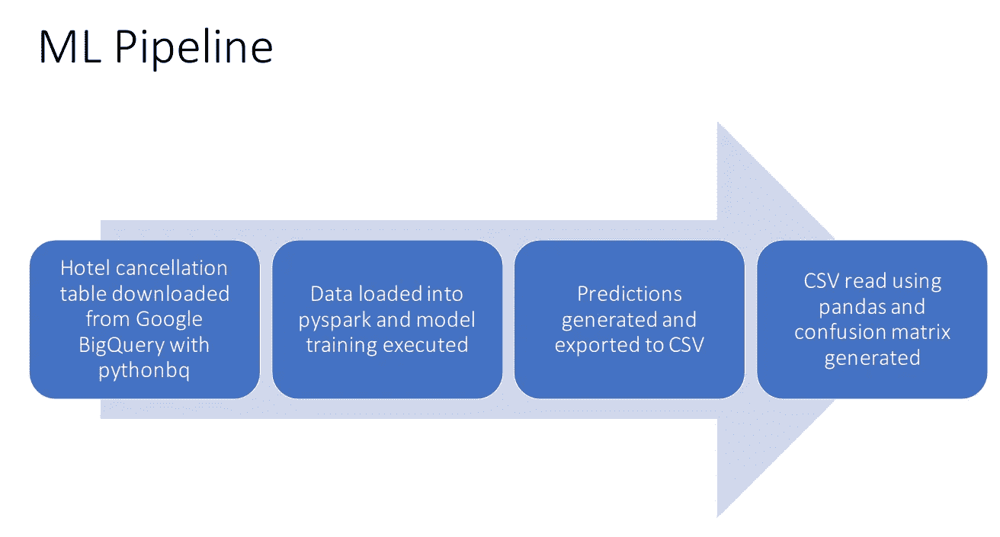
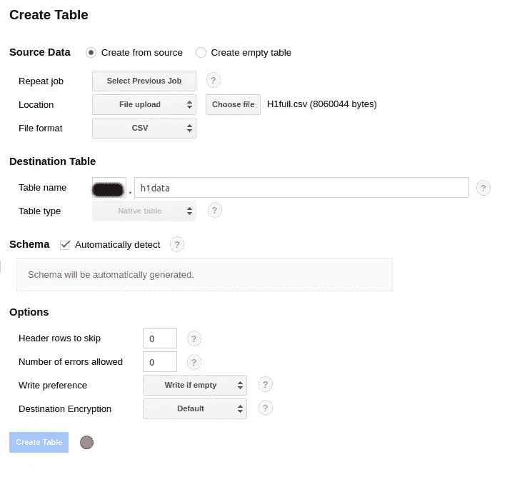
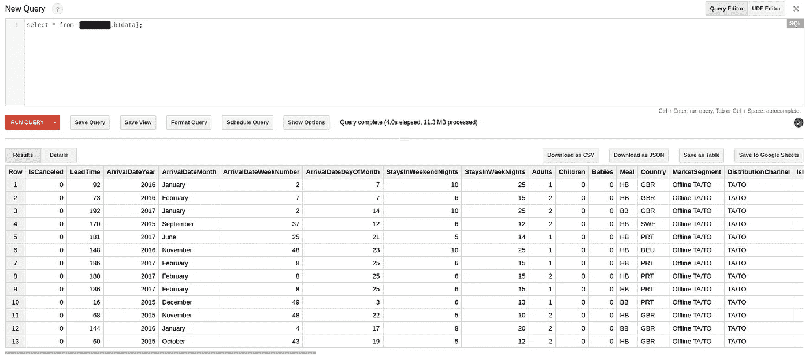
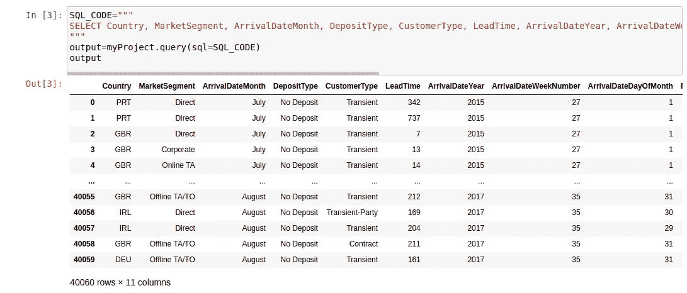
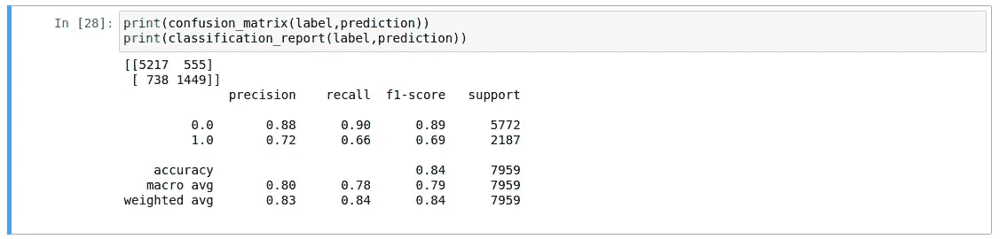
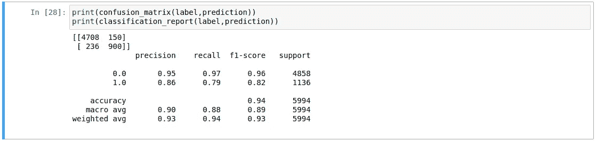

# 使用 Google BigQuery 和 PySpark 生产 ML 项目:预测酒店取消

> 原文：<https://towardsdatascience.com/productionising-ml-projects-with-google-bigquery-and-pyspark-predicting-hotel-cancellations-8bf94fdc4af?source=collection_archive---------35----------------------->

## 数据科学家经常陷入数据科学的探索阶段，即在特定数据集上运行多个模型并优化准确性。

机器学习的探索阶段无疑是重要的。在生产过程中投入大量时间和资源之前，确保模型正确运行并具有预测能力是必要的。

然而，总是有在这个阶段花费太多时间而在生产上花费不够的风险。也就是说，整理来自多个来源的数据，并确保基础设施适合处理大型数据流。

这是一个使用梯度推进分类器预测酒店取消的 ML 管道示例。在这个例子中，为两个不同的酒店(H1 和 H2)构建并运行了两个模型。

# 管道

具体来说，管道设置如下:

1.  从酒店取消表中选择的列从 Google BigQuery 数据库下载到带有 pythonbq 的 Jupyter 笔记本中，Python bq 是 BigQuery 的 Python 客户端。
2.  使用 pyspark 初始化 Spark 会话。进行相关的数据转换是为了让 GBTClassifier 能够处理相关的数据。
3.  进行 80/20 训练测试分割，以允许模型评估训练集的不可见部分的性能。
4.  模型预测从 Spark 转换为 pandas 数据框架，然后导出为 CSV。然后，这些预测被读回 Jupyter 笔记本，并生成一个混淆矩阵来评估模型的准确性。



# 谷歌大查询

首先，H1 的相关 CSV 文件可以上传到 Google BigQuery 并存储为表格。



来源:谷歌大查询

在这种情况下，选择了模式的“自动检测”选项，并生成了表。

下面是 Google BigQuery 中显示的表格:



来源:谷歌大查询

# 与 PySpark 的相互作用

Spark 专为处理“大数据”而设计。虽然本例中数据集的大小仍然适合使用 Python 本身固有的模型运行，但是我们假设随着更多的数据添加到数据库中，最终将需要使用 Spark 来高效地处理这些大数据批次。此外，Spark 更适合处理不断流动和更新的数据。

Spark 会话用 pyspark 初始化，pythonbq 用于从 BigQuery 加载数据:

```
import pyspark
conf = pyspark.SparkConf()conf.set('spark.local.dir', 'path')
sc = pyspark.SparkContext(conf=conf)from pythonbq import pythonbqmyProject=pythonbq(
  bq_key_path='json_file',
  project_id='project_id'
)
```

以下是 Jupyter 笔记本中所选功能的表格显示:



加载相关特征和输出标签:

```
from pyspark.ml import Pipeline
from pyspark.ml.feature import OneHotEncoderEstimator, StringIndexer, VectorAssembler
categoricalColumns = ["Country", "MarketSegment", "ArrivalDateMonth", "DepositType", "CustomerType"]stages = []
for categoricalCol in categoricalColumns:
    stringIndexer = StringIndexer(inputCol=categoricalCol, outputCol=categoricalCol + "Index")
    encoder = OneHotEncoderEstimator(inputCols=[stringIndexer.getOutputCol()], outputCols=[categoricalCol + "classVec"])
    stages += [stringIndexer, encoder]label_stringIdx = StringIndexer(inputCol="IsCanceled", outputCol="label")
stages += [label_stringIdx]numericCols = ["LeadTime", "ArrivalDateYear", "ArrivalDateWeekNumber", "ArrivalDateDayOfMonth", "RequiredCarParkingSpaces"]
assemblerInputs = [c + "classVec" for c in categoricalColumns] + numericCols
assembler = VectorAssembler(inputCols=assemblerInputs, outputCol="features")
stages += [assembler]
```

# gbt 分类器

现在可以加载 gbt 分类器(或梯度增强分类器)来用相关数据进行训练。

```
from pyspark.ml.classification import GBTClassifier

partialPipeline = Pipeline().setStages(stages)
pipelineModel = partialPipeline.fit(dataset)
preppedDataDF = pipelineModel.transform(dataset)gbtClassifier = GBTClassifier()
trainedModel = gbtClassifier.fit(preppedDataDF)
```

在将数据分成 80%训练和 20%测试时，可以训练分类器。

```
gbtModel = gbtClassifier.fit(trainingData)
predictions = gbtModel.transform(testData)
selected = predictions.select("label", "prediction", "probability")
```

我们来评价一下模型。

```
from pyspark.ml.evaluation import BinaryClassificationEvaluator
evaluator = BinaryClassificationEvaluator(rawPredictionCol="rawPrediction")
evaluator.evaluate(predictions)
```

该模型返回的评估值为 0.9131。

预测现在可以转换成熊猫数据帧并导出到 CSV:

```
selected.toPandas().to_csv('h1predictions.csv')
```

再次导入预测时，这里有一个包含结果的混淆矩阵。



f1 得分的总体准确率为 84%，而召回率为 66%表明该模型正确识别了 66%取消酒店预订的客户。

对 H2 表运行相同的程序——下面是混淆矩阵结果。



f1 分数的准确率为 94%，而回忆率为 79%。

# 结论

在本例中，我们看到:

*   如何在 Google BigQuery 中填充表格
*   将 Jupyter 笔记本与 BigQuery 数据库进行交互
*   使用 pyspark.ml 实现梯度增强分类器

非常感谢您的时间——非常感谢您的任何想法或反馈！

这个例子的相关 GitHub 库可以在[这里](https://github.com/MGCodesandStats/hotel-cancellations)找到，你也可以在 michael-grogan.com[找到更多我的数据科学内容](https://michael-grogan.com/)。

*免责声明:本文是在“原样”的基础上编写的，没有担保。本文旨在提供数据科学概念的概述，不应以任何方式解释为专业建议。*