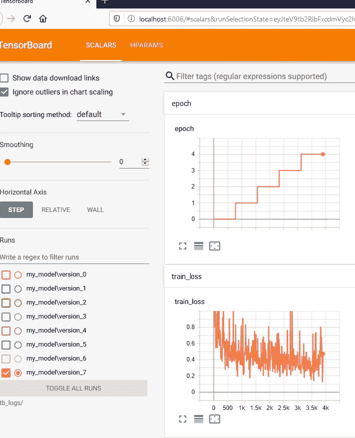

# 使用 Pytorch Lightning 和 Torchtext 对 Python 进行高效的自然语言处理实验

> 原文：<https://towardsdatascience.com/productive-nlp-experimentation-with-python-using-pytorch-lightning-and-torchtext-256a4d00a26b?source=collection_archive---------35----------------------->

## 如何使用 Pytorch Lightning 和 Torchtext

Pytorch 是我主要的深度学习框架。然而，有些部分我觉得可以改进。Pytorch Lightning 已经回答了这个问题[1]。

William Falcon 展示了 Pytorch Lightning [2]中的一些核心功能。这些功能包括构建您的代码以准备数据、进行训练、验证和测试，以及使用 Tensorboard 进行日志记录。

他对 Pytorch Lightning、Pytorch Ignite、fast.ai 做了客观的比较[4]。他强调指出，Ignite 并不是每个模型都有一个标准的接口，需要更多的代码来训练模型，并不直接与 Tensorboard 集成，也不像 Lightning 那样具有额外的高性能计算。而 fast.ai 比其他两个有更高的学习曲线，用例可能与 Pytorch Lightning 和 Pytorch Ignite 不同。

在本文中，我想强调 Pytorch Lightning 提高我的工作效率的一些特性，以及如何将 Pytorch Lightning 与 Torchtext 集成。


照片由[🏴󠁵󠁳󠁴󠁸󠁿·廷德尔](https://unsplash.com/@micahtindell?utm_source=medium&utm_medium=referral)在 [Unsplash](https://unsplash.com?utm_source=medium&utm_medium=referral) 上拍摄

# 为什么使用 Pytorch 闪电

## 减少样板文件

除非万不得已，不要再进行写作训练。您可以将您的培训定义为

```
from pytorch_lightning import Trainertrainer = Trainer(
    gpus=1, 
    logger=[logger],
    max_epochs=5
)
trainer.fit(model)
```

一个`Trainer`的工作是做你的日常训练。

*   **不再有写循环。**正如你所看到的，不再有通常在 pytorch 教程中看到的循环。
*   **不要将你的模型转换成 gpu。**您不必担心忘记将您的型号转换为`cuda`。
*   **没有定制打印对您造成的损失。**你看到`logger`那里的变量了吗？你可以使用 Tensorboard 来管理你的日志，我推荐你使用它。在本地使用之前，请执行`pip install tensorboard`。



Pytorch 闪电产生的张量板样本

在这个截图中，我将`logger`变量定义为

```
from pytorch_lightning.loggers import TensorBoardLoggerlogger = TensorBoardLogger('tb_logs', name='my_model')
```

Pytorch Lightning 会创建一个名为`tb_logs`的日志目录，你可以参考你的 Tensorboard 的日志目录(如果你在 Jupyter notebook 之外单独运行你的 Tensorboard)。

```
tensorboard --logdir tb_logs/
```

## 组织代码

除了构造函数和`forward`之外，你还可以定义更多的函数

*   `configure_optimizer`。期望从`torch.optim`包中返回 Pytorch 优化器。

```
def configure_optimizers(self):
    return Adam(self.parameters(), lr=0.01)
```

*   `train_step`。给定一个批次和批次号，定义我们将如何输入到模型中。

```
def training_step(self, batch, batch_idx):
    x, y = batch.text[0].T, batch.label
    y_hat = self(x)
    loss = self.loss_function(y_hat, y)
    return dict(
        loss=loss,
        log=dict(
            train_loss=loss
        )
    )
```

在这个例子中，注意我用转置做了一点变换。在输入到模型中之前，可以进行各种转换，但是我建议您在这个函数之外进行大量的转换，这样会比较干净。

我还将`loss_function`定义为模型的一部分，并使用交叉熵对其进行“硬编码”。如果你不想这样，你可以使用`torch.functional as F`然后调用你的功能损失函数，比如`F.log_softmax()`。你可以做的另一件事是让模型构造器接受损失函数作为参数。

*   `train_dataloader`。定义希望如何加载培训数据加载器。

[Pytorch Dataloader](https://pytorch.org/docs/stable/data.html) 是一个 API，可以帮助你批处理输入。不过，据我所知，Pytorch Lightning 将运行`for batch_idx, batch in enumerate(train_dataloader)`(不完全是这样，但类似)。这意味着你可以自由定义任何可迭代的东西。

*   `test_step`。给定一个批次和批号，定义我们如何将输入馈送到模型进行测试。值得注意的是，在这一步中，我们不需要输入损失函数，因为我们是在没有梯度的情况下运行的。
*   `test_dataloader`。定义您希望如何加载您的测试数据加载器
*   `test_epoch_end`。给定所有的测试输出，定义您想要对测试输出做的一些动作。如果您不想定义它，那么您可以定义，但是当您定义了`test_step`和`test_dataloader`之后，它会显示警告，因为这样您基本上对您的测试数据没有做任何事情。

# 使用 Pytorch Lightning 和 Torchtext

之前，我已经描述了我对使用 torchtext 的探索[4]。现在，我想在实验部分进一步提高我的生产力，包括培训、测试、验证、度量记录。所有这些都可以通过 Pytorch 闪电来实现。

我将采用 **IMDB 情感分类数据集**，它已经在 Torchtext 包中可用。

## 正在加载数据集

IMDB 情感分类数据集是文本分类任务，给定评论文本预测它是正面评论还是负面评论。有一个来自[torch text](https://pytorch.org/text/datasets.html)【5】的官方简短教程，然而那个教程并没有涵盖训练部分。我将使用一些教程代码，并使用 Pytorch Lightning 将它们与培训联系起来。

该数据集包含 **3 个类别:未知、阳性(标记为“阳性”)、阴性(标记为“阴性”)**。因此，我们知道我们将需要定义一个可以预测 3 个类的输出。这是一个分类任务，所以我将使用交叉熵损失。

现在加载数据你可以做什么

```
from torchtext.data import Field 
from torchtext.datasets import IMDBtext_field = Field(sequential=True, include_lengths=True, fix_length=200)
label_field = Field(sequential=False)train, test = IMDB.splits(text_field, label_field)
```

由于 IMDB 审查的长度不一致，使用**固定长度参数将有助于填充/修剪序列数据**。

您可以使用`train.examples[i]`访问您的样本数据，以查看训练和测试变量中的内容。

## 构建词汇

预训练单词嵌入通常针对我们使用的不同数据进行训练。因此，它将使用不同的“编码”从令牌到整数，我们目前有。`build_vocab`将使用预先训练的编码重新映射来自当前数据集(在本例中为 IMDB 数据集)的当前整数编码。例如，如果我们词汇表中的标记`2`是`eat`，但是`eat`是预训练单词嵌入中的标记号`15`，那么它将被自动映射到正确的标记号。

```
from torchtext.vocab import FastTexttext_field.build_vocab(train, vectors=FastText('simple'))
label_field.build_vocab(train)
```

IMDB 数据集中的标签字段将采用`pos`、`neg`和`<unk>`的形式，因此它仍然需要构建自己的 vocab，但不嵌入单词。

## 拆分并生成迭代器

迭代器的工作方式有点像数据加载器，它有助于在一个时期内批处理和迭代数据。我们可以使用 BucketIterator 来帮助我们迭代特定数量的批处理，并将所有这些向量转换成一个设备，其中设备可以是`cpu` 或`cuda`。

```
from torchtext.data import BucketIteratordevice = 'cuda' if torch.cuda.is_available() else 'cpu'
batch_size = 32train_iter, test_iter = BucketIterator.splits(
    (train, test), 
    batch_size=batch_size, 
    device=device
)
```

现在我们准备定义我们的模型。

## 模型定义

用 Pytorch Lightning 定义模型就像 William 解释的那样简单[2]。

1.  从`LightningModule`而不是 Pytorch 的模块加载。
2.  定义构造函数并转发。
3.  现在添加上一节提到的属性

在进行完整的训练之前，最好确保您的模型可以正确地接受传递的输入，就像这样。

```
sample_batch = next(iter(train_iter))
model(sample_batch.text[0].T)
```

让我解释一下我为什么要做这些转换。

迭代器中的每个批处理对象都有`text` 和`label` 字段。`text`字段实际上是一个评论的真实单词向量和实际长度向量的元组。真实字向量的大小为**固定长度 x 批量大小**，而实际长度向量的大小为**批量大小**。为了给模型输入单词 vector，我需要:取第一个元组并旋转它，这样它将产生**batch _ size x fixed _ length**。

我们现在准备训练我们的模型！

```
from pytorch_lightning import Trainer
from pytorch_lightning.loggers import TensorBoardLoggermodel = MyModel(text_field.vocab.vectors)
logger = TensorBoardLogger('tb_logs', name='my_model')
trainer = Trainer(
    gpus=1, 
    logger=logger,
    max_epochs=3
)
trainer.fit(model)
```

完成了！它会自动显示进度条，这样你就不用再做 tqdm 了。

```
for batch_idx, batch in tqdm(enumerate(train_loader)):
```

经过培训，您可以通过 1 行进行测试

```
trainer.test()
```

> 如果你在想为什么这个测试方法只返回一个对象？那么你可能会想到 scikit-learn 的训练和测试分离。在 Pytorch 中，“测试”部分通常被定义为“验证”。所以你可能想定义`validation_step`和`val_dataloader`，而不是`test_*`。

# 结论

在我看来，使用 Pytorch lightning 和 Torchtext 确实提高了我试验 NLP 深度学习模型的生产率。我认为这个库非常吸引人的一些方面是向后兼容 Pytorch，Torchtext 友好，以及利用 Tensorboard。

## 向后兼容 Pytorch

如果你犹豫不决，因为你认为使用一个新的库会是一个开销，那么不要担心！你可以先安装，用`LightningModule`代替`nn.Module`并编写普通的 Pytorch 代码。它仍然可以工作，因为这个库不会引起任何额外的麻烦。

## 友好的火炬文本

与 Pytorch Lightning 一起使用 Torchtext 相当容易。这两个库都运行在 Pytorch 上，并且与本机 Pytorch 有很高的兼容性。两者都有额外的特征，这些特征并不相交，而是互补的。例如，Torchtext 具有加载数据集的简单接口，如 IMDB 或 YelpReview。然后，您可以使用 Pytorch Lightning 来训练您想要定义的任何模型，并登录到 Tensorboard 或 MLFlow。

## 利用 Tensorboard 的使用

使用 Tensorboard 代替手动打印你的损失和其他指标，帮助我消除了在训练循环中打印损失时不必要的错误。它还将消除在培训结束时可视化损失与时期图的需要。

你最好现在就在 google colab 中进行实验，这是链接

> [Google Colab 的笔记本](https://colab.research.google.com/github/ariepratama/python-playground/blob/master/dl-pytorch-lightning.ipynb)

# 参考

[1] Pytorch Lightning 文档。[https://py torch-lightning . readthedocs . io/en/stable/introduction _ guide . html](https://pytorch-lightning.readthedocs.io/en/stable/introduction_guide.html)

[2] Falcon，w .从 PyTorch 到 py torch Lightning——一个温和的介绍。[https://towards data science . com/from-py torch-to-py torch-lightning-a-gentle-introduction-b 371 b 7 caaf 09](/from-pytorch-to-pytorch-lightning-a-gentle-introduction-b371b7caaf09)

[3] Falcon，w . py torch Lightning vs py torch Ignite vs fast . ai .[https://towards data science . com/py torch-Lightning-vs-py torch-Ignite-vs-fast-ai-61dc 7480 ad8a](/pytorch-lightning-vs-pytorch-ignite-vs-fast-ai-61dc7480ad8a)

[4] Sutiono，Arie P .用 PyTorch 和 Torchtext 进行 NLP 的深度学习。[https://towardsdatascience . com/deep-learning-for-NLP-with-py torch-and-torch text-4f92d 69052 f](/deep-learning-for-nlp-with-pytorch-and-torchtext-4f92d69052f)

[5] Torchtext 数据集文档。[https://pytorch.org/text/datasets.html](https://pytorch.org/text/datasets.html)