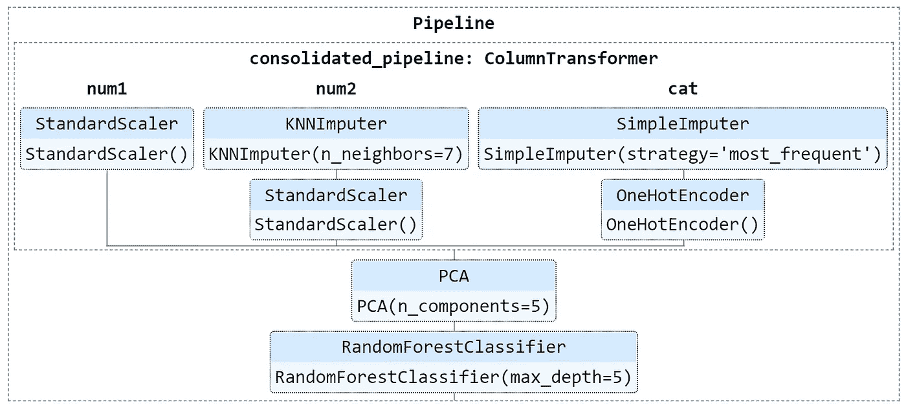

# 生产力助推器:复合估算器和管道的交互式可视化

> 原文：<https://towardsdatascience.com/productivity-booster-interactive-visualisation-of-composite-estimator-and-pipeline-407ab780671a?source=collection_archive---------75----------------------->

## [内部 AI](https://towardsdatascience.com/data-visualization/home)

## Scikit-Learn 0.23 版本中的前处理步骤的可视化是生产力的助推器。



管道和估计器可视化——文章中讨论的代码的输出

根据我的经验，在现实生活中的机器学习项目中，最大的工作份额是数据预处理。使用适当的预处理数据训练模型是稍后获得准确预测的先决条件。

通常，由于连续的预处理和转换，它变得非常复杂，以至于解开它变得非常繁琐和耗时。如果您的同事已经完成了部分预处理逻辑，而您需要完成剩余的部分，这将变得更具挑战性。

Scikit-Learn 在 2020 年 5 月的 0.23 版本中引入了丰富的复合估值器和管道结构的交互式可视化。

在本文中，我将说明如何使用这个主要的新特性来改进我们对复杂的顺序预处理步骤的理解，并在出现任何问题时指出错误的步骤。

在本文中，我们将使用 Seaborn 包中著名的“Titanic”数据集。现实世界中大多数收集的数据都有缺失值。这里，我们将使用 SimpleImputer，KNNImputer 来填充样本 Titanic 数据集中缺失的值。我们需要 ColumnTransformer 对不同的列执行一组不同的转换。

```
**import seaborn as sns
from sklearn.pipeline import Pipeline
from sklearn.impute import SimpleImputer ,KNNImputer
from sklearn.preprocessing import StandardScaler, OneHotEncoder
from sklearn.compose import ColumnTransformer
from sklearn.decomposition import PCA
from sklearn.ensemble import RandomForestClassifier**
```

首先，我们将下载样本 titanic 数据集，并从完整的可用要素集中选择一些要素作为自变量。
如下面的代码所示，大写的“X”通常用于表示自变量，小写的“y”表示因变量。

```
**TitanicDataset=sns.load_dataset("titanic")****X=TitanicDataset[["sex","age","fare","embarked","who","pclass",
"sibsp"]].copy()
y=TitanicDataset[["survived"]].copy()**
```

因为特性“fare”没有任何记录的空白值，所以我们不需要估算器。在下面的代码中，根据要应用的一组预处理和变换对功能进行了分组。

```
**numeric_independent_variables1= ['fare']
numeric_independent_variables2= [ 'age', 'pclass','sibsp']****categorical_independent_variables=["who","embarked","sex"]**
```

我们为三组特征定义了三种不同的管线。第一个管道只涉及缩放，而在第二个管道中依次提到输入和缩放。对于分类特征，使用最频繁策略填充缺失值，然后使用 OneHotEncoder 将分类值转换为数值。

```
**numeric_pipeline1=Pipeline([('scaler', StandardScaler())])****numeric_pipeline2=Pipeline([('imputer', KNNImputer(n_neighbors=7)),('scaler', StandardScaler())])****categorical_pipeline=Pipeline([('imputer',SimpleImputer(strategy='most_frequent')),('onehot', OneHotEncoder(handle_unknown='error'))])**
```

我们将使用 column transformer，因为我们将对不同的列组使用一组不同的预处理和转换。

```
**consolidated_pipeline= ColumnTransformer([('num1', numeric_pipeline1, numeric_independent_variables1),('num2', numeric_pipeline2, numeric_independent_variables2),('cat', categorical_pipeline, categorical_independent_variables)])**
```

在前面的步骤中，在一个列变压器中，提到了三条管线。

最后，我们有一个嵌套的管道，将更早的“合并 _ 管道**”、“** pca **”、**和“分类器”放入新的管道“clf”。

```
**clf = Pipeline([('consolidated_pipeline', consolidated_pipeline),('pca',PCA(n_components=5)),('classifier',RandomForestClassifier(max_depth=5))])**
```

解释转换的顺序已经变得相当复杂，即使与实际项目相比，预处理和转换顺序相对简单

在 0.19 版本中，Scikit-Learn 引入了 set_config 包。在 2020 年 5 月发布的 0.23 版本中，添加了“显示”参数，以实现复合估算器和管道的交互式可视化。

```
**from sklearn import set_config
from sklearn.utils import estimator_html_repr****set_config(display='diagram')
diaplay(clf) # for** **Jupyter Notebook and Google Collab**
```


管道和估计器可视化——文章中讨论的代码的输出

如果你正在运行 Jupyter 笔记本和 Google Collab 中的代码，那么上面的代码将带来管道的结构和其他复合估算器。点击各个方框显示参数。

如果你正在使用 IDLE，那么你可以用下面的代码在你的本地机器上下载完整的结构。由于我们没有在下面的代码中提供任何文件夹路径，因此 HTML 文件将保存在与主 python 程序相同的位置。

```
**with open('estimator.html', 'w') as f:
    f.write(estimator_html_repr(clf)) # for saving the HTML file**
```

我们不需要浏览所有的预处理和转换编码，只需看一眼，就可以通过这种树形结构的可视化来了解管道和转换序列。对于冗长复杂的嵌套管道和预处理步骤，它有助于我们快速确定问题区域，是真正的生产力助推器。