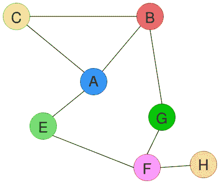
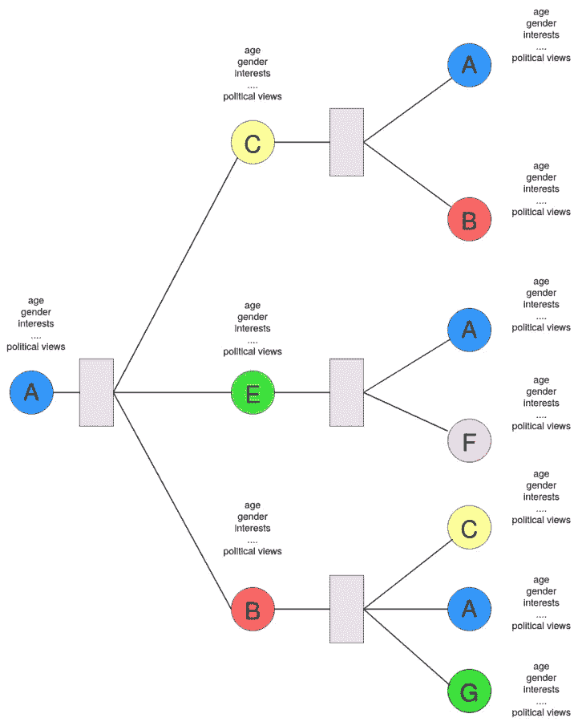
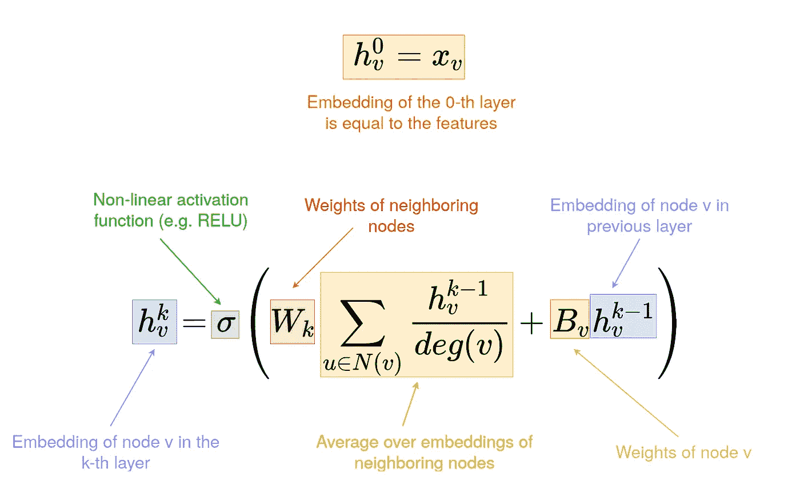
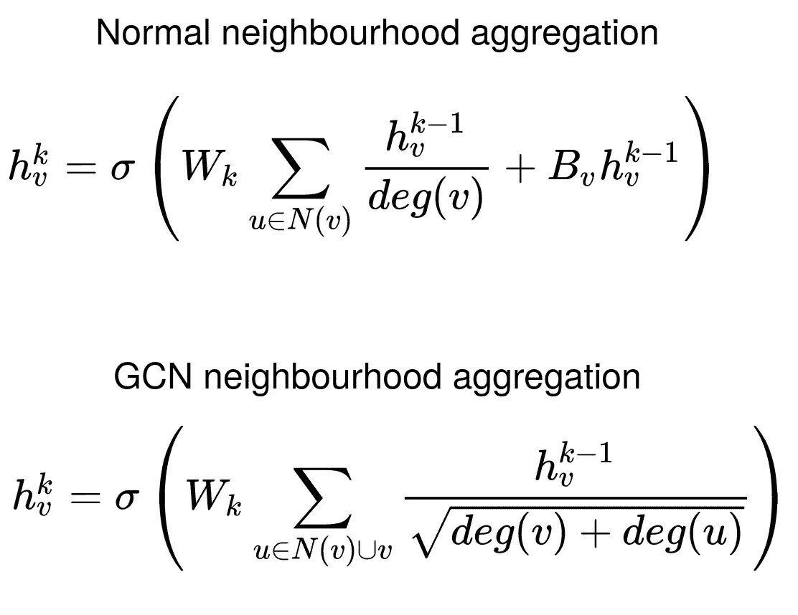
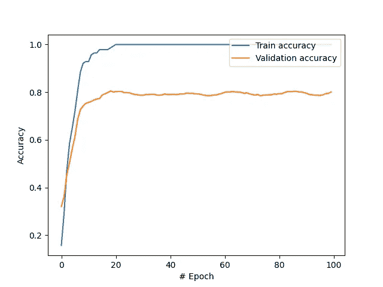

# 用 PyTorch 编写一个简单的图形网

> 原文：<https://towardsdatascience.com/program-a-simple-graph-net-in-pytorch-e00b500a642d?source=collection_archive---------10----------------------->

## 几何机器学习简介

费迪南·斯托尔在 [Unsplash](https://unsplash.com?utm_source=medium&utm_medium=referral) 拍摄的照片

# 介绍

机器学习中一个非常新且快速发展的领域是图神经网络。顾名思义，它们能够学习任何网络中节点之间的关系。这在很多领域都很有用，例如预测分子结构的有用性，了解社交网络中的人，或者构建购物推荐系统。在这篇短文中，我将解释图网背后的理论，并用 PyTorch 实现一个简单的理论。

# 概观

在深入图网之前，让我们首先回答一个重要的问题:图究竟是什么？基本上，图是由两个元素组成的结构:

*   节点:通常具有一组特定属性的实体
*   边:连接两个节点。边可以是单向的，也可以是双向的

图形数据和我们在其他机器学习任务中遇到的“正常”数据之间的主要区别在于，我们可以从两个来源获得知识:

1.  就像在其他机器学习应用中一样，每个节点都有一组**特征**。例如，当我们看一个社交网络时，每个节点都可以是具有特定年龄、性别、兴趣、政治观点等的人。
2.  信息也编码在图的**结构中。通过观察一个人的朋友，通常可以对这个人有所了解。**

那么，所有这些是如何组成一个神经网络的呢？让我们继续我们的社交圈的例子。我们可以首先只看一个人本身。然后我们可以收集一个人的朋友的信息。然后是朋友的朋友的信息等等。这基本上是一个图形网络的想法:我们聚集邻居的信息，邻居的邻居，等等。一个节点。让我们看一个简单的例子，让事情更清楚。下图显示了一个小型朋友组，其中两个节点之间的边表示这两个人是彼此的朋友。

图 1:一个简单的图表

我们现在将关注人物 a。首先，我们只看一下深度为 0 的朋友圈，例如，只有人物本身

图 2:深度为 0 的朋友圈

那不太有意思。我们只能从这个人的特征来推断。现在看看深度 1(图 3)。

图 3:深度为 1 的朋友圈

现在我们还可以分析朋友们的特征。最后，深度为 2 的网(图 4):

图 4:深度 2 的朋友圈

哇，最后一张图看起来已经很像神经网络了！这就是我们在这些神秘的灰色盒子中所做的事情:我们以某种方式聚集相邻节点的所有特征，将它们乘以权重，并应用激活函数。注意:我们称聚集的特性**为嵌入**

让我们仔细看看这些盒子里发生了什么。看看下面的两个等式(图 5)。

图 5:图形网络的基本方程

我们定义没有前趋的节点在第 0 层。这些节点的嵌入只是它们的特征。为了计算层 k 的嵌入，我们对层 k-1 的平均嵌入进行加权，并将其放入激活函数中。注意这里的两件重要事情:首先，所有相邻节点的权重是相同的，它们没有单独的权重。第二，当我们计算一个节点 v 的嵌入时，我们也想包括这个节点的特征，所以我们给每个节点添加自循环。这在直觉上也是有意义的:当描述一个节点的特征时，邻居确实扮演了一个重要的角色，但是节点本身也很重要。

到目前为止，我们已经了解了普通图网络是如何工作的。在我们开始实现之前，我想介绍一个轻微的修改，它已经显示出经常优于正常的图网。这种邻域聚合被称为**图卷积网络** (GCN，看[这里](https://tkipf.github.io/graph-convolutional-networks/)有很好的介绍)。有两个主要区别(图 6):

1.  每层只有一组权重，所以 W 和 B 不再不同。因此，节点本身的特征乘以与其所有邻居相同的权重。
2.  所有节点的归一化因子并不相同，而是取决于它们各自的邻居数量。

图 6:差分正态和 GCN 邻域聚合

# 履行

好在 PyTorch 已经有了一个惊人的几何深度学习库，它叫 [PyTorch 几何](https://github.com/rusty1s/pytorch_geometric)。务必仔细通读[安装说明](https://pytorch-geometric.readthedocs.io/en/latest/notes/installation.html)，因为我在这里搞砸了。这里的陷阱是 PyTorch 几何需要不同版本的库，这取决于您是否有 GPU。

首先，我们要定义我们的 GCN 层(清单 1)。

清单 1: GCN 层

让我们一行一行地看一下:

add_self_loops 函数(清单 2)是 PyTorch Geometric 提供的一个方便的函数。如上所述，在每一层中，我们都希望聚合所有的相邻节点以及节点本身。为了确保包含节点本身，我们在这里添加了自循环。

清单 2:添加自循环

接下来我们要做的是用我们的权重乘以嵌入值(清单 3)。

清单 3:乘以权重

最后，我们计算归一化因子(清单 4)。

清单 4:计算规范化

**重要**:不要惊讶我们这里没有激活功能，我们会在网本身添加。

接下来我们可以使用我们的层定义创建一个图形网(清单 5)。这里没有太多特别需要注意的地方。我们创建了一个香草火炬网使用我们的 GCN 层。注意:从数据中我们可以得到节点(x)和它们之间的边(edge_index)。

清单 5:整个图形网

当然，我们想测试我们的网络在一些真实数据上的表现。上面实现的网络是一个非常简单的网络，所以它在大数据集上表现不好。一个不错的选择是 21 世纪初收集的 Cora 数据集。这里我们有来自七个不同领域的机器学习论文，并希望对哪篇论文属于哪篇进行分类。每篇论文的特点是经常出现的单词。两个节点之间的边表示一篇论文引用了另一篇论文。通过查看数据集(图 7 ),我们已经可以看到同一区域的论文形成了一个集群。

图 7: Cora 数据集可视化

在这里，我将省略我们为了训练模型而需要的常见 PyTorch 样板代码。完整的代码可以在我的 GitHub(链接)中找到。仅仅几个时期之后，我们就获得了 100%的训练准确率和大约 80%的验证准确率。

图 8:简单图形网络的性能

# 结论

这是我第一次涉足图形神经网络领域，总体来说是一次非常有趣的经历。图网的想法是几年前的事了，所以直到今天，就像在快速发展的机器学习世界的其他领域一样，无数的修改和改进已经出现了。所以有很多要发现的！

全部代码都在我的 [GitHub](https://github.com/praxidike97/GraphNeuralNet/tree/master) 里。

# 来源

[1] PyTorch 几何文档[https://py torch-Geometric . readthedocs . io/en/latest/index . html](https://pytorch-geometric.readthedocs.io/en/latest/index.html)

[2]斯坦福教程[http://snap . Stanford . edu/proj/embeddings-www/files/nrl tutorial-part 2-gnns . pdf](http://snap.stanford.edu/proj/embeddings-www/files/nrltutorial-part2-gnns.pdf)