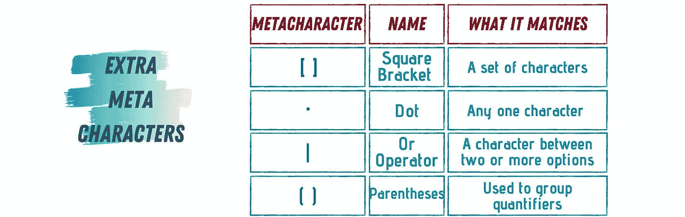
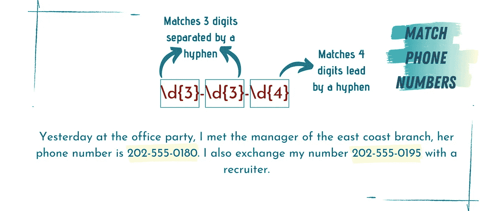

# 掌握正则表达式 1 的唯一指南

> 原文：<https://towardsdatascience.com/programmers-guide-to-master-regular-expression-f892c814f878?source=collection_archive---------12----------------------->

## 清晰、简明、循序渐进的指南

## 了解语言类比


照片由 [Fotis Fotopoulos](https://unsplash.com/@ffstop?utm_source=medium&utm_medium=referral) 在 [Unsplash](https://unsplash.com?utm_source=medium&utm_medium=referral) 上拍摄

正则表达式(Regex)是最强大、最灵活、最有效的文本处理方法之一。Regex 有自己的术语、条件和语法；从某种意义上说，它是一种迷你编程语言。Regex 可用于添加、删除、隔离和操作所有类型的文本和数据。它可以用作简单的文本编辑器命令，例如搜索和替换，或者作为它自己强大的文本处理语言。正因为如此，Regex 在今天的技术中有如此多的应用，例如:用网络爬虫提取有用的信息、数据抓取和网络抓取、数据争论和机器学习——即自然语言处理和语音识别。

Regex 不是特定于编程语言的应用程序；事实上，它可以用在今天所有的编程语言中。编程语言支持正则表达式的使用，但是所有的魔力和力量都来自正则表达式本身。

使用正则表达式可以为程序员节省宝贵的时间，这些时间可能会浪费在平凡的任务上。任务，如在文件夹中查找电子邮件，从一堆文本文件中删除重复内容，分析特定语言的语法，突出显示文件中的某些上下文，等等。对于那些以前从未使用过 Regex 的人来说，这听起来很神奇，但也很吓人！第一次阅读正则表达式可能——不，可能，肯定——会感到困惑和复杂。我是说，看看这个例子:


我向您保证，在本文结束时，您将很快理解您遇到的任何正则表达式，包括上面的这个。

然而，第一次看到一门新的语言总是令人困惑。然而，当你开始学习形成语言的小块时，它看起来就不再复杂或令人困惑了。

所以，让我们开始破译正则表达式…


# 正则表达式语言类比

完整的正则表达式通常由两种基本类型的字符组成:*元字符*和*文字*。*元字符*是赋予正则表达式权力的特殊字符，而*文字*是所有其他标准文本字符。Regex 与文件名模式的不同之处在于，文件名模式为有限的应用程序提供了有限的选项。相比之下，Regex 提供了丰富的*元字符*，允许更高级的应用程序。


作者使用 [Canva](https://www.canva.com/)

考虑*元字符*和*文字*的一种方式是，因为 Regex 是它自己的语言，我们可以说*文字*是该语言的单词，而*元字符*是它的语法。单词和语法可以在一套特定的规则下结合在一起，形成无数的表达式，能够表达你能想到的任何可能的模式。

你意识到正则表达式的力量了吗？

没有吗？只要继续读下去…

首先，我们将涵盖正则表达式的基本概念，然后我们将举一些例子，我们将看到如何构造一个正则表达式，以及我们如何使用 Python 来提取匹配。


# 元字符

元字符有三种基本类型，每一种都用来表示我们正在搜索的模式的一个方面。这三种类型是元字符类、量词和位置元字符。

## 元字符类

这些类型的元字符用于匹配单个字符，它们都以\开头，以区别于文字。下面是六种可能的元字符类的表格:


## 量词

这些类型的元字符用于指示我们试图匹配的模式中某个字符出现的次数。假设我们希望匹配“鞠波”和“杰西”，我们将使用其中一个量词来表示这两个选项都是可接受的。量词有四种类型:


## 位置元字符

位置元字符用于指示我们正在寻找的字符的位置。是在正文的开头，行尾，还是一个词？为了实现这一点，我们使用位置元字符。


## 超级演员

这只是我对他们的称呼——绝对不是正式的名字😄—这些是一些额外的元字符，用于连接其他元字符和文字。



# 文字

文字是所有不是元字符的单词和字符。例如，“从”，“到”，“你好:”所有这些都是文字。如果我想匹配一个元字符，例如，我想匹配`*`或`^`字符，我应该怎么做呢？

在这种情况下，我们使用转义字符来正则表达式，以明确表示我们想要匹配该字符。所以我们输入`\^`或`\*`，而不仅仅是`^`和`*`。


# Python 中的正则表达式

要在 Python 中使用 Regex，我们需要使用一个名为`***re***`的库。这个库是 Python 内置库的一部分，这意味着您不需要为了使用它而安装它。你只需*导入*它并得到匹配。这个库包含许多函数，允许我们有效地使用 Regex。在本文中，我们将讨论基本的五个功能:`*compile*`、`*search*`、`*match*`、`*findall*`和`*sub*`。

## 编制


正则表达式基本上是我们定义并要求代码寻找的模式。在 Python 中，这些表达式是作为字符串或原始字符串的句柄。普通字符串和原始字符串之间的区别在于，在原始字符串中，转义字符不被处理，即它们将按原样打印。例如:

```
usual_str = "Hello\nWorld!" #This will print Hello and World! in different linesraw_str = r'Hello\nWorld!' #Will print the string as it is Hello\nWorld!
```

在 Python 中，可以使用字符串来表示表达式，也可以使用`compile` 函数将正则表达式模式计算成正则表达式对象。如果您计划在代码中多次使用相同的模式，最好将它作为编译对象；因为将模式存储为正则表达式对象以便重用比将其保存为字符串更有效。

## 比赛


我们可以使用`match`函数在给定的字符串中搜索模式。如果搜索成功，该方法将返回一个 match 对象。如果不是，则返回`None`。

## 搜索


`search`函数在扫描字符串时寻找给定模式的第一次出现。如果找到匹配，将作为 match 对象返回，否则返回`None`。

## `**search()**` **VS** `**match()**`

`match`函数只在字符串的开头检查匹配，而`search`函数在字符串的任何位置检查匹配。

## 芬达尔


`findall`函数搜索一个字符串，找到所有可能的匹配，并将它们作为一个字符串列表返回。每个返回的字符串代表一个匹配。

## 潜水艇


`sub`是替代功能。它接受一个原始字符串和一个模式，并返回通过用替换 repl 替换该字符串中最左边的非重叠模式获得的字符串。如果找不到模式，则返回字符串，不做任何更改。

`subn`类似于`sub`。但是，它返回一个包含新字符串值和对原始字符串执行的替换次数的元组。


注意所有这些方法都有一个额外的属性叫做`flag`？

该属性用于微调模式的搜索和匹配，这些标志是:

1.  **IGNORECASE or (I):** 允许不区分大小写的匹配。
2.  **DOTALL or (S):** 允许。匹配任何字符，包括换行符。
3.  **多行 or (M):** 允许插入符号(^)和美元($)元字符匹配换行符。
4.  **VERBOSE or (X):** 允许您在表达式中写入空白和注释，使其更具可读性和易于理解。


好了，这已经很多了，让我们举一些例子来帮助我们阐明不同元字符的用法。

我们将从小处着手，然后逐步构建更复杂的示例。😉

## 例子一

创建一个正则表达式，匹配以大写字母开头的任意长度的单词。例如，在句子中:

*侧栏包括备忘单、完整参考和帮助。您还可以保存与社区的共享，并在我的模式中查看您创建或喜爱的模式。*

我们希望匹配所有以大写字母开头的单词。

***步骤:***

1.  匹配单词中的第一个字符(在[A-Z]大写字母中)。
2.  匹配下列任意数量的字母。


匹配模式的 Python 代码:

执行这段代码将打印`[‘The’, ‘Cheatsheet’, ‘Reference’, ‘Help’, ‘You’, ‘Share’, ‘Community’, ‘My’, ‘Patterns’]`


## 例子二

创建一个正则表达式来匹配 xxxx-xxxx-xxx 格式的电话号码。例如，在这句话中:

昨天在办公室聚会上，我遇到了东海岸分公司的经理，她的电话号码是 202-555-0180。我还和招聘人员交换了我的电话号码 202-555-0195。

我们将匹配*202–555–0180 和 202–555–0195。*

***步骤:***

1.  匹配 4 个数字，后跟一个连字符。
2.  重复步骤 1。
3.  匹配三位数。



匹配模式的 Python 代码:

执行代码打印`[‘202–555–0180’, ‘202–555–0195’]`


## 例子三

让我们加大难度吧！

我们想创建一个正则表达式来匹配 DD 格式的任何日期。年月日或年月日或年月日。此外，我们希望年份只在 19s 或 20s 之间。

Python 3.0 于 2008 年 3 月 12 日发布。这是对该语言的一次重大修改，它并不完全向后兼容。它的许多主要特性都被移植到了 Python 2.6。以及分别于 2008 年 10 月 3 日和 2010 年 7 月 3 日发布的 2.7 版本。

我们希望匹配该句子中的所有三个日期。

步骤:

1.  匹配*天*。我们可以将日正则表达式分为三部分。**0[1–9]，**表示从 01 到 09 的日期。接下来，我们有**【12】【0–9】；这个**表示 1 或 2，后面跟一个 0~9 之间的数。最后，**3【01】**，这是针对 3 后面跟着 bt 0 或者 1。所以，30 或者 31。
2.  匹配*分隔符(*)。|-|/).这符合-或/或。注意，在点之前我们添加了一个\来告诉 Python 我们想要匹配一个点，我们不是指点元字符。
3.  匹配*月份*。月份可以分为两部分:小于 10 的月份和小于 10、11 和 12 的月份。第一部分可以用**0[1–9]，**匹配，第二部分是 **1[012]** 。
4.  最后，我们需要匹配年份。对于年份，我们希望它以 19 或 20 开始，然后后面跟着另外两个数字。


匹配模式的 Python 代码:

执行代码打印`[‘03–12–2008’, ‘03.10.2008’, ‘03/07/2010’]`


唷…

那很有趣——我希望如此！。

Regex 是一个很大的话题，我们可以花很多时间来讨论它，这就是为什么我决定把这篇文章分成两篇。在这一篇中，我介绍了基础知识，在下一篇中——下周开始——我将进入更高级的形式，我们将讨论如何在 Python 中创建高效的正则表达式以及更多的`re`方法…


# 参考和工具

[1] Tonkin，e .，& Tourte，G. J. L. (2007 年)。掌握正则表达式。*阿里阿德涅*， *53* 。

[2]练习正则表达式的一个有用工具是 regexr.com。