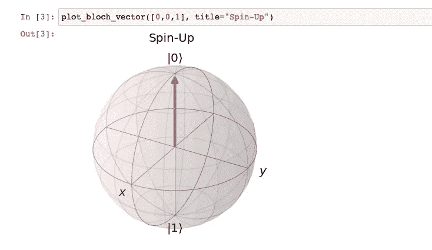
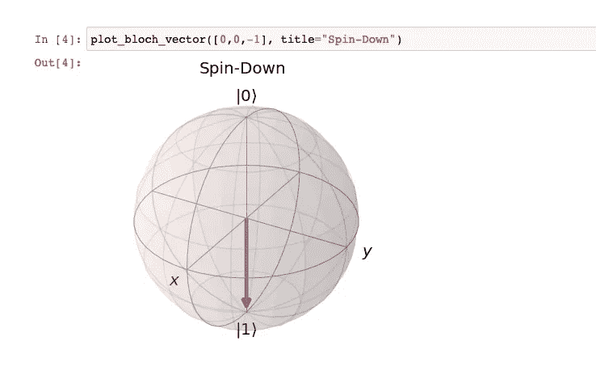
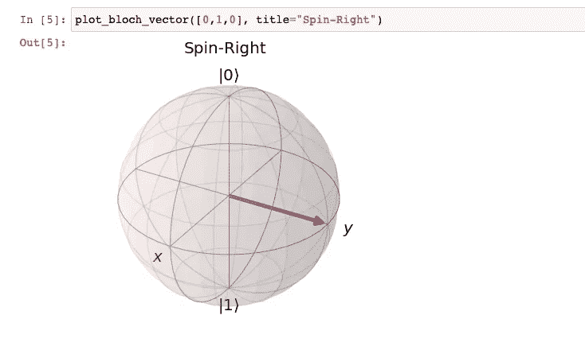
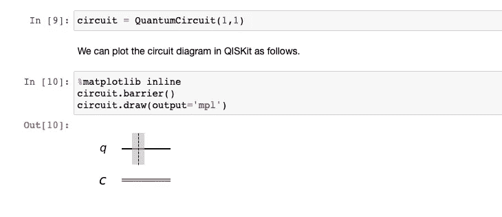
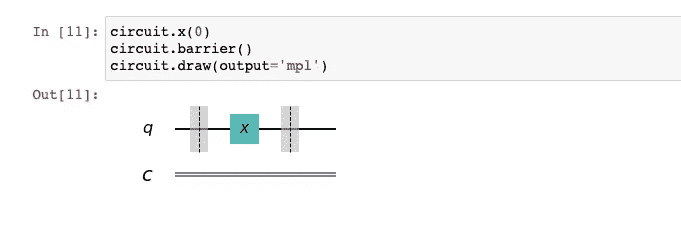
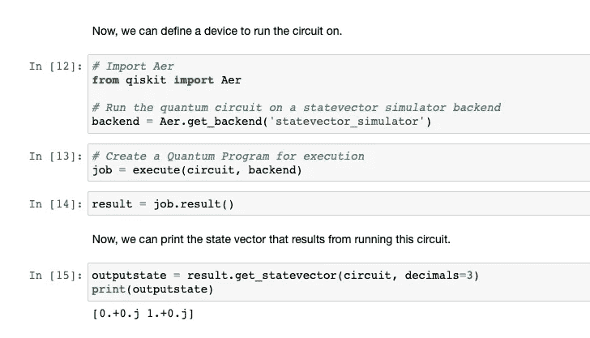

# 给量子计算机编程

> 原文：<https://towardsdatascience.com/programming-a-quantum-computer-21baf506bdc4?source=collection_archive---------7----------------------->

## [奇点研究](https://towardsdatascience.com/tagged/the-singularity-research)

## 量子逻辑门软件

一个普遍的误解是，量子计算机还没有为应用做好准备，这项技术还需要很多年才能变得有用。在这篇文章中，我们将看看量子计算机编程的一些基本原则，并解决这个误解。我们将关注免费的开源软件，如 IBM 的 [QISKit](https://qiskit.org/) ，以及量子机器学习软件 [PennyLane](http://pennylane.ai/) 。我们还将解释如何在 IBM 云中的实际量子计算机上运行你的程序。在后续文章中，我们将讨论机器学习中的一些应用，这些应用目前可供任何有一点好奇心的人使用。

## 什么是量子计算机？

首先，让我们谈一谈量子计算，以及你可以从这项技术中期待什么。你可以在手机、笔记本电脑或平板电脑中找到的当前计算机芯片架构是由硅制成的。最常见的技术之一是使用一种特殊的基于光的光刻技术在硅片上蚀刻出微小的图案。这些微小的图案使我们能够制造出硅芯片，以可控的方式在芯片中传输电子(电流)。目前，我们已经达到了这些微小图案可以有多小的物理极限。它们可以有效地大量制造，具有纳米级的精度，典型的结构大约为 10 纳米，直径在 20 到 50 个原子之间。

更精确的技术已经存在，可以操纵单个原子，我们目前可以创造出比你通常在电脑或电话中看到的还要小的结构。这种制造过程有点慢，因此大规模生产这些更小、原子级精确的芯片有点困难。在构造具有如此小特征的计算机芯片时，我们遇到的一个困难是电子和原子的量子行为。电子有一种叫做波粒二象性的东西。这意味着，在某些情况下，电子的行为像波而不是粒子，因此当蚀刻图案太小时，将它限制在硅片上的微小蚀刻图案变得更加困难。电子“扩散”并发生电子泄漏，导致电流流经硅片中的这些微小通道时出现问题。这种泄漏意味着芯片不能按预期运行，电子的波动行为成为一个问题。这通常被称为“摩尔定律的死亡”，代表着过去几十年来我们所期待的计算机性能增长的停止。如果你押注于一个建立在持续不断增长的假设之上的市场，这将是一个大问题，因为你能制造的电脑芯片有多小多高效，实际上是有物理限制的。

量子计算旨在将量子力学行为的这一“问题”作为一种计算优势，通过使用它以一种与我们手机和笔记本电脑中常见的二进制 1 和 0 完全不同的方式处理信息。一种有用的方式认为量子计算机是一个专用集成电路。不完全是这样，但这是个不错的类比。可以把它想象成一种特殊的计算机芯片，设计用来执行特定种类的计算，比标准的硅芯片更有效。我们来看看 QISKit 中的基本计算单位是如何表示的。

## QISKit 中的量子比特态

首先，你需要下载一个免费分发版的 Anacond，这样你就可以使用 Jupyter Lab 了。下载 Anaconda 之后，打开 Anaconda navigator 并打开 Jupyter Lab 的一个实例。如果你想从 Github 下载笔记本，你可以在这里找到[。如果你想看活页夹上的互动版本，你可以在这里找到](https://github.com/The-Singularity-Research/bloch-spheres/blob/master/qiskit_bloch_spheres.ipynb)。要安装 QISKit，只需使用 Jupyter 笔记本或 Jupyter Lab 中的 pip 即可。

接下来，您需要导入 qiskit 和 matplotlib。

现在，如果您想在 Bloch 球体上绘制“自旋”状态，您可以键入以下命令。

我们可以用下面的命令画出量子位的“自旋下降”状态。

总的来说，量子位状态不再像经典的二进制信息位那样局限于简单的 0 或 1。量子位可以有无限多种状态。每个状态被表示为布洛赫球面上的一个点。自旋向上对应于状态 0，自旋向下对应于状态 1，但是量子位也可以是这两种状态的组合。布洛赫球上的每一个点，就像地球表面的坐标一样，代表一个独特的量子位元状态。一个量子位可以处于无限多种不同状态的这种能力，与量子物理中的“叠加”概念有关。例如，布洛赫球面上的以下状态是状态 0 和状态 1 的均匀混合，因此它是这两个状态的叠加。

这个“右旋”位置被表示为“叠加”，

或者 0 状态和 1 状态的“线性组合”。如果你不懂线性代数参考，没关系。现在，如果我们想对自旋向上状态(或状态 0)的单个量子位进行操作，并将其翻转到自旋向下状态(或状态 1)，我们可以使用非门。非门或“泡利 X 门”是一个[量子逻辑门](https://en.wikipedia.org/wiki/Quantum_logic_gate)。量子逻辑门在概念上类似于经典逻辑门，但又不完全相同。它们对量子比特进行操作，就像经典逻辑门对比特进行操作一样，但是它们总是可逆的，并且用(酉)矩阵乘法来表示。我们可以在 QISKit 中创建一个量子电路，如下所示:

现在，如果我们想使用非门对单个量子位进行操作，我们可以在 QISKit 中使用下面的代码来完成。

这向我们表明，我们已经翻转了量子位状态，使其自旋向下。这是量子算法背后的基本思想。在下一篇文章中，我们将看看这些量子逻辑门是如何在实际硬件上使用超导量子位实现的。这也可以用 IBM 软件来完成，相当于对应用于量子计算机芯片的微波脉冲进行编程。如果你想看一些介绍量子算法背后的数学的教程，可以看看我的 [Github 知识库，里面有用 Python](https://github.com/The-Singularity-Research/linear_algebra_for_quantum_computing) 实现的量子计算背后的数学。如果你有问题或评论，或者想讨论量子计算及其应用，请随时联系。