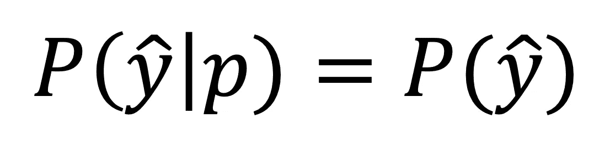

# 算法中的编程公平性

> 原文：<https://towardsdatascience.com/programming-fairness-in-algorithms-4943a13dd9f8?source=collection_archive---------17----------------------->

## 理解和解决监督学习中的公平问题。

> "做好事容易，难的是做公正。" *―* ***维克多雨果***
> 
> "我们需要捍卫那些我们从未谋面、也永远不会谋面的人的利益。" *―* ***杰弗里·萨克斯***

**注:**本文旨在让普通读者尝试并阐明机器学习算法中不公平性的复杂本质。因此，我试图用简单易懂的方式解释概念，尽量少用数学，希望每个人都能从阅读中有所收获。

有监督的机器学习算法天生具有歧视性。它们是歧视性的，因为它们使用嵌入在数据特征中的信息将实例分成不同的类别——事实上，这是它们生活中的指定目的。这反映在这些算法的名称中，这些算法通常被称为判别算法(将数据分成类别)，与生成算法(从给定类别生成数据)相反。当我们使用监督机器学习时，这种“区分”被用来帮助我们将数据分类到数据分布中的不同类别，如下图所示。

判别式与生成式算法的图解。请注意，生成算法从限制于特定类别的概率分布(例如，蓝色分布)中提取数据，而判别算法旨在辨别这些分布之间的最佳边界。**来源:** [**堆栈溢出**](https://stackoverflow.com/questions/879432/what-is-the-difference-between-a-generative-and-a-discriminative-algorithm)

虽然当我们对任何数据集应用判别算法(如支持向量机、各种形式的参数回归(如香草线性回归)和非参数回归(如随机森林、神经网络、boosting))时会出现这种情况，但结果不一定有任何道德含义。例如，使用上周的天气数据来尝试预测明天的天气，这并不具有道德价值。然而，当我们的数据集基于直接或间接描述人(个体)的信息时，这可能会无意中导致基于群体关系的歧视。

显然，监督学习是一种两用技术。它可以为我们带来好处，例如用于信息(例如预测天气)和保护(例如分析计算机网络以检测攻击和恶意软件)。另一方面，它有可能被武器化，以便在几乎任何层面上进行歧视。这并不是说算法这样做是邪恶的，它们只是在学习数据中存在的表示，这些表示本身可能已经嵌入了历史不公正的表现，以及个人的偏见和倾向。数据科学中的一个常见格言是“垃圾输入=垃圾输出”，指的是高度依赖于提供给它们的数据质量的模型。这可以在算法公平性的上下文中类似地表述为“偏入=偏出”。

# **数据原教旨主义**

有些支持者信奉 [**数据原教旨主义**](https://hbr.org/2013/04/the-hidden-biases-in-big-data#:~:text=The%20hype%20becomes%20problematic%20when,analytics%20always%20reflect%20objective%20truth.) ，也就是说，数据通过经验观察反映了世界的客观真相。

> "有了足够的数据，数字就能说明一切。" ***—前《连线》主编克里斯·安德森(数据原教旨主义者)***
> 
> 数据和数据集不客观；它们是人类设计的产物。我们赋予数字它们的声音，从中得出推论，并通过我们的解释来定义它们的意义。收集和分析阶段的隐藏偏差带来了相当大的风险，对于大数据等式来说，这与数字本身一样重要。 ***—凯特·克劳福德，微软研究社交媒体集体*** 首席研究员

表面上看，这似乎是一个合理的假设，但凯特·克劳福德在《哈佛商业评论》的一篇文章中提供了一个很好的反驳:

> 波士顿有坑洞的问题，每年修补大约 20，000 个。为了帮助有效地分配资源，波士顿市发布了优秀的 [StreetBump 智能手机应用程序](http://streetbump.org/)，它利用加速度计和 GPS 数据来帮助被动检测坑洞，并立即向城市报告。虽然这无疑是一个聪明的方法，但 StreetBump 有一个信号问题。在美国，低收入群体不太可能拥有智能手机，尤其是老年居民，他们的智能手机普及率只有 16%。对于像波士顿这样的城市来说，这意味着智能手机数据集缺失了相当一部分人口的输入——通常是那些资源最少的人。——***微软研究院首席研究员凯特·克劳福德***

本质上，StreetBump 应用程序从富裕社区获得了大量数据，而从贫困社区获得的数据相对较少。很自然，你可能从中得出的第一个结论是，较富裕的社区有更多的坑洞，但实际上，贫穷社区的数据很少，因为这些人不太可能有智能手机，因此下载了 SmartBump 应用程序。通常，我们的数据集中没有的数据会对我们的结果产生最大的影响。这个例子说明了一种微妙的收入歧视形式。因此，当从可能遭受“信号问题”的数据中得出这样的结论时，我们应该谨慎。这种信号问题通常被表征为 [**采样偏差**](https://en.wikipedia.org/wiki/Sampling_bias) 。

另一个值得注意的例子是“替代性制裁的惩教罪犯管理概况”算法，简称 COMPAS。美国许多州都使用这种算法来预测累犯率，即前罪犯再次犯罪的可能性。调查性新闻机构 ProPublica 对该算法的分析[引发了争议](https://www.propublica.org/article/machine-bias-risk-assessments-in-criminal-sentencing)，因为它似乎表明该算法是基于种族的歧视——种族在美国是一个受保护的阶层。为了让我们更好地了解正在发生的事情，用于预测累犯的算法看起来像这样:

**累犯风险评分** =(年龄*w) +(首次被捕年龄*w) +(暴力史* w)+(职业教育* w)+(违规史* w)

应该清楚的是，种族不是用作预测的变量之一。然而，根据美国历史上的不公正以及人口统计、社会和执法统计数据(这通常是另一个批评的目标，因为他们经常使用算法来确定哪些街区需要巡逻)，对于这些变量中的一些变量，如“暴力历史”和“职业教育”因素，两个给定种族之间的数据分布可能有很大不同。这些数据分布之间的不匹配可以被算法利用，导致种族之间的差异，从而在某种程度上导致适度偏向或反对某些种族的结果。这些根深蒂固的偏见将被算法操作化，并因此继续存在，导致进一步的不公正。这个循环本质上是一个自我实现的预言。

**历史不公→训练数据→生产中的算法偏差**

这导致了一些困难的问题——我们去除这些有问题的变量了吗？我们如何确定一个特征是否会导致歧视性的结果？我们需要设计一个度量标准来提供“歧视”的阈值吗？人们可以将这种方法发挥到极致，去掉几乎所有的变量，但这样算法就没用了。这描绘了一幅暗淡的画面，但是幸运的是，有一些方法可以解决这些问题，这些问题将在本文的后面讨论。

这些例子不是孤立的事件。甚至乳腺癌预测算法也显示出一定程度的不公平歧视。从乳房 x 光片预测乳腺癌的深度学习算法对黑人女性的准确性远远低于白人女性。这部分是因为用于训练这些算法的数据集主要基于白人女性的乳房 x 光片，但也因为黑人女性和白人女性之间的乳腺癌数据分布可能有很大差异。[根据疾病控制中心(CDC)](https://www.cdc.gov/cancer/dcpc/research/articles/breast_cancer_rates_women.htm)*黑人女性和白人女性患乳腺癌的几率差不多，但是黑人女性死于乳腺癌的几率比白人女性高***。**

# ****动机****

**这些问题引发了关于算法开发人员动机的问题——设计这些模型的人是故意这样做的吗？他们是否有一个他们试图推动的议程，并试图将其隐藏在灰色盒子机器学习模型中？**

**虽然这些问题不可能有把握地回答，但在问这类问题时，考虑一下汉隆剃刀是有用的:**

> **永远不要把可以用愚蠢来充分解释的事情归咎于恶意——罗伯特·j·汉伦 T3**

**换句话说，世界上没有那么多邪恶的人(谢天谢地)，世界上邪恶的人肯定比无能的人少。一般来说，我们应该假设当事情出错时，更可能是因为无能、幼稚或疏忽，而不是纯粹的恶意。虽然可能有一些恶意的行为者想要推动歧视性议程，但这些可能是少数。**

**基于这种假设，可能会出现什么问题呢？有人可能会说，统计学家、机器学习从业者、数据科学家和计算机科学家没有被充分地教授如何开发监督学习算法来控制和纠正偏见倾向。**

**为什么会这样呢？**

**事实上，实现这一点的技术并不存在。机器学习公平性是机器学习的一个年轻的子领域，在过去几年中，随着机器学习与社会领域的快速融合，它越来越受欢迎。与医生不同，计算机科学家不一定受过考虑其行为的道德含义的训练。直到最近(可以说是社交媒体出现以来)，计算机科学家的设计或发明才具备了伦理维度。**

**这表现在大多数计算机科学期刊不要求对提交的稿件进行伦理陈述或考虑。如果你有一个包含数百万真实人物图像的图像数据库，这无疑会有伦理上的影响。由于物理距离和数据集的大小，计算机科学家与数据主体相距甚远，以至于对任何一个人的影响都可能被认为是微不足道的，从而被忽视。相比之下，如果社会学家或心理学家对一小群人进行测试，就会成立一个完整的伦理审查委员会来审查和批准实验，以确保实验不会超越任何伦理界限。**

**从好的方面来看，这种情况正在慢慢开始改变。越来越多的数据科学和计算机科学项目开始要求学生参加数据伦理和批判性思维的课程，期刊也开始认识到通过 IRB 和手稿中的伦理陈述进行伦理审查可能是同行评审过程的必要补充。对机器学习公平性话题的兴趣不断上升，只是在强化这一立场。**

# ****机器学习中的公平性****

****

**在过去的几年里，机器学习的公平性已经成为一个热门话题。图片来源: [**CS 294:机器学习中的公平性**](https://fairmlclass.github.io/) 加州大学伯克利分校教授的课程。**

**如前所述，监督机器学习算法的广泛采用引发了对算法公平性的担忧。这些算法被采用得越多，它们对我们生活的控制力越大，只会加剧这些担忧。机器学习社区很清楚这些挑战，算法公平现在是机器学习的一个快速发展的子领域，有许多优秀的研究人员，如 Moritz Hardt，Cynthia Dwork，Solon Barocas 和 Michael Feldman。**

**尽管如此，在我们能够实现真正公平的算法之前，仍有一些重大障碍需要克服。在算法中防止**不同的处理**是相当容易的——一个群体对另一个群体的显式区别对待，例如通过从数据集中删除对应于这些属性的变量(例如种族、性别)。然而，要防止**不同的影响**——一个群体相对于另一个群体的隐性差别待遇，通常是由数据中被称为*冗余编码*的东西引起的，要容易得多。**

****

**不同影响的图示-在此图中，两组的数据分布非常不同，这导致了算法输出的差异，而没有任何组的显式关联。来源: [KdNuggets](https://www.kdnuggets.com/2018/05/machine-learning-breaking-bad-bias-fairness.html)**

**一个**冗余编码**告诉我们关于一个受保护属性的信息，比如种族或性别，基于我们数据集中与这些属性相关的特征。例如，在线购买某些产品(如化妆品)可能与性别高度相关，某些邮政编码可能具有不同的种族人口统计数据，算法可能会发现这些数据。**

**尽管算法并不试图沿着这些路线进行区分，但不可避免的是，在模式识别任务中取代人类表现的数据驱动算法可能会发现这些嵌入数据中的关联，无论它们可能有多小。此外，如果这些关联是非信息性的(即，它们不会增加算法的准确性)，则算法将忽略它们，这意味着一些信息显然嵌入在这些受保护的属性中。这对研究人员提出了许多挑战，例如:**

*   **公平和准确之间是否存在根本性的权衡？我们是否能够从受保护的特征中提取相关信息，而不会以歧视的方式使用它们？**
*   **在算法中嵌入“公平”概念的最佳统计方法是什么？**
*   **我们如何确保政府和公司产生保护个人公平的算法？**
*   **我们的训练数据中有哪些偏见，我们如何减轻它们的影响？**

**我们将在文章的剩余部分触及其中的一些问题。**

# **数据的问题**

**在上一节中，提到了冗余编码会导致与受保护属性相关的特性。随着我们的数据集规模的扩大，这些相关性出现的可能性也相应扩大。在大数据时代，这提出了一个大问题:**我们访问的数据越多，我们可用于辨别的信息就越多**。这种歧视不一定是纯粹基于种族或性别的，它可以表现为对粉发者、网络开发者、星巴克咖啡饮用者或所有这些群体的组合的歧视。在本节中，将介绍训练数据和算法中存在的几种偏差，这些偏差使公平算法的创建变得复杂。**

## ****多数偏向****

**算法对任何特定的群体都没有亲和力，然而，由于它们的统计基础，它们确实倾向于大多数群体。正如 Moritz Hardt 教授在 Medium [的文章](https://medium.com/@mrtz/how-big-data-is-unfair-9aa544d739de)中所概述的，分类器通常会随着用于训练它们的数据点的数量而提高，因为误差与样本数量的平方根成反比，如下所示。**

****

**分类器的误差通常随着样本大小的平方根的倒数而减小。四倍的样本意味着误差率减半。**

**这导致了一个令人不安的现实，因为根据定义，关于少数群体的可用数据总是较少，我们的模型在这些群体中的表现往往比在多数群体中的表现差。只有当多数群体和少数群体来自不同的分布时，这个假设才是正确的，如果他们来自单一的分布，那么增加样本量对两个群体都同样有利。**

**这方面的一个[例子](https://www.engadget.com/2019-05-07-mit-ai-model-breast-cancer.html)是我们之前讨论过的乳腺癌检测算法。对于这个由麻省理工学院研究人员开发的[深度学习模型](https://www.csail.mit.edu/news/using-ai-predict-breast-cancer-and-personalize-care)，在用于训练神经网络的数据集中的 6 万张乳房 x 光照片中，只有 5%是黑人女性的乳房 x 光照片，她们死于乳腺癌的可能性增加了 43%。因此，在对黑人女性和少数族裔群体进行测试时，该算法的表现更差。这可能部分是因为[乳腺癌通常在有色人种妇女中较早出现](https://www.vice.com/en_us/article/neqaww/breast-cancer-screening-age-women-of-color)，这表明了不同的影响，因为有色人种妇女的概率分布未被充分代表。**

**这也提出了另一个重要的问题。准确性是公平的合适代表吗？在上面的例子中，我们假设少数群体的较低分类准确度对应于不公平。然而，由于公平的定义差异很大，性质有些模糊，有时很难确保我们衡量的变量是公平的良好代表。例如，我们的算法对于黑人和白人女性可能都有 50%的准确性，但是如果对于白人女性有 30%的假阳性，对于黑人女性有 30%的假阴性，这也将指示不同的影响。**

**从这个例子中，几乎可以直观地看出这是一种歧视形式，因为存在基于群体隶属关系的差别待遇。然而，有时这种群体关系对我们的预测是有益的。例如，对于一个试图决定向用户展示什么内容的电子商务网站来说，了解个人的性别、年龄或社会经济地位非常有帮助。这意味着，如果我们仅仅从数据中删除受保护的字段，我们将降低模型的准确性(或其他一些性能指标)。类似地，如果我们有足够的黑人和白人女性的乳腺癌模型数据，我们可以开发一种算法，将种族作为输入之一。由于种族间数据分布的差异，很可能两组的准确性都有所提高。**

****因此，理想的情况是拥有一个包含这些受保护特征的算法，并使用它们来进行算法概括，但受到公平性度量的约束，以防止算法进行区分。****

**这是由莫里茨·哈特和埃里克·普莱斯在“[监督学习中的机会均等](https://arxiv.org/abs/1610.02413)”中提出的想法。与其他指标相比，这有几个优点，如统计奇偶和均等优势，但我们将在下一节讨论所有这三种方法。**

# **公平的定义**

**在这一节中，我们分析了机器学习公平研究人员提出的一些公平概念。即统计上的均等，然后是统计上的均等的细微差别，如机会均等和机会均等。**

## **统计平价**

**统计均等是最古老也是最简单的实施公平的方法。在 arXiv 文章 *"* [*算法决策和公平成本*](https://arxiv.org/pdf/1701.08230.pdf) *"* 中对此进行了详细阐述。统计奇偶校验的公式如下所示。**

****

**统计奇偶性公式。换句话说，这说明结果 *y 独立于参数 p——它对结果概率没有影响。***

**对于统计奇偶校验，结果将独立于我的团体从属关系。这直观上意味着什么？这意味着每组的相同比例将被归类为积极或消极。出于这个原因，我们也可以将统计上的均等描述为**人口上的均等**。对于包含在 *p* 内的所有人口统计群体，将实施统计均等。**

**对于尚未应用统计奇偶校验的数据集，我们可以通过计算如下所示的统计奇偶校验距离来衡量我们的预测与统计奇偶校验的偏差程度。**

****

**统计奇偶距离可用于量化预测偏离统计奇偶的程度。**

**这个距离可以为我们提供一个度量标准，来衡量一个给定的数据集基于群体关系的公平或不公平程度**

***使用统计奇偶校验的利弊是什么？***

***统计上的均等并不能确保公平。***

***你可能已经注意到了，统计奇偶性并没有说明这些预测的准确性。一个组可能比另一个组更有可能被预测为阳性，因此我们可能获得每个组的假阳性率和真阳性率之间的巨大差异。这本身会造成完全不同的影响，因为一个组的合格人员( *p=0* ) *可能会被另一个组的不合格人员( *p=1* )漏掉。从这个意义上说，统计上的均等更类似于结果的均等。****

***下图很好地说明了这一点。如果我们有两个组，一个有 10 个人(A 组=1)，一个有 5 个人(A 组=0)，我们确定 A 组=1 中的 8 个人(80%)获得了 Y=1 的分数，那么 A 组=0 中的 4 个人(80%)也必须获得 Y=1 的分数，而不考虑其他因素。***

************

***统计奇偶性图解。来源:[杜克大学隐私&数据科学中的公平讲义](https://www2.cs.duke.edu/courses/fall18/compsci590.1/lectures/FairML2.pdf)***

*****统计奇偶性降低算法准确性*****

***统计奇偶性的第二个问题是，受保护的类可能提供一些对预测有用的信息，但是由于统计奇偶性强加的严格规则，我们无法利用这些信息。性别对于预测人们可能购买的物品可能非常有用，但如果我们被阻止使用它，我们的模型就会变得更弱，准确性也会受到影响。一种更好的方法将允许我们考虑这些组之间的差异，而不会产生完全不同的影响。显然，统计奇偶校验与机器学习的基本目标不一致——完美的分类器可能无法确保人口统计奇偶校验。***

***由于这些原因，一些机器学习公平性研究人员不再认为统计奇偶性是一个可信的选择。然而，统计上的均等是一个简单而有用的起点，公平的其他定义都建立在这个起点上。***

***统计奇偶性有稍微更细微的版本，例如真正奇偶性、假正奇偶性和正比率奇偶性。***

## *****真正的正均等(机会均等)*****

***这仅适用于二元预测，并对真值执行统计奇偶校验(预测输出为 1，而真值输出也为 1)。***

******

***机会均等与均等几率相同，但重点在于 y=1 的标签。***

***这确保了在两组中，在所有合格的人(Y=1)中，相同比例的个人将被归类为合格(C=1)。当我们只对正面结果的均等感兴趣时，这是有用的。***

******

***真实正宇称的图解。注意，在第一组中，所有 Y=1(蓝框)的都被归类为阳性(C=1)。类似地，在第二组中，所有被分类为 Y=1 的人也被分类为阳性，但有一个额外的假阳性。在统计奇偶性的定义中没有考虑这种假阳性。来源:[杜克大学隐私&数据科学中的公平讲义](https://www2.cs.duke.edu/courses/fall18/compsci590.1/lectures/FairML2.pdf)***

## *****假阳性奇偶校验*****

***这也仅适用于二进制预测，并侧重于误报(预测输出为 1，但真实输出为 0)。这类似于真阳性率，但是提供了跨假阳性结果的奇偶性。***

## *****正比率平价(均等赔率)*****

***这是同时针对真阳性和假阳性的统计奇偶性的组合，也称为**均衡赔率**。***

******

***正比率平价图解(均等的赔率)。注意，在第一组中，所有 Y=1(蓝框)的都被归类为阳性(C=1)。类似地，在第二组中，所有归类为 Y=1 的也归类为阳性。在获得 Y=0 的 A=1 的群体中，其中一个被分类为 C=1，给出 50%的假阳性率。类似地，在第二组中，这些个体中的两个被给予 C=1，对应于 50%的假阳性率。来源:[杜克大学隐私&数据科学中的公平讲义](https://www2.cs.duke.edu/courses/fall18/compsci590.1/lectures/FairML2.pdf)***

***请注意，对于机会均等，我们放宽了均等赔率的条件，即在 Y=0 的情况下赔率必须相等。均等机会和均等机会也更加灵活，能够纳入受保护变量的一些信息，而不会产生完全不同的影响。***

***请注意，虽然所有这些都提供了某种形式的解决方案，可以说是公平的，但没有一个是特别令人满意的。其中一个原因是，对于公平的内涵有许多相互冲突的定义，很难用算法的形式来捕捉它们。这些都是很好的起点，但仍有很大的改进空间。***

# ***增加公平性的其他方法***

***统计均等、均等的机会和机会均等都是很好的起点，但我们还可以做其他事情来确保算法不会被用来过度歧视个人。已经提出的两种这样的解决方案是人在回路中和算法透明。***

# ***人在回路中***

***这听起来像某种过山车，但它只是指一种人类监督算法过程的范式。[人在回路](https://en.wikipedia.org/wiki/Human-in-the-loop)通常在算法出错的高风险情况下实施。例如，当检测到导弹时通知军方的导弹检测系统允许个人审查情况并决定如何做出反应——如果没有人类的互动，算法不会做出反应。想象一下，当 AI 检测到威胁时，允许它开火，运行核武器系统的灾难性后果——一个假阳性，整个世界都将毁灭。***

***另一个例子是针对累犯的 COMPAS 系统——该系统不会将你归类为累犯并做出法律判决。取而代之的是，法官审查 COMPAS 的分数，并将此作为他们评估情况的一个因素。这提出了新的问题，例如人类如何与算法系统交互。使用亚马逊 Mechanical Turk 的研究表明，一些人会全心全意地遵循算法的判断，因为他们认为它比人类可能拥有的知识更多，其他人则对其输出持保留态度，有些人则完全忽视它。对人在回路中的研究相对来说比较新颖，但随着机器学习在我们的社会中变得更加普遍，我们可能会看到更多这样的研究。***

***另一个重要且相似的概念是人在回路中。这类似于人在回路中，但不是人主动参与过程，而是被动参与算法的监督。例如，数据分析师可能负责监控石油和天然气管道的各个部分，以确保所有传感器和流程正常运行，并且没有相关信号或错误。该分析师处于监督位置，但不积极参与流程。“人在回路”比“人在回路”本质上更具可扩展性，因为它需要更少的人力，但在某些情况下它可能站不住脚——例如照看那些核导弹！***

## ***算法透明性***

***公平在法律文献中的主导地位是通过算法的可解释性和通过透明度的可解释性。论点是，如果一个算法能够被公开查看和仔细分析，那么它就可以在很大程度上确保模型中没有完全不同的影响。虽然这在许多层面上显然是可取的，但算法透明也有一些缺点。***

*****专有算法根据定义不能是透明的**。***

***从商业角度来看，这种想法在大多数情况下是站不住脚的——如果算法和业务流程被提供给所有人看，商业秘密或专有信息可能会被泄露。想象一下，脸书或 Twitter 被要求向世界发布他们的算法，以便他们可以被仔细检查，以确保没有偏见问题。最有可能的是，我可以下载他们的代码，然后很容易地开始我自己版本的 Twitter 或脸书。完全透明只是公共服务中使用的算法的一个选项，例如政府(在某种程度上)、医疗保健、法律系统等。由于法律学者主要关心的是法律制度，这在目前仍然是共识是有道理的。***

***在未来，对私人公司来说，对算法公平性的监管可能是一个比算法透明度更站得住脚的解决方案，因为私人公司有既得利益让他们的算法远离公众的视线。Andrew Tutt 在他的论文“[a FDA For Algorithms](https://papers.ssrn.com/sol3/papers.cfm?abstract_id=2747994)”中讨论了这一想法，该论文专注于开发一个类似于 FDA 的监管机构来监管算法。可以将算法提交给监管机构，或者第三方审计服务，并对其进行分析，以确保它们适合使用而不会产生完全不同的影响。***

***显然，这样的想法需要大量的讨论、资金和专业知识来实现，但从我的角度来看，这似乎是一个潜在可行的解决方案。要确保我们的算法不受不同的对待和不同的影响，还有很长的路要走。通过将法规、透明度、人在回路、人在回路以及新的和改进的统计奇偶性变化结合起来，我们是实现这一目标的一部分，但这一领域仍然年轻，还有许多工作要做——请关注这一领域。***

# ***最终意见***

***在本文中，我们详细讨论了由于收集和分析数据的方式而导致的训练数据中存在的多重偏差。我们还讨论了几种方法来减轻这些偏见的影响，并帮助确保算法对少数群体和受保护的阶层保持不歧视。***

***虽然机器学习就其本质而言总是一种统计歧视，但当它将某些特权群体置于系统优势而将某些非特权群体置于系统劣势时，这种歧视就会变得令人反感。由于标签中的偏见或欠采样/过采样，训练数据中的偏差会产生带有不需要的偏差的模型。***

***有些人可能会说，这些决定是由人在较少的信息下做出的，这可能会有许多隐含的和认知的偏见影响他们的决定。自动化这些决策提供了更准确的结果，并在很大程度上限制了这些偏差的程度。算法不需要完美，只要比以前存在的算法更好就行。历史的弧线朝着正义弯曲。***

***有些人可能会说，算法被赋予了自由，允许不平等被系统地实例化，或者数据本身存在固有的偏见。应该从数据中删除与受保护属性相关的变量，以帮助缓解这些问题，并且删除或限制与变量相关的任何变量。***

***这两组都是部分正确的。但是，我们不应该满足于不公平的算法，还有改进的空间。类似地，我们不应该浪费我们拥有的所有数据并删除所有变量，因为这将使系统性能更差，并使它们变得不那么有用。话虽如此，归根结底，这些算法和监督机构的创造者以及负责收集数据的人有责任确保这些偏见得到妥善处理。***

***数据收集和抽样程序在统计学课堂上经常被掩盖，并且不被公众所理解。在监管机构出现之前，机器学习工程师、统计学家和数据科学家有责任确保机会平等嵌入到我们的机器学习实践中。我们必须注意我们的数据来自哪里，我们用它做什么。谁知道我们的决定将来会影响到谁？***

> ***“世界是不公平的，卡尔文。”“我知道爸爸，但是为什么从来没有对我有利的时候呢？”
> *―* ***【比尔·沃特森】，*** [***加尔文与霍布斯:一个加尔文与霍布斯的国库***](https://www.goodreads.com/work/quotes/2244438)***

## ***时事通讯***

***关于新博客文章和额外内容的更新，请注册我的时事通讯。***

*** [## 时事通讯订阅

### 丰富您的学术之旅，加入一个由科学家，研究人员和行业专业人士组成的社区，以获得…

mailchi.mp](https://mailchi.mp/6304809e49e7/matthew-stewart) 

# 进一步阅读

**【1】**[大数据:关于算法系统、机会和公民权利的报告](https://obamawhitehouse.archives.gov/sites/default/files/microsites/ostp/2016_0504_data_discrimination.pdf)。白宫。2016.

**【2】**[计算机系统中的偏差](http://dl.acm.org/citation.cfm?id=230561)。巴特娅·弗里德曼，海伦·尼森鲍姆。1996

**【3】**[大数据中隐藏的偏见](https://hbr.org/2013/04/the-hidden-biases-in-big-data)。凯特·克劳福德。2013.

**【4】**[大数据的不同影响](https://papers.ssrn.com/sol3/papers.cfm?abstract_id=2477899)。索隆·巴罗卡斯，安德鲁·塞尔伯特。2014.

**【5】**博文:[大数据有多不公平](https://medium.com/@mrtz/how-big-data-is-unfair-9aa544d739de)。莫里茨·哈特。2014

**【6】**[从语言语料库中自动导出的语义包含类人偏见](http://science.sciencemag.org/content/356/6334/183)。艾林·卡利斯坎，乔安娜·j·布赖森，阿尔温德·纳拉亚南

**[研究生招生中的性别偏见:来自伯克利](http://science.sciencemag.org/content/187/4175/398)的数据。比克尔，哈默尔，奥康内尔。1975.**

****【8】**辛普森悖论。珍珠(第六章)。[技术报告](http://bayes.cs.ucla.edu/R264.pdf)**

****【9】**[验证并移除不同的影响](https://arxiv.org/abs/1412.3756)。迈克尔·费尔德曼，索雷尔·弗雷德勒，约翰·默勒，卡洛斯·沙伊德格，苏雷什·文卡塔萨布拉曼尼安**

****【10】**[监督学习中的机会均等](https://arxiv.org/abs/1610.02413)。莫里茨·哈特，埃里克·普莱斯，内森·斯雷布罗。2016.**

****【11】**博文:[接近机器学习中的公平](http://blog.mrtz.org/2016/09/06/approaching-fairness.html)。莫里茨·哈特。2016.**

****【12】**[机器偏差](https://www.propublica.org/article/machine-bias-risk-assessments-in-criminal-sentencing)。Julia Angwin，Jeff Larson，Surya Mattu 和 Lauren Kirchner，ProPublica。代码审查:[github.com/probublica/compas-analysis](https://github.com/propublica/compas-analysis)，[github.com/adebayoj/fairml](https://github.com/adebayoj/fairml)**

****【13】**[COMPAS 风险等级:展示准确性、公平性和预测性平价](https://www.documentcloud.org/documents/2998391-ProPublica-Commentary-Final-070616.html)。诺斯波因特公司。**

**[刑事司法风险评估中的公平性:最新技术](https://arxiv.org/abs/1703.09207)
Richard Berk，Hoda Heidari，Shahin Jabbari，Michael Kearns，Aaron Roth。2017.**

****【15】**[法院和预测算法](http://www.datacivilrights.org/pubs/2015-1027/Courts_and_Predictive_Algorithms.pdf)。安格尔·克里斯汀、亚历克斯·罗森布拉特和丹娜·博伊德。2015.[讨论稿](http://www.datacivilrights.org/pubs/2015-1027/WDN-Courts_and_Predictive_Algorithms.pdf)**

****【16】**[用机器学习减轻司法偏见的局限性](https://www.nature.com/articles/s41562-017-0141)。克里斯蒂安.卢姆。2017.**

****【17】**[支持向量机的概率输出以及与正则化似然方法的比较](http://citeseer.ist.psu.edu/viewdoc/summary?doi=10.1.1.41.1639)。约翰·c·普拉特。1999.**

****【18】**[公平确定风险分值的内在权衡](https://arxiv.org/abs/1609.05807)。乔恩·克莱因伯格，森迪尔·穆莱纳坦，马尼什·拉加万。2016.**

****【19】**[影响迥异的公平预测:累犯预测工具偏差研究](https://arxiv.org/abs/1610.07524)。亚历山德拉·乔尔德乔娃。2016.**

****【20】**[用更智能的机器学习攻击歧视](https://research.google.com/bigpicture/attacking-discrimination-in-ml/)。Martin Wattenberg，Fernanda Viégas 和 Moritz Hardt 的交互式可视化。2016.**

****【21】**[算法决策与公平成本](https://arxiv.org/abs/1701.08230)。山姆科比特-戴维斯，艾玛·皮尔森，阿维费勒，沙拉德戈埃尔，阿齐兹胡克。2017.**

****【22】**[歧视性结果检验中的次边际问题](https://5harad.com/papers/threshold-test.pdf)。卡米莉亚·西莫伊，萨姆·科比特·戴维斯，沙拉德·戈埃尔。2017.**

****【23】**[监督学习中的机会均等](https://arxiv.org/abs/1610.02413)。莫里茨·哈特，埃里克·普莱斯，内森·斯雷布罗。2016.**

**[因果推论的要素](http://www.math.ku.dk/~peters/elements.html)。彼得斯、扬金、舍尔科夫**

****【25】**[关于调整混杂和中介变量的回归中种族的因果解释](https://www.ncbi.nlm.nih.gov/pmc/articles/PMC4125322/)。泰勒·j·范德威尔和惠特尼·r·罗宾逊。2014.**

****[【反事实公平】](https://arxiv.org/abs/1703.06856)。马特 j .库斯纳，约书亚 r .洛夫特斯，克里斯拉塞尔，里卡多席尔瓦。2017.****

******【27】**[通过因果推理避免歧视](https://arxiv.org/abs/1706.02744)。尼基·基尔伯图斯、马特奥·罗哈斯-卡鲁拉、詹巴蒂斯塔·帕拉斯坎多罗、莫里茨·哈特、张秀坤·扬金、伯恩哈德·舍尔科夫。2017.****

******【28】**[对结果的公平推断](https://arxiv.org/abs/1705.10378)。伊利亚·施皮泽尔·拉齐埃·纳比****

******【29】**[通过认知实现公平](https://arxiv.org/abs/1104.3913)。辛西娅·德沃克，莫里茨·哈特，托尼安·皮塔西，奥马尔·莱因戈尔德，里奇·泽梅尔。2012.****

******【30】**[论公平的可能性](https://arxiv.org/abs/1609.07236)。Sorelle A. Friedler，Carlos Scheidegger，Suresh Venkatasubramanian。2016.****

******【31】**[为什么不应该使用倾向评分](https://gking.harvard.edu/files/gking/files/psnot.pdf)。理查德·尼尔森·Gary King。2016.****

******【32】**[原始数据是一种矛盾修饰法](https://mitpress.mit.edu/books/raw-data-oxymoron)。莉萨·吉特曼编辑。2013.****

******【33】**博文:[统计中最重要的有哪些是课本上没有的](http://andrewgelman.com/2015/04/28/whats-important-thing-statistics-thats-not-textbooks/)。安德鲁·吉尔曼。2015.****

******【34】**[解构统计问题](http://statlab.bio5.org/sites/default/files/fall2014/hand-deconstructin.pdf)。大卫. j .汉德。1994.****

******【35】[统计学和计量理论](http://www.lps.uci.edu/~johnsonk/CLASSES/MeasurementTheory/Hand1996.StatisticsAndTheTheoryOfMeasurement.pdf)。大卫. j .汉德。1996.******

********【36】**[计量理论与实践:通过量化看世界](http://www.wiley.com/WileyCDA/WileyTitle/productCd-0470685670.html)。大卫. j .汉德。2010******

******[【调查方法论】第二版](http://www.wiley.com/WileyCDA/WileyTitle/productCd-0470465468.html)。罗伯特·格罗夫斯、小弗洛伊德·j·福勒、米克·p·库帕、詹姆斯·m·莱普考斯基、埃莉诺·辛格、罗杰·图兰盖。2009******

******男人对于电脑程序员就像女人对于家庭主妇一样？去偏置词嵌入。托尔加·博卢克巴斯、张开伟、詹姆斯·邹、文卡特什·萨利格拉玛、亚当·卡莱。2016.******

********【39】**[男性也喜欢购物:利用语料库级约束减少性别偏见放大](https://arxiv.org/abs/1707.09457)。、王天禄、马克·亚茨卡、维森特·奥多涅斯、张开伟。2017.******

******【40】**[大数据的不同影响](https://papers.ssrn.com/sol3/papers.cfm?abstract_id=2477899)。索隆·巴罗卡斯，安德鲁·塞尔伯特。2014.****

******【41】**[这不是隐私，也不公平](https://www.stanfordlawreview.org/online/privacy-and-big-data-its-not-privacy-and-its-not-fair)。辛西娅·德沃克迪尔德丽·k·穆里根。2013.****

******【42】**[算法决策的麻烦](http://journals.sagepub.com/doi/abs/10.1177/0162243915605575)。塔尔·扎斯基。2016.****

******【43】**[版权法如何修复人工智能的隐性偏见问题](https://papers.ssrn.com/sol3/papers.cfm?abstract_id=3024938)。阿曼达·莱文多夫斯基。2017.****

******【44】**[FDA 对算法的](https://papers.ssrn.com/sol3/papers.cfm?abstract_id=2747994)。安德鲁·塔特。2016*******