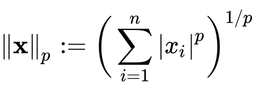
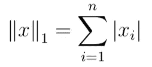
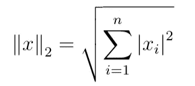

# 每个数据工程师都应该知道的 ML 编程技巧——第 1 部分

> 原文：<https://towardsdatascience.com/programming-hacks-that-every-data-engineer-should-know-part-1-fb7cd436c40?source=collection_archive---------37----------------------->

## 现实世界中的 DS

## 数据科学家和机器学习从业者的更广泛的备忘单。


纳赫尔·阿卜杜勒·哈迪在 [Unsplash](https://unsplash.com?utm_source=medium&utm_medium=referral) 上的照片

## 让我们马上开始。

# 1.省略号对象(…):

它是 Python 中的一个对象，可以用于 Numpy 包中的矩阵切片，也可以用于一般的列表切片。这个对象的主要目的是使多维数组处理更容易。Numpy 数组中的多个索引可以替换为…(省略号对象)。

同样，它也可以用来代替 Python 中的 *pass* 命令，在定义空函数时实现“无操作”。

```
>>> import numpy as np
>>> a = np.array([[[i + 2*j + 8*k for i in range(3)] for j in range(3)] for k in range(3)])
>>> arr = np.array(a)
>>> arr
array([[[ 0,  1,  2], [ 2,  3,  4], [ 4,  5,  6]],
[[ 8,  9, 10], [10, 11, 12], [12, 13, 14]],
[[16, 17, 18], [18, 19, 20], [20, 21, 22]]])
>>> **arr[1,...]** array([[ 8,  9, 10], [10, 11, 12], [12, 13, 14]])
>>> **arr[...,1]** array([[ 1,  3,  5], [ 9, 11, 13], [17, 19, 21]])
```

# 2.* & @速记运算符:

两个主要的 numpy 矩阵运算是 *np.multiply(A，B)* 和 *np.matmul(A，B)* ，它们分别计算元素乘法和矩阵乘法。np.multiply(A，B)可以实现为 **A*B** ，np.matmul(A，B)可以实现为 **A@B** 。

```
>>> import numpy as np
>>> A = np.random.rand(2,2)
>>> B = np.random.rand(2,2)
**>>> np.multiply(A,B)**
array([[0.69938897, 0.08791922], [0.23572921, 0.04930693]])
**>>> A*B**
array([[0.69938897, 0.08791922], [0.23572921, 0.04930693]])
**>>> np.matmul(A,B)**
array([[0.75990246, 0.74811588], [0.49980481, 0.39179465]])
**>>> A@B**
array([[0.75990246, 0.74811588], [0.49980481, 0.39179465]])
```

# 3.样本/混洗数据集:

熊猫数据帧对象可以用一只熊猫随机洗牌。DataFrame.sample()函数。

```
>>> import pandas as pd
>>> df = pd.DataFrame({'num_legs': [2, 4, 8, 0],
                       'num_specimen_seen': [10, 2, 1, 8]},
                       index=['falcon', 'dog', 'spider', 'fish'])
>>> df
        num_legs  num_specimen_seen
falcon         2                 10
dog            4                  2
spider         8                  1
fish           0                  8
>>> df.sample(frac=1, random_state=2)
        num_legs  num_specimen_seen
spider         8                  1
fish           0                  8
dog            4                  2
falcon         2                 10
```

# 4.LP 规范:

范数是从复数或实数上的向量空间到正实数的一种度量。LP 范数是有限维 p 范数的推广形式。p-范数定义为向量的和的幂 *p，*进一步幂为 *p 的倒数，*公式如下:



当 p=1 时，其 L1 范数(也称为曼哈顿距离)和用于 Lasso 回归的绝对值范数(称为 L1 损失(MAE))。



当 p=2 时，其 L2 范数，也称为欧氏距离，在岭回归中用作 L2 损失(MSE)。



类似地，p=3，4，…可用于计算不同水平的范数，并可在不同的机器学习算法中用作损失函数。

# 5.处理等级不平衡:

在所有 scikit learn 的机器学习算法实现中，有一个名为“class_weight”的参数，需要设置为“balanced”或 Python 字典对象，其中包含所有样本的权重。

```
>>> rfc = RandomForestClassifier(class_weight='balanced')
>>> rfc.fit(df_train_pca,y_train)
```

# 6.正在加载 ARFF 数据集:

大多数情况下，当我们使用数据集时，我们被提供了。csv 或。xls 文件，可以用 *pandas.read_csv()* 或 *pandas.read_excel()* 函数直接读取。但是，有些时候**。arff 文件**也用于分析，也用于记录一组属性的实例，如。但是对性能和内存使用更敏感。我们可以使用熊猫数据帧中的 arff 库在熊猫中阅读它，如下所示:

```
>>> import arff
>>> df = pd.DataFrame(arff.loadarff('./Training Dataset.arff')[0])
>>> df = df.select_dtypes([np.object])
>>> df = df.stack().str.decode('utf-8').unstack()
```

# 7.PIL 图像:

PIL 是 Python 图像库，它提供了使用 Python 解释器操作和显示图像的能力。

```
# importing Image class from PIL package
>>> from PIL import Image
# creating a image object
>>> im = Image.open(r"/Users/killerHack/Desktop/Hackint.jpg")
>>> im.show()
```

# 8.用熊猫制图。Series.map():

当操作 pandas 数据框架中的列值时，例如将分类值转换为数值。熊猫。Series.map()函数可用于 Series 或 DataFrame 列，将不同的值替换为另一组值，如下所示:

```
>>> s = pd.Series(['cat', 'dog', np.nan, 'rabbit'])
>>> s.map({'cat': 'kitten', 'dog': 'puppy'})
0   kitten
1    puppy
2      NaN
3      NaN
dtype: object
```

# 9.数据透视表:

大多数人都有在 Excel 中使用数据透视表的经验，并且可以在 Python 中使用相同的 pandas.pivot_table()函数。数据透视表用于汇总大型扩展表中的一些列的数据。

```
>>> import pandas as pd
>>> df = pd.DataFrame({"A": ["foo", "foo", "foo", "foo", "foo",
...                           "bar", "bar", "bar", "bar"],
...                     "B": ["one", "one", "one", "two", "two",
...                           "one", "one", "two", "two"],
...                     "C": ["small", "large", "large", "small",
...                           "small", "large", "small", "small", "large"],
...                     "D": [1, 2, 2, 3, 3, 4, 5, 6, 7]})
>>> df
     A    B      C  D
0  foo  one  small  1
1  foo  one  large  2
2  foo  one  large  2
3  foo  two  small  3
4  foo  two  small  3
5  bar  one  large  4
6  bar  one  small  5
7  bar  two  small  6
8  bar  two  large  7
>>> table = pd.pivot_table(df, values='D', index=['A', 'B'],
...                      columns=['C'], aggfunc=np.sum)
>>> table
C        large  small
A   B                
bar one    4.0    5.0
    two    7.0    6.0
foo one    4.0    1.0
    two    NaN    6.0
```

# 10.Matplotlib 样式参数:

matplotlib 是用于在 Python 中创建静态和动态可视化的绘图库。使用 matplotlib 绘图时，可以根据绘图要求使用 matplotlib.rcParams 对象更改样式的一些重要参数。

```
**import** **matplotlib.pyplot** **as** **plt**
%**matplotlib** inline
plt.style.use('ggplot')
plt.rcParams['font.family'] = 'sans-serif'
plt.rcParams['font.serif'] = 'Ubuntu'
plt.rcParams['font.monospace'] = 'Ubuntu Mono'
plt.rcParams['font.size'] = 10
plt.rcParams['axes.labelsize'] = 12
plt.rcParams['axes.titlesize'] = 12
plt.rcParams['xtick.labelsize'] = 8
plt.rcParams['ytick.labelsize'] = 8
plt.rcParams['legend.fontsize'] = 12
plt.rcParams['figure.titlesize'] = 14
plt.rcParams['figure.figsize'] = (12, 8)
```

目前就这些。在接下来的几部分中，我将介绍更多这些每个数据工程师都应该了解的重要技巧/功能。敬请关注。

> 【更新】
> [下面继续下一部分..](/ml-programming-hacks-that-every-data-engineer-should-know-part-2-61c0df0f215c)

[](/ml-programming-hacks-that-every-data-engineer-should-know-part-2-61c0df0f215c) [## 每个数据工程师都应该知道的 ML 编程技巧——第 2 部分

### 数据科学家和机器学习从业者的更广泛的备忘单。

towardsdatascience.com](/ml-programming-hacks-that-every-data-engineer-should-know-part-2-61c0df0f215c) [](/most-common-loss-functions-in-machine-learning-c7212a99dae0) [## 机器学习中最常见的损失函数

### 每个机器学习工程师都应该了解机器学习中这些常见的损失函数，以及何时使用…

towardsdatascience.com](/most-common-loss-functions-in-machine-learning-c7212a99dae0) 

照片由[豪伊·R](https://unsplash.com/@howier?utm_source=medium&utm_medium=referral)在 [Unsplash](https://unsplash.com?utm_source=medium&utm_medium=referral) 拍摄

感谢阅读。你可以在这里找到我的其他[机器学习相关的帖子](https://towardsdatascience.com/@imsparsh)。

希望这篇帖子有用。我感谢反馈和建设性的批评。如果你想谈论这篇文章或其他相关话题，你可以在这里或在 [LinkedIn](https://www.linkedin.com/in/imsparsh/) 给我发短信。

[](/importance-of-data-visualization-anscombes-quartet-way-a325148b9fd2) [## 数据可视化的重要性——Anscombe 的四重奏。

### 四个数据集欺骗了线性回归模型。

towardsdatascience.com](/importance-of-data-visualization-anscombes-quartet-way-a325148b9fd2)