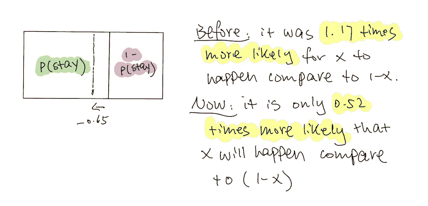

# 没有技术术语的逻辑回归+与树模型的比较

> 原文：<https://towardsdatascience.com/programming-journal-3-logistic-regression-cbf68f01bf7d?source=collection_archive---------68----------------------->

## 没有术语的机器学习

## 如果你喜欢披萨，你就会明白逻辑回归和随机森林的区别！

尼克·欧文斯在 [Unsplash](https://unsplash.com?utm_source=medium&utm_medium=referral) 上的照片

## 概述

*   什么是逻辑回归，它有什么好处
*   理解这个算法和随机森林(我们上周提到的那个)的区别，用一个意大利辣香肠披萨来说明使用**哪个更好！**
*   本周我这边的更新

逻辑回归非常常用于告诉我们一个事件是 T 还是 F，例如，这个客户会留下还是离开，这是垃圾邮件还是非垃圾邮件，有人会不会得这种病，等等。我几次看到人们声称这是最常用的算法。所以就来说说吧。

假设我们的漏斗中有 1000 名新客户作为潜在客户。我们知道有些客户比其他人更有可能和我们在一起。换句话说，一些客户更符合我们的特征，或者需要我们付出更少的精力来达成交易。我们想确认他们是谁。

图片 1

由于这是一个相互排斥的事件，客户越有可能留在我们这里，客户就越不可能离开我们。那么**让我们在这里陈述我们的目标:我们想要一个模型，这样如果客户 A 可能会和我们呆在一起，它会告诉我们“呆”的概率很高，或者“不呆”(1-呆)的概率很低，反之亦然。**(记住这一点，我们以后再来讲这个！)

图片 2

我们有三个变量，它们是合同的大小(价值)，客户的类型(B2C 对 B2C)，以及他们了解我们的渠道。我们非常直观地开始思考，我们需要看看我们以前的客户，看看这三个变量与结果之间有什么关系。这是正确的方向，除了我们这里有一个问题。

在我们初中或高中学过的传统线性方程中，它不代表概率；它给了我们一个明确的答案。为了向您展示我的意思，在*图 3* 等式 1)中，我们可以使用一些以前的数据，并有一个函数来计算 A、B 或 C 的“停留”百分比……我们将需要另一个函数来计算 A、B 或 C 的“未停留”百分比。这两个百分比不一定相加为 1，因为它们不代表概率。

因此，一些聪明的家伙开始思考，如果，我升级 Y，使它直接产生一个比较事件“停留”的概率和事件“不停留”的概率的结果，换句话说，它告诉我哪个事件比另一个更可能发生*(图 4)* 。这就是我们如何从功能 1)到功能 2)！**函数 2)直接给我们“停留”的概率和“不停留”的概率之比**

图 3

图 4

## 那么木头为什么会在哪里出现呢？现在就不能解决关系吗？

原因很简单。这是因为当我们在比较 A 比 B 多多少时间时，这个数字可以从 0 到无穷大。你想想，你比你不喜欢的人牛逼 100 倍、1000 倍、10000 倍……牛逼。“时代”可以有多大是没有限制的(当然！).另一方面，如果我们想表达更少的可能性，我们没有办法做到，因为我们的等式 2)的分子的最小值，事件 A 的概率是 0。不存在负概率。

为了解决这个问题，我们通过记录 y 从等式 2)移至等式 3)。如果您需要一些关于对数如何工作的提示，我在下面附上了基于 10 的对数标度与线性标度的图像。简而言之，这只是一种不同的测量方式，比如从英尺到厘米。现在，我们准备使用我们的数据，并解决这些系数！

图 5

[来源](https://www.forbes.com/sites/naomirobbins/2012/01/25/how-should-i-label-log-scales-in-charts-and-graphs/#14bd8b6263f7)

我相信学校里没有多少人喜欢解这些系数的作业。**这就是为什么我们要使用算法！！**没什么花哨的。在逻辑回归中，当你输入数据后，你的计算机会告诉你系数，而不是一个神奇的答案。

我们的计算机将通过尝试一系列不同的线来为我们获得最佳系数！我们如何定义最好的一个？记得我们的目标是什么吗？

> 我们需要一个模型，这样如果客户 A 很有可能和我们呆在一起，它会告诉我们“呆”的概率很高，或者“不呆”(1-呆)的概率很低，反之亦然。

因此，最佳系数的定义是使最大数量的情况能够满足我们定义的目标。

现在，计算机已经给了我们系数。我们已经解决了三个变量和结果之间的关系！现在我们想从我们的函数中获得洞察力。然而，记住我们改变了我们的 Y，所以解释起来有点棘手。让我们编造一些准确的数字来说明这一过程。

图 6

第一个系数是指 x1 增加 1 个单位(其他一切不变)，将**增加**概率 x 与概率(1-x) **的比值在对数标度上增加 0.005**；另一方面，x2 增加 1 个单位，将会使**在对数标度上使**比率降低 0.65。

既然在生活中，我们用的是线性标度而不是对数标度，那么我们可以用 e 将其转换回线性标度，在 x2 的例子中，之前，事件“停留”发生的可能性是事件“不停留”发生的可能性的 1.17 倍。**然而，在 x2 发生 1 个单位的变化后，尽管“停留”仍然更有可能发生，但该比率现在降低到只有 0.52 倍的可能性。**

图 7

图 8

## 嘿，我知道这不是最简单的事情，但是如果你能接受这个，你知道有什么好处吗？

你不仅知道谁有可能留下来，你应该把精力放在哪里，而且在那些有可能留下来的人中，你甚至知道谁最有可能留下来！所以现在，您可以对您的客户进行排名，或者为不同的客户制定不同的预期时间表！！

例如，对于不太可能的客户，预留更多的时间，因为这将是一场漫长的战斗，如果你没有在第一次尝试中获得它，不要觉得自己不好:)对于那些已经获得的客户来说，更有可能是“不留下来”，然后留下来，我们现在甚至不需要麻烦！！

你如何整合你发现的例子

## 好吧，但是[上周的帖子](https://medium.com/swlh/programming-journal-2-what-is-and-why-random-forest-without-technical-jargon-c5a9a69d8739?source=friends_link&sk=f569648b9b48c1b93bcc9a6eb0dc6140)显示，随机森林也可以告诉我们一个客户是否会留下来或离开，为什么要用另一种方法呢？

我们可以(或许应该)用很多角度来解决这个问题，但我只想在这里给出最直观的答案。

[(来源)](https://www.biggerbolderbaking.com/no-yeast-pizza-dough-recipe/)

想象一下，你的室友让你把比萨饼平均分成两份，因为你喜欢意大利辣香肠，所以你正在考虑如何切它，以便最大限度地获得意大利辣香肠。在逻辑回归中，你只能选择一条线来切断，尽管你仍然有很多选择，然而，在决策树中，没有这样的规则。

这种差异的原因是，在树模型中，我们使用一组逻辑陈述(是或否问题)来得出我们的结论，而对于逻辑回归，我们定义一组数字关系。**当我们用一组数字来表达一种关系时，我们已经预先确定了一个等式，一个预先确定的结构来表达这种关系**。例如，我们有等式 1)、2)和 3)，我们只想找到系数。当我们使用一组逻辑语句时，我们不会指定这种关系是什么样的结构。

## 所以你可能会问，哪个更好？

谨记“如果一个模型是好的？”或者“应该使用哪个模型？”可以扩展成一个巨大的主题模型评估，我打算写一个单独的博客。对于每个人来说，了解我们应该或者能够如何评估一个模型是至关重要的，因为很多时候，在生产中使用哪个模型不仅仅是由具有坚实技术背景的人决定的。现在，让我们只讨论基础知识。

继续披萨的类比，第一个方法是计算哪一个给我们的辣香肠最多。然而，大多数时候事情并不那么清楚。如果你仔细观察比萨饼，通过使用逻辑回归划分，我们可以得到 7–7.5 个意大利辣香肠，而树模型给我们 8 个意大利辣香肠。没有明显的区别。考虑到每块披萨上意大利香肠的位置略有不同，逻辑回归有时可能会优于树形模型。这就是为什么你看到一个数据科学家有时使用 2 或 3 个模型，看看哪一个做得最好。

思考这个问题的另一种方法是问:除了模型的准确性，什么样的信息将最有助于解决您的业务问题？正如我在以前的文章中提到的，树模型(包括随机森林)最好的部分是它告诉你哪个逻辑语句最重要。在我们的比萨饼例子中，如果每个矩形都是一个逻辑陈述，那么它应该是最左边的那个，因为它给了我们三个意大利香肠。对于逻辑回归来说，最好的部分是它不仅给了我们意大利辣香肠，还告诉我们哪个意大利辣香肠最大，并为我们排序。

因此，在商业环境中，如果我正在开发一个产品并希望改进功能，树模型将帮助我们确定哪个功能是最重要的，因为该功能将为我们带来最多的客户，但如果我希望在月底前尽可能多地签订合同，逻辑回归将告诉我们首先瞄准哪些客户，因为他们最有可能从一开始就与我们合作。

每周更新！！上周不是最有成效的一周。

从周一到周二，在我周一晚上发布了我的上一篇文章后，我经历了一场几乎是恐慌的袭击，因为我意识到了我在文章中犯的一些错误(已经修复)。虽然我知道这是一个学习的过程，我知道作为一个新作家，可能没有人会仔细阅读这篇文章，但我仍然感到非常尴尬。因此，我花了两天时间来确保我对这个模型了如指掌。

周三和周四，我在准备两份工作申请，周四我有一个第一轮面试。不幸的是，我的推荐人告诉我，虽然面试的人力资源给了我一个通过，但我未来的老板让我失望了，因为我在☹之前没有任何相关的工作经验

在经历了这些情绪紧张的日子后，我开始感到有点疲惫，我觉得这一周我没有完成任何事情。我也开始质疑自己在数据领域找工作的能力(我看了一段时间不同的工作岗位)。所以我放慢了自己的节奏，出去散步，做一些烘焙，花一些时间读一本名为《商业数据科学》的书。阅读是我的自理活动之一。此外，这是一本令人惊叹的书，我打算在读完之后分享一些见解。

除此之外，我还在以下方面取得了一些进步:

*   模型选择和正则化:像所有的降维方法一样，ROC，AUC
*   关于树模型算法的更多信息:Ada 增强、梯度增强和 XGboost
*   总结所有监督模型并了解如何使用它们。为了准备这篇文章，我比以前更深入地理解了逻辑回归、LDA 和朴素贝叶斯。
*   我确实开始了一个项目，但我决定做一个预测客户流失的项目，而不是客户细分。我没有取得多大进展，但我计划下周完成它。我的目标是同时使用随机森林和逻辑回归。

仅此而已。我想用一句令人愉快的话来结束这篇文章，来提醒我自己和其他所有感觉有点精疲力尽的人。

> “生活中的大事只有在你花时间做一些照顾自己的小事时才有可能实现。”—香奈儿·米勒

下周见！