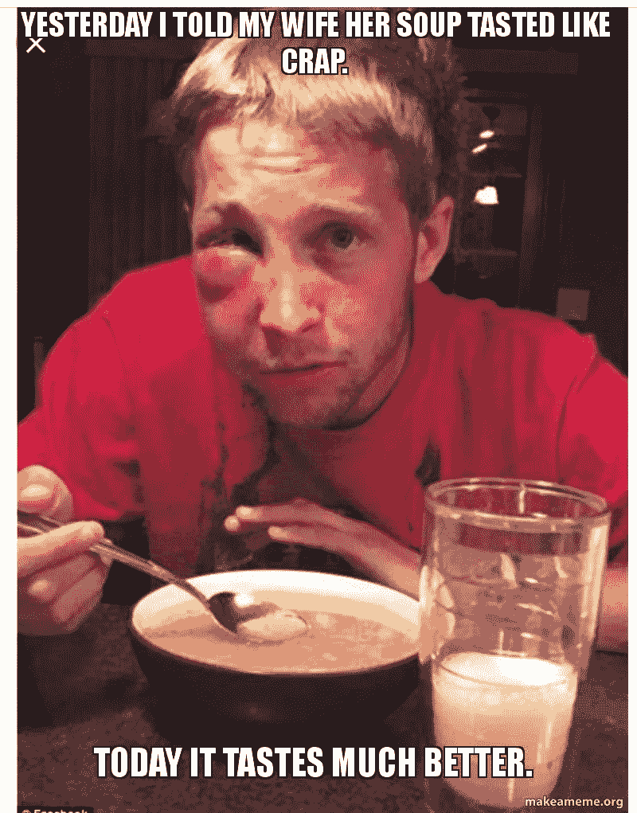
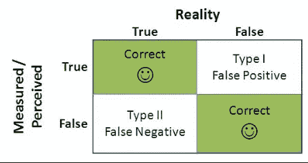
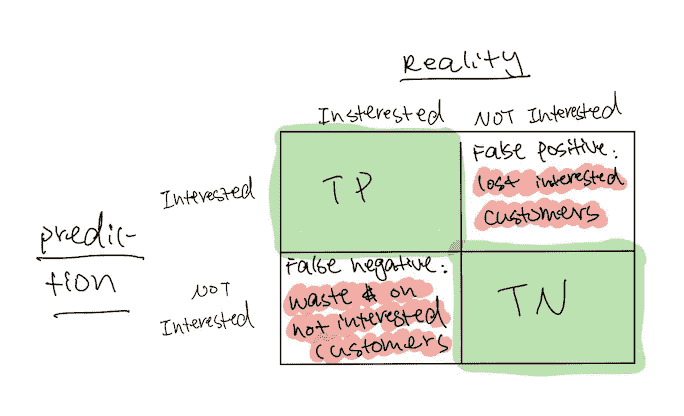
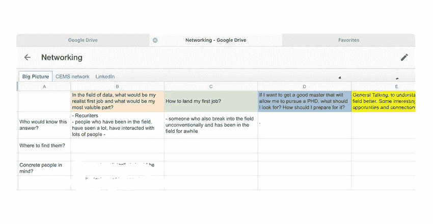

# 为什么我们必须谈论第一类错误和第二类错误？

> 原文：<https://towardsdatascience.com/programming-journal-4-why-do-we-have-to-talk-about-type-1-error-and-type-2-error-41b3ae68bb96?source=collection_archive---------54----------------------->

## 艰难的教训，真正的秘诀

## 从模型评估到商业决策…

在 [Unsplash](https://unsplash.com?utm_source=medium&utm_medium=referral) 上由 [nousnou 岩崎](https://unsplash.com/@nousnou?utm_source=medium&utm_medium=referral)拍摄的照片

你听说过 1 型错误和 2 型错误吗？还是假阳性，真阴性等？当我们研究假设检验时，通常会引入这些概念。这是推断统计学中的一个基本概念。然而，每个人都应该理解这一点，因为当我们想要评估使用哪个模型来进行更好的业务决策时，这也是至关重要的。我想告诉你为什么。

因为解释这个直截了当的概念有点枯燥，所以我将在这里使用一个类比来添加一些果汁，这样你就永远不会忘记这个概念🤓

想想你的男朋友/女朋友/想象中的伴侣。在一段关系中，我们知道有不同类型的谎言。其中一种是善意的谎言，意思是你问了一些信息，但是你的伴侣告诉了你一些不真实的事情，因为他/她想让你感觉更好。另一种谎言是隐藏信息。你询问一条信息，但你的伴侣只是否认。

对于这个类比，你可以把算法想象成测谎仪。与另一种类型的谎言相比，一些算法更擅长检测一种类型的谎言。我们需要知道这种算法擅长检测哪种类型的谎言。为什么？因为不同类型的谎言或者同一类型的谎言，在不同的情境下，会有不同的代价。

比如，对于善意的谎言来说，“我爱你做的菜”的谎言和“我爱你”的谎言不知道的代价是完全不同的(当然对于骗子来说，两个谎言被识破的后果也是很不一样的)。所以在第二种情况下，你会想要使用能够最好地检测善意谎言的算法！因为这个谎言会让你付出很大代价。

来源:makeameme.org

隐藏信息也一样。你的伴侣隐瞒了他/她吃了一个培根芝士汉堡的事实，而你们两个承诺一起节食，这和隐瞒他/她看到另一个人也就是欺骗你的事实有着不同的代价。因此，为了检测这一点，你需要选择一种对这类谎言特别敏感的算法。

## 现在你已经理解了不同类型的谎言以及它们的重要性。我们把技术术语带回来，连起来。

在一个模型中，我们有预测值(我们的模型给我们的值)和实际值(或观察值，我们从现实中观察到的值)。衡量我们的模型有多好的最直接的方法是看他们对实际值的正确次数。当实际值为*真*时，我们希望我们的预测说*真*，当它为*假*时，我们希望我们的预测说*假*。**因此，有两种类型的准确答案，模型也有两种出错的方式。**

来源: [mrzepczynski](http://mrzepczynski.blogspot.com/2015/01/type-i-and-type-ii-errors-and.html) ，经由 blogspot.com

对于假阳性、真阴性等术语，如果你觉得它们难以记忆，可以这样想:如果这是一个错误的预测，那么这个术语将以“假”开头，如果它是正确的预测，则以“真”开头。

联系到我们在关系中撒谎的类比，我想把“假阴性”理解为否认事实，因为它是否认，把“假阳性”理解为善意的谎言，因为这个人主动给了我一条新的信息。

## 现在我们知道了技术术语。让我们来谈谈为什么我们需要在商业环境中谈论它们。

原因是一样的，因为在不同的情况下，与每种错误相关的成本是不同的。

例如，[上周，](/programming-journal-3-logistic-regression-cbf68f01bf7d?source=friends_link&sk=bf04ad8889180a66ca5e850f2227e8da)我谈到了如何使用逻辑回归来预测哪些客户更有可能沿着漏斗向下移动，以便您可以集中精力锁定最有可能的客户。我们的逻辑回归有 98%的准确率，我们有 1000 个潜在客户。因此，200 个客户会有错误的分类，换句话说，我们的模型“欺骗”了我们。

比方说，我们有一些营销材料要邮寄给我们的潜在客户，我们只发送给那些我们希望重点锁定的客户，因为每份材料的制作成本为 100 美元。因此，如果所有的 200 名客户从未对我们感兴趣，但我们的模型告诉我们他们会感兴趣(假阳性:说谎让我们感觉更好)，我们将材料邮寄给他们，那么公司的成本将是 20，000 美元。另一方面，如果所有 200 个错误分类的客户都是假阴性(对我们隐藏信息)，换句话说，我们没有对那些本来会对我们感兴趣的客户采取任何行动，财务成本将是 0 美元。

尽管如此，尽管其中一个成本更高，但这并不一定能让一个比另一个更好。我试图反复强调这种情况的重要性，因为成本不仅仅是数字上的，我们还有机会成本和其他隐性成本。例如，如果你是一家 B2B 公司，与 B2C 公司相比，你的考虑应该是不同的，因为每笔交易的规模可能不同，所以损失 20，000 美元意味着不同的东西；或者对你的公司来说，首先很难让客户感兴趣，或者你通常每年只有 50 个客户，或者每个漏斗的成功率不同，等等。等。

如果你用谷歌搜索 1 型和 2 型错误，许多材料使用癌症检测来证明为什么知道类型会有所不同。该示例的重点是显示与不同类型相关的不同成本。明确地说，治疗一个健康病人的成本与不知道某人患有癌症的成本。在这里，我想强调在不同的情况下，即使是同一类型的错误也会产生不同的影响。

这里的要点是，记住同一类型的谎言在不同的情况下会有非常不同的代价。做生意也是一样。**同一类型的错误对于不同类型的企业来说，成本是不同的，更不用说不同类型的错误了。**

所以下一次，当你的数据团队向你展示一个模型和准确性时，问问他们，这个模型对哪种类型的错误更敏感？然后，在选择模型之前，了解与您的业务问题相关的成本！

我这边每周更新一次:

我选择这个主题来写这个星期，因为我花了大部分时间在模型评估、选择和特征工程上。我意识到，数据工程师的职位需要对业务和公司试图解决的业务问题有非常透彻的理解。我也开始怀疑在工作场所，许多公司将数据收集员(其他部门)、数据工程师和数据科学家的职位分开，这种设置有多容易引发问题。

我还在做上周帖子中提到的客户流失率项目。我希望在下面的帖子中，我可以完成这个项目，并以它作为一个真实的例子来演示两个模型如何具有相同的准确性，但由于不同类型的误差，对业务产生非常不同的影响。

在非技术方面。我申请了一些工作。我意识到我焦虑和缺乏信心的原因是由于缺乏这方面的经验，这直接影响了我的工作效率。

例如，我不确定我现在拥有的技术技能是否足以胜任数据分析师或数据工程师的工作；与其他候选人相比，我有竞争力吗？我可以花更多的时间准备、自学、做项目，直接开始做数据科学家吗？所有知识的缺乏让我不安，因为我觉得我没有足够的针对性。

所以，我决定向人们伸出援手，找到答案，而不是坐在那里，用我的想象力让自己冷静下来。我总结了我最关心的三个问题，并对它们的优先级进行了排序。我也愿意参加一般性的谈话，这样我可以更好地了解整个领域的生态系统，并对我的职业发展道路有一个想法。你可以看下面的截图。

我给每个问题都涂了颜色，这样在我列出我打算联系的人的其他页面上，我可以在他们的名字旁边加上不同的颜色。因此，对我来说，识别缺少哪种颜色是很容易的。

我最初是通过我学校的校友网络在 LinkedIn 上找人的。然而，因为我的学校是一所商学院，符合我条件的人非常有限。猜猜我做了什么？我开始通过 [*向数据科学*](https://towardsdatascience.com/) 筛选人哈哈。

我的结论是，在 TDS 上写作的人更有可能是喜欢分享的人，这将给我一个更好的机会去结识那些非常规进入这个领域的人。我已经确认了下周的两个电话！

我真的很感激有陌生人帮助我。我等不及有一天我会成为帮助别人的人了！

向梅致以最美好的祝愿！希望这个月一切都会变好:)

参考:

*   教务长，福斯特，1964-和汤姆。Fawcett，*【关于数据挖掘和数据分析思维，你需要知道什么】。*加利福尼亚州塞瓦斯托波尔:2013 年，奥赖利。