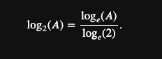
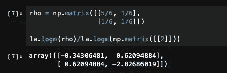
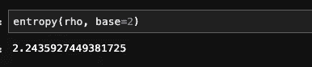

# 量子信息编程

> 原文：<https://towardsdatascience.com/programming-quantum-information-8f251ec6770?source=collection_archive---------46----------------------->

## [奇点研究](https://towardsdatascience.com/tagged/the-singularity-research)

## 使用 Python 和 Qiskit 的熵

在本文中，我们要来看看如何使用 Python 和 IBM 的免费开源量子计算软件 Qiskit 来理解量子系统中的*信息*和*熵*的概念。我们将看看熵的经典版本，以展示它与量子熵或*冯诺依曼熵的关系。我们会提供代码，最后会有一些免费的交互式 Jupyter 笔记本的链接，你可以在你的浏览器中运行，以更好地理解概念。*

量子电路

## 概率分布

在信息研究中，我们首先遇到的概念之一是概率分布。**有限概率分布**是一个函数，

概率分布

从某个有限集𝑋到区间[0，1]。𝑥2,…,𝑥𝑛} 𝑋={𝑥1 的有限集通常被认为是可能发生的事件的集合，值𝑓(𝑥𝑖)∈[0,1]是𝑥𝑖事件发生的相关概率。函数𝑓必须满足以下条件

概率之和必须为 1

所以所有的概率总和为 1。举个例子，如果我们有一枚硬币可以抛，我们可以把事件集合定为𝑋={ℎ,𝑡} (" *正面*"或"*反面*")，概率是𝑓(ℎ)=1/2 和𝑓(𝑡)=1/2.显然𝑓(ℎ)+𝑓(𝑡)=1，所以函数𝑓:𝑋→[0,1]是集合𝑋.上的概率分布如果我们有一个六面骰子，我们可以把事件集合看作是𝑌={1,2,3,4,5,6}，概率是

六面骰子的概率

函数𝑔:𝑌→[0,1]也是一个概率分布(在事件集𝑌).上现在，我们可以有**联合概率分布**，它是由像(𝑓×𝑔):𝑋×𝑌→[0,1].)这样的函数描述的在这种情况下，我们可以写出概率表

联合概率分布

在这种情况下，𝑋X 组的结果与𝑌Y.组的结果在本质上是独立的。掷硬币对掷骰子没有影响，掷骰子对掷硬币也没有影响。然而情况并非总是如此。有时我们有相互依赖的联合概率。在这种情况下，我们有**条件概率**，其中𝑦∈𝑌事件发生的概率取决于𝑥∈𝑋.事件

## 香农熵

在教科书中，可能发生的𝑋X 事件集通常被称为随机变量**。**香农熵**给出了我们通过学习随机变量的值平均获得多少信息的精确定义。𝑋的**熵**定义了在得知结果值之前，我们对𝑋的不确定性。因此，假设我们有一些有限的事件集(或随机变量)𝑋={𝑥1,…,𝑥𝑛}，相关的概率分布𝑓:𝑋→[0,1]取值{𝑓(𝑥1),…,𝑓(𝑥𝑛)}.香农熵定义为**

****

**香农熵**

**这里，对数以 2 为底。每个概率都是一个 0≤𝑓(𝑥𝑖)≤1.值让我们来看看抛硬币的例子。在这种情况下，香农熵就是**

****

**抛硬币的香农熵**

**现在，让我们看看六面骰子的情况。这种情况下的香农熵为**

****

**六面模具的香农熵**

**为了计算这一点(以及其他)，让我们用 Python 导入一些东西。首先，运行以下命令导入必要的库。**

****

**Python 导入**

**我们可以很容易地在 Python 中得到-log(1/6)的十进制近似值，如下所示。**

****

**Python 中的计算日志(1/6)**

**作为另一个例子，让我们以随机变量𝑋为例，它可以取值{𝑥1,𝑥2,𝑥3,𝑥4}.设相关的概率分布为**

**{𝑓(𝑥1)=1/8, 𝑓(𝑥2)=1/4, 𝑓(𝑥3)=1/8, 𝑓(𝑥4)=1/2}.让我们用 Python 来定义这些概率。**

****

**用 Python 定义概率**

**现在，让我们计算香农熵。**

****

**X 的香农熵**

## **冯·诺依曼熵**

**香农熵测量与经典概率分布相关的不确定性。我们在之前的笔记本中讨论过密度算子。回想一下，密度算符是一种描述量子系统可能状态的方式，或者等效地说，是一种描述可能测量结果的方式，与概率分布非常相似。量子态ρ(其中ρ是密度矩阵)的**冯诺依曼熵**定义为**

****

**冯·诺依曼熵**

**这里的对数现在是一个*矩阵对数*，也取为底数 2。如果我们让{𝜆𝑘}是矩阵ρ的*特征值*的全集，那么我们也可以将冯诺依曼熵定义为**

****

**冯·诺依曼熵**

**使用`scipy.linalg.logm()`可以在 Python 中计算矩阵对数。我们已经从 SciPy 导入了`linalg`作为`la`。让我们看一个例子。拿着矩阵**

****

**密度矩阵**

**在 Python 中，我们可以使用下面的代码来定义密度矩阵，**

****

**Python 中的密度矩阵**

**为了得到合适的基数 2，我们需要使用一个转换，**

****

**对数的底数变化**

**所以，我们真正需要的是，**

****

**矩阵对数**

**我们可以使用这个矩阵的迹来计算冯·诺依曼熵，如下所示，**

****

**冯·诺依曼熵**

**正如所料，这是一个 1×1 矩阵，即标量值。让我们为密度矩阵定义一个计算冯·诺依曼熵的函数。**

****

**Python 中的冯诺依曼熵函数**

**现在，让我们在矩阵`rho`上测试这个函数。**

****

**测试功能**

## **状态演化**

**在量子物理学中，状态很少保持不变。在量子计算的电路和门模型中，状态根据酉矩阵运算演化，状态向量的演化相当于线性代数。在其他模型中，我们可以使用哈密顿量来模拟状态的演化。有两种重要的状态叫做混合态和纯态。纯状态总是可以表示为状态向量与其自身的“外积”。混合状态通常表示为正交状态向量的和。在纯态的情况下，冯·诺依曼熵总是零。在混合态的情况下，熵可以是整个范围的值。让我们看一个例子，一个系统从纯态演化到混合态，然后又回到纯态。我们将看到冯·诺依曼熵逐渐增大，然后减小回到零。首先，我们来定义自旋向上和自旋向下的状态向量，以及外积给出的纯态。**

****

**定义纯态**

**我们可以使用下面的代码来绘制进化图，**

****

**情节演变**

**我们得到的图表如下，**

****

**我们可以将其与经典的香农熵进行比较**

****

**香农熵**

**看到它们实际上是一样的。**

****

**香农熵图**

## **使用 Qiskit**

**在 Qiskit 中，我们可以对下面的量子电路进行编程，**

****

**GHZ 状态**

**接下来，我们可以使用 Qiskti 的`Statevector()`函数来打印状态向量。这将有助于使用 Qiskit 中的函数`entropy()`计算相应密度矩阵的冯诺依曼熵。**

****

**状态向量**

**接下来，我们使用 Qiskit 的`DensityMatrix()`函数，将上面定义的`GHZ_state` ket-vector 传递给它。**

****

**Qiskit 中的密度矩阵**

**现在我们可以使用 Qiskit `entropy()`函数来计算熵。我们可以通过`Statevector`或`DensityMatrix`。在第二种情况下，我们得到有效的零熵，在第一种情况下，我们得到精确的零熵。这是有意义的，因为态是纯态，密度矩阵是按𝐷=|𝜓⟩⟨𝜓|.计算的**

****

**齐斯基特中的冯·诺依曼熵**

**最后，让我们使用 Qiskit 函数`random_density_matrix()`生成一个随机密度矩阵𝜌ρ。该函数的第一个参数是所需密度矩阵的维数，它不必是 2 的幂。然而，在具有量子位的量子电路的情况下，我们手动做出这种限制是很重要的。当然还有更一般的系统，包括像“ *qudits* 这样的东西，它们可能产生任意维的密度矩阵。**

****

**随机密度矩阵**

**我们可以使用 Qiskit `entropy()`函数来计算熵。**

****

**冯·诺依曼熵**

**让我们画出从 GHZ 态的密度矩阵𝐷给出的态演化到密度矩阵ρ描述的系统的熵。**

****

**绘图熵**

**我们得到的情节是，**

****

**如果你想了解更多，[可以考虑支持 Github](https://github.com/sponsors/The-Singularity-Research?preview=true) 。有超过 20 个免费的，关于量子计算和量子机器学习的交互式笔记本，你可以在你的浏览器中运行。有关熵的笔记本请点击[链接](https://github.com/The-Singularity-Research/entropy)。如果你想为这个项目做贡献，或者如果你需要在你正在做的事情中加入量子计算方面的咨询，请联系**

**thesingularity.research@gmail.com**

**一定要包括“黑客宇宙”这个主题，这样邮件才不会丢失。**