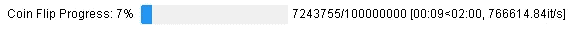
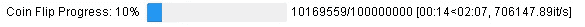
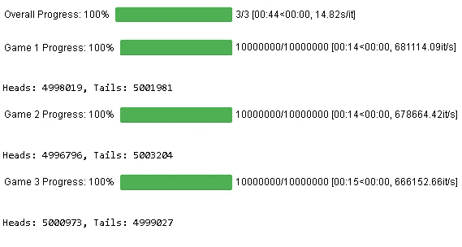
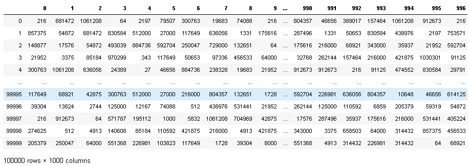

# 使用 tqdm 的 Python 的进度条

> 原文：<https://towardsdatascience.com/progress-bars-for-python-with-tqdm-4dba0d4cb4c?source=collection_archive---------9----------------------->

## 使用智能进度条跟踪 Python 迭代的执行


在 [Unsplash](https://unsplash.com?utm_source=medium&utm_medium=referral) 上由[zdenk macha ek](https://unsplash.com/@zmachacek?utm_source=medium&utm_medium=referral)拍摄的照片

在我开始从事 Python 中的机器学习项目后不久，我遇到了需要很长时间才能运行的计算密集型任务。通常这与某种可重复的过程有关。我立即想到的两个例子是:( 1)在 p、d 和 q 订单上运行网格搜索，以在大型数据集上拟合 ARIMA 模型，以及(2)在训练机器学习算法时网格搜索超参数。在这两种情况下，您可能会花费数小时(或更长时间！)等待您的代码运行完毕。我迫切需要某种指标来显示这些任务的进展，于是我找到了 **tqdm** 。

## 什么是 tqdm？

[**tqdm**](https://tqdm.github.io/) 是一个 Python 库，允许你通过环绕任何 iterable 来输出一个智能进度条。一个 **tqdm** 进度条不仅显示了已经过去的时间，还显示了可迭代的估计剩余时间。

## **安装和导入 tqdm**

由于 **tqdm** 是 Python 包索引( [PyPI](https://pypi.org/) )的一部分，因此可以使用 **pip install tqdm** 命令进行安装。

我倾向于经常在 IPython/Jupyter 笔记本上工作，而 **tqdm** 为此提供了出色的支持。要开始在笔记本上玩 **tqdm** ，您可以导入以下内容:

## 例子

为了清楚起见，我不会在这篇文章中进行计算密集型的网格搜索——相反，我将使用几个简单的例子来演示 **tqdm** 的用法。

**For-loop 进度**

假设我们想在跟踪结果的同时模拟投掷一枚硬币 100，000，000 次，我们还想看看这些迭代在 Python 中运行需要多长时间。我们可以围绕 iterable(范围(100000000))包装 **tqdm** 函数，这将在 for 循环运行时生成一个进度条。我们也可以使用 **desc** 关键字参数给进度条指定一个名称。



产生的 **tqdm** 进度条为我们提供信息，包括任务完成百分比、完成的迭代次数、经过的时间、估计的剩余时间以及每秒完成的迭代次数。

在这种情况下， **tqdm** 允许通过使用 **trange(100000000)** 代替 **tqdm(范围(10000000))**进行进一步优化。



**嵌套 for 循环进度**

如果您遇到需要嵌套 for 循环的情况， **tqdm** 允许您在多个层次上跟踪这些循环的进度。例如，让我们以抛硬币为例，但这次我们想玩三个独立的 10，000，000 次抛硬币的“游戏”,同时跟踪结果。我们可以为“整体进度”创建一个 **tqdm** 进度条，以及三个游戏中每一个的进度条。



## 熊猫集成

**tqdm** 的一个稍微不同的实现涉及到与 [**熊猫**](https://pandas.pydata.org/) 的集成。 **tqdm** 可以为**提供额外的功能。应用()**方法的一个**熊猫**数据帧。熊猫。必须首先使用下面的代码向 **tqdm** 注册 progress_apply() 方法。然后，是**。使用 progress_apply()** 方法代替传统的**。apply()** 方法——不同之处在于，我们现在在方法的输出中包含了一个智能进度条。

```
Processing Dataframe: 100%|██████████| 1000/1000 [00:02<00:00, 336.21it/s]
```



## 其他 tqdm 集成

除了与 **IPython/Jupyter** 和 **pandas** ， **tqdm** 提供与 [**Keras**](https://keras.io/) 和实验模块的集成，用于 [**itertools**](https://docs.python.org/3/library/itertools.html) ， [**并发**](https://docs.python.org/3/library/concurrent.futures.html) ， [**不协调**](https://pythondiscord.com/) 和 [**电报**这篇文章仅仅触及了 **tqdm** 功能的表面，所以请务必查看](https://github.com/python-telegram-bot/python-telegram-bot)[文档](https://github.com/tqdm/tqdm/tree/f4b172f7ec7598d75df094eb713c5be5370033bc#ports-to-other-languages)以了解更多关于如何在 Python 代码中包含智能进度条的信息！

## 参考

[](https://github.com/tqdm/tqdm/tree/f4b172f7ec7598d75df094eb713c5be5370033bc#ports-to-other-languages) [## tqdm/tqdm

### tqdm 源自阿拉伯语 taqaddum (تقدّم)，意思是“进步”，是“我如此爱你”的缩写

github.com](https://github.com/tqdm/tqdm/tree/f4b172f7ec7598d75df094eb713c5be5370033bc#ports-to-other-languages)  [## tqdm 文档

### tqdm 在阿拉伯语(塔卡杜姆，تقدّم)中是“进步”的意思，在西班牙语中是“我非常爱你”的缩写(特…

tqdm.github.io](https://tqdm.github.io/)