# 渐进神经网络:解释与实现

> 原文：<https://towardsdatascience.com/progressive-neural-networks-explained-implemented-6f07366d714d?source=collection_archive---------25----------------------->

## 学习使用 PyTorch 和 Doric 库创建渐进式神经网络。

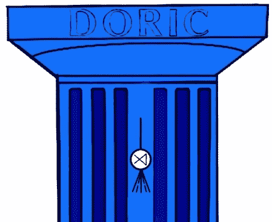

## 目录

```
• [Introduction & Background](#b575)
    ∘ [Transfer Learning](#2f8f)
    ∘ [Progressive Neural Networks](#0d70)
• [Doric](#a6bc)
• [Simple Example](#a1b0)
• [Complex Example](#9e99)
    ∘ [Autoencoders & VAEs](#4b35)
    ∘ [Experimental Design](#50ba)
    ∘ [Results](#4088)
    ∘ [Analysis](#81c7)
• [Conclusion](#b78d)
• [Acknowledgments](#5f5d)
• [Links & References](#8e8d)
```

# **简介&背景**

学习新的东西需要你建立在你已经知道的基础上。就像一把简单的锤子可以被用来将金属塑造成更加动态和复杂的工具一样，先前的知识可以成为形成想法和创造新知识的基础。研究只不过是这种想法一遍又一遍地应用于自身。

迁移学习是指将在一项任务中学到的知识应用到另一项相关任务中。许多神经网络转移学习技术已经被成功地使用。然而，网络的拓扑通常是固定的，旧任务中使用的参数很可能被破坏性地覆盖。这些不需要的品质由渐进式神经网络解决，这种网络可以扩展其拓扑结构——用它来传输重要的知识——同时保留原始参数供以后使用。

本文将讨论迁移学习、灾难性遗忘和渐进式神经网络。在这本书中，我们将学习使用 Doric 库和 PyTorch 来创建程序网；以及遍历它背后的代码，并检查它如何实现渐进式神经网络论文中讨论的功能。最后，我们将使用 Doric 运行两个 prognet 实验，并分析它们的结果，以更好地理解使用渐进式神经网络进行迁移学习的好处和缺点。

## **转移学习**

国际象棋是一种有趣而复杂的游戏，像许多伟大的游戏一样，它的复杂性可能需要花一生的时间来掌握——然而它的基本机制可以在一个下午就被教授和理解。每个象棋新手最终都会遇到类似下图的情况，他们会很快学会白棋的最佳走法:移动骑士同时攻击黑棋的两个车。

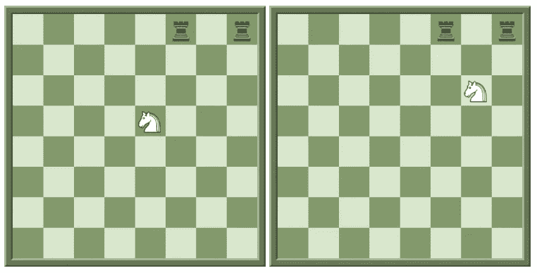

通过同时威胁两个目标，白棋迫使一个有利的交易。

这种策略被称为“叉”，将黑方置于两败俱伤的境地，他们必须用自己的一辆车交换白方的骑士。熟练的棋手将会知道迫使对手下叉是非常有利的。

国际象棋并不是唯一出现这种简单战术的游戏。Connect-4 是一种游戏，其中两名玩家将瓷砖扔进一个 6×7 的直立网格中，目标是在对手之前完成 4 个瓷砖。下图是一个 connect-4 板。红色有机会以这样一种方式连接三个瓷砖，蓝色只能阻止一边的运行，让红色在下一轮获胜。


Connect-4 战略在很大程度上基于这一策略。

国际象棋和 Connect-4 是非常不同的游戏，但它们都包括从两个方向同时进攻的相同策略，迫使敌人陷入无赢的局面。事实上，叉子战术可以在许多游戏中找到。通过学习叉子的概念，并通过不同游戏的机制应用该概念，我们能够跨不同领域传递知识。学象棋可以教我们一些关于 Connect-4 的知识。

亲爱的读者，这就是迁移学习的本质。

迁移学习是将从一项任务中获得的知识应用到另一项独立但相关的任务中的过程。近年来，迁移学习在语言和图像处理领域得到了广泛的应用。在自然语言处理中，预训练的嵌入模型如[埃尔莫](https://arxiv.org/pdf/1802.05365.pdf)、[伯特](https://arxiv.org/pdf/1810.04805.pdf)和 [GPT-2](https://cdn.openai.com/better-language-models/language_models_are_unsupervised_multitask_learners.pdf) 已经成功地学习了英语的基本结构，从而可以应用于许多任务。在这种情况下，模型通常被冻结，优化只在连接到嵌入器头部的任务模型上执行。虽然这种方法对于语言任务来说是理想的，但它依赖于遵循语言结构的一致输入。在图像处理中，完全训练卷积神经网络来完成复杂的任务已经变得罕见。相反，通才预训练网络，如 [ResNet-50](https://arxiv.org/pdf/1512.03385.pdf) 、 [GoogLeNet](https://arxiv.org/pdf/1409.4842.pdf) 和 [VGG-19](https://arxiv.org/pdf/1409.1556.pdf) 会根据新数据进行再训练。这个过程被称为微调。虽然微调是使网络适应新数据的有效方法，但它也不是没有缺点。

灾难性遗忘是一种有害事件，在微调过程中可能发生在经过训练的神经网络中。当网络中的重要参数被更改以适应新数据时，就会发生这种情况，从而损害网络处理旧数据的能力。理想情况下，网络可以通过在很少使用的参数中编码新信息，或者通过改变重要参数以推广到其他任务而不是完全切换到其他任务，来保持其在先前任务中的能力。使用标准的基于梯度的学习方法，这通常是不可能的。已经提出了许多对抗灾难性遗忘的方法，但这里讨论的算法不止于此:它完全消除了灾难性遗忘，同时仍然允许有效的一般迁移学习。

**渐进神经网络**

渐进神经网络(prognets)是 Deepmind 在他们的论文 [*渐进神经网络*](https://arxiv.org/pdf/1606.04671.pdf) (鲁苏等人，2016)中开发的一种神经算法。程序网是一种简单、强大和创造性的迁移学习的解决方案——引用论文摘要，它们“不会遗忘，并且可以通过与先前学习的特征的横向连接来利用先前的知识”。

程序网开始存在时只有一个单列的神经网络，它将在一个初始任务上被训练。每列由 *L* 个块组成，每个块包括一层神经元 *W* ，一组用于每个父列的侧神经元 *U* ，以及一个激活函数 *f* 。由于初始列没有传入的横向连接，它将与标准神经网络的行为相同。这第一列学习任务 1，然后它的参数被冻结。对于任务 2，将生成一个新列，并添加横向连接。这些横向连接将所有先前列中的先前块的输出作为输入。然后将侧层添加到主层上，最后进行活化。


列 *k* 的块 I 的方程。


第一列(k = 0)。

下面是一个 prognet 的插图，在 progressive neural nets 论文中发现了 K = 3 个任务和 L = 3 个块。请注意，任何给定的块都是其自身参数、其自身列中的前一个块的输出以及所有先前列中的前一个块的输出的函数。


[*渐进式神经网络*](https://arxiv.org/pdf/1606.04671.pdf)

理解程序网的另一种方式是把每个程序块看作一个计算的黑盒，它需要决定哪些信息源对完成它的任务最有效。例如，在上图中， *output₃* 可以访问先前的隐藏层 *h₂* 。但是，它还可以访问每个父列的 *h₂* 层，并可以使用其横向参数在本地微调它们的输出。如果 *output₃* 模块发现 *h₂* 拥有它需要的所有信息，它可以“清零”其他输入。如果它发现 *h₂* 和 *h₂* 各自提供了所需的部分信息，它可以忽略 *h₂* ，充当 *h₂* 和 *h₂* 的函数。通过建立这些横向连接，我们允许网络轻松地在任务之间传递信息，同时也允许它忽略不重要的信息。

作者在一组强化学习环境中测试了他们的算法，包括 pong 变体、迷宫变体和 Atari 游戏。他们对各种基线模型进行了测试，发现程序网优于每种基线。在发表之后，其他几篇论文已经展示了跨不同领域的程序网的成功使用；例如， [*渐进式神经网络用于情感识别中的迁移学习*](https://arxiv.org/pdf/1706.03256.pdf) (Gideon et al .，2017)发现，在给定一组积木式任务的情况下，渐进式神经网络可用于情感检测。类似地， [*用渐进网络*](https://arxiv.org/pdf/1610.04286.pdf) (鲁苏等人，2018)从像素学习的模拟到真实机器人表明，渐进神经网络可以用于在不完美的机器人模拟和真实硬件之间进行转换。


[用机械手将 Sim 传送到机器人。](https://arxiv.org/pdf/1610.04286.pdf)

虽然上述渐进式神经网络出版物在各种强化学习任务上测试其算法时产生了令人信服的结果，但程序网并不是迁移学习的灵丹妙药。主要是它们是参数浪费的:每个侧化的块需要一个完整的侧层用于它从中提取的每个父列。目前形式的程序网也仅限于对每个记录都有相应任务标签的数据起作用。为了允许冻结，每个任务必须按顺序学习，而顺序会极大地影响最终网络的质量。这通常只是一个较小的限制，但仍然是一个限制。此外，由于冻结，如果任务改变，程序就不灵活。因此，这意味着色谱柱应该在冻结前非常熟练地完成任务。

总之，渐进式神经网络不受灾难遗忘的影响，因为它们冻结了每个完成的列，但它们也允许通过与新列的横向连接进行有效的迁移学习。他们牺牲了增加的模型复杂性(即，在每个额外的列中训练更多的参数)和改变任务的灵活性来实现这一点。许多先前的出版物和实验支持这种算法作为有效的迁移学习平台的可信度。

# **多利安**

Doric 是我开发的工具，用于实现和扩展渐进式神经网络。这是一个建立在 PyTorch 之上的免费开源库。在本文的剩余部分，我们将遍历 Doric 背后的代码，用它运行一个简单的实验来分析正在训练的 prognet，最后，在一组困难的图像处理任务上测试 Doric。

注意:这里显示的 Doric 版本是简化的。完整版带示例代码[这里](https://github.com/arcosin/Doric)。

首先，我们的库需要块的定义。每个块必须包含一个激活函数，一个充当块的主层的模块，以及一个实现 *U* 参数的横向层列表。Doric 使用下面的抽象类。

通过扩展这个类和实现未实现的方法，用户可以很容易地为任何可以想象的用途创建他们自己的程序块。再补充几个简单的。

现在我们有了简单密集层、批量标准化密集层和 2D 卷积层的模块。注意，在我们的对象中，任何包含 PyTorch 模块的列表都被实现为 nn.ModuleLists，这是因为它允许 PyTorch 正确地注册这些子模块。另外值得注意的是，因为 ProgBlocks 是 nn 的一个子类。模块，它们可以像任何其他 PyTorch 模块一样运行。但是，我们没有在它们上面实现 forward 方法，所以我们仍然需要调用 runActivation 和 runBlock。

```
tensor([
[0.0000, 0.0000, 1.8789, 0.0000, 0.0000],
[0.0138, 0.0000, 2.9942, 0.0000, 0.0000],
[1.5449, 0.0000, 2.8891, 0.0000, 0.0000]], 
grad_fn=<ReluBackward0>)
```

现在我们有了一个 block 对象，我们需要将它们组织成列网络。每次指定新任务时，都需要添加这些列网。然而，由于我们有一个很好的可扩展的块结构，我们不需要依赖用户来实现单独的列——至少不直接。

最后，我们需要整个渐进式神经网络。该对象将包含一个列网列表，并将运行每个必要的列，以产生给定任务的结果。

有几件重要的事情需要注意。首先，在 addColumn 中，Doric 允许用户直接传递列网，或者用户可以通过扩展 ProgColumnGenerator 类来创建列生成器。

这允许用户在 generateColumn 方法中定义每个列的体系结构，这样 prognet 就可以添加列，而无需传递列。msg 参数还允许用户通过 addColumn 方法传递信息来生成 Column。

第二件特别重要的事是向前的方法。这实际上是渐进神经网络算法的核心。prognet 按顺序运行每一列，直到到达与给定任务相关联的列。这允许后面的列访问每个分支的输入。

就其本身而言，这足以为任何简单的顺序体系结构创建渐进式网络，但当我们需要更复杂的体系结构时，它就会崩溃。举个例子，这张 Q 函数评论家网络图是我在另一个项目中作为 [DDPG](/deep-deterministic-policy-gradients-explained-2d94655a9b7b) 代理的一部分而写的:

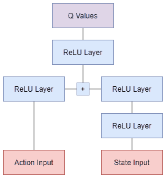

为这样的网络设计渐进式系统的最简单方法是允许使用多通道模块。这些砌块还必须允许某些非横向通道上的直通通道。

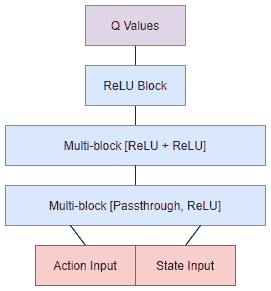

除此之外，我们还需要解决 Doric 的一个特性:惰性和 lambda 块。惰性块是可以被侧化的块——不在初始列中，也不在第一行中——但是故意不被侧化。这些允许我们在我们的网络中包括特殊的操作，或者减少那些没有从迁移学习中受益的块中不必要的参数。

要实现这两个更改，我们只需要定义它们，并对我们的列网络类做一些小的更改。

仅此而已。截至本文发表时，这是 Doric 的(简化的)核心功能。使用这些工具，我们可以将大多数神经网络架构实现为一个 prognet。

# **简单的例子**

对于第一个 Doric 示例，我们将创建一个双任务 prognet。具体来说，我们将教会我们的列模拟 xor 和 nand 函数。回想一下，xor 和 nand 的真值表如下。

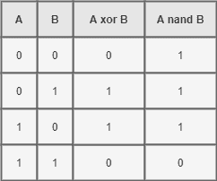

在这个简单的实验中，我们的第一篇专栏文章将解决 xor 任务，第二篇将利用第一篇文章解决 nand 问题。要明确的是，这不是一套需要迁移学习的任务。具有这种结构的单柱网络可以毫不费力地解决任一任务。这个实验的价值在于，它将允许我们深入分析这些网络，并观察横向连接如何传递知识。这是我们将在实验中使用的代码。

运行该程序后，我们会收到这些结果。

```
Testing Xor.
Input: [0, 0].  Target: 0\.  Predicted: 0\.  Error: 0.
Input: [0, 1].  Target: 1\.  Predicted: 1\.  Error: 0.
Input: [1, 0].  Target: 1\.  Predicted: 1\.  Error: 0.
Input: [1, 1].  Target: 0\.  Predicted: 0\.  Error: 0.Testing Nand.
Input: [0, 0].  Target: 1\.  Predicted: 1\.  Error: 0.
Input: [0, 1].  Target: 1\.  Predicted: 1\.  Error: 0.
Input: [1, 0].  Target: 1\.  Predicted: 1\.  Error: 0.
Input: [1, 1].  Target: 0\.  Predicted: 0\.  Error: 0. Xor and Nand params:
columns.0.blocks.0.module.weight
Parameter containing:
tensor([[-3.2474,  3.2474],
        [-2.0008,  2.0429],
        [-0.5795,  0.0801]])
columns.0.blocks.0.module.bias
Parameter containing:
tensor([-1.7442e-05,  2.0007e+00, -3.0051e-01])
columns.0.blocks.1.module.weight
Parameter containing:
tensor([[ 4.5644, -3.4079,  0.1078]])
columns.0.blocks.1.module.bias
Parameter containing:
tensor([3.0512])
columns.1.blocks.0.module.weight
Parameter containing:
tensor([[-0.2739, -0.1766],
        [ 0.5853,  2.8434],
        [-0.6689,  0.3338]], requires_grad=True)
columns.1.blocks.0.module.bias
Parameter containing:
tensor([-0.3227, -0.5853, -0.3339], requires_grad=True)
columns.1.blocks.1.module.weight
Parameter containing:
tensor([[-0.1367, -2.9894, -0.4210]], requires_grad=True)
columns.1.blocks.1.module.bias
Parameter containing:
tensor([1.9972], requires_grad=True)
columns.1.blocks.1.laterals.0.weight
Parameter containing:
tensor([[1.9479, 0.2868, 0.1236]], requires_grad=True)
columns.1.blocks.1.laterals.0.bias
Parameter containing:
tensor([1.8058], requires_grad=True)
```

这些日志显示网络学习了 xor 和 nand 功能，但是如果我们想知道它是如何完成的，我们需要更仔细地观察。让我们从 xor 列开始。在一个图形结构上绘制出所有的参数后，我们可以构建下图。

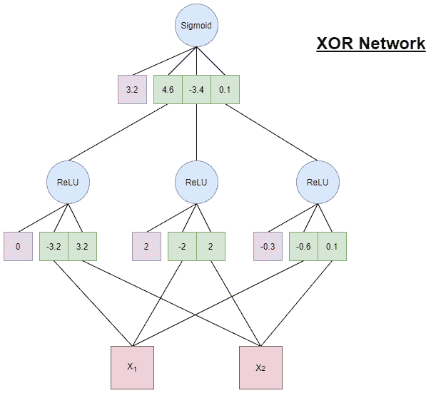

注意事项:

*   最右边的神经元将总是输出 0。这意味着学习这个函数是不必要的。
*   如果 X1 和 X2 相同，它们将抵消，并且偏移参数将确定隐藏层的输出。结果是 sigmoid(-3.6)，或~0.02。
*   如果 X1 是 1，X2 是 0，隐藏层输出[0，0，0]。结果是 sigmoid(3.2)，或~0.96。
*   如果 X1 是 0，X2 是 1，隐藏层输出[3.2，4，0]。结果是~0.98。

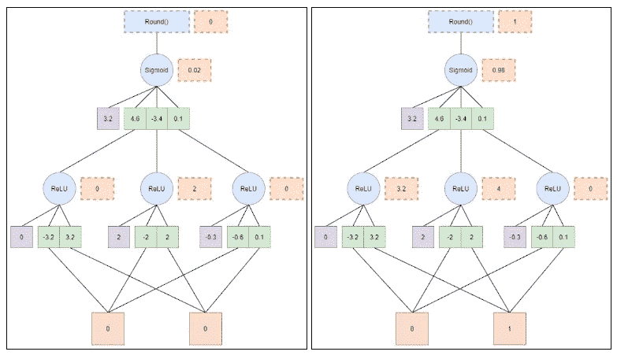

所有这些都是值得了解的，但也不足为奇。让我们看看当我们添加 nand 列时会发生什么。

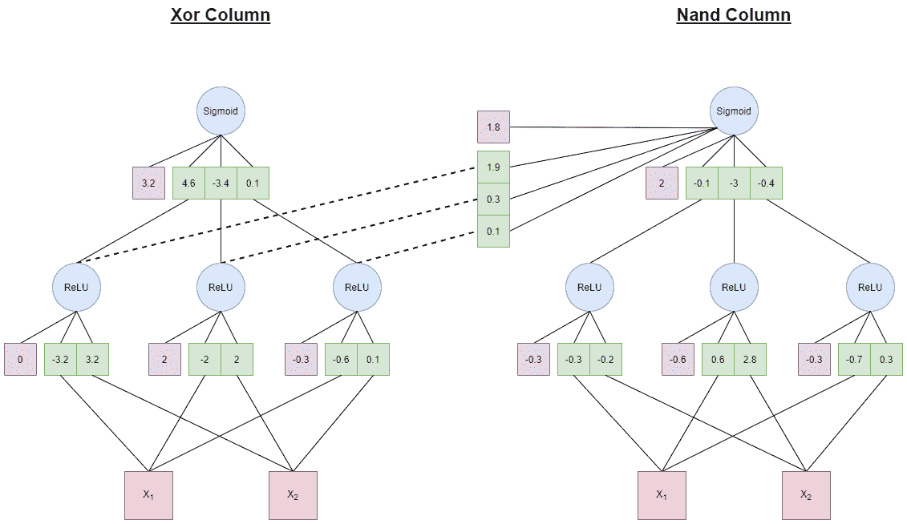

现在，我们列举所有的输入组合。


X = [0，0]


X = [0，1]

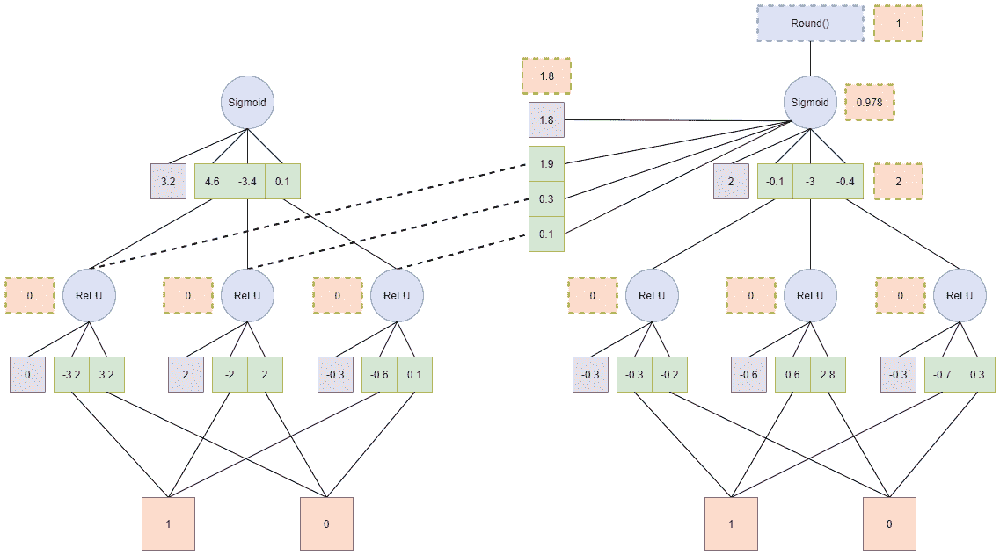

X = [1，0]

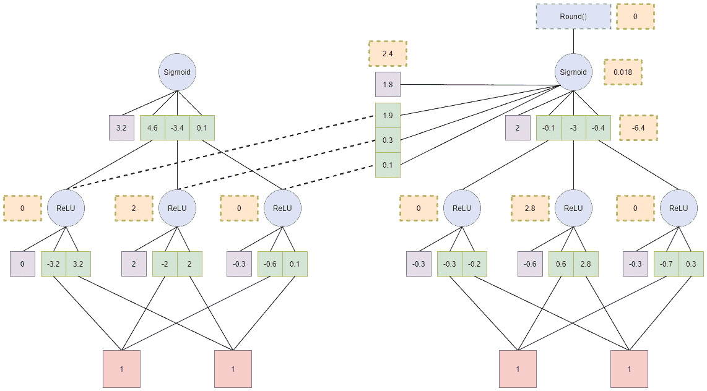

X = [1，1]

需要注意的事项:

*   这一次，两个隐藏层神经元被置零。这是因为 nand 比 xor 容易得多(nand 是线性可分的)。
*   隐藏层中仍然活跃的神经元将输出 0、2.8 或 2.2。
*   当主动隐藏神经元输出 2.2 时，外侧层出现尖峰，以补偿非外侧输入的-4.6 值。
*   如果横向层被归零，给定[0，1]输入，答案将是不正确的。
*   当给定输入为[0，0]或[1，1]时，分支输出相同的值。对于这些输出，分支并不重要。

# 复杂示例

## 自动编码器&阀门

自动编码器是一种功能强大的架构，可以应用于许多任务并产生良好的结果(尤其是图像处理任务)。它们也是演示渐进式网络的理想选择。这有两个原因:

1.  编码器部分的任务之间可能有很多共享信息。
2.  自动编码器通常是非常深的网络，这一特性允许我们展示一个具有大量分支的网络。

可变自动编码器(VAEs)是自动编码器的一种变体，其中网络学习数据的平均值和标准偏差的抽象，而不是数据本身。这给了解码器部分强大的生成能力！这篇文章很长，没有深入解释自动编码器和 VAEs，所以我推荐阅读 Irhum Shafket 撰写的这篇[关于数据科学的文章。](/intuitively-understanding-variational-autoencoders-1bfe67eb5daf)

## **实验设计**

对于这个实验，我们将使用 Doric 构建一个渐进变分自动编码器。该网络将能够在图像处理领域执行四种不同的任务。下面列出了这些操作。

1.  简单重构—将输入重构为输出，通过瓶颈层保留重要信息。
2.  去噪-从输入中移除椒盐噪声。
3.  着色-向输入的灰度版本添加颜色。
4.  修复—在图像中被随机游走的黑色像素遮挡的部分进行绘画。

我们将使用[名人数据集](http://mmlab.ie.cuhk.edu.hk/projects/CelebA.html)进行实验，这是一个大规模的名人脸部图像集。这个数据集适合我们实验的参数，因为它的大小，难度，以及容易注意到人脸的不一致。

运行这个实验的完整代码可以在示例目录中的 [Doric 存储库中找到。](https://github.com/arcosin/Doric/tree/master/examples)

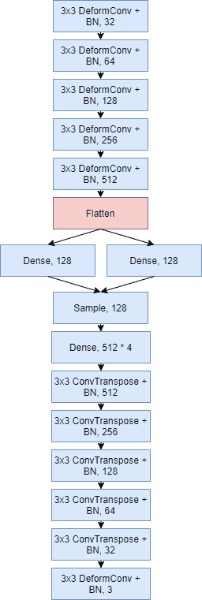

我们的图像处理 VAE 柱的结构。

## 结果

下面是进步 VAE 的三个实验柱的结果。所有格式都是*原始/输入/输出*。列 0(简单重建)未显示，因为它不包含分支。

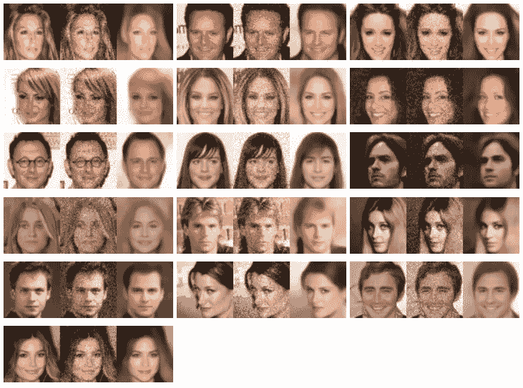

第 1 列(去噪)

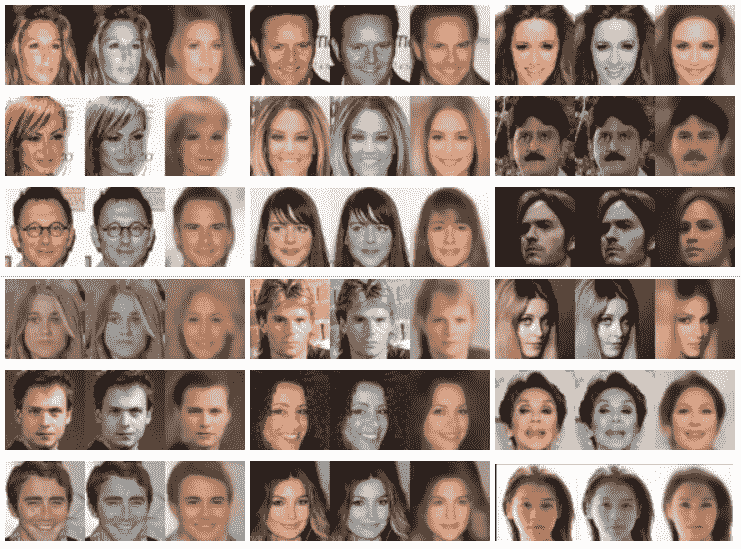

第 2 列(着色)

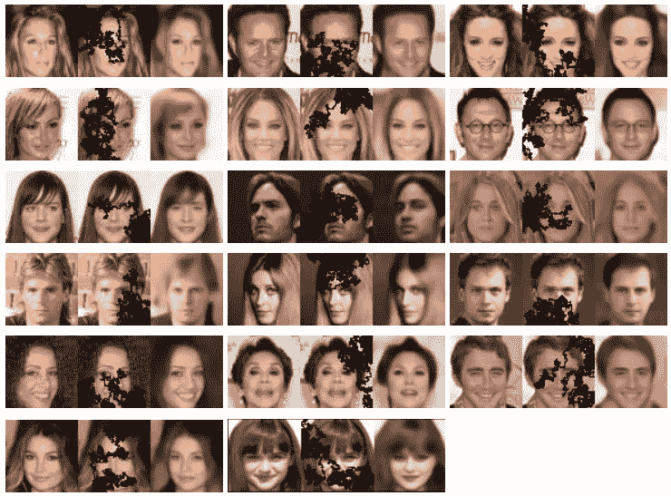

第 3 列(修复)

## 分析

为了开始我们对结果的分析，我认为首先解决 autoencoder 的奇怪之处是很重要的——虽然有些图像翻译得很好，但有些却不是。然而，当 VAE 失败时，它很少通过创建错位或不现实的人脸来实现。相反，它过度概括，创造了一个新的人类面孔，更类似于以前见过的面孔。这些种类的错误，以及其他奇怪的错误，都不是由 prognet 引起的，在独立的 VAE 中也会发生。


在这张图片中，网络做了很好的重建工作，甚至匹配了大部分被随机行走覆盖的头发梯度。


另一方面，这个人完全被取代了。也有很多照片中的脸没有被替换，但是眼镜被拿掉了。


背景极有可能变得模糊，因为 VAE 知道背景并不重要。

也就是说，我们可以开始分析与 prognet 相关的结果。从降噪专栏开始，我们看到了我们对任何正常的 VAE 降噪师的期望。网络在去除噪声和保持图像质量方面做得很好(模糊是可以预料的，因为瓶颈只有 128)。值得注意的是训练时间；如果您运行代码，您可能会发现，作为一个 prognet，网络学习去噪要比作为一个独立的网络快得多。

在彩色栏中，我们可以看到结果又一次和我们预期的一样。更值得注意的任务是由第三列执行的修复。在之前专栏知识的帮助下，我们能够得到惊人的结果。即使图像的一小部分通过掩模被损坏的像素曝光，网络也可以重建图像，几乎与简单的重建一样好。


由于只能看到她嘴的一小部分，VAE 能够重现她口红的颜色。


即使重要的面部特征被遮挡，VAE 也能够利用现有的信息重建出合理的相似度。

生成高质量的结果图像对 prognet 来说是一个好兆头，但要了解横向参数的影响，我们需要找到一些方法来测试它们如何影响结果。一种方法是在移除横向参数的情况下运行正向通道。如果结果仍然是可识别的，分支没有做太多。如果结果是明亮的但不可识别的，则分支与主网络参数一起工作来创建结果。如果结果是暗的或完全黑的，则该列仅使用或主要使用分支进行计算。这是那次向前传球的结果。


无侧边去噪。


无侧边着色。


无侧边修补。

这些结果表明，在列 1 和列 2 中，大部分计算是由分支完成的。在最后一栏中，几乎所有的工作都是由分支完成的。这是迁移学习正在发生的一个强有力的标志。

# 结论

渐进神经网络是迁移学习和连续学习的有力工具。虽然它们受到浪费内存使用、需要标记和明确定义的任务以及无法适应先前学习的任务变化的限制，但它们完全不受灾难性遗忘的影响，并且它们为持续学习神经系统的宽度方向增长提供了新的模板。在 progressive neural net 论文中进行的实验，以及其他论文和本文中提出的实验，显示了强有力的证据，表明 prognets 是迁移学习的可行工具。

同样，Doric 是一个用于程序开发和实验的有用的轻量级库。借助用户创建的模块以及多通道模块和惰性模块，几乎任何标准架构都可以作为渐进式网络实施。

# 感谢

感谢 Case Wright 在开发 Doric 和编写我们所有的 autoencoder 测试中的帮助，感谢 David Stucker 的帮助编辑，感谢 Gustavo Rodriguez-Rivera 博士的指导和学术支持，感谢 Purdue 大学。

# **链接&引用**

*   *渐进式神经网络论文—*[](https://arxiv.org/pdf/1606.04671.pdf)
*   **全多利安库—*[*https://github.com/arcosin/Doric*](https://github.com/arcosin/Doric)*
*   **CelebA 数据集—*[*http://mmlab.ie.cuhk.edu.hk/projects/CelebA.html*](http://mmlab.ie.cuhk.edu.hk/projects/CelebA.html)*
*   **自动编码器和 VAEs 解释—*[*https://towards data science . com/直观-理解-变分-自动编码器-1bfe67eb5daf*](/intuitively-understanding-variational-autoencoders-1bfe67eb5daf)*
*   **用于情感识别中迁移学习的渐进式神经网络—*[*https://arxiv.org/pdf/1706.03256.pdf*](https://arxiv.org/pdf/1706.03256.pdf)*
*   **虚拟现实机器人用渐进网络从像素学习—*[*https://arxiv.org/pdf/1610.04286.pdf*](https://arxiv.org/pdf/1610.04286.pdf)*
*   **棋图制作人—*[*http://SVG _ experimenten . DEDS . nl/棋盘/Chess _ diagram _ maker . html*](http://svg_experimenten.deds.nl/chessboard/chess_diagram_maker.html)*

*除非另有说明，所有图片和其他版权材料均由作者创作。*