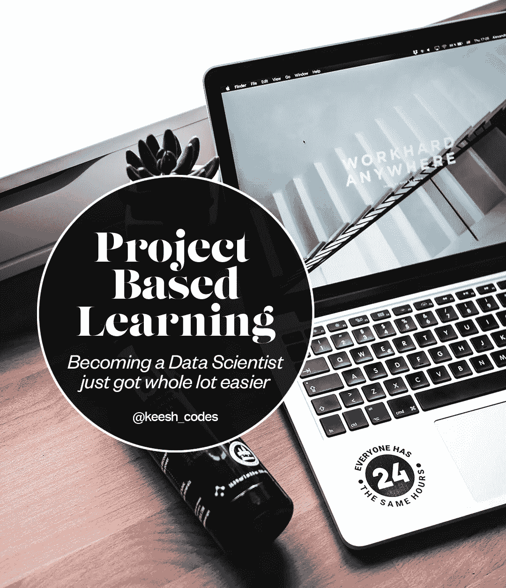

# 数据科学家基于项目的学习

> 原文：<https://towardsdatascience.com/project-based-learning-for-data-scientists-df6a8f74e4a1?source=collection_archive---------9----------------------->

## *成为一名数据科学家变得简单多了*

要成为一名数据科学家，需要学习很多东西。一个真正优秀的数据科学家候选人不仅要具备良好的技术技能，还要能够*批判性地思考和解决业务相关问题，以指导业务决策。*

从本质上说，培养如何解决不同业务问题的敏锐感觉，会让你在面试过程中从潜在雇员中脱颖而出。

那么，如何才能培养你的*数据直觉*？在本文中，我将与您分享我最喜欢的培养关键批判性思维技能的策略之一，通过**基于项目的学习，让您走上发展数据直觉的道路。**

什么是基于项目的学习？

基于项目的学习(PBL)是通过实际工作和应用来发展你的技能。在数据科学的背景下，这意味着使用您已经掌握或正在掌握的各种技能对许多不同种类的数据进行数据分析。本质上，要发展你的数据感觉和直觉，你需要练习使用它们。

**但是怎么做？**

随着您处理越来越多的数据分析，或*项目*，您将会接触到越来越多来自不同领域的数据，这些数据将会有独特的业务相关问题需要您去寻找和解决。

你能够完成的项目越多，你接触不同种类的数据、业务问题和*发展数据感觉的机会就越多。*

不仅如此，这里还有一些基于项目的学习的额外好处:

*   练习编写复杂的代码来解决与特定行业数据相关的特定问题
*   当不同的错误出现时，发展你解决问题的技巧(也就是成为一个更好的谷歌人)
*   练习/学习你从未接触过的技能
*   增强对自己作为数据科学家能力的信心
*   你可以把个人项目放在简历上展示给雇主看

听起来很棒，对吧？让我告诉你如何开始。

**建立你的第一个数据科学项目**

1.  **选择您的数据集**

这里有一个免费的数据集存储库列表，你可以仔细阅读并下载你喜欢的数据集。我会选择你真正感兴趣的主题的数据集，而不是你认为雇主想看到的。

*   [卡格尔](https://www.kaggle.com/)
*   [来自 GitHub 的令人惊叹的公共数据集](https://github.com/awesomedata/awesome-public-datasets)
*   [改头换面星期一](https://www.makeovermonday.co.uk/data/)
*   [谷歌的测试数据集搜索引擎](https://toolbox.google.com/datasetsearch)
*   [Reddit](https://www.reddit.com/r/datasets/)
*   [UCI 机器学习知识库](https://archive.ics.uci.edu/ml/index.php)
*   [美国政府](https://www.data.gov/)
*   [数据是复数](https://tinyletter.com/data-is-plural)
*   我在这里汇总了上面的库和更多的库[。](/the-best-free-data-repositories-for-aspiring-data-scientists-in-2020-886d8785ebac)

*不确定选哪个？*新手的话从 Kaggle 开始。您将可以访问其他用户的笔记本，这样您就可以获得灵感开始工作。

**2。你想解决什么问题？**

选择数据后，您需要将其加载到 Python 中，并执行探索性数据分析(EDA)来了解您的数据。如果你以前从未做过 EDA，或者需要复习，请随意参考这本[方便的书](https://tanthiamhuat.files.wordpress.com/2018/04/pythondatasciencehandbook.pdf)。

完成 EDA 后，问问自己“如果一家公司带着这些数据来找我，他们可能想了解更多什么？我可以找到哪些关键信息来帮助公司改进？”

例如，如果你有亚马逊这样的在线零售公司的时间序列数据，寻找季节性趋势可能是个好主意。也许你的数据有很多连续变量。创建一个相关矩阵来开始研究数据中不同变量之间可能存在的不同关系可能是明智的。

**3。你有足够的数据吗？**

根据您在分析中提出的问题，您可能需要找到更多的数据添加到您的分析中，以获得更多的见解。您可能还需要获得额外的数据集来扩展原始数据的时间范围。

例如，Airbnb 的公共数据集只能以 1 个月为增量。这并不坏，是一个开始的地方，但是如果你有几年的数据，你可能能够创建一个更彻底的分析。

**4。开始你的项目**

组织你的项目来回答你在步骤 2 中提出的各种问题，并从你所拥有的数据中提取尽可能多的有意义的信息。

这就是奇迹发生的地方。您现在处于真实的实践场景中，需要解决数据和重要的行业相关问题。你可以访问万维网，获得大量的资源来帮助你，你得到了这个。

这是你学习新技能和加深对他人理解的绝佳机会。当你遇到错误和其他问题时，Google 和文档将成为你最大的资产。您还可以访问网络上许多数据科学家论坛，如 [Stackoverflow](https://stackoverflow.com/) 和[数据科学堆栈交流](https://datascience.stackexchange.com/)。

随着您创建和完成越来越多的项目，作为一名真正的数据科学家，您将获得越来越多的真实世界实践。这将缓慢但肯定地让你的数据感觉成长为数据杀手的本能。

**5。写下你的发现，并与观众分享**

在我看来，一份关于你的项目的好的期末报告是展示你的沟通和写作技巧的好方法。通过你的分析，你发现了哪些真知灼见？你会建议客户/经理做哪些事情？

对于你放在简历上的任何项目来说，最后的总结都是必须的。这让招聘经理有机会快速审视你的技能和思维方式，看看你是否适合这个团队。你肯定会想包括不同的视觉效果和你使用的统计模型，并仔细解释你的业务问题是什么，以及你的工作如何解决这些问题。

但是，唉，这将是另一天的话题:)

**你的第一个项目和第十个项目会是什么感觉:)**

基于项目的学习是培养你的数据意识以及技术和沟通技能的最有效的方法。有些技能你只能在工作中学习，而基于项目的学习将让你掌握这些关键的数据意识。

非常感谢您花时间阅读我的文章，如果您有任何问题，请随时联系我。下次见！

我叫 Kishen Sharma，是一名数据科学家，在旧金山湾区工作。我的使命是教授和激励全世界有抱负的数据科学家。

请随时在 [Instagram](https://www.instagram.com/keesh_codes/) 上与我联系，并在这里查看我的附加内容[。你也可以在这里](http://linktr.ee/keesh_codes)查看我的其他文章[。](https://medium.com/@keesh_codes)