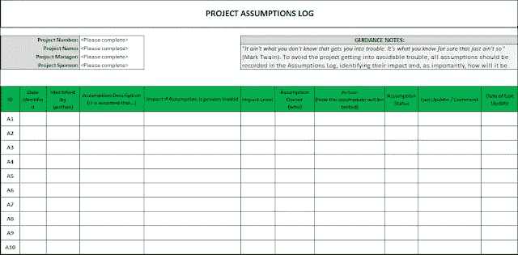
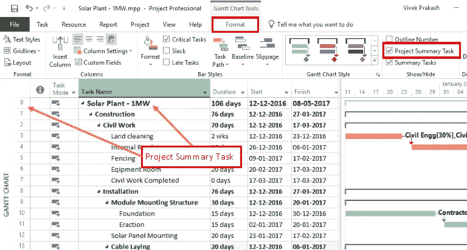
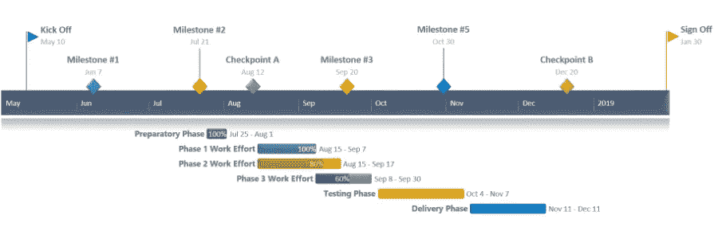

# 数据科学中的项目管理

> 原文：<https://towardsdatascience.com/project-management-in-data-science-11d059bcb265?source=collection_archive---------10----------------------->

## 来自前项目经理的建议，告诉你如何在事情出错时也能让自己保持在正轨上

在 [Unsplash](https://unsplash.com?utm_source=medium&utm_medium=referral) 上插入佩佩·西尔维娅来自《费城永远阳光灿烂》的 meme 照片由[阿尔瓦罗·雷耶斯](https://unsplash.com/@alvaroreyes?utm_source=medium&utm_medium=referral)拍摄

当讨论转向数据科学家应该具备的辅助技能时，项目管理有时会被当作一种不错的软技能。但是关于如何将项目管理技术具体应用于数据科学的资源很少，并且建议通常是油嘴滑舌的。每当这个问题出现时，“只要看看现有的项目管理资源”就是标准答案。

作为公司范围内数百万美元项目的项目经理，我可以从经验中告诉你，项目管理不仅仅是制定一个计划和在清单上打勾。任何实际参与过数据科学项目的人都知道，由于不可预见的情况，您的计划经常被搁置。事情花费的时间比预期的长，出现了意想不到的问题。事实上，丹尼尔·卡纳曼和阿莫斯·特沃斯基为这种低估完成任务所需时间的倾向创造了术语“计划谬误”。

项目管理实际上是关于解决交付中人的易犯错误。这就是为什么我想根据有效的项目管理技术给出坦率的建议——而不是列出昂贵的软件工具，也不是概述 CRISP-DM 流程的每一步要花多长时间。

## 为什么要使用项目管理工具？

有大量的项目经理工具用于监控和报告项目进展。虽然这些工具的存在似乎只是为了创造忙碌的工作，并证明项目经理的薪水是合理的，但事实并非如此！您不仅可以使用这些工具来让高级管理层了解信息，还可以帮助您和您的利益相关者记录假设和项目依赖关系。

敏捷宣言说我们应该总是优先考虑人和交互，而不是过程和工具。同样，对于一个数据科学项目，你应该优先回答业务问题，而不是无关紧要的华而不实的东西。虽然你可以说项目管理工具是附带的，但你会惊讶于这些工具是如何帮助你以一种结构化的方式处理和思考问题的。

正如敏捷宣言所坚持的，这些工具的使用和形式化应该与项目规模成比例。因此，举例来说，如果你只是在为你的投资组合做一个周末数据科学项目，你不需要创建一个花哨的甘特图。但是创建一个 RAID 日志(风险、假设、问题和依赖性)可能是值得的，以便在您进行建模时将您的假设放在心上。即使在项目结束后，几个月或几年后继续提醒你你的假设也是一个很好的资源。所以当你继续读下去的时候，请记住你可以并且*应该*根据你的需求扩展这些工具。

## 数据科学项目管理工具的类型

你的项目管理工具包里有什么工具？…由[托德·夸肯布什](https://unsplash.com/@toddquackenbush?utm_source=medium&utm_medium=referral)在 [Unsplash](https://unsplash.com?utm_source=medium&utm_medium=referral) 上拍摄的照片

1.  **结构化思考问题:RAID 日志** — RAID 代表 **R** isks、 **A** 假设、 **I** 问题、 **D** 依赖。RAID 日志不是我们倾向于想到的用于项目管理的第一类工具，但是我认为它们是最重要的。不管项目大小如何，我都建议保留一个 RAID 日志。每当你着手解决一个问题时，当你制定方法时，总会有一些假设。当你制定收集数据的计划时，可能会有风险阻碍你的计划。当你列出你需要做的事情的步骤时，*依赖关系*可以帮助你计划处理项目的顺序。将这些记录在一个地方是消息灵通和看起来对你的项目一无所知的区别。
2.  确定你需要做什么:WBS — WBS 代表**W**work**B**分解 **S** 结构。它本质上是一个花哨的术语，指需要完成的所有任务的列表。虽然数据科学流程框架(如 CRISP-DM、KDD 和 OSEMN)总结了数据科学项目中的步骤，但将这些框架应用于您的问题非常重要。例如，在 OSEMN 框架中(**O**b ain， **S** crub， **E** xplore， **M** odel，I **N** terpret)，你期望做什么样的数据擦洗？你打算使用什么样的模式——如果第一种模式不起作用，你随后会尝试什么样的模式？如果你和团队一起工作，WBS 甚至可以帮你分配任务。
3.  **计划每个任务或阶段的顺序和持续时间:甘特图** —结合 *RAID 日志*中的依赖关系和 *WBS* 中的任务，甘特图有助于计划任务的时间和顺序。它可以相当详细——在 WBS 上绘制出每个单独的任务——或者它可以是高层次的，以便只绘制高层次的流程。在这种情况下，它通常被称为“路线图”，是与高级管理层沟通的最佳方式之一。

# RAID 日志

RAID 日志的创建是反映业务问题、评估您的数据科学问题是否能解决业务问题的一种方式，并让您与利益相关方保持联系以解决问题。

假设日志示例。在 techno-pm.com 找到更多的例子和模板

## 思考业务问题

从记录项目的风险、假设和依赖性开始。我强烈建议在收到利益相关者的业务问题后，尝试将它转化为数据科学问题，并思考如何回答它。这自然会引出问题和假设，您可以记录下来，然后与业务部门一起审查。

## 假设

假设通常是那些隐藏的、没有说出来的东西，让我们认为一个项目会比它实际上要简单。可以从多个方面进行假设，包括:

1.  **数据:**作为数据科学家，我们最容易出错的地方——尤其是考虑到数据清理经常被认为是数据科学家 80%的工作。您可能会对数据做出一些假设，包括我们希望数据如何格式化，我们可以使用哪些功能，数据的范围有多广，某个功能作为某种事物的代理的适用性，等等。
2.  **模型:**所有的模型都有自己的假设。例如，K-均值聚类假设聚类内的方差本质上是球形的，并且聚类的大小是相同的。我们的模型可以强加给我们的另一个假设是没有空值，这可能需要我们在 WBS 中包括一个插补步骤。这些假设和任何违反假设的情况都必须记录下来，以确保我们完全理解使用任何模型的利弊(并在 WBS 中包括满足假设的任何必要步骤)。
3.  **工作流或数据管道:**虽然我们倾向于不去想在部署我们的模型后事情会发生变化，但是如果将来发生变化，记录关于工作流的假设是很重要的。例如，我们可能假设地理位置仅作为一个分类城市/州可用，但我们的数据管道可能会在未来改变以获取纬度/经度数据，并导致我们在生产中调整我们的模型。

## 属国

依赖性可以是数据科学项目自然遵循的顺序，例如在尝试任何建模之前完成数据清理。依赖关系还可以说明一些团队欠其他团队什么，例如数据工程师向数据分析师或机器学习团队提供的干净数据文件。这可以让你跟踪项目可能被延迟的原因，而不是把它归咎于最后一个接触项目的团队。

## 风险

风险可能难以识别，并且经常与其他 RAID 日志项目混淆。假设和依赖有助于揭示风险所在。风险通常是实际问题的前兆(事实上，如果意识到风险，它可以被关闭，新的问题应该在它的位置打开)。

## 问题

记录问题是一个只有在项目开始后才能完成的步骤。那么，为什么要这么做呢？项目管理不仅仅是项目规划，还包括持续的监控和文档记录。这看起来像是在浪费时间，但是就像任何好的实践一样(*咳咳*评论代码)，它在未来会有回报。了解在过去的项目中遇到了什么问题——特别是对于一个数据基础设施不经常改变的公司——可能是低估潜在工作和准确估计项目时间表和收益的区别！

## 利益相关方联系人

最佳实践是让您的利益相关者定期签署 RAID 日志。或者，如果这看起来太官僚主义，只要检查任何新的项目或变化就可以让每个人都了解情况并负责任。您的 IT 和业务利益相关者可以轻松地确认假设或风险，他们的意见将有助于您保持正确的方向。

# 工作分解结构(WBS)

带有预计任务持续时间的工作分解结构示例。在[pmwares.com](https://www.pmwares.com/blog/creating-work-breakdown-structure-in-ms-project/)了解更多关于使用 Microsoft Project 创建 WBS 的信息

WBS 将项目从主要的可交付成果分解成越来越小的组成部分，直到你达到单个任务级别。列出你的个人任务有很多好处:

## 头脑风暴一下你需要做什么

在我们对*实际解决问题*的过度热情中，我们可能低估了我们的任务，没有为我们的项目分配足够的时间。或者，更糟糕的是，我们可以跳过简单但必要的步骤(检查和输入丢失的值！标准化数字特征！一次性编码分类变量！)而没有意识到我们的模型结果表明了基本的特征转换问题。通过强迫自己将高级数据科学项目阶段分解成任务，你开发了一个标准的、可重复的方法。

最棒的是，你可以在未来的项目中重用 WBS 的一部分。还有一个问题可以通过集群解决吗？只需从上一个集群项目中抽出 WBS，它已经列出了必要的步骤和检查！

## **估计每一步需要多长时间**

WBS 是计算一个项目需要多长时间的好方法。因为你已经列出了每一个单独的任务，添加一个时间估计是很简单的。与高层次估计时间表不同(例如，数据清理需要 2 天)，如果发现某项任务没有必要，或者违反了模型的假设，表明它不太适合您的数据，您可以立即确定节省的时间。

由于我们很难估计事情需要多长时间，所以最好用历史作为例子。如果您记录了过去项目中每项任务实际花费的时间，就可以更好地预测未来项目的时间长度。

## **确定依赖关系**

虽然一些任务之间的依赖关系很明显(在通过特定的机器学习模型运行您的要素之前对空值进行插补)，但还有其他一些更微妙的依赖关系。特别是当我们考虑到数据科学过程可以在特征工程和建模步骤中迭代时，仔细考虑任务之间的依赖关系可以帮助您有效地规划模型管道。

例如，您可能希望对刚刚标准化的要素运行线性回归模型，然后您可能会回过头来查看各种变换如何影响模型结果。因此，虽然标准化可能是线性回归两次迭代的依赖项，但对数转换可能只在第二次迭代中需要。记录任务之间的顺序和依赖关系可以帮助您创建一个可重用和干净的管道。

# 线条图

甘特图是一种将 WBS 可视化的方式。通常情况下，任务是垂直列出的，时间是水平跨越的，一个水平条显示每个任务跨越多长时间。任务也可以分组到工作流中，特别是当项目很大并且跨越整个组织中的许多功能组时。

更高层次的甘特图，也可以称为“路线图”图片来源:[如何在 Powerpoint 中制作甘特图](https://www.officetimeline.com/make-gantt-chart/powerpoint)

## 确定粒度级别

这是一个项目管理工具，如果你正在做一个单独的项目，你可以跳过它。但是如果你在一个组织中，我认为高层次的“路线图”是有用的。我认为更多的人是视觉学习者，而不是我们所认为的那样。或者至少，事情变得有意义*更快*当我们看到它们的时候。这就是为什么手头上有一个项目进展的路线图这样的视觉图像——特别是在一个长期项目中——可以帮助减轻高级管理层的恐惧，并让他们继续投资。

一个需要大型组织中不同团队参与的项目很容易在较低的任务级别上创建甘特图。但通常在这种情况下，会有一个专门的项目经理来监控和管理项目。

# 结论

虽然在您的下一个数据科学项目中使用这些工具可能无法防止意外延迟，但持续使用这些工具可以让您更好地感知风险，帮助您更好地估计任务的持续时间，并迫使您与利益相关者保持更密切的联系。我建议在您的下一个项目中实施这些工具的简单版本，看看您如何处理和规划您的数据科学项目，以及如何改进！

在我的下一篇博客文章中，我将带你看看我的个人项目中没有按计划进行的例子。

**TL；博士**

在项目正式开始之前和项目进行过程中，使用 RAID 日志来确定假设、依赖性、风险和问题。根据项目的复杂程度和规模，在 WBS 中列出所有必要的任务，包括预期的开始和结束日期、任务之间的相关性以及任务负责人。甘特图采用工作分解结构，并用图表显示每项任务或工作流预计需要多长时间。高级甘特图也被称为项目路线图，可用于让高级管理层了解进展情况。虽然你可以使用花哨的软件来应用这些工具，但好的 Excel 或 Google Sheets 可以做到这一点。

[1]:规划谬误，[https://en.wikipedia.org/w/index.php?title=Planning_fallacy&oldid = 914560670](https://en.wikipedia.org/w/index.php?title=Planning_fallacy&oldid=914560670)(2019 年 11 月 18 日最后一次访问)。