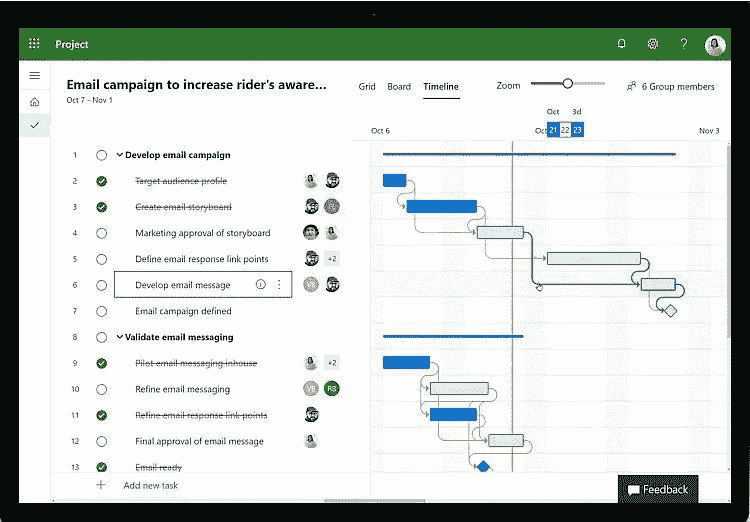
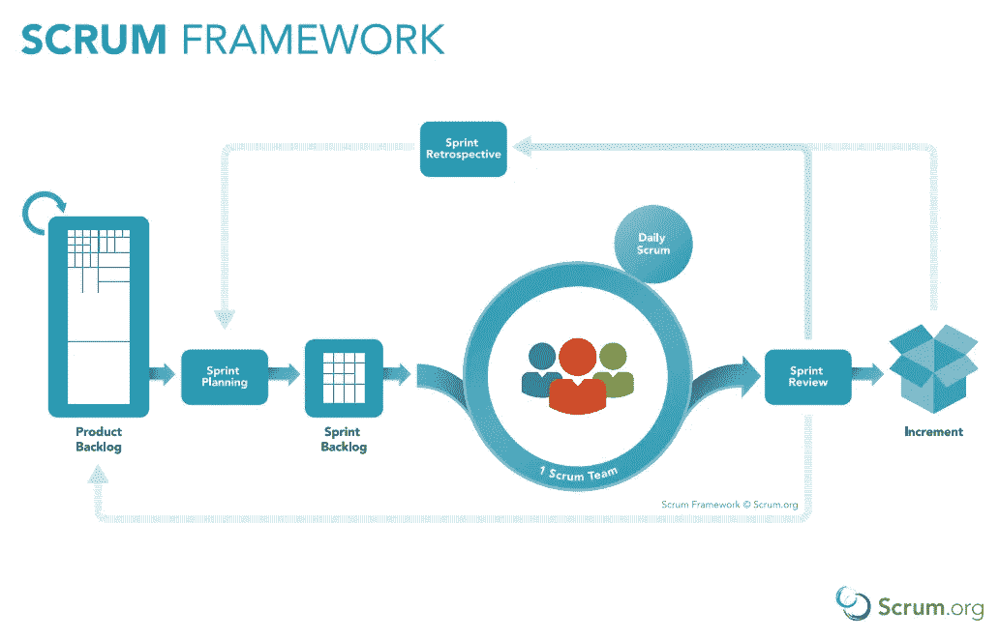
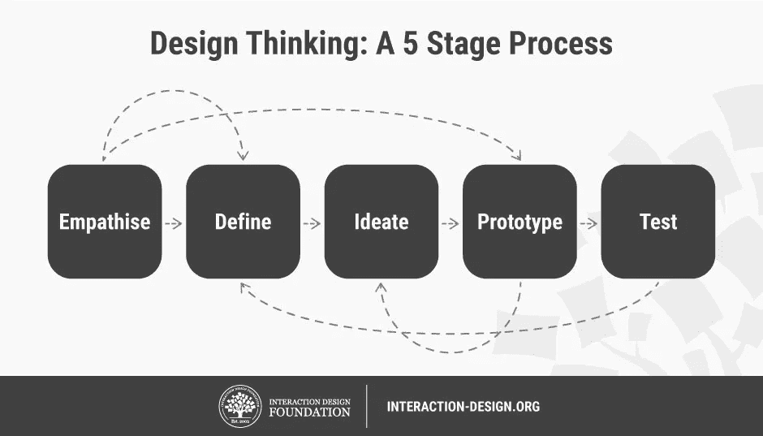

# 每个数据科学家都应该知道的项目管理工作流

> 原文：<https://towardsdatascience.com/project-management-workflows-every-data-scientist-should-know-89bbf0d625e4?source=collection_archive---------52----------------------->

Jo Szczepanska 在 [Unsplash](https://unsplash.com?utm_source=medium&utm_medium=referral) 上拍摄的照片

## 管理数据科学项目的主要流程以及为什么您应该了解它们

# 介绍

我们中的许多人开始自学数据科学，参加 Kaggle 比赛和在线阅读教程。即使我们最终在编码和算法方面学到了很多，但在开始时，我们对处理数据所需要的其他东西了解不多，比如项目管理。

即使你不是经理，了解公司采用的不同方法也很重要，因为你可能会发现自己被迫在这些框架中的一个框架内工作。在这篇文章中，我将为您介绍主要的几种。

# 瀑布

尽管瀑布是最传统的项目管理方法之一，但由于它的线性方法，通常不适合数据科学。

来源:微软

它的名字来源于它生成的甘特图，类似瀑布并说明了它的线性。

它通常从定义最终产品要求和详细步骤开始，以线性时间表组织，其中任务通常取决于前面的任务，并附属于负责执行任务的人。所以，当你开始一个项目时，你希望确切地知道它什么时候结束，最终产品是什么。

将这种方法应用于数据科学项目的问题是，它假设项目需求在未来不会改变，这可能是一些其他类型项目的情况，但通常不会在数据中发生，在数据中，随着我们在执行中的进步，我们会积累知识，初始需求可能会发生很大变化。

# 混乱

根据 Scrum 的说法，“Scrum 本身是一个简单的框架，用于复杂产品的有效团队协作”。

资料来源:Scrum.org

它是一个敏捷框架，广泛用于软件开发，有时也用于数据项目，尤其是当数据团队以某种方式被插入开发团队时。

团队从一个**产品待办事项清单**开始，这是要做的事情的列表，根据它们的重要性排序。从这个列表中，构建了一个新的列表:T2 sprint planning T3，其中包含了将在下一个 sprint 中处理的高优先级项目。顺便说一下，一个**冲刺**，是团队专注于冲刺计划中列出的任务的一小段时间。因此，每隔 2-4 周，团队会聚在一起设定下一次会议之前要完成的目标，在下一次会议期间，还会有一个 **sprint 回顾**，参与者会回顾上一次 sprint 的目标，看看已经实现了什么，还没有实现什么，以及为什么。

它倾向于面向产品的项目，这并不总是数据项目的最佳选择，因为数据科学有时由长时间的探索性分析组成，这不一定会转化为产品特性或需求。另一方面，Scrum 可能会将这些分析推向一个更加面向结果的道路，减少有时浪费在智力分歧上的时间。

# CRISP-DM

数据挖掘的跨行业标准流程，也称为 CRISP-DM，自 1996 年以来一直存在，是数据挖掘流程中使用最广泛的模型之一。它不像瀑布模型那样是线性的，瀑布模型为每一步之间的迭代增加了很多灵活性。

肯尼斯·詹森

它始于**业务理解**步骤，在这里你开始系统地阐述你想要回答的问题，第一假设，等等。一旦你有了这些，你就开始寻找你需要的数据，进入**数据理解**阶段，在那里你检查你有什么样的可用数据，寻找异常值、缺失值等等。下一阶段是**数据准备**，您将决定如何处理那些缺失值和异常值，如何导入和清理您的数据，等等。一旦完成，你将开始**建模**，尝试不同的算法，然后**评估**它们以及它们的表现，通常与基线进行比较。最后一步是**部署**选定的模型，将其投入生产。

请注意，虽然这些步骤是以线性顺序呈现的，但在此过程中，您通常会在它们之间移动很多次。例如，在建模阶段，您可能需要更改准备数据和处理要素的方式，具体取决于您使用的模型。一旦你评估了你的模型，有时结果可能不令人满意，促使你去理解为什么，也许回到第一步，重新思考你理解业务问题的方式。

# IBM 人工智能工作流

IBM 对于 AI 项目的工作流程基本上是受**设计思维**的启发，所以每一步都与一个设计思维流程步骤相关。它也是基于迭代的思想，每一步都可以导致下一步，但也可以让你回到以前的步骤，这取决于你的结果。

来源:交互设计基金会

**数据收集** ( *移情*)，是数据科学家与最接近数据的人交谈，以阐明商业机会，并将其转化为可测试的假设。它包括定义时间表、成本、可行性等。最后，您继续为项目收集数据。

**探索性数据分析** ( *定义*)是您尝试可视化您的数据、检查缺失值(并决定如何处理它们)以及潜在测试假设的地方。

然后您移动到**转换** ( *ideate* )步骤，这里的目标是转换您的数据，以便它可以被模型使用。这是所有[特性工程魔法](/feature-engineering-3a380ad1aa36)发生的地方。

**建模** ( *原型*)是下一步，在这里您定义一个评估标准，并针对您的问题比较不同的模型。从简单的模型开始，然后逐步建立。

最后一步是**测试**，这里的目标不仅仅是对你的代码进行单元测试，还包括批评你之前所做的选择，如果需要的话再回去(通常是这样)。它以所选解决方案的部署而告终，这也要经过测试:即使是运行的模型也要经过审查和持续的性能测试。

顺便说一下，IBM 在 Coursera 上有一个专门研究这种方法的项目，我强烈推荐这个项目。

# 结论

每种方法都有自己的优点和缺点，正确的方法取决于你的公司、你的团队以及项目的规模和范围。瀑布式工作流最适合范围已经明确的项目，比如改进已经实现的模式，而当项目涉及更多的数据工程而不是数据科学时，Scrum 会工作得更好，并且最终的可交付物本身就是一个产品。CRISP-DM 和 IBM AI 工作流在需要不断迭代和彻底探索性分析的项目中工作得更好。

## 更新

要进行回顾和更深入的分析，可以查看海王星博客的文章[2021 年的数据科学项目管理](https://neptune.ai/blog/data-science-project-management-in-2021-the-new-guide-for-ml-teams)。他们概述了这里没有提到的一些其他方法，这些方法也可以作为您处理数据科学项目的参考。