# 项目:用回归机器学习算法预测红酒成分的完美比例

> 原文：<https://towardsdatascience.com/project-maximizing-red-wine-profits-with-regression-machine-learning-algorithms-8caad2a10a08?source=collection_archive---------52----------------------->


[来源](https://unsplash.com/photos/8_tZ-eu32LA)

# 目录

**1。简介:**场景&目标，特性&预测器

**2。数据争论:**缺失值，用 Z 值检测/处理异常值

**3。探索性数据分析:**相关性、配对图、特征工程、核密度估计(KDE)、回归联合图、条形图、小提琴&盒图

**4。机器学习+预测分析:**为建模准备数据，建模/训练，R 值，预测，k 重交叉验证‍ ‍ ‍ ‍ ‍ ‍ ‍ ‍ ‍ ‍ ‍ ‍ ‍ ‍ ‍ ‍ ‍ ‍

**5。结论**

# **1。简介**

# **场景**:

你走进 T21 北部的一家酒吧。你点了伏特加，并对坐在你旁边的人说你是一名数据科学家。酒吧的老板，碰巧是一个葡萄酒商，让你知道他正在雇佣一名数据科学家。他说他正在**失去顾客** &需要**帮助**为他的**红酒系列**想出一个**新配方**。葡萄酒商把这些数据交给你，让你进行**数据分析**和**预测**配料的**完美比例**和**最大化**他的**利润**。

# 目标:

*   **预测**红酒配料的**完美比例**。这是一个**数值连续的结果**。
*   **用各种**回归**模型&探索**，看哪个**产生**最大**精度**。
*   检查我们数据中的**趋势** & **相关性**
*   确定哪些**特性**对**高**品质**红酒**品质*重要*

**注**:由于我们是**预测**一个**数值连续**值，我们将**训练**各种**回归模型。回归分析**是**监督学习的子领域。**

# 特征和预测:

我们的**预测器** (Y，葡萄酒质量)由 11 个**特征** (X)决定:

1.**固定酸度**(g/L)——大多数与葡萄酒有关的酸或固定的或不挥发的(不容易挥发)
2。**挥发性酸度(**g/L)——乙酸的含量(含量过高会导致不愉快的醋味)
3。**柠檬酸**(摩尔/升)——少量存在的柠檬酸可以增加葡萄酒的“新鲜度”和风味
4。**残糖**(克/升)——发酵停止后剩余的糖量
5。**氯化物**(克)—盐量
6。**游离二氧化硫**(mg/L)——游离形式 SO 存在于分子 SO(溶解气体)和亚硫酸氢根离子
7 之间的平衡。**总二氧化硫(** mg/L **)** —游离态和结合态 SO 的量
8。**密度(**克/厘米 **)** —水的密度接近于水的密度，取决于酒精和糖的百分比含量
9。**pH**——描述葡萄酒的酸性或碱性程度，范围从 0(非常酸性)到 14(非常碱性)；大多数葡萄酒在 3–4
10 之间。**硫酸盐**(g)——可增加二氧化硫气体(SO)水平的添加剂，作为抗菌剂
11。**酒精**——酒精含量百分比

**注**:我们的数据只有一种数据:****(#)**；这是可以测量的**定量**数据**

```
**import** **numpy** **as** **np**
**import** **pandas** **as** **pd**
**import** **matplotlib** **as** **plt**
**import** **seaborn** **as** **sns**
**import** **matplotlib.pyplot** **as** **plt**
```

# **2.数据争论**

```
**filePath = '/Users/jarar_zaidi/Downloads/wineQuality.csv'

data = pd.read_csv(filePath)

data.head()**
```

**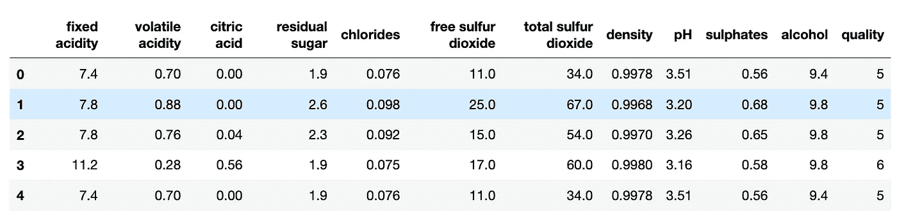**

**帮助我们了解我们正在处理的数据。**

```
**print("(Rows, columns): " + str(data.shape))
data.columns**
```

**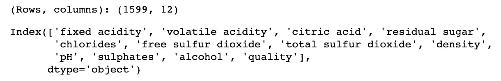**

**显示行数和列数。以及列名**

```
**data.nunique(axis=0)** *# returns the number of unique values for each variable.*
```

**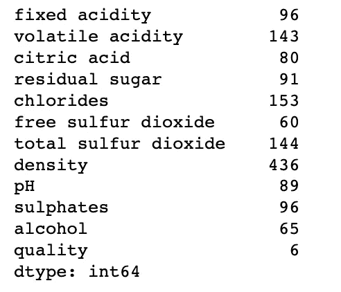**

**返回每个变量的唯一值的数量。**

```
*#summarizes the count, mean, standard deviation, min, and max for numeric variables.*
**data.describe()**
```

**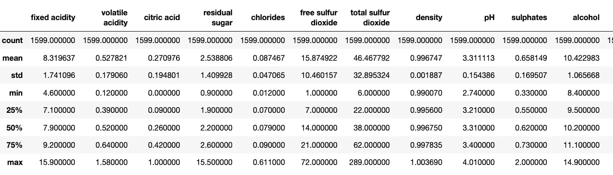**

**汇总数字变量的计数、平均值、标准差、最小值和最大值。**

****平均质量**为 5.6，其**最大** ( **最佳质量**得分)为 8.0 &其**最小** ( **最差质量**得分)为 3.0。现在，让我们看看是否有任何**缺失值**需要处理。**

# **缺少值**

```
*# Display the Missing Values*

**print(data.isna().sum())**
```

**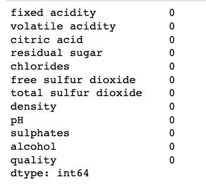**

**显示每列缺失值的数量。幸运的是我们没有。**

# **使用 Z 分数检测/处理异常值**

> **一个 **Z 值**是对**位置**的测量，它表示一个数据值偏离**平均值**的**标准偏差**的数量。任何 z 分数**小于 **-3** 或**大于 **3** ，都是**异常值**。******

**注**:从**经验法则**我们看到我们数据的 **99.7%** 应该在**均值**与**的 3 个标准差**以内。

```
**from scipy import stats
import numpy as np
z = np.abs(stats.zscore(data))
print(z)**
```

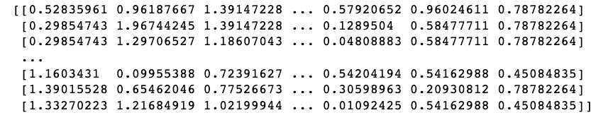

获取 Z 分数

接下来，我们想要获取 Z 值大于 3 的行和列。这些被认为是**异常值。**

```
**threshold = 3
print(np.where(z > 3))**
```

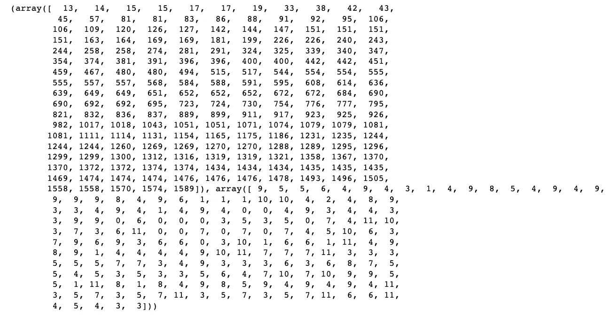

第一个**数组**是**行**号&的列表**第二个数组**是**异常值**对应的**列**号。例如，第一个异常值在第 13 行第 9 列。一旦我们**计算出**Z 值 **Z 值**，我们就可以**移除**离群值**来**清理我们的数据，方法是执行下面的操作。

```
**Newdata = data[(z < 3).all(axis=1)]
Newdata**
```

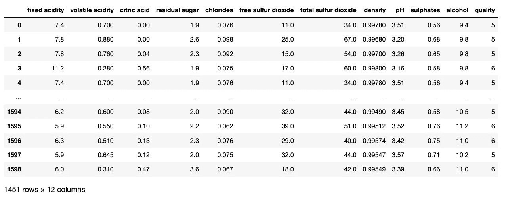

我们现在已经**成功地** **移除了** **148+** 行，这些行是**异常值**！

> **注意**:其他**异常值**指标也可以使用，如 **IQR** **得分**、**散点图**、**箱线图**。

让我们看看我们的**新清理的**数据。

```
**Newdata.describe()**
```

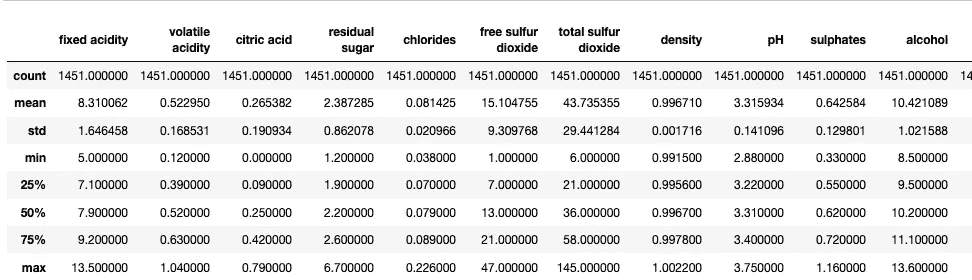

# 3.探索性数据分析

# 相关

**相关矩阵**又名**热图** -让你看到所有变量之间的**相关性**。

> 在**秒**内，你可以看到某件事是**正**还是**负** **与我们的**预测器(目标)相关。****

```
*# calculate correlation matrix*

**corr = Newdata.corr()
plt.subplots(figsize=(15,10))
sns.heatmap(corr, xticklabels=corr.columns, yticklabels=corr.columns, annot=True, cmap=sns.diverging_palette(220, 20, as_cmap=True))
sns.heatmap(corr, xticklabels=corr.columns,
            yticklabels=corr.columns, 
            annot=True,
            cmap=sns.diverging_palette(220, 20, as_cmap=True))**
```

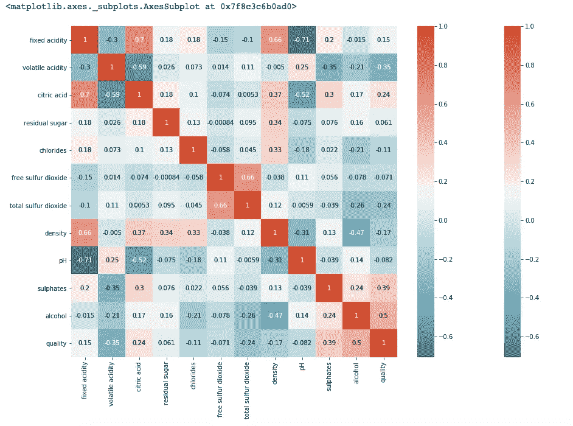

我们可以看到在**酒精**我们的**预测因子**之间有一个**强** **正** **相关**。事实上，这是我们数据集中**最相关的特征**，其值为 **0.5** ！

> **注意:**我们的**酒精**特征是饮料中的**酒精含量百分比**。对于购买红酒的顾客来说，酒精含量的百分比**越高**就会产生越大的满意度**！**

**接下来，我们可以看到**第二** **最强的正相关**， **0.39** ，**硫酸盐** &我们的质量**预测值**。似乎当饮料中添加了添加剂时，人们对质量的评价会更高。**硫酸盐** **充当**的**抗菌剂**。**

**最后，**负相关性最强的**是**挥发酸度**，相关性为 **-0.35** ！这是意料之中的，因为过高的醋酸含量会导致令人不愉快的 T42 醋味道！**

# **配对图**

> ****成对图**也是一种很好的方式，可以让**立即**看到所有**变量**之间的**相关性**。**

**因为我们有 **11 特征**，所以让我们只选择**将**关联到我们的**预测**的**显著**特征，以进一步**检查**它们在配对图上的相关性**

```
**subData = data[['volatile acidity','citric acid','sulphates','alcohol']]
sns.pairplot(subData)**
```

**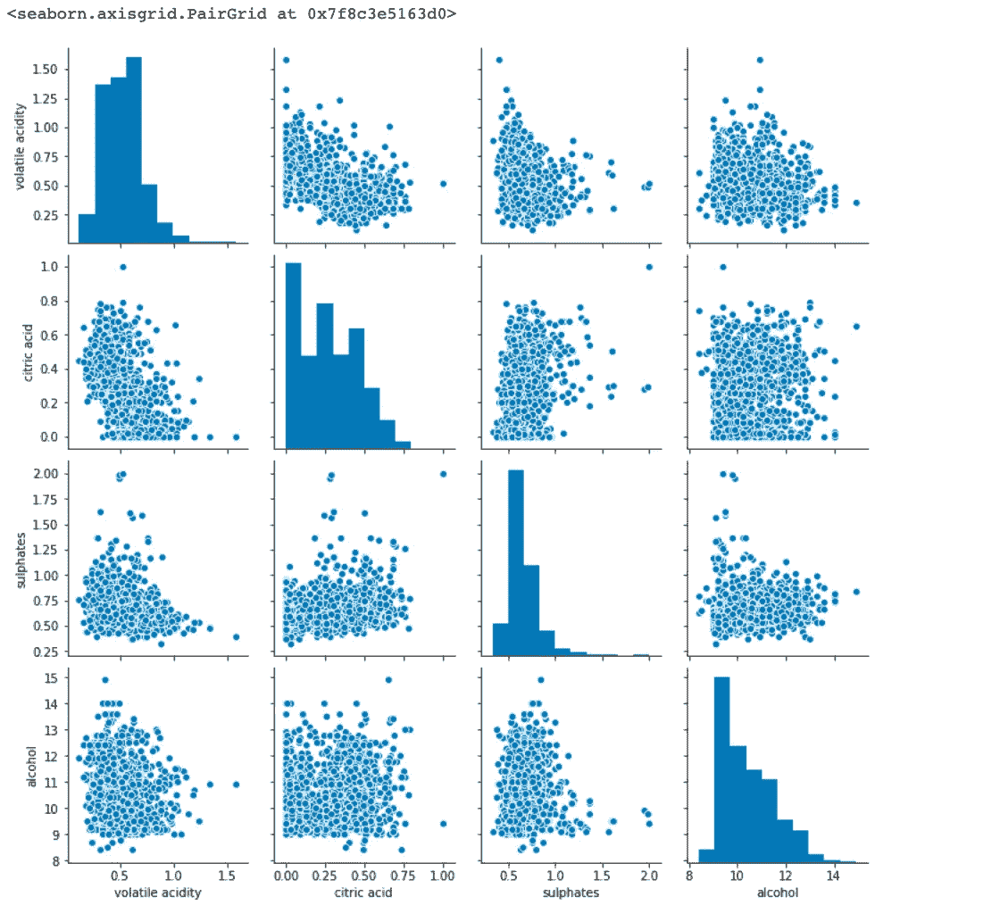**

**该图**支持**热图中所述的**相关性**。**

> ****注**:选择制作一个**较小的配对图**，其中只有**最强的预测值**，以便**深入**到**关系**中。这也是一个很好的方法来看看他们的关系是**正**还是**负** **相关**！**

# ****特征工程****

**我们现在将进行**特征工程**的一种形式，其中我们**创建**一个新的** **列** **根据其**质量分数**对**进行分类！****

> **这个新列将是一个**二进制分类数据**，其中 **0** 或 **1** 表示该葡萄酒是否被认为是“**美味的**”。**

```
**Newdata['tasty'] = [0 if x < 6 else 1 for x in Newdata['quality']]**
```

**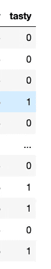**

**我们现在有一个**新列**带有**0**1**1**s。**

# **核密度估计(KDE)**

> **一个**核密度估计(KDE)** 估计一个**连续随机变量**的**概率密度函数(PDF)****

```
**g = sns.jointplot("quality", "volatile acidity", data=Newdata,
           kind="kde", space=0, color="red")**
```

**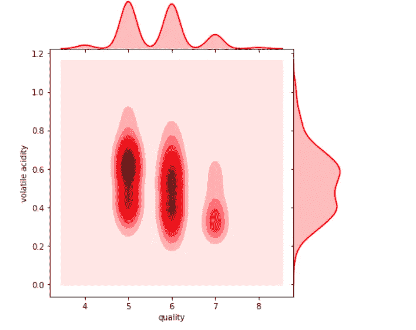**

**一个**内核密度估计**允许我们**可视化**数据在**连续区间**上的**分布**。从这个图中，我们可以**得出**结论:质量**较低的**红酒是**严重倾向于**到**挥发酸度**水平较高的**。这正如我们**所料**因为，**大量**醋酸**产生**难闻的**醋味！******

# **回归联合图**

```
**g = sns.jointplot(x= 'fixed acidity',y= 'pH', data=Newdata,
             kind = 'reg',height=15,color='blue')

plt.xlabel('Fixed acidity',size=30)
plt.ylabel('pH',size=40)
plt.title('Fixed acidity vs. pH',size=30)**
```

**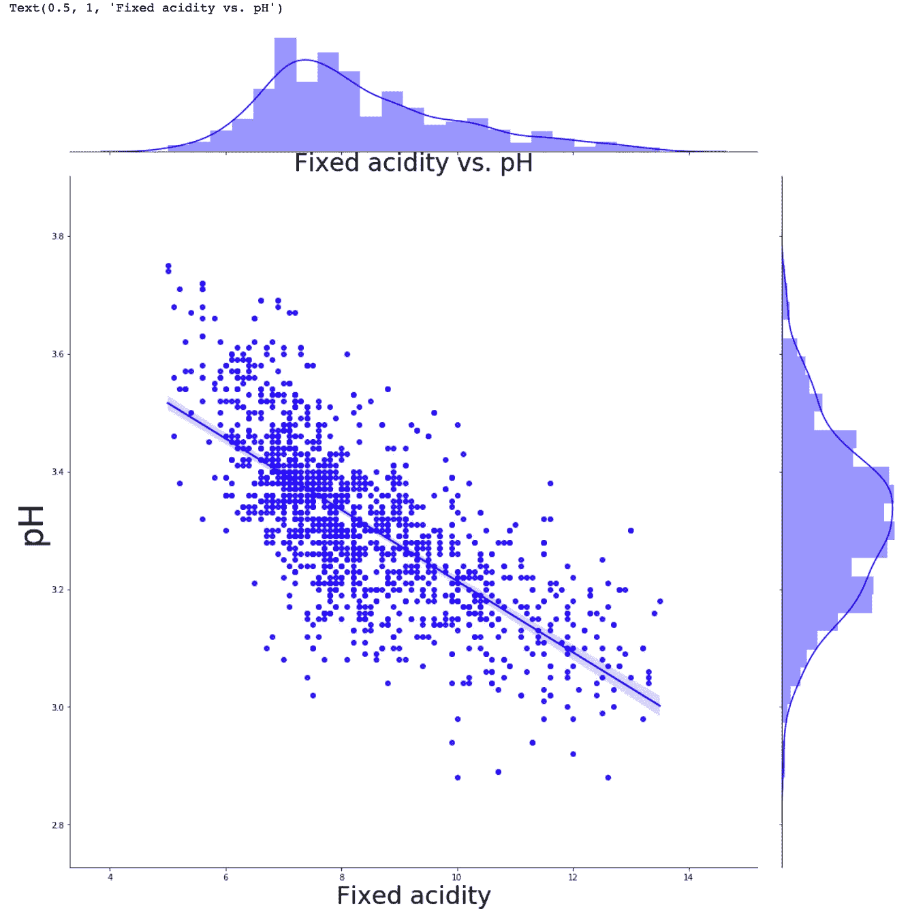**

**从上面解释的回归联合图中，我们可以看到 **pH** 水平&固定酸度之间存在**强负相关**。换句话说，当其中一个增加时，另一个减少。根据**热图**，这两个特性有一个**相关性**系数 **-0.71** ！**

# **条形图**

```
**sns.catplot(x="quality", y="volatile acidity", hue="tasty", kind="bar", data=Newdata);

plt.title('Tasty & Non-Tasty Wine with Volatile Acidity Level',size=19)
plt.xlabel('Wine Quality',size=16)
plt.ylabel('Volatile Acidity Level',size=16)**
```

**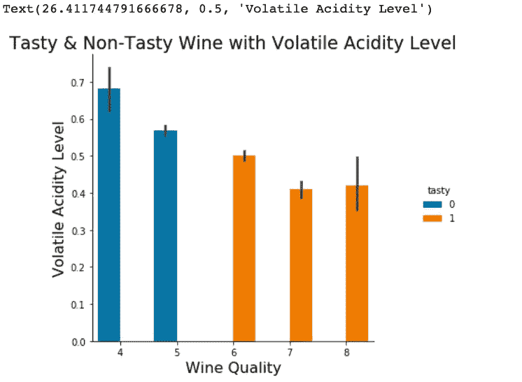**

**这幅图说明了**高挥发性酸度**水平**产生**一款**糟糕的**品酒。这正如我们所料，因为**大** **量**的**醋酸**产生一种**难闻的**醋味！**

# **小提琴和盒子图**

> **显示**框&小提琴**图的**优点**在于它显示了**基本**数据的**统计**，以及其 ***分布*** 。这些图通常用于比较给定变量在某些类别中的分布。**

**显示的是**中位**、 **IQR** 、&图基的栅栏。(最小值、第一个四分位数(Q1)、中值、第三个四分位数(Q3)和最大值)。此外，它可以为我们提供数据中的异常值。**

```
**plt.figure(figsize=(12,8))
sns.boxplot(x="quality", y="sulphates", hue="tasty", data=Newdata )
plt.title("Tasty & Non-Tasty Wine with Sulphate Level", fontsize=20)
plt.xlabel("Wine Quality Level",fontsize=16)
plt.ylabel("Sulphate Level", fontsize=16)**
```

**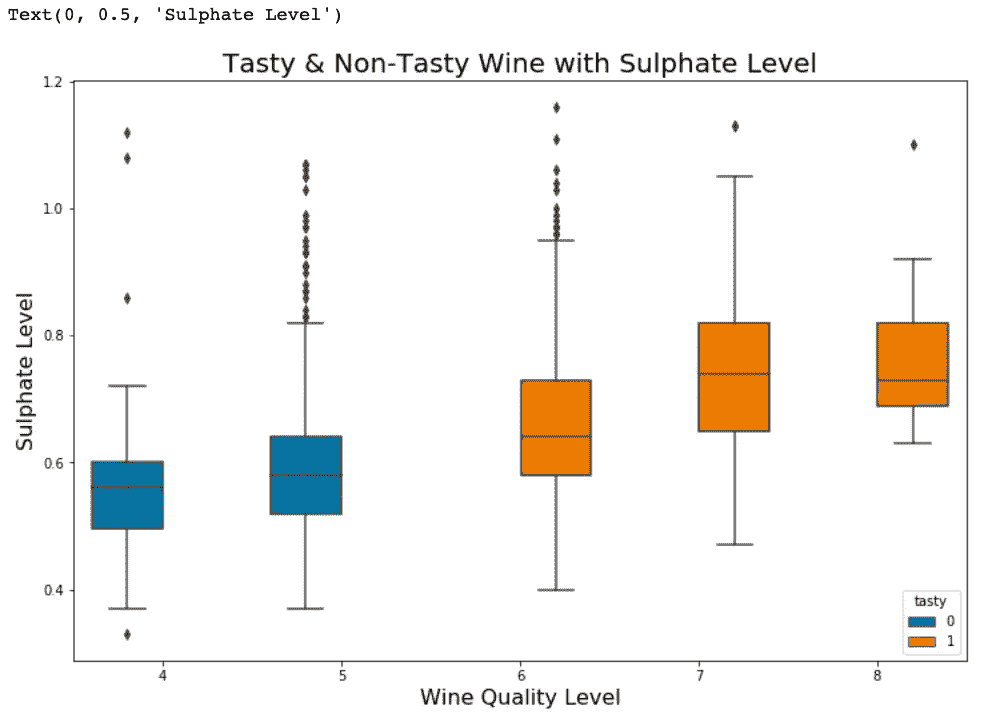**

**接下来，我们检查这个**方框图**，这有助于**进一步得出**结论，即**好喝的**红酒显示出**硫酸盐**水平**的中位数**升高。******

> **如果我们回想一下我们的化学课，我们记得硫酸盐是一种添加剂，可以增加二氧化硫气体(SO)的水平，这是一种抗菌剂！**

> ****注**:一种**抗菌剂**是一种**杀死微生物** & **阻止其**生长 *h*** *的药剂。*****

**我们现在明白了为什么这些高硫酸盐含量会增强顾客的偏好！**

```
**plt.figure(figsize=(12,8))
sns.violinplot(x="quality", y="alcohol", hue="tasty", inner='quartile',data= Newdata )
plt.title("Tasty & Non-Tasty Wine with Percent alcohol content",fontsize=20)
plt.xlabel("Wine Quality Level", fontsize=16)
plt.ylabel("Percent alcohol content ", fontsize=16)**
```

**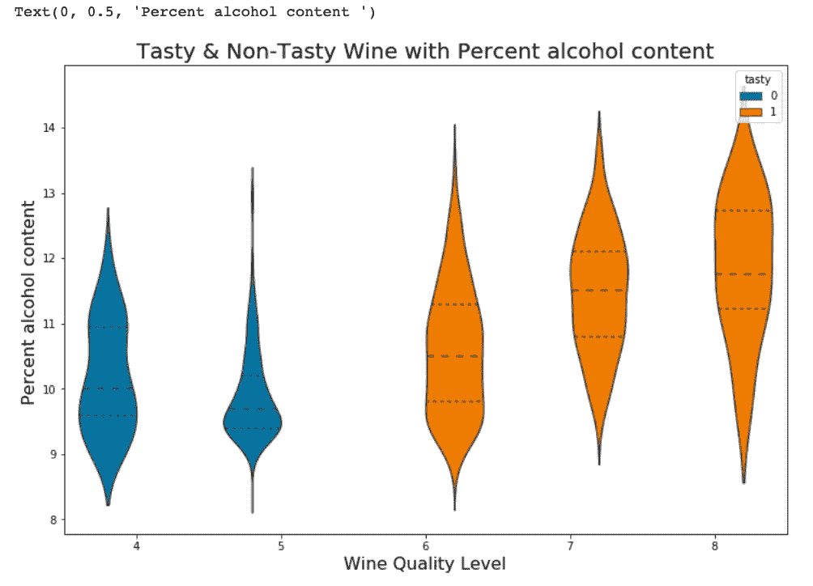**

**分析完这个**小提琴剧情**我们可以**得出**好酒&不好酒**的整体形态& **分布**差异巨大**。**好喝的**红酒显示出一个**剩余中值**为百分比**酒精**含量&因此**他们的数据的一个**大分布在 10 & 13 之间，而**不好喝的**红酒由一个**低中值**酒精含量在 9.5 & 11 之间。**

**L et 的**比较**好喝&不好喝红酒之间的**平均值****

```
**yummy = Newdata[Newdata['tasty']==1]
yummy.describe()**
```

**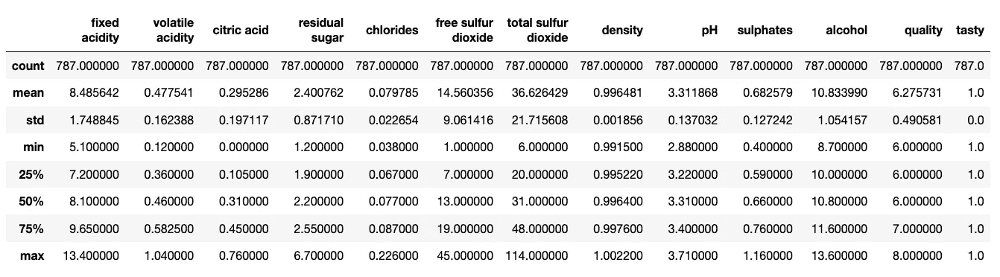**

```
**notYummy = Newdata[Newdata['tasty']==0]
notYummy.describe()**
```

**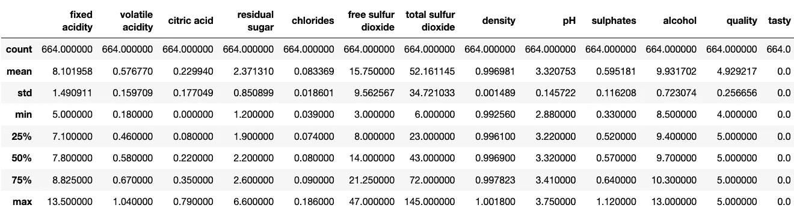**

```
**print("(Tasty Wine Sulphates level): " + str(yummy['sulphates'].mean()))
print("(Non-Tasty Wine Sulphates level): " + str(notYummy['sulphates'].mean()))**
```

****

****更美味的**葡萄酒表现出**更高的**硫酸盐**水平****

```
**print("(Tasty Wine Alcohol content level): " + str(yummy['alcohol'].mean()))
print("(Non-Tasty Wine Alcohol content level): " + str(notYummy['alcohol'].mean()))**
```

**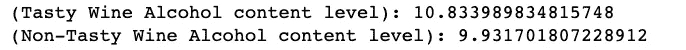**

****更好喝的**葡萄酒表现出**更高的**酒精含量**水平****

```
**print("(Tasty Wine Total Sulfur Dioxide level): " + str(yummy['total sulfur dioxide'].mean()))
print("(Non-Tasty Wine Total Sulfur Dioxide level): " + str(notYummy['total sulfur dioxide'].mean()))**
```

**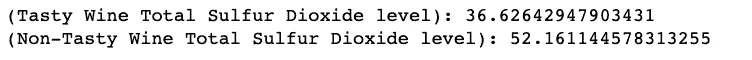**

****更好喝的**葡萄酒展示了**更低的**二氧化硫**水平****

**L 很快，好喝&与不好喝**之间的**平均值**相差极大****。例如，美味的红葡萄酒包含总量**二氧化硫**的**最小化**水平。此外，美味的红葡萄酒含有的硫酸**&**酒精**水平要高出很多**。********

> ********如果我告诉葡萄酒商每种成分的完美比例能让**最大化**他的红酒**销量**，我会告诉他包括低**水平的**二氧化硫**和高**水平的 T11 硫酸盐******酒精 T15。******************

# 4.机器学习+预测分析

# 为建模准备数据

为建模准备数据，只需记住 **ASN** ( **赋值、拆分、规格化**)。

AT22 将 11 个特征赋值给 X，&最后一列给我们的预测值，y

```
**X = df.iloc[:, :-1].values
y = df.iloc[:, -1].values**
```

SS**plit**:数据集分为训练集和测试集

```
**from sklearn.model_selection import train_test_split
x_train, x_test, y_train, y_test = train_test_split(X,y,test_size = 0.2, random_state = 1)**
```

N **标准化**:标准化数据将转换数据，使其分布的平均值为 0，标准差为 1。

```
**from sklearn.preprocessing import StandardScaler
sc = StandardScaler()
x_train = sc.fit_transform(x_train)
x_test = sc.transform(x_test)**
```

# 建模/培训

现在，我们将在训练集&上训练各种**回归模型**，看看哪个**产生最高的精确度**。我们将*比较*的准确性 ***多元线性回归*** *，* ***多项式线性回归*** *，* ***SVR(支持向量回归)*** *，* ***决策树回归*** *，* ***随机森林这些都是**监督学习**模型，用于预测连续值。***

> **注**:对于**回归**模型，有几个**度量**用于测量**精度**，如**均方根误差(RMSE)** 、**残差标准差(RSE)** 、**平均绝对误差(MAE)** 。但是我们将用 **R .** 来测量我们的模型

**模型 1:多元线性回归**

```
*# Train model on whole dataset*
**from** **sklearn.linear_model** **import** **LinearRegression
regressor = LinearRegression()
regressor.fit(x_train,y_train)**

*#Predicting Test Set Results*
**y_pred = regressor.predict(x_test)** 
*# Evaluating Model Performance*
**from** **sklearn.metrics** **import** **r2_score
r2_score(y_test,y_pred)**
```


**准确率 75%**

**模型 2:多项式线性回归**

```
**from sklearn.model_selection import train_test_split x_train2, x_test2, y_train2, y_test2 = train_test_split(X2,y2,test_size = 0.2, random_state = 1)****from sklearn.preprocessing import PolynomialFeatures from sklearn.linear_model import LinearRegression poly_reg = PolynomialFeatures(degree = 4) x_poly = poly_reg.fit_transform(x_train2) lin_reg_2 = LinearRegression() lin_reg_2.fit(x_poly,y)****y_pred2 = lin_reg_2.predict(poly_reg.transform(x_test2))****from sklearn.metrics import r2_score r2_score(y_test2,y_pred2)**
```

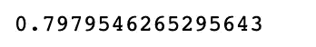

**准确率 80%**

**模型 3: SVR(支持向量回归)**

```
*#assign*
**X3 = df.iloc[:, :-1].values
y3 = df.iloc[:, -1].values**

*#split*
**from** **sklearn.model_selection** **import** **train_test_split
x_train3, x_test3, y_train3, y_test3 = train_test_split(X3,y3,test_size = 0.2, random_state = 1)**

**from** **sklearn.svm** **import SVR
regressor3 = SVR(kernel='rbf')
regressor3.fit(x_train3,y_train3)** *# replace by x_train , y_train if we split*

**regressor3.predict(x_test3)

from sklearn.metrics import r2_score
r2_score(y_test3,y_pred3)**
```

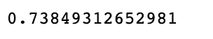

**准确率 74%**

**模型 4:决策树回归**

```
*# Assign*
**X4 = df.iloc[:, :-1].values
y4 = df.iloc[:, -1].values**

*# Split*
**from** **sklearn.model_selection** **import** **train_test_split
x_train4, x_test4, y_train4, y_test4 = train_test_split(X4,y4,test_size = 0.2, random_state = 4)**

**from** **sklearn.tree** **import** **DecisionTreeRegressor
regressor4 = DecisionTreeRegressor(random_state = 0)
regressor4.fit(x_train4,y_train4)** *# replace by x_train , y_train if we split*

**y_pred4 = regressor4.predict(x_test4)** 
**from** **sklearn.metrics** **import** **r2_score
r2_score(y_test4,y_pred4)**
```

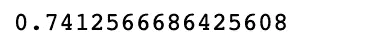

**准确率 74%**

**模型 5:随机森林回归**🏆

```
*# Assign*
**X5 = df.iloc[:, :-1].values
y5 = df.iloc[:, -1].values**

*# Split*
**from** **sklearn.model_selection** **import** **train_test_split
x_train5, x_test5, y_train5, y_test5 = train_test_split(X5,y5,test_size = 0.2, random_state = 6)** 

**from** **sklearn.ensemble** **import RandomForestRegressor
regressor5 = RandomForestRegressor(n_estimators = 10, random_state=0)
regressor5.fit(x_train5,y_train5)** *# replace by x_train , y_train if we split*

**y_pred5= regressor5.predict(x_test5)**

**from** **sklearn.metrics** **import r2_score
r2_score(y_test5,y_pred5)**
```

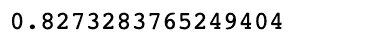

**准确率 83%！🏆**

**83%，**的一个 **R** 揭示了数据**的 **83%** 符合**回归模型

**型号 6: XGboost**

```
**from** **xgboost** **import** XGBClassifier

**model7 = XGBClassifier(random_state=1)
model7.fit(x_train, y_train)
y_pred7 = model7.predict(x_test)
from sklearn.metrics import r2_score
r2_score(y_test5,y_pred7)**
```

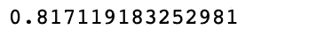

**准确率 82%**

# **解释 R 值**

> **R** (又名**拟合优度**或**决定系数**)是**统计**测量**数据与**拟合**回归线的接近程度。**比**高 **R** ，比**好**。最佳 R 值为 1.0**

通过比较 6 个回归模型，我们可以得出结论:**模型 5:随机森林回归**产生的**精度最高**，其**精度**为**的 83%** ！*🏆*

> **注意**:一个**好的经验法则**是任何高于 70%的精度都被认为是好的，但要小心，因为如果你的精度极高，它可能好得不真实(过度拟合的一个例子)。因此，83%是理想的精确度！

# 预言

S **cenario** :让我们**预测**一家公司酿造的一款红酒的**质量**是根据其**每种成分**的**比例**。我们现在将**输入**每种**成分**的**比例**到我们的**机器学习算法**中。

**红酒的成分**由…

**7.9 g/L** 的**固定酸度**，

**0.59 克/升**的**挥发酸度**，

**柠檬酸**的 0.004 摩尔/升，

**发酵停止后**残糖**1.9g/L**，

**0.062 克**的**氯化物盐**，

**49.0 毫克/升**的**游离二氧化硫**，

**33.0 毫克/升**的**总二氧化硫**，

**密度为 0.9915 克/厘米的水，**

**pH** 的 **3.21** (酸性)，

**0.53 克**的**硫酸盐**，

和 **8.9 %** 的**酒精含量**

根据这些信息，你能**预测**这款**红酒**的**质量分数**吗？

```
**print(regressor5.predict(([[7.9,0.59,0.004,1.9,0.062,49.0,33.0,0.99513,3.21,0.53,8.9,1]])))**
```

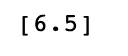

**产量**一**红酒质量分数**为 **6.5** ！

***P.S*** *。如果你看不出来，我以前是* ***生物专业*** *，转行之前是* ***数据科学***

# k 倍交叉验证

> **K 倍交叉验证**是一种**统计**方法，确保我们对我们的模型**性能**有更好的**测量**。我们在数据的不同**子集**上运行我们的建模过程，以获得模型**质量**的多个度量**。我们**用**我们的数据除以**特定的**数量的**倍**。**

> **K 重交叉验证**允许原始数据集中的每个观察值出现在我们的训练&测试集中。

当我们创建 **20 个不同的测试折叠**时，我们**降低了获得**幸运**的** **风险**。**最终** **精度**我们得到的将是**平均值**的 **20 倍测试**！

```
**from sklearn.model_selection import cross_val_score
accuracies = cross_val_score(estimator = regressor5, X = x_train5, y = y_train5, cv = 20)**
**print("Accuracy: {:.2f} %".format(accuracies.mean()*100))** *# float w 2 decimals after comma*
**print("Accuracy: {:.2f} %".format(accuracies.std()*100))** *# float w 2 decimals after comma*
*# the 20 accruaceis lie within  % , we have a high std.* 
*#(Mean - Std, Mean + Std)*
```

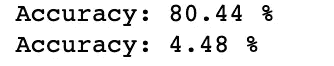

20 个准确度位于**(80.44–4.48，80.44+4.48)%** = **(75.96，84.92)%置信区间**内。我们有一个**高标准差**，这意味着我们的**数字**是**展开**的。

# 结论

1.  **在我们研究的 11 个特征中，帮助葡萄酒商酿造美味红酒的前 3 个重要特征是低水平的二氧化硫和高水平的硫酸盐&酒精。**
2.  我们的随机森林算法产生了最高的 R 值，83%！任何超过 70%的 R 都被认为是好的，但是要小心，因为如果你的精确度非常高，它可能好得不真实(过度拟合的一个例子)。因此，83%是理想的精确度！
3.  我们的机器学习算法现在可以根据成分比例预测红酒的质量。通过检测这些重要的特征，我们可以防止我们的葡萄酒商倒闭或损失任何利润！生产一种没有人会喜欢的葡萄酒成本很高，会给我们公司带来收入损失。这是非常强大的，因为现在我们可以正确地看到人们更喜欢葡萄酒的哪些成分&，从而最大化我们的利润！

这里是从我的 **GitHub** 页面对**数据集** & **代码**的**访问**:

[](https://github.com/jzaidi143/Project-Predicting-the-Perfect-Ratio-of-Red-Wine-Ingredients-with-Regression-Machine-Learning-Algor) [## jzaidi 143/Project-用回归机器学习预测红酒成分的完美比例…

### 预测红酒成分的最佳比例。这是一个数字离散结果。探索各种…

github.com](https://github.com/jzaidi143/Project-Predicting-the-Perfect-Ratio-of-Red-Wine-Ingredients-with-Regression-Machine-Learning-Algor) 

[https://archive.ics.uci.edu/ml/datasets/wine+quality](https://archive.ics.uci.edu/ml/datasets/wine+quality)

欢迎推荐和评论！

# 承认

页（page 的缩写）科尔特斯、塞德伊拉、阿尔梅达、马托斯和雷伊斯。
通过物理化学特性的数据挖掘建立葡萄酒偏好模型。在决策支持系统中，爱思唯尔，47(4):547–553，2009。