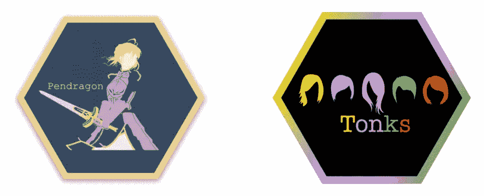
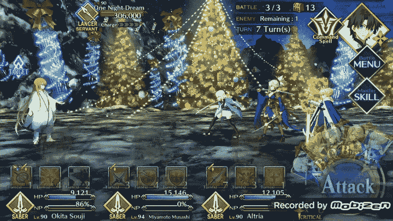
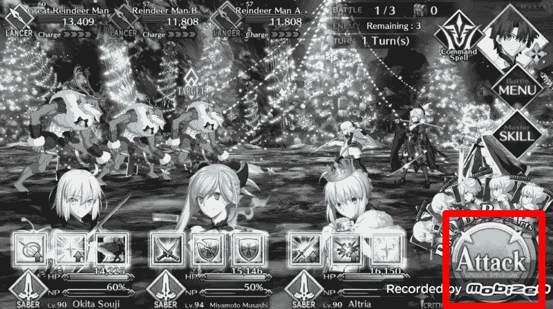
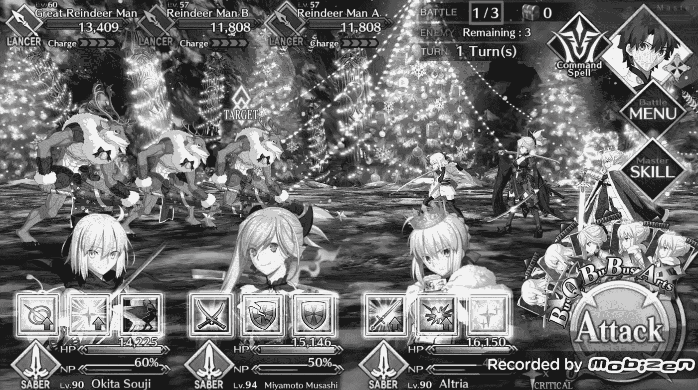
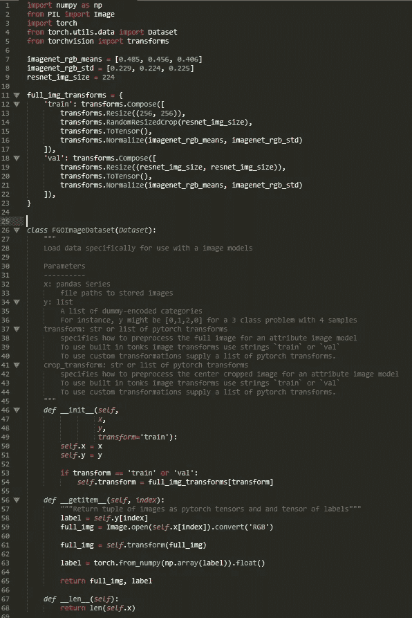
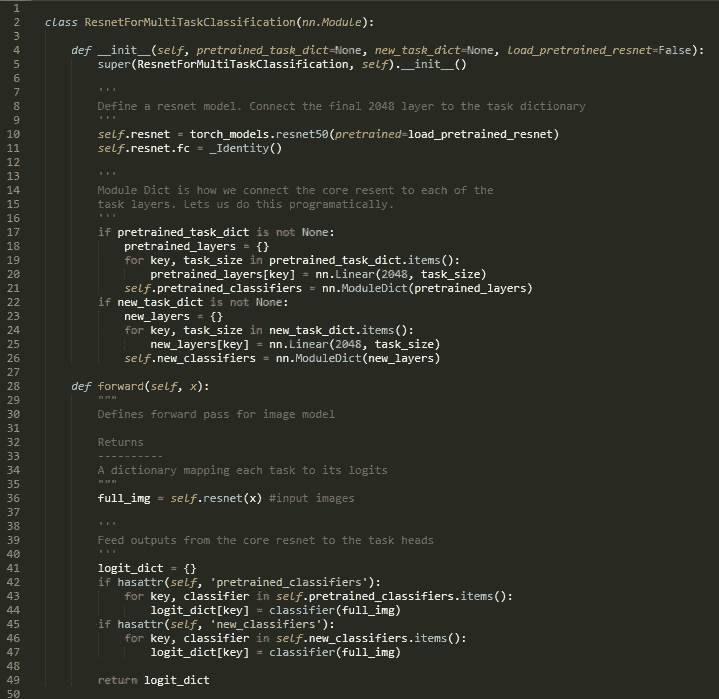
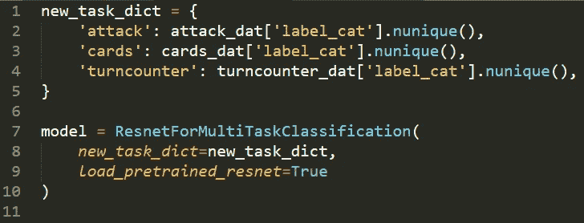

# 项目潘德雷肯+唐克斯:农业命运大订单的多任务特征提取

> 原文：<https://towardsdatascience.com/project-pendragon-tonks-multi-task-feature-extraction-for-farming-fate-grand-order-af077b7aafd2?source=collection_archive---------60----------------------->

不写数据科学博客时，我在一家名为 ShopRunner 的电子商务公司担任高级数据科学家。在过去的一年里，我们的团队一直在构建大型多任务深度学习集成，以使用图像和文本来预测我们产品目录中产品的相关时尚属性和特征。最近，我们的团队开源了我们内部构建的主要培训管道和框架，以在一个名为 Tonks 的包中培训我们的多任务学习者。Tonks 可以安装在 [pypi](https://pypi.org/project/tonks/) 上，源代码可以在 GitHub [这里](https://github.com/ShopRunner/tonks)获得。

在我们讨论开源 Tonks 的过程中，我意识到一个潜在的早期用例可能是升级我的一个辅助项目，我正在构建一系列强化学习(RL)代理来玩手机游戏《命运大订单(FGO)》，我给它起了个绰号叫“潘德雷肯项目”。

潘德雷肯项目有两个主要部分，特征提取管道，它将输入发送到 RL 代理，这些代理做出决策并将命令发送回游戏。虽然我扮演 FGO 的 RL 代理已经反复升级，但我的特征提取管道基本上还在一年前的位置。

这篇文章将介绍我如何替换我的原始特征提取管道，该管道使用三个大型卷积神经网络(两个 ResNet 50 和一个 ResNet 34)，并用一个用多个数据集训练的 Tonks 多任务 ResNet 50 替换这三个模型。

早期版本的多个 RL 代理通过多任务网络从 FGO 手机游戏中提取信息来玩 FGO 内容。

# 唐克斯

我们的 ShopRunner 团队构建了基于 PyTorch 的 Tonks 库，帮助我们使用图像和文本构建大型多任务网络集合。在大多数用例中，我们关心的是能够根据提供的图像、描述、标题和其他信息返回产品的相关属性。

当你培养多任务学习者时，你通常是抱着这样的心态来解决问题的，即在一个任务中学到的特性可能对另一个任务有益。对于电子商务领域的我们来说，像这样的两个任务可能是服装长度和袖子长度，其中两个单一的任务模型可能会学习寻找线条和长度，而不担心颜色、图案和背景。当任务满足这些标准时，这意味着我们可以将任务组合成多任务网络，在 tanks 中，我们通过拥有一个核心模型(如图像的 ResNet 或文本的 Bert 模型)来实现这一点，并将这些核心模型的输出连接到我们各自的任务头

当你的任务都在同一个领域时，多任务学习是有用的，因为它让你建立和维护一个单一的模型，而不是使用多个单一任务的学习者。在我目前的管道中，我训练和使用 3 个大型 CNN，在那里我为以前的每个任务建立了定制的数据集。Tonks 旨在处理您使用定制数据集进行个别任务训练的情况，因此它可以帮助我减少需要维护的模型数量，并让我使用以前使用的数据集进行训练。

在构建多任务模型时要考虑的一点是，当任务不在相似的域内时，多任务模型可能会遭受*破坏性干扰*、，其中来自不同任务的冲突信号将模型拉向不同的方向。关于如何处理这种破坏性干扰的讨论可能是一个很好的后续帖子或讲座，但超出了本文的范围。对于我的 FGO 用例，我的直觉是这个问题是相当可行的，因为所有的任务都使用了 FGO 截图、类似的文本、调色板等等。所以我可能不会有破坏性干扰的问题。

更多关于唐克斯的细节请看我们的发布会[帖子](https://medium.com/shoprunner/tonks-building-one-multi-task-model-to-rule-them-all-3e5d020f1f2b)。

首先，CNN 检测到攻击按钮，Python 向它发送了一个点击。在下一个屏幕上，另一个 CNN 检测到 5 种命令卡类型，RL 机器人根据该输入做出决定。

# 潘德雷肯项目

2018 年秋天，我开始制作一些基本的机器人来玩 FGO，但在我进入机器人的细节之前，我会快速概述一下 FGO 到底是什么。命运大令是一个回合制手机游戏，你可以选择 3 到 6 个不同属性和能力的角色。然后你用这支队伍去对抗一波又一波的敌人，直到所有的敌人或队伍被击败。

我建造这些机器人的主要动机是，作为 FGO 常规活动的一部分，玩家经常被要求数十次(如果不是数百次的话)重复游戏关卡。在最近的一次活动中，我在一周的时间里进行了 100 次农业操作，每一关花费 3-5 分钟(总共 5-8 小时)。因此，考虑到这一点，我认为建立一个机器人能够为我做这个重复性的任务将是一个伟大的附带项目！这个曾经简单的“副业”已经变成了一个有趣的分分合合长达一年的兔子洞，增加了许多有趣的东西，如[多个强化学习代理](/pendragon-four-multi-agent-reinforcement-learning-with-fate-grand-order-80f6254754dd)和各种定制游戏环境。

尽管对围绕机器人的代码库以及如何做出决定进行了许多升级，但我真的没有接触过我的特征提取管道来为我的 RL 游戏机器人获取信息。

## 特征提取器一:现在轮到谁了？

FGO 是一个回合制游戏，为了让机器人玩这个游戏，我需要能够检测到什么时候该轮到他们了。我决定检测机器人何时开始行动的方法是在挑选指挥卡之前寻找出现在主战斗屏幕上的“攻击”按钮。

下面是一个主战斗界面的例子，攻击按钮在右下角突出显示。

右下角的攻击按钮，高亮显示。

我把这个网络分成两类，“攻击”和“不攻击”，基本上就是说这个网络被训练来检测攻击按钮是否出现在游戏屏幕的那个部分。如果是，那么这意味着轮到机器人了，你可以做一些有用的事情，比如在当前屏幕上采取行动/使用技能，或者继续前进，调出命令卡屏幕，在那里你可以选择 5 张卡中的哪一张来玩。

挑选指挥卡是 FGO 的主要战斗技巧。因此，一旦我能够检测到该轮到谁了，就该构建一个分类器来帮助我识别那一轮发了什么命令卡。我的第一批机器人使用这些信息进行算法上的游戏，而后来的机器人通过强化学习来训练选择要玩的牌，但作为特征提取过程的关键部分，它们都需要能够识别哪些牌已经被处理。

## 特征提取二:发了什么命令牌？

FGO 的主要战斗机械师在你的回合中挑选“指挥卡”。有三种类型的牌:“艺术”、“克星”和“快速”，每种类型的牌做的事情略有不同。每回合发 5 张牌，玩家必须从其中选择 3 张来玩该回合。下面是展示的 5 张卡片和挑选的 3 张卡片的样本。

样本命令卡和正在挑选的卡。特征提取模型预测 5 张卡中每一张的类型。这些预测随后被发送到一个“拣卡者”模型，该模型决定玩哪一个 3。

虽然我可以构建一个检测器来在幕后找到卡的位置，但我找到了一个更简单的解决方案。这些屏幕相对一致，卡片放在同一个位置，所以我选择做的是硬编码五个命令卡的位置，并从命令卡屏幕的截图中裁剪出来(见下面的示例)。然后，我将五张卡中的每一张都通过一个经过 PyTorch 训练的 CNN 来确定卡的“类型”。

彩色部分是发出的 5 张命令牌。

然后，可以将这些牌类型分类提供给各种 RL 代理，并用于决定在给定的回合中使用哪些牌。很长一段时间，这两个网络(攻击按钮和卡类型检测器)是我的第一个 FGO 强化机器人的核心特征提取器，昵称为[潘德雷肯·阿尔特](/project-pendragon-part-2-a-reinforcement-learning-bot-for-fate-grand-order-7bc75c87c4f3)。他们让我做了一个机器人，可以在 FGO 进行主要的战斗，也可以以自动化的方式玩完整个游戏。从这一点开始，我真的只需要考虑玩游戏还需要哪些信息，以及如何从游戏中提取这些信息。

## 特征提取器三:我们在敌人的哪一波？

我添加到我的框架中的最后一个网络实际上是一个波计数器，我用它作为我的几个不同版本的机器人的输入。我添加这个的原因是 FGO 等级几乎总是有 1 到 3 个回合的敌人，你必须通过战斗，一个代理人可能想采取的行动可能取决于回合。例如，第一波敌人可能相对较弱，但第三波可能相当强，所以为第三波保留技能通常是一个好策略。

我在下面截图的顶部用红色突出显示了圆形柜台。

回合计数器显示当前回合和总回合数

虽然我可以使用某种光学字符识别来获得数字，但我真正关心的是告诉它是第 1 轮、第 2 轮还是第 3 轮，所以我训练 CNN 将三个类别映射到这些数字，每次检测到攻击按钮时，我都会检查当前是哪个回合数。

这三个网络实现了我需要的基本特征提取，但需要同时运行三个大型 CNN 会增加相当多的 GPU 或 CPU 计算开销和额外的存储(2 个 Resnet 50s 约为 220MB，1 个 Resnet 34 约为 84Mb)。

# 唐克斯培训管道

我们的 Tonks 管道遵循 Fastai 建立的通用框架，其中管道被组织成数据加载器、模型和学习器。我们最终使用各种帮助记账的字典来管理多个任务和多个数据集。

以下部分将显示出现在下面链接的培训笔记本中的代码片段，并讨论其中发生的事情。

> 我培训用的笔记本放在[这里](https://github.com/sugi-chan/fgo_tonks_training/blob/master/fgo_tonks.ipynb)

## Tonks 数据集和数据加载器

我们的自定义 Tonks 数据集(第 26 行)FGOImageDataset 遵循相当标准的 PyTorch 数据集布局，其中我们需要提供一种方法来索引适当的值，作为数据生成器的一部分(第 58-59 行)，应用变换(第 61 行)，并返回图像数据和标签(第 65 行)。

第 11–24 行的应用取决于我们是否在查看验证集的训练。我喜欢以这种格式保存转换，但这只是个人偏好。

fgo_tonks 笔记本的 14 号单元格

一旦我们创建了自定义的 Tonks 数据集类，我们就可以开始为我们的三个任务创建训练和验证数据集。流程的这一部分也非常类似于标准的 PyTorch 培训管道，您必须将培训和验证分割放入数据集，然后最终放入数据加载器。这里唯一的区别是我们有三个数据集，而不是普通的一个。

第 1–26 行显示了我们如何为这三个任务中的每一个准备训练和验证分割。第 28–37 行显示了我们如何创建一个数据加载器字典，我们将在接下来的步骤中使用它来创建 Tonks 的多任务多数据集数据加载器。

在上面这段代码中，我们使用我之前展示的自定义数据集类为每个类创建训练和验证数据集。这包括指定 x 和 y 输入(图像及其标签的文件路径)以及我们想要应用的转换。在这个管道中，我只是在训练集中使用了 ImageNet 标准化的随机裁剪，在验证集中只使用了标准化。一旦创建了数据集，我们就创建了一个基本 PyTorch 数据加载器的字典，其中键是任务的名称，值是与这些任务相关联的数据加载器。这里的想法是，我们可以跟踪我们应该为哪个数据集生成批次，作为我们多数据集训练管道的一部分。

下面的代码片段显示了我们如何将 PyTorch 数据加载器的两个字典放入两个 Tonks MultiDatasetLoaders 中。这些 Tonks 数据加载器是我们用来集成我们的多任务多数据集培训管道的。

Tonks 多数据集加载器

## Tonks 网络架构示例

管道的下一个主要部分是模型。虽然我们提供了一些示例图像和文本模型架构，但是根据您的需求定制这些架构可能是有意义的。对我来说，我只是做了一个简单的基于 ResNet50 的架构，并将其连接到各个任务层。在 Tonks 中，我们用两个 PyTorch 模块指令来处理这一部分，称为`pretrained_classifiers`和`new_classifiers`。我们在这里的想法是，第一次训练网络时，我们将任务发送到`new_classifiers`字典，当我们保存训练好的网络时，这些任务将被移动到`pretrained_classifier`字典进行保存。然后在随后的运行中，我们可以将预先训练的任务头加载到`pretrained_classifier`字典中。这有助于我们跟踪在哪里应用学习率(因为您可能希望根据任务头之前是否进行过微调来获得不同的学习率)

## 加载 Tonks 模型

当我们加载一个 Tonks 模型的实例时，主要的输入在`task_dictionary`中。有两个潜在的选项:第一个是`new_task_dict`，这是您第一次训练模型时应该使用的选项，而第二个是`pretrained_task_dict`，这是您可以将任务放置在已经存在 Tonks 预训练权重的位置。对于我们在 ShopRunner 的人来说，这很有用，因为我们现在可以轻松地向现有模型添加新任务。

对于这个 FGO 的例子，我有三个全新的任务。我将把一个包含任务名称和每个任务中类别数量的字典放入一个名为`new_task_dict`的字典中，并在初始化模型类时将其输入到模型类中。这告诉 Tonks 模型创建三个任务头，每个任务头有一定数量的节点。

## 培养

一旦我们初始化了模型，在开始训练之前，我们需要做的就是为各种任务定义一个损失函数，指定一个优化器，分配学习率，创建我们的学习器，并调用 fit 函数。

对于这个管道，每个任务都是一个多类问题，所以我们使用交叉熵损失。当我们指定学习率时，我们可以为模型的不同部分指定不同的学习率。对于主要的 ResNet 部分，我们指定一个低的`1e-4`学习率，但是对于新的部分，我们指定一个更积极的`1e-2`学习率。这背后的主要思想是，我们并不真的想大幅改变 ResNet50 核心模型中的 ImageNet 权重，但由于新的分类器层是随机初始化的，所以我们可以更积极地调整它们。然后我们定义了一个调度器来降低每两个时期的学习率。

一旦完成，我们可以使用 Tonks `MultiTaskLearner`类定义我们的学习者。该类包含我们训练模型所需的所有功能，并接受我们之前加载的模型架构、训练和验证 Tonks 数据加载器以及任务字典，后者包含我们所有任务的映射，用于从我们的数据加载器中检索批处理。

最后，我们可以在我们的学习器上调用`fit()`。关于不同论点的细节，你可以查看我们的[阅读文件](https://tonks.readthedocs.io/en/latest/)。

# 结果

一旦我完成了三任务 Tonks 网络的训练，我就必须用新的多任务网络替换我的项目潘德雷肯回购中的三个网络。由于 Tonks 是建立在 PyTorch 之上的，为了使用一个模型，您需要跟踪的只是模型架构和权重文件，因此您不一定需要安装 Tonks 及其所有依赖项来在新项目中使用经过训练的模型。

Tonks 模型在所有任务中表现强劲，到目前为止，我在 FGO pendragon 游戏界面的部署中没有遇到任何问题。在我继续改进我的 RL 代理人时，我一直在用 Tonks 模型进行我最近的其他开发。最近的部分是让代理使用协调的策略。

代理协调清除困难的内容。代理和机器人的特征提取基于这里训练的多任务 tonks 模型。

因此，虽然这个基于手机游戏的例子很可爱，但是在这里使用 Tonks 这样的框架的原因与我们研究工业规模问题的原因是一样的。它消除了我维护多个单一任务学习者网络的需要，并且我能够快速轻松地进行训练，因为我能够使用我之前构建的三个现有数据集。

Tonks 是一个库，我们的 ShopRunner 数据科学团队一直在使用它来构建工业规模的多任务深度学习集成，使用经过多个数据集训练的图像和文本。对我们来说，这使得我们的团队创建多任务模型来满足新的和变化的需求变得相对简单。由于培养多任务学习者是一个非常现实的需求，但目前还没有得到支持，我们开源了我们的工作，以帮助回馈数据科学社区。