# 项目:用分类机器学习算法预测心脏病

> 原文：<https://towardsdatascience.com/project-predicting-heart-disease-with-classification-machine-learning-algorithms-fd69e6fdc9d6?source=collection_archive---------5----------------------->

## 你刚刚被聘为**数据科学家**


[来源](https://unsplash.com/photos/OermHGSUzhI)

# **目录**

**1。简介:**场景&目标，特性&预测器

**2。数据角力**

**3。探索性数据分析:**相关性，小提琴&箱线图，按阳性&阴性心脏病患者筛选数据

**4。机器学习+预测分析:**为建模准备数据，建模/训练，混淆矩阵，特征重要性，predictions‍‍‍‍‍‍‍‍‍‍‍‍‍‍‍‍‍‍‍‍‍‍‍‍‍‍‍‍‍‍‍

**5。结论**

# 1.介绍

# 场景:

你刚刚被一家医院聘为数据科学家，这家医院有数量惊人的患者报告各种心脏症状。心脏病专家测量生命体征&将数据交给**进行数据分析**和**预测**某些患者是否患有心脏病。我们想做一个**机器学习算法**，在那里我们可以训练我们的 AI 学习&从经验中改进。因此，我们想将患者分为心脏病阳性或阴性。

# 目标:

*   预测病人是否应该被诊断为心脏病。这是一个**二元**结果。
    **(+)= 1，患者诊断为心脏病
    **阴性** (-) = 0，患者未诊断为心脏病**
*   **用各种**分类模型** &做实验，看看哪一个产生最大的**精确度**。**
*   **检查我们数据中的**趋势** & **相关性****
*   **确定哪些**特征**对阳性/阴性心脏病诊断**最重要****

# **特征和预测:**

**我们的**预测因子** (Y，心脏病的阳性或阴性诊断)是由 13 个**特征** (X)决定的:**

**1.**年龄** (#)
2。**性别** : 1=男，0=女(*二进制* )
3。( **cp** )胸痛类型(4 值- *序数*):值 1:典型心绞痛，值 2:不典型心绞痛，值 3:非心绞痛性疼痛，值 4:无症状
4。( **trestbps** )静息血压(#)
5。( **chol** )血清胆固醇以毫克/分升计(#)
6。( **fbs** )空腹血糖> 120 mg/dl( *二进制* )(1 =真；
0 =假)7。( **restecg** )静息心电图结果(值 0，1，2)
8。( **thalach** )达到的最大心率(#)
9。( **exang** )运动诱发心绞痛(*二元* ) (1 =是；
0 =否)10。( **oldpeak** ) =运动相对于休息诱发的 ST 段压低(#)
11。最大运动 ST 段的(**斜率**)(*序数*)(值 1:上坡，值 2:平，值 3:下坡)
12。( **ca** )透视着色的主要血管数(0–3，*序数*)13。( **thal** )达到的最大心率— ( *序数* ): 3 =正常；6 =修复缺陷；7 =可逆缺陷**

***注:我们的数据有 3 种类型的数据:***

****(#)**:可以测量的定量数据**

****顺序数据**:有顺序的分类数据(0，1，2，3 等)**

****二进制数据**:其单元只能呈现两种可能状态的数据(0 & 1)**

# **2.数据争论**

```
**import** **numpy** **as** **np**
**import** **pandas** **as** **pd**
**import** **matplotlib** **as** **plt**
**import** **seaborn** **as** **sns**
**import** **matplotlib.pyplot** **as** **plt**filePath = '/Users/jarar_zaidi/Downloads/datasets-33180-43520-heart.csv'

data = pd.read_csv(filePath)

data.head(5)
```

**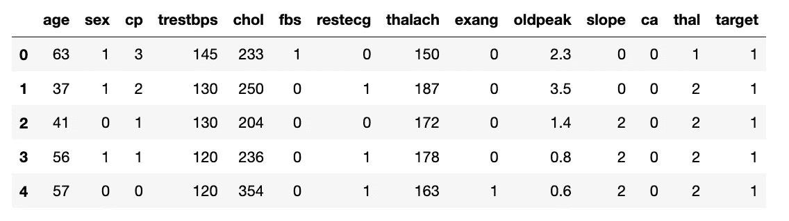**

**帮助我们了解我们正在处理的数据。**

```
**print("(Rows, columns): " + str(data.shape))
data.columns**
```

**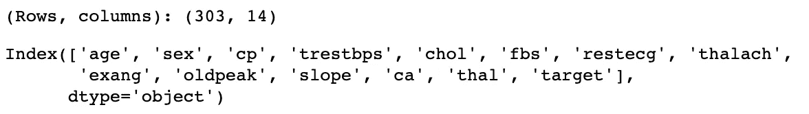**

**显示行数和列数。以及列名**

```
**data.nunique(axis=0)***# returns the number of unique values for each variable.*
```

**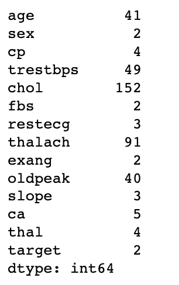**

**返回每个变量的唯一值的数量。**

```
*#summarizes the count, mean, standard deviation, min, and max for numeric variables.*
**data.describe()**
```

**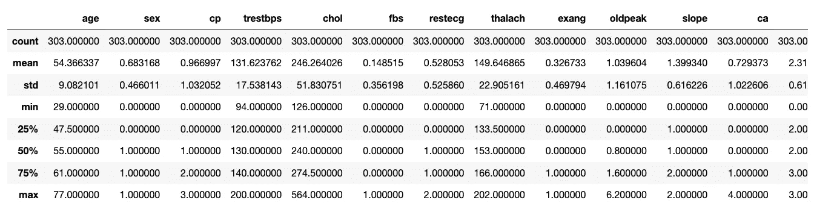**

**汇总数字变量的计数、平均值、标准差、最小值和最大值。**

```
*# Display the Missing Values*

**print(data.isna().sum())**
```

**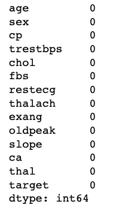**

**显示每列缺失值的数量。幸运的是我们没有。**

**让我们看看在我们的正&负**二元预测器之间是否有一个*好的比例*。****

```
**data['target'].value_counts()**
```

**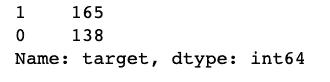**

**看起来我们在两个二进制输出之间有一个很好的平衡。**

# **3.探索性数据分析**

# **相关**

****相关矩阵** -让我们看看所有变量之间的**相关性**。**

> **几秒钟之内，你就能看出某样东西与我们的**预测器(目标)**是正相关还是负相关。**

```
*# calculate correlation matrix*

**corr = data.corr()
plt.subplots(figsize=(15,10))
sns.heatmap(corr, xticklabels=corr.columns, yticklabels=corr.columns, annot=True, cmap=sns.diverging_palette(220, 20, as_cmap=True))
sns.heatmap(corr, xticklabels=corr.columns,
            yticklabels=corr.columns, 
            annot=True,
            cmap=sns.diverging_palette(220, 20, as_cmap=True))**
```

**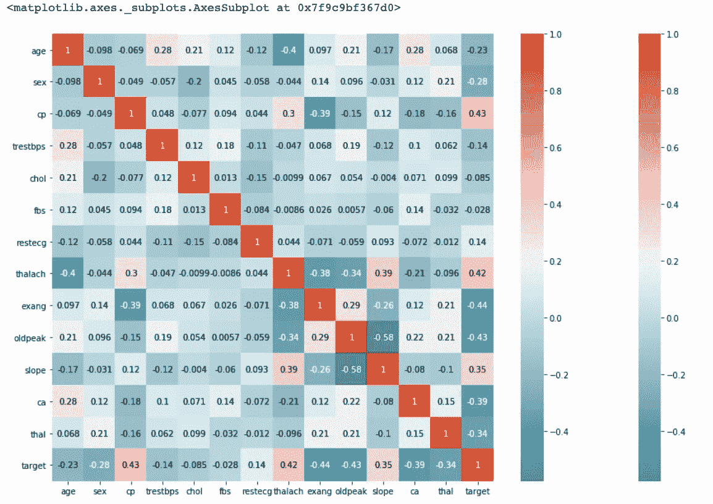**

**我们可以看到胸痛(cp) &目标值(我们的预测值)之间存在**正相关**。这是有道理的，因为胸痛越严重，患心脏病的几率就越大。Cp(胸痛)，是具有 4 个值的顺序特征:值 1:典型心绞痛，值 2:不典型心绞痛，值 3:非心绞痛性疼痛，值 4:无症状。**

**此外，我们发现运动诱发的心绞痛(exang) &与我们的预测因子**呈负相关**。这是有道理的，因为当你运动时，你的*心脏需要更多的血液*、*，但狭窄的动脉会减缓血液流动*。**

**Pairplots 也是一种很好的方式，可以立即看到所有变量之间的相关性。但是你会看到我只用我们的数据中的连续列来制作它，因为有这么多的特征，很难看到每一个。因此，我将制作一个只有连续特征的配对图。**

```
**subData = data[['age','trestbps','chol','thalach','oldpeak']]
sns.pairplot(subData)**
```

**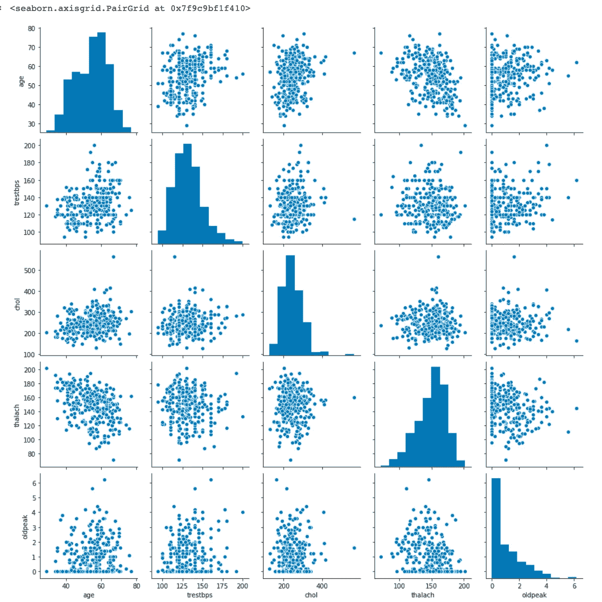**

**选择用**和**连续的**变量制作一个较小的 pairplot，以便更深入地研究这些关系。这也是一个很好的方法来看看他们之间是正相关还是负相关！****

```
**sns.catplot(x="target", y="oldpeak", hue="slope", kind="bar", data=data);

plt.title('ST depression (induced by exercise relative to rest) vs. Heart Disease',size=25)
plt.xlabel('Heart Disease',size=20)
plt.ylabel('ST depression',size=20)**
```

**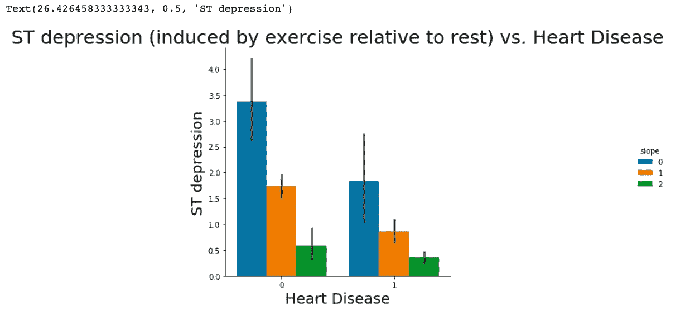**

**ST 段压低的发生是因为当心室处于静止状态并因此复极时。如果 ST 段中的迹线异常地低于基线，此*可导致此心脏病*。这支持了上面的图表，因为低 ST 段抑郁会使人们有更大的患心脏病的风险。而高度 ST 段压低被认为是正常的&健康的。*斜率*色调，指运动 ST 段峰值，取值:0:上升，1:平缓，2:下降)。两个阳性&阴性心脏病患者都表现出 3 个斜率类别的**均等分布**。**

# **小提琴和盒子图**

**显示方框&图的**优点**是显示*基本*数据的*统计*，以及其*分布*。这些图通常用于比较给定变量在某些类别中的分布。**

**它显示了**中值，IQR，&图基的栅栏。**(最小值、第一个四分位数(Q1)、中值、第三个四分位数(Q3)和最大值)。**

**此外，它可以为我们提供数据中的异常值。**

```
**plt.figure(figsize=(12,8))
sns.violinplot(x= 'target', y= 'oldpeak',hue="sex", inner='quartile',data= data )
plt.title("Thalach Level vs. Heart Disease",fontsize=20)
plt.xlabel("Heart Disease Target", fontsize=16)
plt.ylabel("Thalach Level", fontsize=16)**
```

**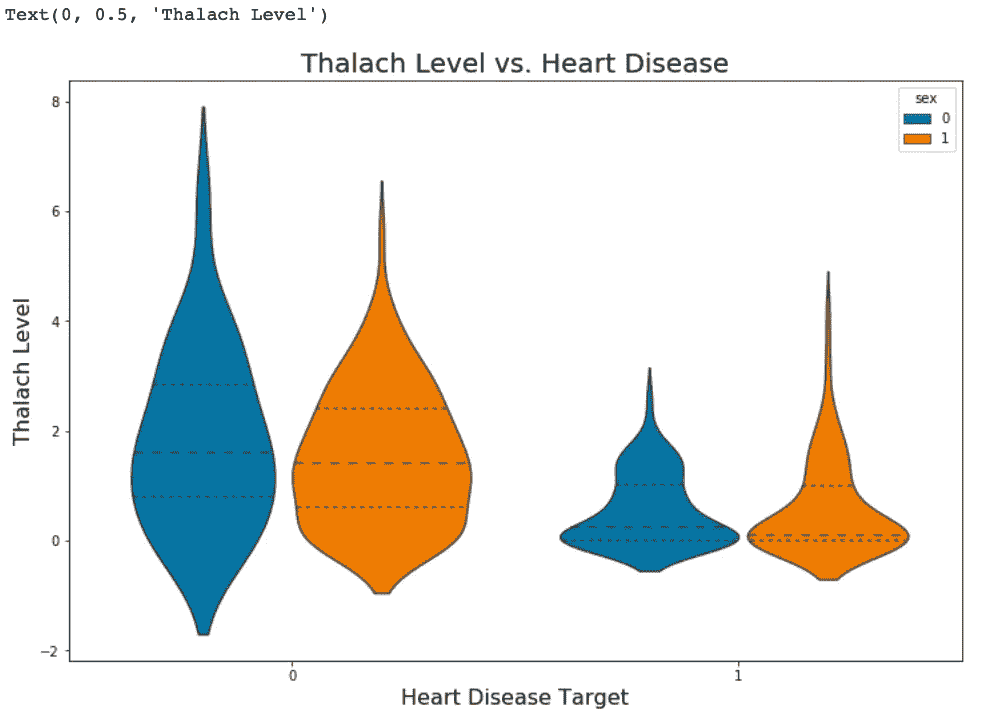**

**我们可以看到，阴性和阳性患者的总体形状和分布**差别很大**。阳性患者表现出较低的 ST 段压低水平中位数&，因此他们的数据分布在 0 & 2 之间，而阴性患者在 1 & 3 之间。此外，我们看不出男性&女性目标结果之间有多大差异。**

```
**plt.figure(figsize=(12,8))
sns.boxplot(x= 'target', y= 'thalach',hue="sex", data=data )
plt.title("ST depression Level vs. Heart Disease", fontsize=20)
plt.xlabel("Heart Disease Target",fontsize=16)
plt.ylabel("ST depression induced by exercise relative to rest", fontsize=16)**
```

**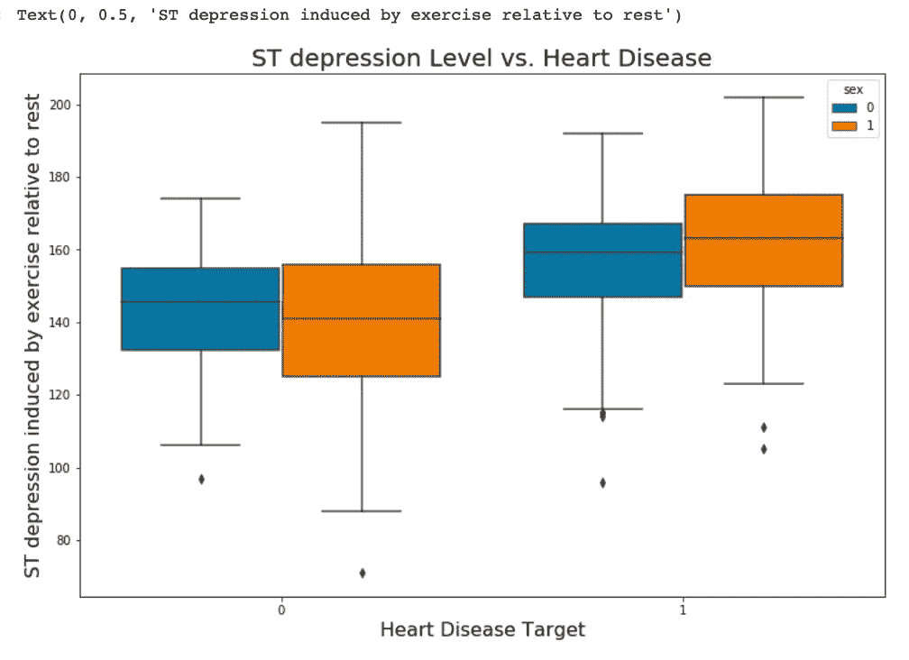**

****阳性患者**表现出**增高的 ST 段压低水平中位数**，而**阴性患者**的水平较低。此外，我们看不出男性&和女性**的目标结果有什么不同，除了男性的 ST 段下降幅度稍大。****

# **按阳性和阴性心脏病患者过滤数据**

```
# Filtering data by POSITIVE Heart Disease patient
**pos_data = data[data['target']==1]
pos_data.describe()**
```

**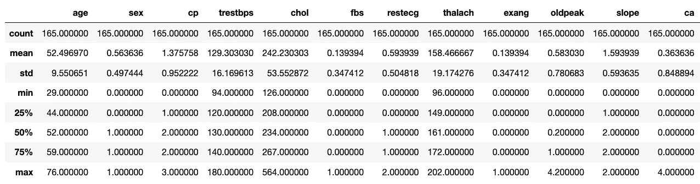**

```
# Filtering data by NEGATIVE Heart Disease patient
**pos_data = data[data['target']==0]
pos_data.describe()**
```

**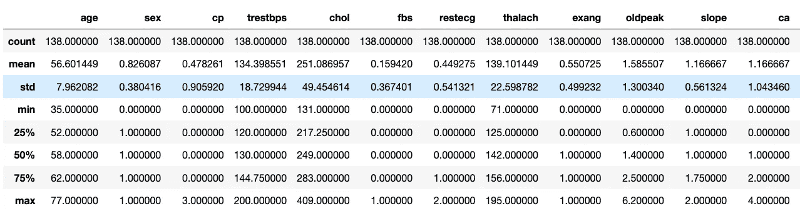**

```
**print("(Positive Patients ST depression): " + str(pos_data['oldpeak'].mean()))
print("(Negative Patients ST depression): " + str(neg_data['oldpeak'].mean()))**
```

**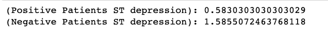**

```
**print("(Positive Patients thalach): " + str(pos_data['thalach'].mean()))
print("(Negative Patients thalach): " + str(neg_data['thalach'].mean()))**
```

**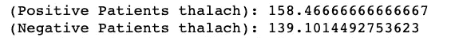**

**从*对比*阳性和阴性患者我们可以看到**在我们的 *13 特征*的很多手段上有**巨大的差异。通过检查细节，我们可以观察到**阳性患者的最大心率增加，达到了** (thalach)平均值。此外，**阳性患者表现出运动诱发的 ST 段压低**相对于静息(oldpeak)约 1/3 的量。**

# **4.机器学习+预测分析**

# **为建模准备数据**

**为建模准备数据，只需记住 **ASN(赋值，拆分，规格化)。****

**AT22 将 13 个特征赋值给 X，&最后一列给我们的分类预测值，y**

```
**X = data.iloc[:, :-1].values
y = data.iloc[:, -1].values**
```

**SS**plit**:数据集分为训练集和测试集**

```
**from sklearn.model_selection import train_test_split
x_train, x_test, y_train, y_test = train_test_split(X,y,test_size = 0.2, random_state = 1)**
```

**N **标准化**:标准化数据将转换数据，使其分布的平均值为 0，标准差为 1。**

```
**from sklearn.preprocessing import StandardScaler
sc = StandardScaler()
x_train = sc.fit_transform(x_train)
x_test = sc.transform(x_test)**
```

# **建模/培训**

**现在，我们将在训练集&上训练各种**分类模型**，看看哪个**产生最高的准确度**。我们将*比较*逻辑回归、*K-NN(*K-最近邻)*、SVM(支持向量机)、Naives Bayes 分类器、决策树、随机森林和 XGBoost* 的准确性。**

**注:这些都是**监督学习模型**。**

****模型 1:逻辑回归****

```
**from** **sklearn.metrics** **import** classification_report 
**from** **sklearn.linear_model** **import** LogisticRegression

**model1 = LogisticRegression(random_state=1)** *# get instance of model*
**model1.fit(x_train, y_train)** *# Train/Fit model* 

**y_pred1 = model1.predict(x_test)** *# get y predictions*
**print(classification_report(y_test, y_pred1))** *# output accuracy*
```

**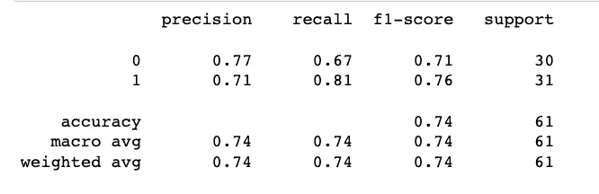**

****准确率 74%****

****模型 2:K-NN(K-最近邻)****

```
**from** **sklearn.metrics** **import** classification_report 
**from** **sklearn.neighbors** **import** KNeighborsClassifier

**model2 = KNeighborsClassifier()** *# get instance of model*
**model2.fit(x_train, y_train)** *# Train/Fit model* 

**y_pred2 = model2.predict(x_test)** *# get y predictions*
**print(classification_report(y_test, y_pred2))** *# output accuracy*
```

**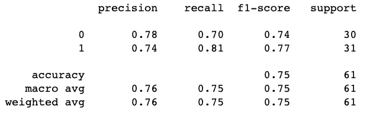**

****准确率 75%****

****模型三:SVM(支持向量机)****

```
**from** **sklearn.metrics** **import** classification_report 
**from** **sklearn.svm** **import** **SVC**

**model3 = SVC(random_state=1)** *# get instance of model*
**model3.fit(x_train, y_train)** *# Train/Fit model* 

**y_pred3 = model3.predict(x_test)** *# get y predictions*
**print(classification_report(y_test, y_pred3))** *# output accuracy*
```

**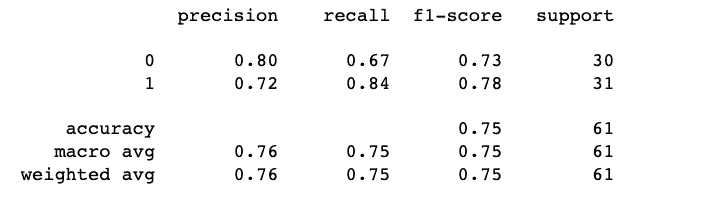**

****准确率 75%****

****模型 4: Naives 贝叶斯分类器****

```
**from** **sklearn.metrics** **import** classification_report 
**from** **sklearn.naive_bayes** **import** GaussianNB

**model4 = GaussianNB()** *# get instance of model*
**model4.fit(x_train, y_train)** *# Train/Fit model* 

**y_pred4 = model4.predict(x_test)** *# get y predictions*
**print(classification_report(y_test, y_pred4))** *# output accuracy*
```

**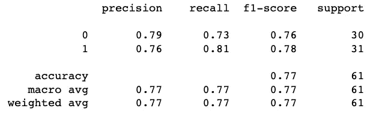**

****准确率 77%****

****模型 5:决策树****

```
**from** **sklearn.metrics** **import** classification_report 
**from** **sklearn.tree** **import** DecisionTreeClassifier
 **model5 = DecisionTreeClassifier(random_state=1)** *# get instance of model*
**model5.fit(x_train, y_train)** *# Train/Fit model* 

**y_pred5 = model5.predict(x_test)** *# get y predictions*
**print(classification_report(y_test, y_pred5))** *# output accuracy*
```

**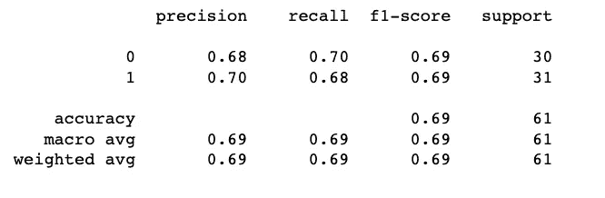**

****准确率 69%****

****模式六:随机森林**🏆**

```
**from** **sklearn.metrics** **import** classification_report 
**from** **sklearn.ensemble** **import** RandomForestClassifier

**model6 = RandomForestClassifier(random_state=1)***# get instance of model*
**model6.fit(x_train, y_train)** *# Train/Fit model* 

**y_pred6 = model6.predict(x_test)** *# get y predictions*
**print(classification_report(y_test, y_pred6))** *# output accuracy*
```

**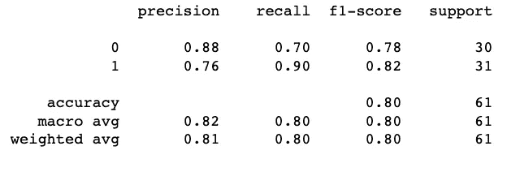**

****准确率 80%！**🏆**

****型号 7: XGBoost****

```
**from** **xgboost** **import** XGBClassifier
 **model7 = XGBClassifier(random_state=1)
model7.fit(x_train, y_train)
y_pred7 = model7.predict(x_test)
print(classification_report(y_test, y_pred7))**
```

**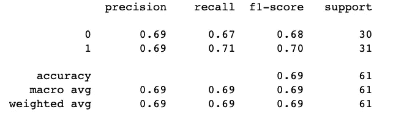**

****准确率 69%****

> **通过比较这 7 个模型，我们可以**得出**结论:**模型 6:随机森林**产生的**精确度最高**。准确率高达 80%。🏆**

****精度、召回、F1-得分**和**支持**:**

****精度**:是“该类中有多少被正确分类”**

****回想一下**:“你在这个类的所有元素中找到了多少个这样的元素”**

****F1-得分**:调和*表示精度和召回值的*。
F1 得分在 1 时达到最佳值，在 0 时达到最差值。
F1 得分= 2 x((精度 x 召回)/(精度+召回))

**支持**:*真*响应的样本数，即位于该类中。**

# **制作混淆矩阵**

```
**from sklearn.metrics import confusion_matrix, accuracy_score
cm = confusion_matrix(y_test, y_pred6)
print(cm)
accuracy_score(y_test, y_pred6)**
```

**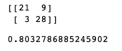**

**注意:一个**好的经验法则**是任何高于 70% 的精度**都被认为是**好的**，但是要小心，因为如果你的精度非常高，它可能好得不真实(一个**过度拟合**的例子)。因此，80%是**的理想精度**！****

****如何解读混淆矩阵:****

**21 是我们数据中**真阳性**的数量，而 28 是**真阴性的数量。****

**9 和 3 是**错误**的数量。**

**有 9 个**类型 1 错误(假阳性)** -你预测阳性，它是假的。**

**有 3 个**类型 2 错误** **【假阴性】**——你预测阴性，是假的。**

**因此，如果我们计算**准确度**，它的#正确预测/ #总数。
换句话说，其中 TP、FN、FP 和 TN 代表真阳性、假阴性、假阳性和真阴性的数量。**

****精度** = (TP + TN)/(TP + TN + FP + FN)。
**精度**=(21+28)/(21+28+9+3)= 0.80 =**80%精度****

# **特征重要性**

****特性重要性**提供了一个**分数**，表明**每个特性在我们的模型中有多有用**。**

> **该**特征得分越高，**用于做出关键决策的特征越多**&因此越重要。****

```
*# get importance*
**importance = model6.feature_importances_**

*# summarize feature importance*
**for i,v in enumerate(importance):
    print('Feature: %0d, Score: %.5f' % (i,v))**
```

**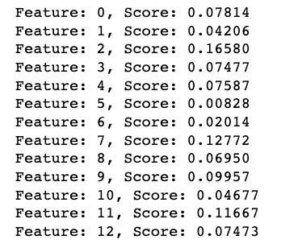**

```
**index= data.columns[:-1]
importance = pd.Series(model6.feature_importances_, index=index)
importance.nlargest(13).plot(kind='barh', colormap='winter')**
```

**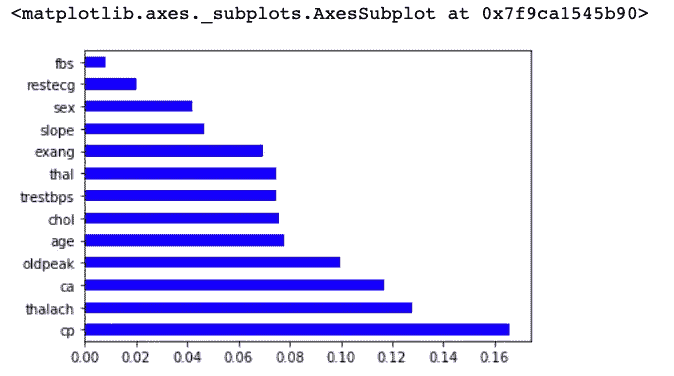**

**从上面的特征重要性图中，我们可以得出结论，**前 4 个显著特征**分别是胸痛类型( **cp** )、达到的最大心率( **thalach** )、主要血管数量( **ca** )以及运动相对于休息诱发的 st 段压低( **oldpeak** )。**

# **预言**

**S **cenario** :一个病人出现心脏症状&你把他的生命体征输入机器学习算法。**

**他是一名 **20** 岁男性，胸痛值**2**(非典型心绞痛)，静息血压**110。****

**此外，他的血清胆固醇水平为 230 毫克/分升。**

**他是**空腹血糖> 120 mg/dl。****

**他有一个 **1 的**静息心电图结果**。****

****患者达到的最大心率**是 **140。****

**还有，他是**运动诱发的心绞痛。****

**他的**运动诱发的 ST 段压低**相对于休息值为 **2.2。****

**峰值运动 ST 段的**坡度**为**平**。**

**他的**没有透视着色的大血管**，此外他的**达到的最大心率**是可逆的缺陷。**

**根据这些信息，你能**给**这个心脏病患者分类吗？**

```
**print(model6.predict(sc.transform([[20,1,2,110,230,1,1,140,1,2.2,2,0,2]])))**
```

**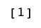**

****输出**二进制 **1** - >意为**阳性**心脏病诊断**

**预测测试集结果:**

****第一个值**代表我们的 ***预测值*** ，**第二个值**代表我们的*实际值。***

***如果值**与**匹配，那么我们正确预测了**。*****

```
*****y_pred = model6.predict(x_test)
print(np.concatenate((y_pred.reshape(len(y_pred),1), y_test.reshape(len(y_test),1)),1))*****
```

*****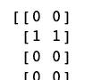***************

*****可以看到我们的结果非常**准确(80%)** ！*****

# *****结论*****

*******1。在我们检查的 13 个特征中，有助于我们在阳性&阴性诊断之间进行分类的前 4 个显著特征是胸痛类型(cp)、达到的最大心率(thalach)、主要血管数量(ca)和运动相对于休息诱发的 st 段压低(oldpeak)。*******

*******2。我们的机器学习算法现在可以对心脏病患者进行分类。现在我们可以正确地诊断病人，给他们康复所需的帮助。通过早期诊断和检测这些特征，我们可以防止以后出现更糟糕的症状。*******

*******3。我们的随机森林算法产生最高的准确率，80%。任何超过 70%的准确度都被认为是好的，但是要小心，因为如果你的准确度非常高，可能好得不像真的(过度拟合的一个例子)。因此，80%是理想的准确度！*******

*****以下是从我的 GitHub 页面获得的数据集和代码:*****

*****[https://github . com/jzaidi 143/Project-Predicting-Heart-Disease-with-class ification-Machine-Learning-Algorithms](https://github.com/jzaidi143/Project-Predicting-Heart-Disease-with-Classification-Machine-Learning-Algorithms)*****

*****欢迎推荐和评论！*****

# *******致谢*******

*****创作者:*****

1.  *****匈牙利心脏病研究所。布达佩斯:医学博士安朵斯·雅诺西*****
2.  *****瑞士苏黎世大学医院:威廉·斯坦布伦医学博士*****
3.  *****瑞士巴塞尔大学医院:马蒂亚斯·菲斯特勒医学博士*****
4.  *****弗吉尼亚医疗中心，长滩和克利夫兰诊所基金会:罗伯特·德特拉诺，医学博士，哲学博士。*****

*****捐赠者:
大卫·w·阿哈(阿哈' @ ' ics.uci.edu)(714)856–8779*****