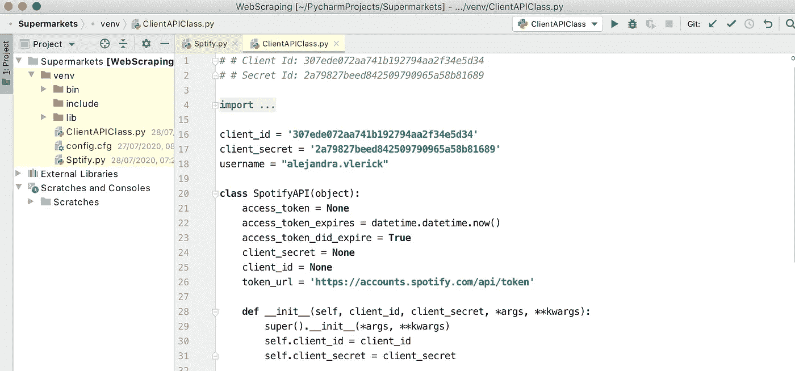
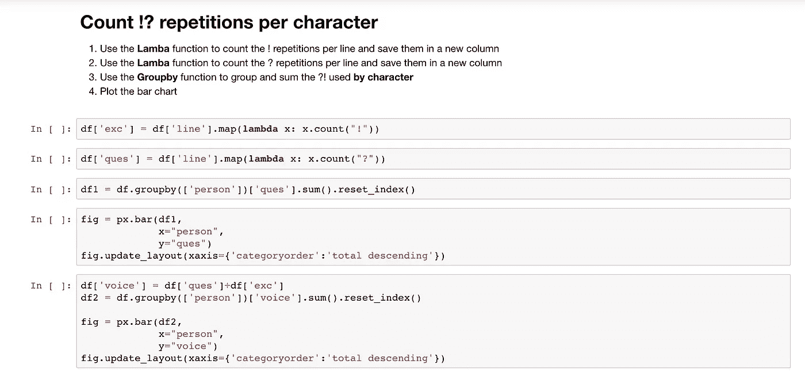
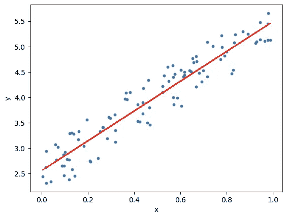
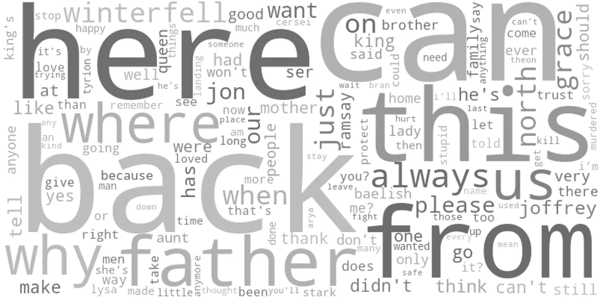

# 数据科学初学者项目时间表

> 原文：<https://towardsdatascience.com/project-timeline-for-data-science-beginners-83b7106e44e1?source=collection_archive---------33----------------------->

## 并回答这个问题:*我该从哪里开始呢？我如何进步？？？*

由[布鲁克·卡吉尔](https://unsplash.com/@brookecagle?utm_source=medium&utm_medium=referral)在 [Unsplash](https://unsplash.com?utm_source=medium&utm_medium=referral) 拍摄的照片

整整两个月前，我决定开始我的编码之旅。我发现很少有文章给出初学者友好的编程管道。是时候分享了！

> 如何利用数据分析来回答棘手的问题？

在这篇文章中，你会发现:

*   从哪里开始？用于编程的编码平台/环境
*   **初学者项目哪里找灵感。**如何从每个项目中学习而不被卡住
*   当我们遇到**卡住**时该怎么办

如果您还不是会员，请在此获得您的中级会员资格！

# 人们实际上在哪里编码？

在线课程很少提到数据科学过程中第一步也是最关键的一步。**想开始编码的时候下载哪些工具！**为此，我推荐两种可能的集成开发环境(ide):

# 皮查姆

> **Pycharm:** 计算机编程中使用的集成开发环境，专门针对 Python 语言。它是由捷克公司 JetBrains 开发的。

Pycharm 太棒了！有很多视频解释如何设置软件和运行代码。对于初学者来说，这个 IDE 提供了您需要的一切，而不会使用户界面过于复杂。随着你越来越有经验，它提供了专业人员将用于机器学习、模型训练等的所有功能。

显然，生活中没有免费的东西。该软件允许 30 天的试用期，对学生完全免费。你不会因为尝试而失去任何东西，如果你在几个项目后看到了编码的未来，那么**这是你可能做出的最好投资**。

# 朱皮特

> Jupyter:一个开源的网络应用程序，允许你创建和分享包含实时代码、公式、可视化和解释文本的文档。用途包括:数据清理和转换，数值模拟，统计建模，机器学习等等。

Jupyter 很容易使用，对初学者友好，但当你尝试做更高级的事情时，它不会为你工作。然而，这是一个很好的起点。现在好消息来了，它完全免费了！

# 去哪里找项目的灵感？

作为一个完全的初学者，很难评估一个项目的难度。许多东西会使项目变得更加困难:函数、库、数据集或弃用。你怎么知道该去做哪个项目？

## 选择适合您的项目:

1.  选择一个你感兴趣的话题，比如电影收视率，离婚率，销售，流浪狗...任何事！
2.  找一个数据集(真正好的网站包括 **Kaggle** 、 **DataWorld** 等等)
3.  找一个做过类似项目的人
4.  复制项目，对其进行改进，并使用类似的数据集进行同样的尝试。

你可以在 Kaggle 上的**内核标签**下找到好的示例项目。Medium 的**走向数据科学**出版物拥有数百名作家，他们分享他们的项目，并带你走过每一步。

当心几件可能让你的生活变得困难的事情:

*   **导入的库数量:**单个项目中超过 6 或 7 个库可能对初学者不友好。库允许我们为特定的数据类型或数学应用程序使用函数和执行子程序。例如 [Seaborn](https://seaborn.pydata.org/) 执行绘图， [xlrd](https://pypi.org/project/xlrd/) 处理 excel 文件， [Numpy](https://numpy.org/) 允许数学计算等。库越多，你需要学习/理解的东西就越多，项目就越复杂。
*   **带注释的代码**:写代码的时候，注释会添加关于代码的信息，让代码更容易理解。如果别人的项目得到了很好的评论，他们会花时间解释和思考每一行代码，然后再把它发布到互联网上。
*   **发布年份:**寻找不超过现在 2 年的项目实例。函数、库和编程语言每隔几年就会更新或被弃用，你需要确保你使用的是最新的。

# 面向初学者的数据分析项目时间表:

## 1.探索性数据分析和可视化:

## [**酒评**](https://www.kaggle.com/residentmario/creating-reading-and-writing)

学到的技能:熊猫数据集

这个示例项目将向您介绍如何在编码环境中创建和导入数据集。然后，它将引导您完成探索性数据分析的早期阶段。**完全新手的绝佳起点！**

## [每个城市的婚姻数量](/step-by-step-bar-charts-using-plotly-express-bb13a1264a8b)

已学技能:绘图入门

这个项目将以非常详细和初学者友好的方式向你介绍**绘制条形图**。这些数据来自电视节目《一见钟情》的数据集，它是数字和分类数据的健康组合。

## [《权力的游戏》收视率](/3-quick-and-easy-data-visualisations-inspired-by-game-of-thrones-37c0e611b9bf)

学到的技能:更多的初学绘图技术

这个数据集提供了从 IMDb 网站提取的信息，包括每集的名称，收视率，观看次数和值得注意的人物死亡数。该项目示例将带您浏览条形图和散点图。

## [美国致命枪击案(2015–2020)](https://www.kaggle.com/raenish/don-t-shoot)

所学技能:探索性数据分析(EDA)

这个项目示例将让您对**深度探索性数据分析**有一个很好的了解。变量，如年，天，种族，年龄，地区，性别，背景进行了比较和对比，以得出关于美国致命枪击事件的见解。

## [新西兰战胜冠状病毒](/can-googles-mobility-report-explain-new-zealand-s-win-against-the-virus-9e036ace0a2)

学到的技能:首先浏览一个 ***大*** 数据集

谷歌移动性报告发布了世界所有国家的数据，跟踪药店、零售店、公园和办公室的访问量。这个项目使用的数据集特别大，可以让你解决诸如**速度**和**效率**等问题。按国家、地区或日期过滤将是针对该数据集使用的主要工具。

## [澳大利亚房地产价格](https://www.kaggle.com/deltacrot/covid-19-impact-on-australian-property-market)

学到的技能:地理空间绘图(很酷的地图！)和高级图表

这个项目将向你介绍一个基于澳大利亚房地产价格的非常大的数据集。它将向你介绍空间绘图(非常令人兴奋！)等高级剧情使用了强大的 ***Seaborn*** 库。

## 2.回归模型

> **回归**是一种用于金融、投资和其他学科的统计方法，试图确定一个因变量(通常用 Y 表示)和一系列其他变量(称为自变量)之间关系的强度和特征。

## [温度影响啤酒消费吗？](https://www.kaggle.com/melihkanbay/does-temperature-affect-consumption-of-beer)

学到的技能:你的第一个回归模型项目

该数据集收集了巴西圣保罗学生社区的天气和啤酒消费变化。

所有的绘图基础都包括在这个项目中，包括小提琴图，饼图，线图和条形图一步一步地解释。这个例子中还包含了一个非常简单的**线性回归模型**，使用著名的 *sklearn* 库来预测啤酒消费量。

## [Strava 活动追踪应用](https://www.kaggle.com/pedrojunqueira/predicting-strava-kudos)

学到的技能:完整的机器学习项目工作流程

对于那些想看看完整的 ML 管道的人来说，这是一个很好的项目。使用的数据来自应用程序“Strava ”,它记录体育活动并与社区共享。它使用均方根误差(rmse)来设置回归模型的参数。

这个项目比较了多个模型的表现，并选择了最适合的模型来回答这个问题:我们能预测一项锻炼将获得的点赞数吗？

## [普查收入数据](https://www.kaggle.com/prashant111/eda-logistic-regression-pca)

学到的技能:主成分分析

降维是将数据从高维空间转换到低维空间。使得分析更快更容易。主成分分析(PCA)是一种用于主成分分析的方法。

这个非常详细记录的项目将带你通过清洁和减少过程。

## [医疗保险费用](kaggle.com/hely333/eda-regression)

学到的技能 **:** 高级绘图和线性回归

这个项目将为您提供先进的绘图可视化的例子，也将提供另一个线性回归模型的例子。最终目标是准确预测病人的医疗费用。此回归模型使用了 *RandomForestRegressor* 算法。

# 自然语言处理

> **自然语言处理**是语言学、计算机科学、信息工程和人工智能的一个分支，涉及计算机和人类语言之间的交互，特别是如何对计算机进行编程以处理和分析大量自然语言数据。

## [WhatsApp 聊天分析](/what-whatsapp-conversations-tell-us-about-our-friendships-73ce7104d84e)是

学到的技能:自然语言处理(NLP)数据清理。

非常适合从未接触过文本文件的初学者。在这个项目中，您将导入您的 WhatsApp 对话，并执行深入的数据清理。这是数据分析中至关重要的一步，尤其是当我们谈论“语言数据”的时候。在计算机的眼里，单词和数字是非常不同的…

## [姜懿翔·川普发推文](https://www.kaggle.com/shailaja4247/sentiment-analysis-of-tweets-wordclouds-textblob)

学到的技能:全面的自然语言处理项目

自然语言处理初学者的一个非常好的项目。该工作流将引导您完成数据清理和探索。然后，它会使用“***【nltk】****【自然语言工具包】* 库，这将允许你应用机器学习来训练唐纳德·特朗普的推文模型。

# 网络

## [莎士比亚戏剧](https://www.kaggle.com/mallaham/network-analysis-of-shakespeare-plays)

学到的技能:网络可视化

这个项目将引导你在绘制和可视化莎士比亚剧目中的戏剧和角色网络之前，进行深入的数据探索。这是一个很好的网络介绍，也是戏剧爱好者的理想选择！

利用网络，它会找到最有影响力的人物以及这些人物拥有的联系数量。

## [爱尔兰天气每小时数据](https://www.kaggle.com/jerdonegan/irish-weather-hourly-data-eda)

学到的技能:数据随季节变化

该数据集包含来自爱尔兰 15 个县的 25 个站点的数据。从开始记录到 2018 年底，这些气象站可以获得每小时的数据。所有数据来源于爱尔兰气象局。该数据集可与[自行车使用数据集](https://github.com/jameslawlor/dublin-bikes-timeseries-analysis)结合使用。

# 当我们陷入困境时该怎么办

*   **检查您的数据**:确保您正在分析的数据集的列中没有无效值。检查是否有缺失值或错误的数据类型。
*   打印出错误之前的所有内容:确保整个过程没有出错。有时当使用函数或子程序时，我们没有预料到的事情会修改我们的数据。
*   **改变库**:如果你在使用 Matplotlib 绘制条形图时遇到问题，可以使用 Seaborn 库计算出等价的结果。这是一个简单的方法，但是尝试不同的库并看看什么适合你并不可耻。
*   **求助**，网络社区是你的朋友！我最喜欢的网站是 Stack Overflow。如上所述，当使用在线资源时，确保考虑到出版年份。

# 非常感谢你的阅读！

更多类似的文章，请点击这里在 Medium [上找到我！](https://towardsdatascience.com/medium.com/@alejandra.vlerick)

如果你有任何关于如何改进的**问题**、**建议**或**想法**，请在下面留下评论或通过 LinkedIn [这里](https://www.linkedin.com/in/alejandra-g-283595b8)取得联系。