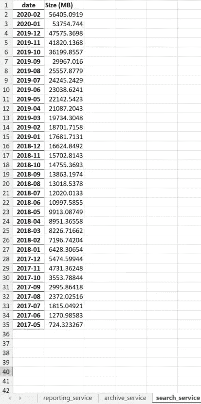
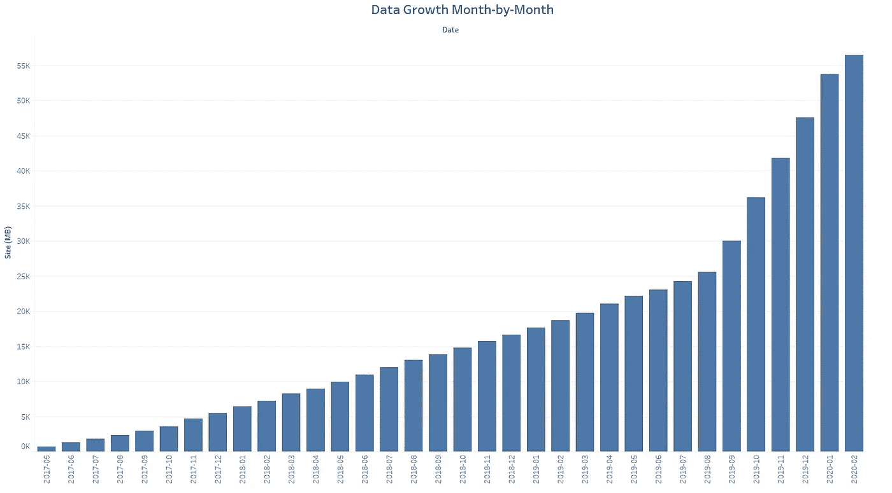
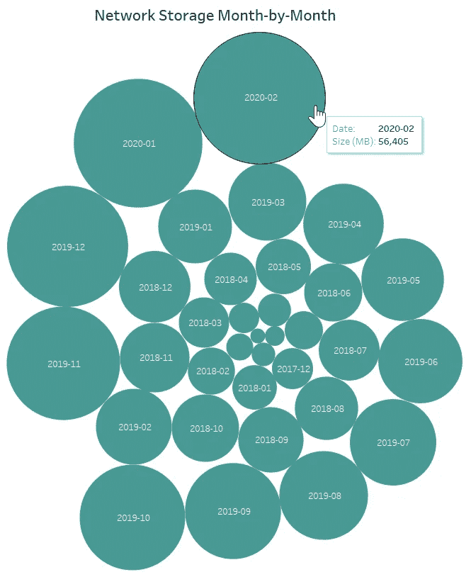

# 使用 Python 和 Tableau 可视化基础设施增长

> 原文：<https://towardsdatascience.com/projecting-and-visualizing-infrastructure-growth-trends-with-python-1e578d9e4260?source=collection_archive---------31----------------------->

## Python 如何逐月汇总数据消耗，并避免数小时的手动计算


unsplash.com

当进行项目规划时，了解您的数据库或专用网络共享是否能够处理增加的数据负载对于避免性能故障至关重要。虽然后端管道开发、数据工程和基础设施维护不像如今的数据科学、机器学习或分析那样“热门”，但它确实是公司数据需求的核心。如果没有坚实的基础或实施策略来处理来自不同来源和系统的大量数据，就很难对数据进行任何转换。

这是一种很自然也很频繁出现的查询——我们在优化我们的基础设施吗？

令人欣慰的是，我们不必手动整理过去三年中成千上万的文件，我们可以让 Python 来完成繁重的工作。当面对我们的应用程序数据需要如何随时间变化的问题时，我创建了一个方便的脚本来按月汇总数据量。一旦这样做了，就很容易绘制出一段时间内的趋势。

在这里的使用案例中，我想知道的是，在一个公共的 Windows 网络连接共享上，每个应用程序的逐月流量是如何增加的。由于许多服务使用同一个位置，因此首先按应用程序，然后按文件夹位置分离报告非常重要。这个脚本最好的部分是它是可重用的，并且可以很容易地为任何其他应用程序或网络位置进行配置，因为这个函数是通用的。

**问题:**

逐月确定 Windows 位置上文件的数据量

**解决方案:**

解析每个文件的时间戳和大小，然后按月合计总数据量

**第一步:**加载所需的库——pandas、datetime、os、os.path、time

**步骤 2:** 命名输出文件(您想要保存报告的地方)

```
appService = "abc_service"
writer = pd.ExcelWriter(r"C:\\scripts\\output\\" + appService + ".xlsx", engine='xlsxwriter')
```

**步骤 3:** 创建一个函数，返回所提供的网络位置在一个月间隔内的总流量

或者，您可以选择添加一个额外的以 MB 或 GB 为单位的列，因为 Python 返回的默认值是以字节为单位的。

```
def getFileSummaryByMonth(directory, path):
 folder = path
 filepaths = [os.path.join(folder, f) for f in os.listdir(folder)]stats = {}
 i = 0for file in filepaths:
  # Get the unique date for each file
  file_name = file
  last_Mod = os.stat(file).st_ctime
  size = os.stat(file).st_size
  str1 = time.ctime(os.path.getmtime(file_name)) 
  datetime_object = datetime.datetime.strptime(str1, '%a %b %d %H:%M:%S %Y')
  date = datetime_object.strftime("%Y-%m") # 06/07/2013
  # Add values to dictionary
  stats = {'Index': i, 'file_name': file_name, 'date': date, 'size': size}
  print(stats)
  i = i+1
  dict_obj.add(i, stats)# Create duplicate file info dictionary
 filestats = stats# Convert to dataframe
 filestats = pd.DataFrame.from_dict(dict_obj,orient='index')
 print(filestats)# Aggregate files by unique month and filesize
 filestats["date"] = pd.to_datetime(filestats["date"])
 grouped_by_month_stats = filestats.groupby(filestats['date'].dt.strftime('%Y-%m'))['size'].sum().sort_values()
 print(grouped_by_month_stats)
 df = pd.Series.to_frame(grouped_by_month_stats)
 df.sort_values(by='date', inplace=True, ascending=False)# Write each filtered dataframe to a different worksheet in the same Excel file
 df.to_excel(writer, sheet_name=directory)
```

**第四步:**更新脚本包含所有路径，调用上面提到的 getFileSummaryByMonth 函数

```
getFileSummaryByMonth('reporting_service', 'C://first_path//')
getFileSummaryByMonth('archive_service', 'C://second_path//')
getFileSummaryByMonth('search_service', 'C://third_path//')
```

**步骤 5:** 执行脚本后查看结果——每个文件夹将在输出 Excel 电子表格中保存为不同的选项卡。根据您的需要，您可以选择更新脚本以相应地显示结果。



为了形象化成长，你可以根据你的最终目标来创造 Tableau。我的目标是每月观察过去三年的交易量增长。如果您知道预期的文件大小，您可以相应地调整电子表格的容量，并再次绘图以预测所需的总存储量。



希望这个 Python 脚本能帮助您踏上数据科学和数据工程之旅！