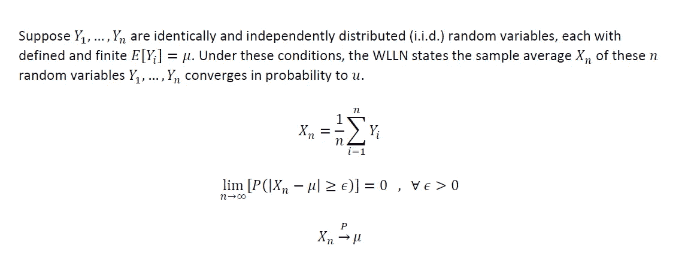
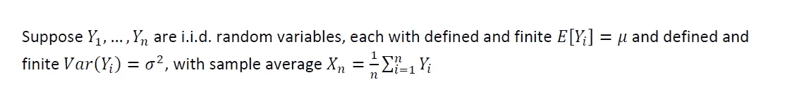
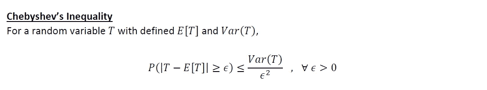
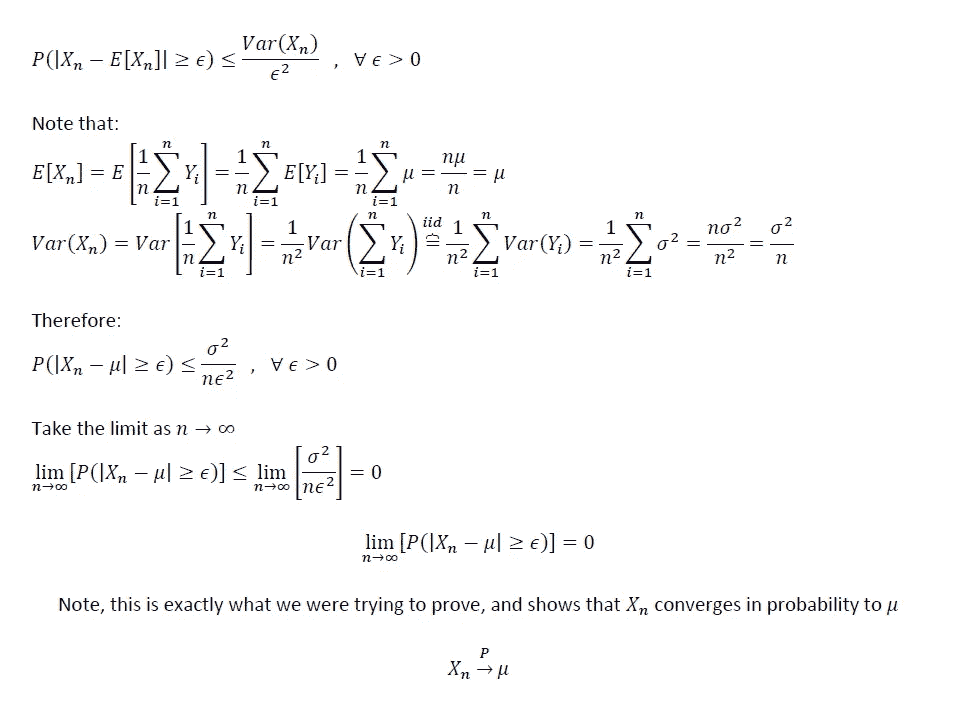
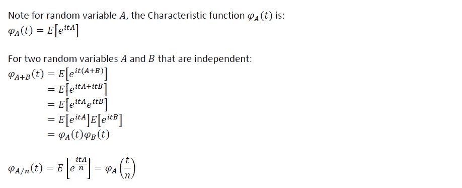
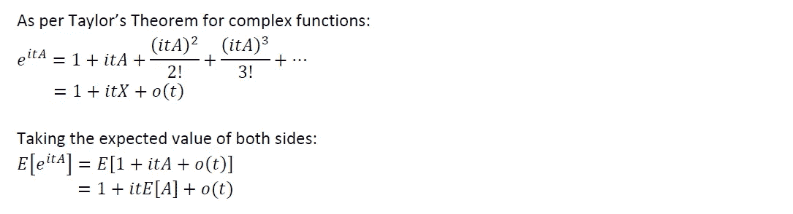
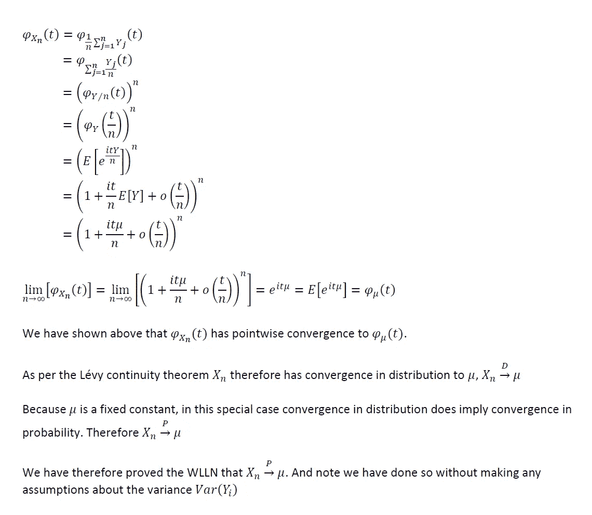

# 大数定律的证明第一部分:弱定律

> 原文：<https://towardsdatascience.com/proof-of-the-law-of-large-numbers-part-1-the-weak-law-daf412178d3a?source=collection_archive---------9----------------------->

## 有限和无限方差情形下 WLLN 的证明

照片来自 [Adobe Stock Images](https://stock.adobe.com/)

# 背景和动机

大数定律(LLN)是概率论中最重要的定理之一。尽管这个定理远远超出了概率和统计的范畴。实际上，LLN 是一种手段，通过这种手段，科学努力甚至有可能被复制，允许我们用科学方法研究我们周围的世界。

LLN 实际上有两个主要版本:弱大数定律(WLLN)和强大数定律(SLLN)。它们之间的区别在于它们依赖于不同类型的随机变量收敛。弱定律处理概率收敛，强定律几乎必然收敛。

在本文中，我们将关注有限和无限方差情况下的标准 WLLN。证明 SLLN 几乎肯定是收敛的有点复杂；关于 SLLN 的证明，请看我的后续篇“[大数定律的证明第二部分:强定律](/proof-of-the-law-of-large-numbers-part-2-the-strong-law-356aa608ca5d)”。

# 弱大数定律的定义(WLLN)

标准 WLLN 的数学定义如下:

注意上面的定义没有对随机变量 **Y** 的方差做任何假设。而是随机变量是独立同分布的，并且有一个确定的有限的期望值。下面我提供两个证明:

1.  对于有限方差的情况
2.  对于有限或无限方差的情况

有限方差情况的证明非常简单，而且广为人知。然而，由于有限方差不是 WLLN 的必要条件，为了完整性，知道无限方差情况的证明是有用的。

# 1.WLLN 的证明:有限方差情形

让我们稍微碰碰运气我们开始的条件:

在这些条件下证明 WLLN 是非常简单的。在我之前的文章[概率论和数理统计中的统计不等式](/statistical-inequalities-in-probability-theory-and-mathematical-statistics-c2c62f51b852)中，我讨论了统计不等式如何以及在哪里有用。这是其中的一个例子。回想一下切比雪夫不等式:

WLLN 的证据直接来自切比雪夫:

# 2.WLLN 的证明:有限或无限方差情况

如上所述，WLLN 不需要定义随机变量**n**Y 的方差。然而，在没有定义和有限方差要求的情况下证明 WLLN 有点复杂，需要一些关于特征函数的知识，以及一些关于不同类型的随机变量收敛之间关系的定理。不过，让我们开始吧:

首先，让我们定义一个任意随机变量的特征函数，并提供一些可能对我们有用的独立同分布随机变量的性质:

以及泰勒定理对指数函数展开的一些注记:

我们现在准备好证明了。让我们从随机变量 **n** i.i.d. **Y** 的样本平均值的特征函数开始，以展示样本平均值以概率收敛于μ结束。

# 最终想法:

上面我们用两种不同的方法证明了标准 WLLN。值得一提的是，LLN 的一些变体允许放宽 i.i.d .要求。关于 SLLN 的证明，请看我的后续篇“[大数定律的证明第二部分:强定律](/proof-of-the-law-of-large-numbers-part-2-the-strong-law-356aa608ca5d)”。

希望以上有见地。正如我在以前的一些文章中提到的，我认为没有足够的人花时间去做这些类型的练习。对我来说，这种基于理论的洞察力让我在实践中更容易使用方法。我个人的目标是鼓励该领域的其他人采取类似的方法。我打算在未来写一些基础作品，所以请随时在 [**LinkedIn**](http://www.linkedin.com/in/andrew-rothman-49739630) 上与我联系，并在 Medium 上 [**关注我的更新！**](https://anr248.medium.com/)